# 14：R语言中的环境

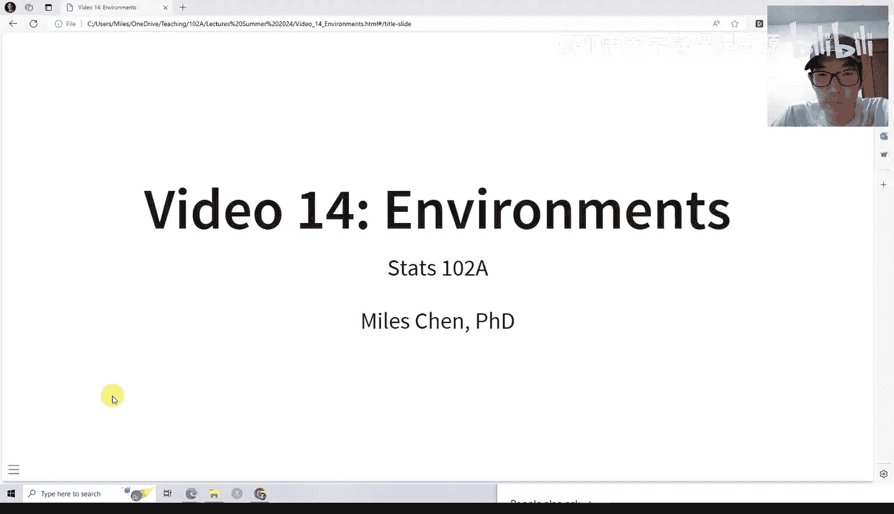

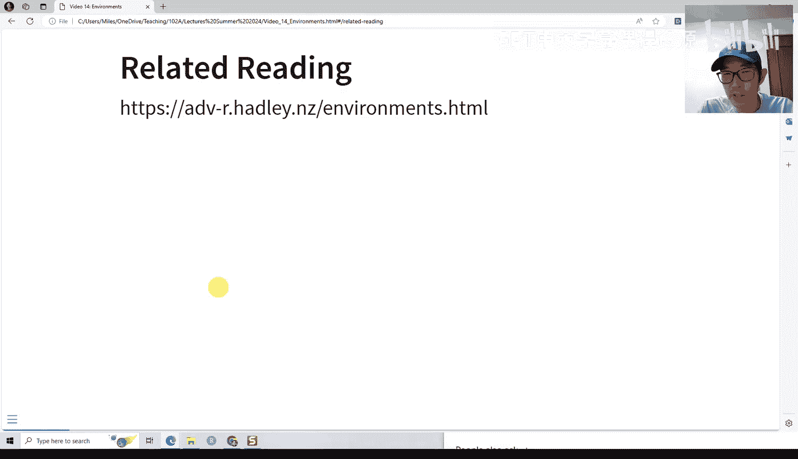

在本节课中，我们将深入学习R语言中的环境概念。环境是R中实现作用域规则的核心数据结构，理解它对于掌握函数如何查找变量以及包如何工作至关重要。

## 环境是一种数据结构

上一节我们介绍了局部环境和全局环境的基本概念。本节中，我们将深入探讨环境本身的特性。

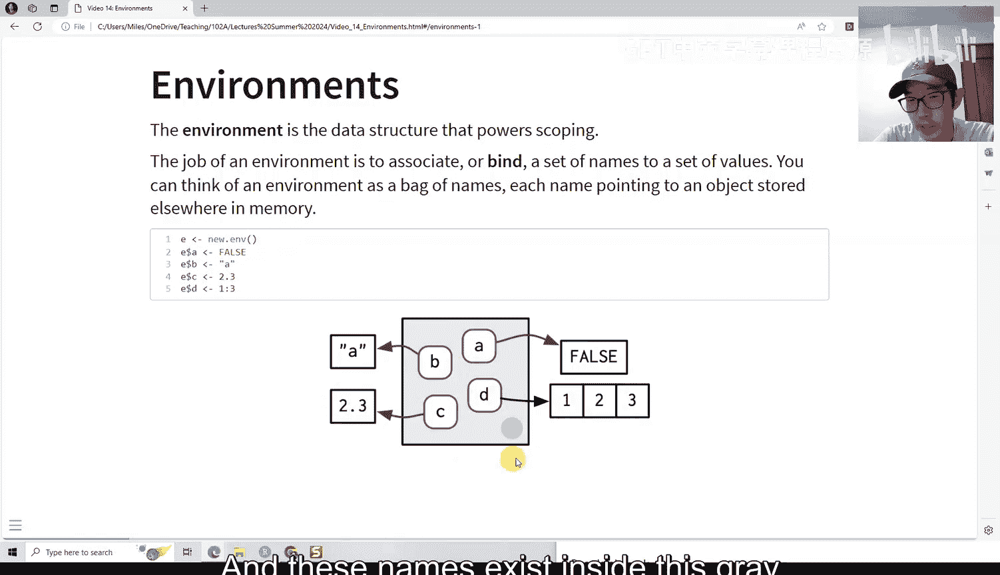

环境本质上是一种数据结构，它负责实现作用域规则。环境的主要工作是将名称绑定到值。你可以将环境想象成一个“名称袋”，其中的每个名称都指向内存中存储的一个对象。计算机将值存储在内存中，而你通过指向该内存对象的名称来访问这些值，这些名称就存储在环境里。

你可以使用 `new.env()` 函数创建自己的环境。

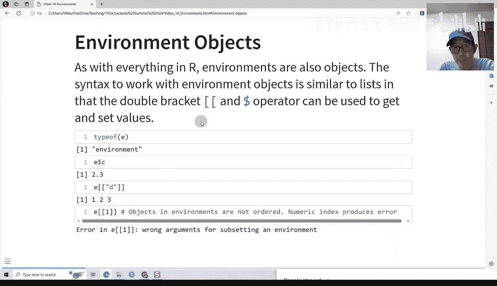

```r
# 创建一个新环境
e <- new.env()
# 在环境中绑定名称和值
e$a <- FALSE
e$b <- c("hello", "world")
e$c <- c(1.0, 2.0)
e$d <- 1L:10L
```

在这个例子中，我们创建了一个名为 `e` 的环境，并在其中绑定了名称 `a`, `b`, `c`, `d` 到不同的R对象。

## 环境的操作

与R中所有事物一样，环境本身也是对象。操作环境的语法与列表类似，你可以使用双括号 `[[]]` 或美元符号 `$` 来获取值。

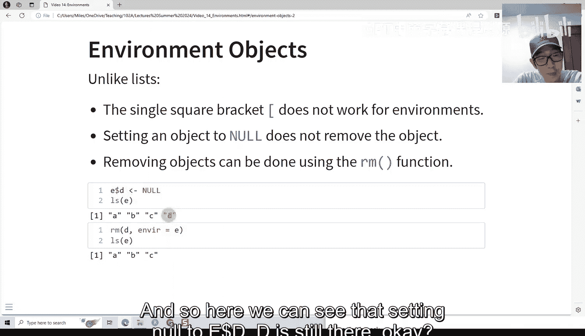

```r
# 检查环境类型
typeof(e) # 返回 "environment"

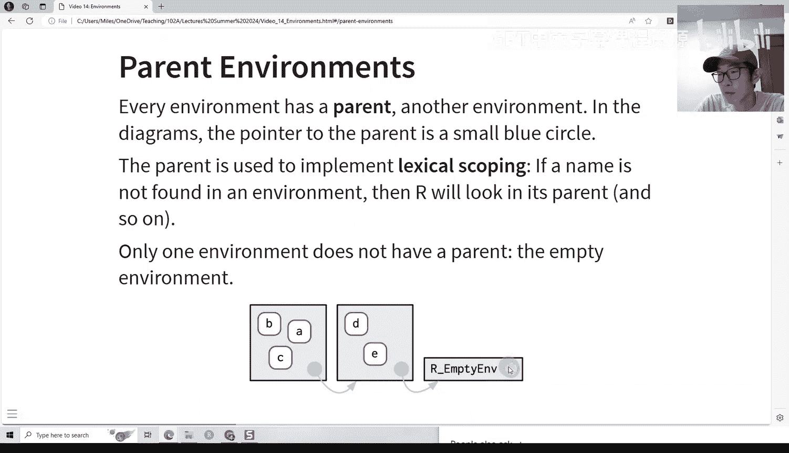

# 获取环境中的值
e$c
e[["d"]]
```

然而，环境本质上是**无序**的。这意味着你不能像列表那样通过数字索引（例如 `e[[1]]`）来获取第一个元素。环境就像一个背包，里面的物品是随意放置的，没有“第一件”或“第三件”的概念。

以下是查看环境内容的常用函数：

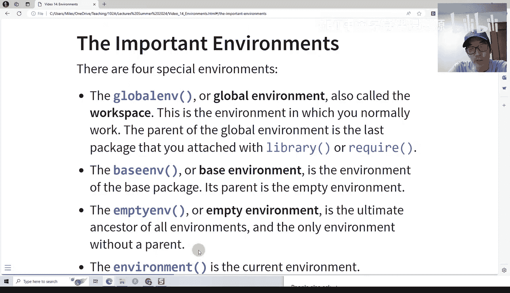

```r
# 列出环境中的所有名称
ls(e)

# 列出环境名称及其结构的详细信息
ls.str(e)
```

环境和列表虽有相似之处，但也有重要区别。例如，你不能对环境使用单括号 `[]`。此外，在环境中将对象设置为 `NULL` 并不会移除该名称，只是将其值设为 `NULL` 对象。若要从环境中完全移除一个对象，必须使用 `rm()` 函数。

```r
# 设置值为NULL，名称d依然存在
e$d <- NULL
ls(e) # d 仍然在列表中

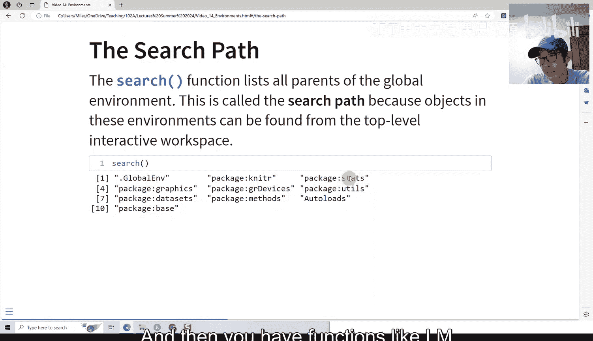

# 使用rm()函数彻底移除名称d
rm(d, envir = e)
ls(e) # d 已被移除
```

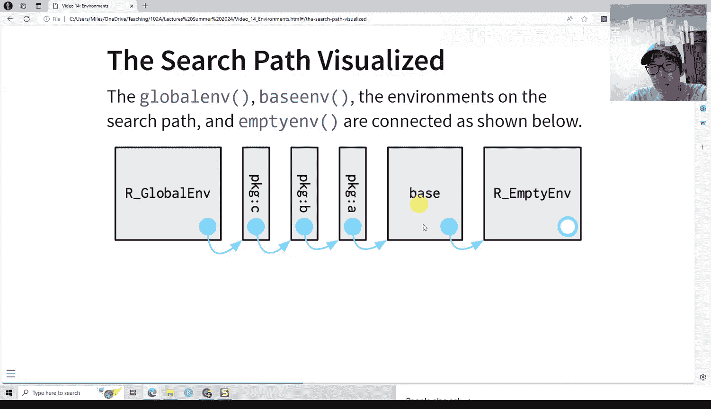

## 父环境与作用域链


每个环境都有一个**父环境**，这是另一个环境。图中蓝色箭头指向父环境。父环境用于实现**词法作用域**。即，如果R在当前环境中找不到某个名称，它会去父环境中查找，并依此类推，形成一个环境链，直到到达顶层环境——**空环境**，这是唯一没有父环境的环境。

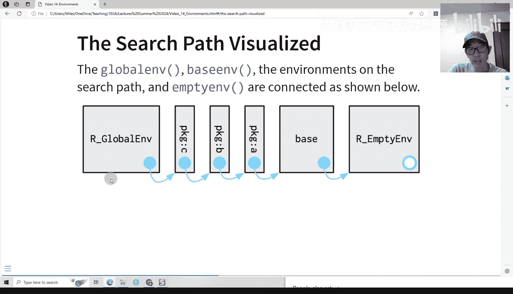

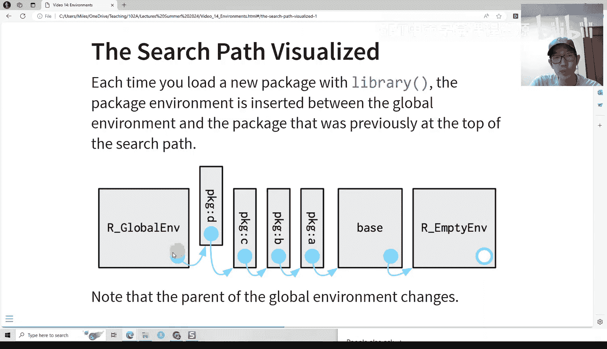

```r
# 获取环境的父环境
parent.env(e)
```

## 特殊环境

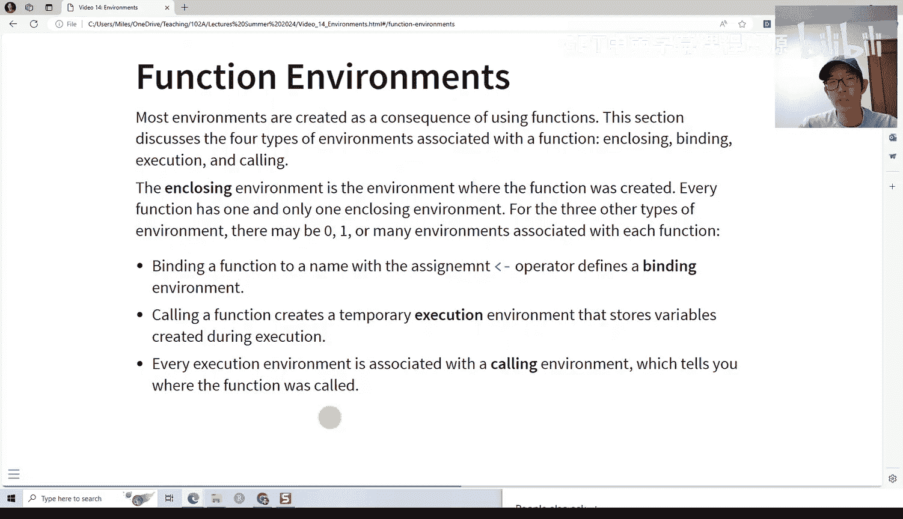

R中有几个特殊的环境需要了解：
*   **当前环境**：`environment()`，即你当前正在操作的环境。
*   **全局环境**：`globalenv()`，通常是你启动R后工作的“工作空间”。你创建的向量和函数默认都存储在这里。
*   **基础环境**：`baseenv()`，是基础包（base package）的环境，包含像`c()`, `sum()`这样的核心函数。它的父环境是空环境。
*   **空环境**：`emptyenv()`，是所有环境的最终祖先，它没有父环境。

全局环境的父环境有点特殊，它是**最后被附加的包**。这引出了**搜索路径**的概念。

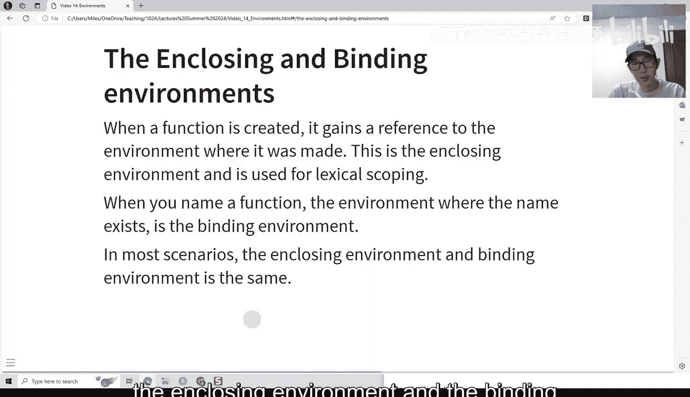

## 搜索路径

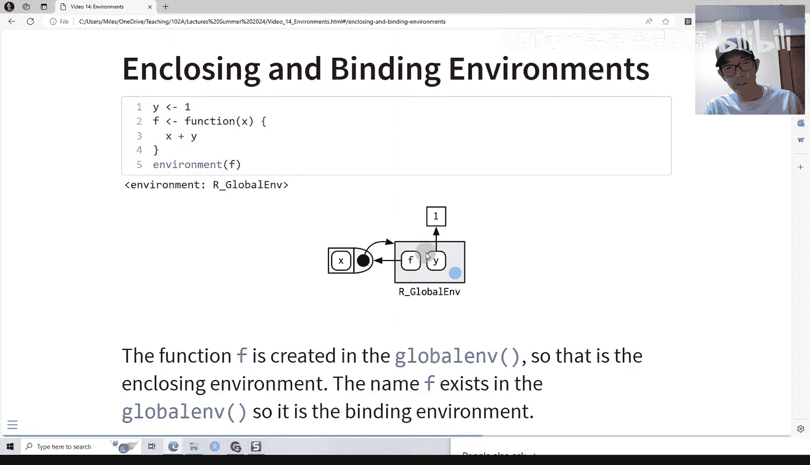

你可以通过 `search()` 函数查看搜索路径，它列出了全局环境的所有父环境。

```r
search()
```

当R在全局环境中找不到某个名称（例如一个函数）时，它会沿着搜索路径向上查找。例如，你从未定义过 `sd()`（标准差）函数，但你可以调用它，因为R在 `stats` 包中找到了它。`lm()`（线性模型）函数也位于 `stats` 包中。

搜索路径的结构可以这样可视化：全局环境 -> 最后加载的包 -> ... -> 基础环境 -> 空环境。当你使用 `library()` 加载一个新包（如 `ggplot2`）时，该包的环境会被插入到全局环境和之前加载的包之间，成为全局环境新的父环境。

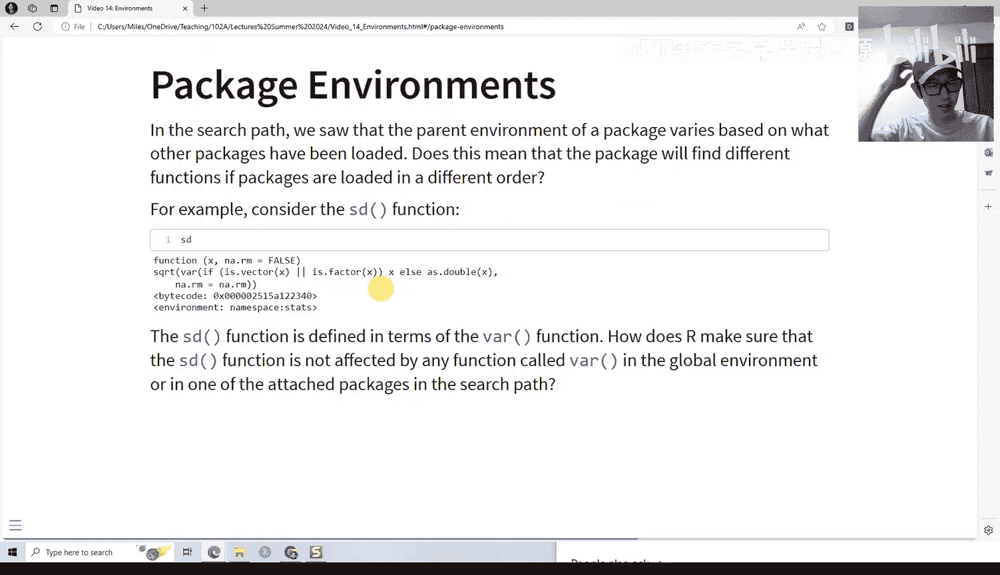

## 函数与环境

我们之前讨论过，许多环境是因使用函数而产生的。每个函数都与四种类型的环境相关联：
1.  **封闭环境**：函数被创建时所在的环境。每个函数有且只有一个封闭环境，用于词法作用域。
2.  **绑定环境**：函数名称被绑定（即赋值）时所在的环境。
3.  **执行环境**：函数被调用时创建的临时环境，用于存储执行过程中的变量。
4.  **调用环境**：函数被调用时所在的环境。

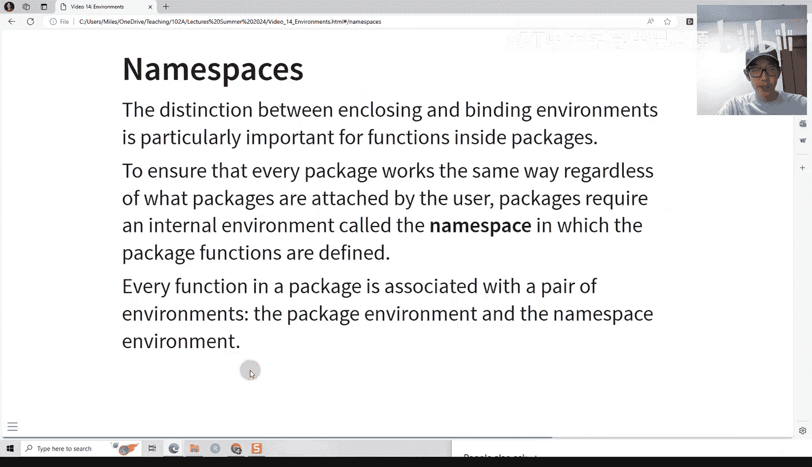

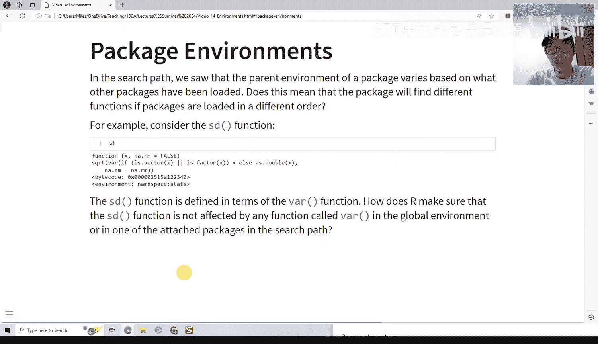

在大多数简单情况下，封闭环境和绑定环境是同一个（例如在全局环境中定义函数）。让我们通过一个例子来理解执行环境。

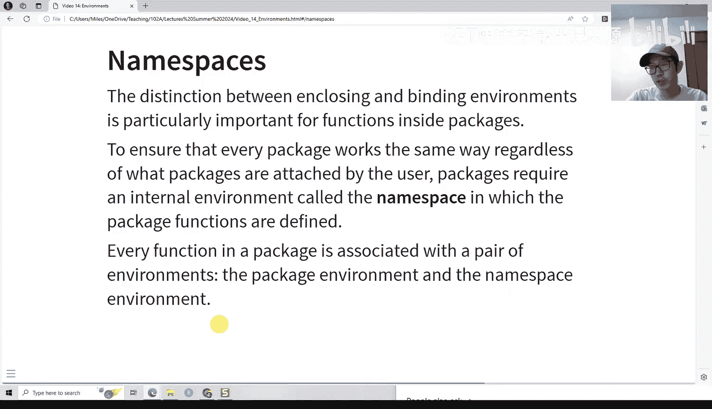

```r
# 在全局环境中定义函数h
h <- function(x) {
  a <- 2
  return(x + a)
}

# 调用函数
y <- h(1)
```

执行过程如下：
1.  调用 `h(1)` 时，创建一个新的**执行环境**。
2.  参数 `x` 被赋值为 `1`。
3.  在函数体内，名称 `a` 被赋值为 `2`。
4.  计算 `x + a` 得到 `3` 并返回。
5.  返回值 `3` 被赋给全局环境中的 `y`。
6.  函数调用结束，**执行环境被销毁**。全局环境中的 `h` 仍然指向原函数，但执行时的临时变量 `a` 和参数 `x` 已不存在。

## 命名空间与包管理

搜索路径的顺序依赖于包加载的顺序，这可能导致问题：如果后加载的包中有同名函数，它会“屏蔽”先加载包中的函数。R通过**命名空间**机制来解决这个问题，确保包内部函数能正确找到其依赖的其他函数，不受用户加载包顺序的影响。

对于用户而言，有两个重要的环境与包相关：
*   **包环境**：包的外部接口。R通过搜索路径在这里查找函数。其父环境由搜索路径决定。
*   **命名空间环境**：包的内部接口。它控制着包内的函数如何找到其所需的变量（如其他内部函数），并将内部实现细节对用户隐藏。

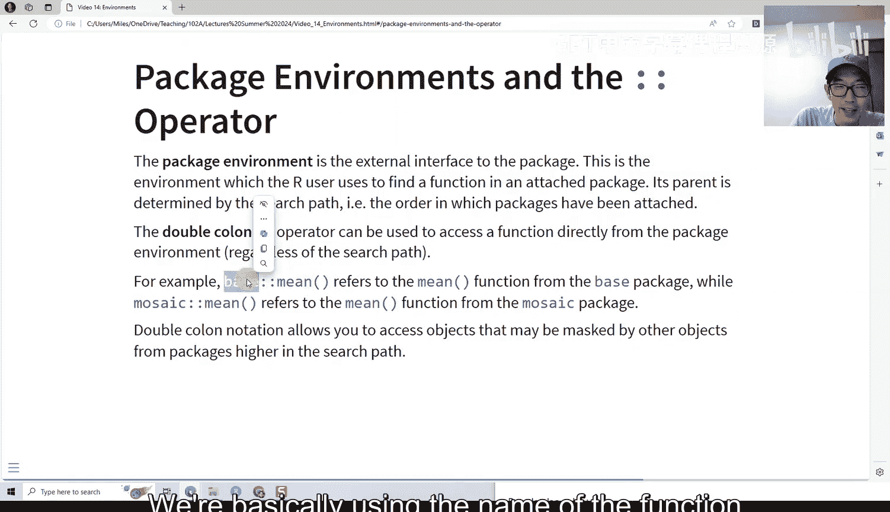

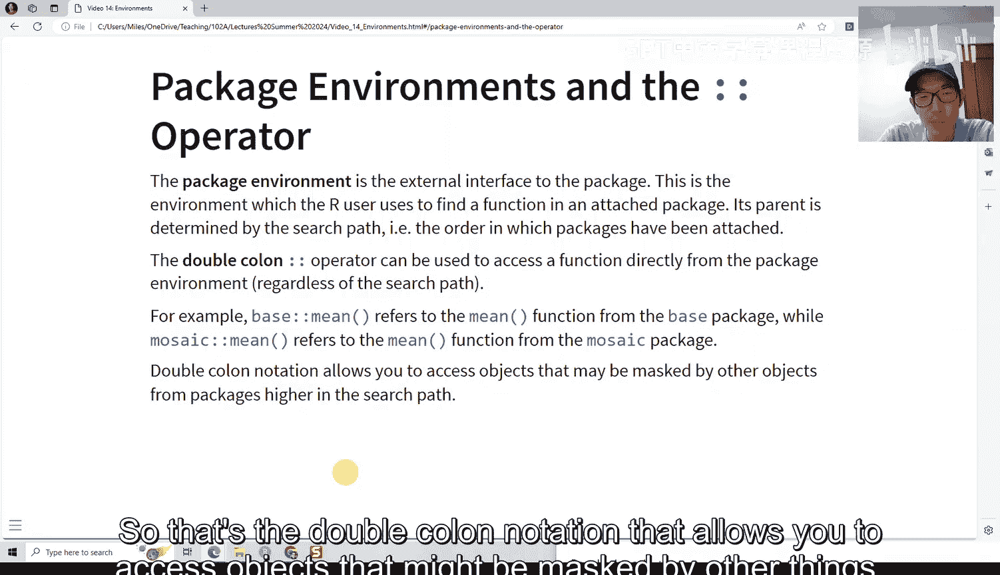

当你想明确使用某个特定包中的函数，避免被屏蔽时，可以使用**双冒号运算符 `::`**。

```r
# 明确使用base包中的mean函数
base::mean(some_vector)

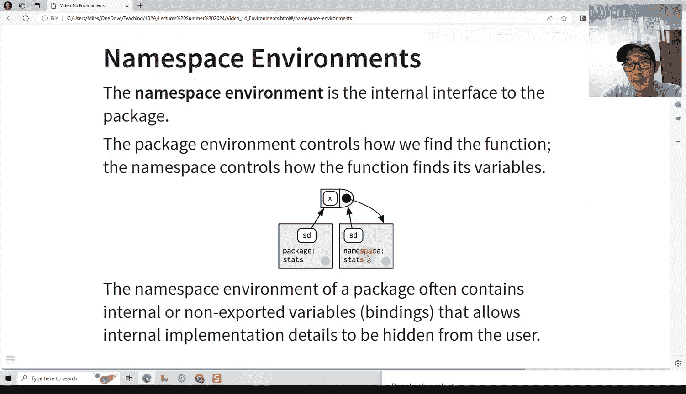

# 明确使用mosaic包中的mean函数（如果已加载）
mosaic::mean(some_vector)
```

## 词法作用域与动态作用域

R默认使用**词法作用域**，即函数在查找变量时，依据的是其**封闭环境**（定义时的环境）。

然而，R也支持**动态作用域**，即函数可以依据其**调用环境**来查找变量。这可以通过 `get()` 函数配合 `parent.frame()` 来实现。

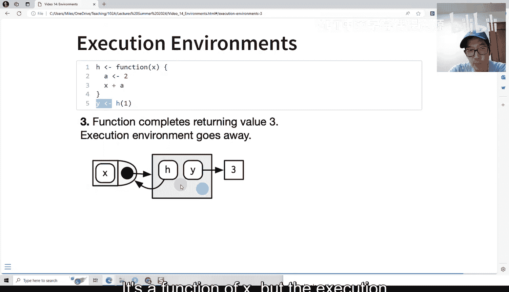

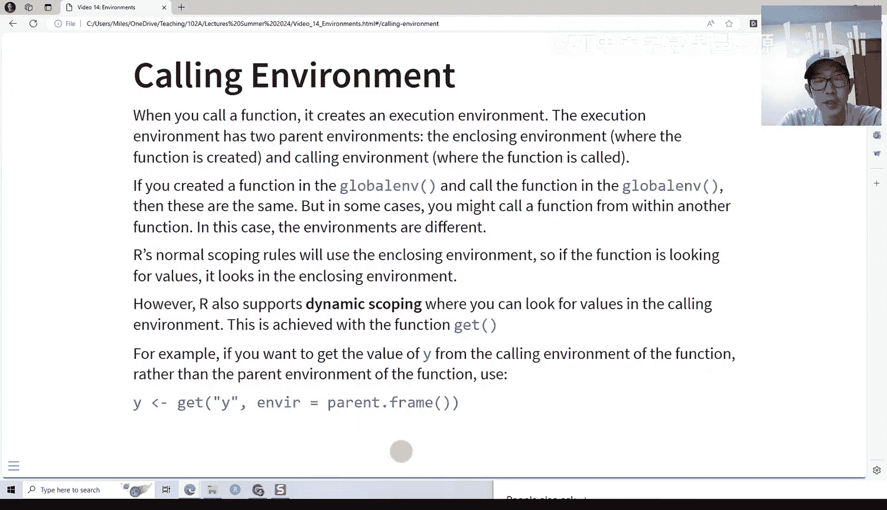

```r
# 动态作用域示例：从调用环境中获取变量y的值
get("y", envir = parent.frame())
```

我们将在下一个视频中展示动态作用域的具体例子。

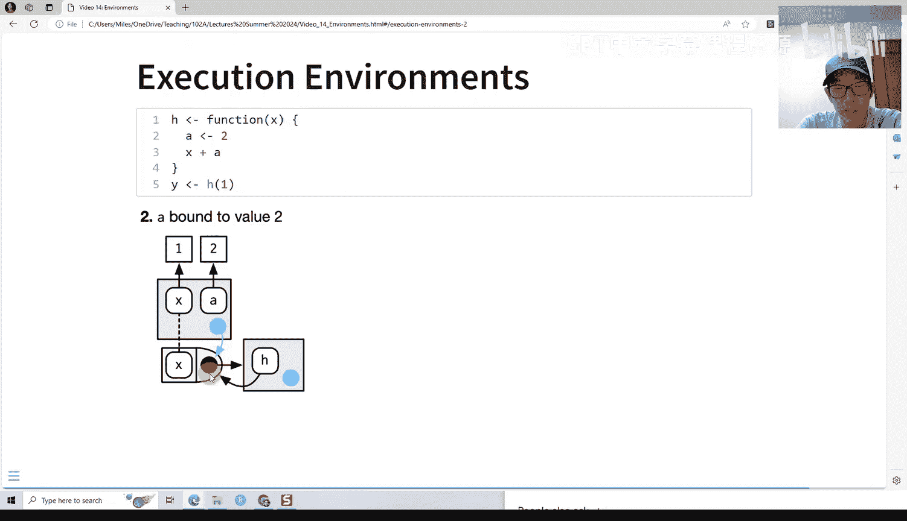

## 总结

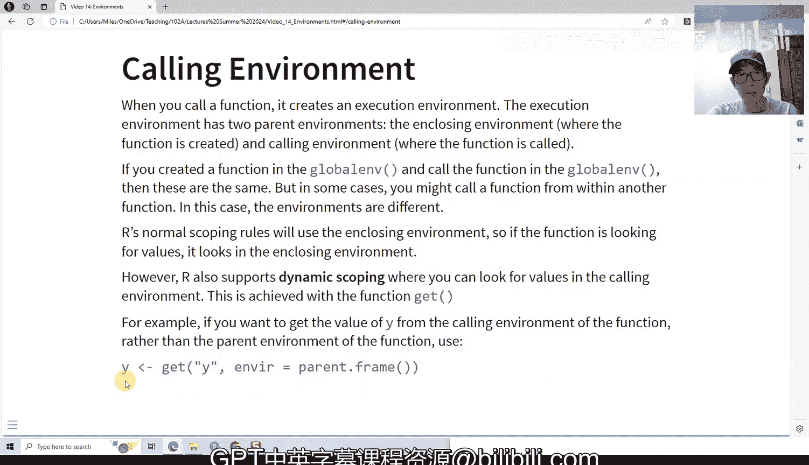

本节课中，我们一起深入学习了R语言中的环境。我们了解到环境是一种将名称绑定到值的数据结构，它是R作用域规则的基础。我们探讨了如何创建和操作环境，理解了父环境、作用域链以及搜索路径的概念。我们还分析了函数与四种环境（封闭、绑定、执行、调用）的关系，并通过例子看到了执行环境的生命周期。最后，我们介绍了包如何通过命名空间和包环境来管理函数，以及如何使用 `::` 运算符来精确调用函数，并简要提及了词法作用域与动态作用域的区别。掌握这些概念对于编写健壮、可预测的R代码至关重要。