# 15：作用域自测题解析 🧠


在本节课中，我们将通过一系列代码示例，深入理解R语言中的作用域规则。作用域决定了变量在何处被查找和赋值，是理解函数行为的关键。我们将分析多个自测题，逐步拆解代码的执行过程，以掌握词法作用域和动态作用域的核心概念。

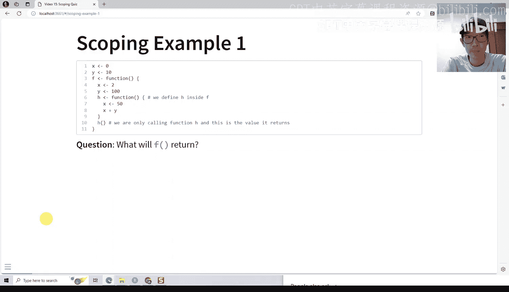

## 概述

本节教程将解析一系列关于作用域的代码片段。我们将学习如何追踪变量的查找路径，理解局部环境、全局环境以及函数定义环境之间的关系。核心在于掌握R语言的**词法作用域**规则：函数在定义时确定其变量的查找环境，而非在调用时。

---

## 示例一：嵌套函数的作用域

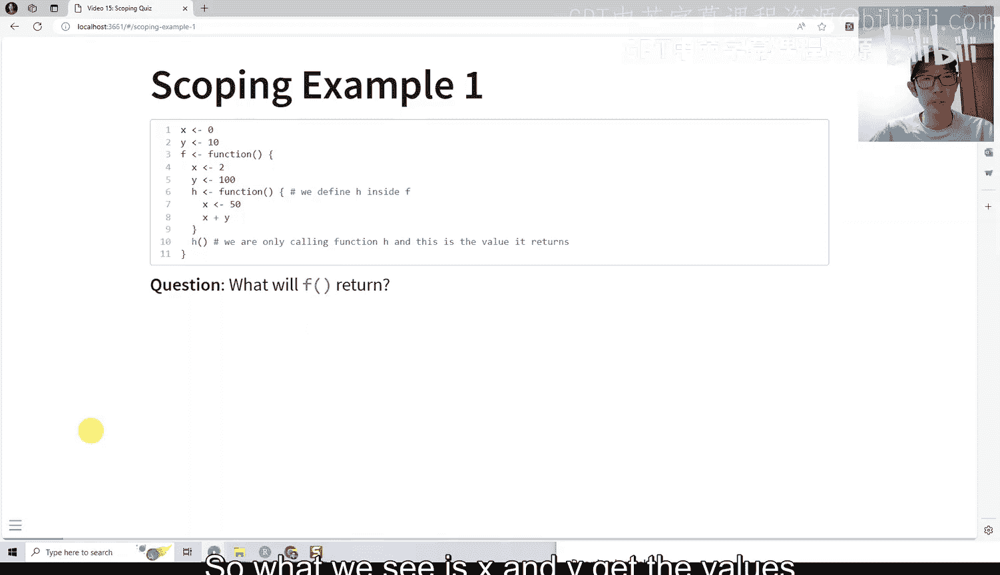

上一节我们介绍了作用域的基本概念，本节中我们来看看一个具体的嵌套函数示例。

```r
x <- 0
y <- 10

f <- function() {
  x <- 2
  y <- 100
  h <- function() {
    x <- 50
    return(x + y)
  }
  return(h())
}
```

以下是代码执行步骤分析：

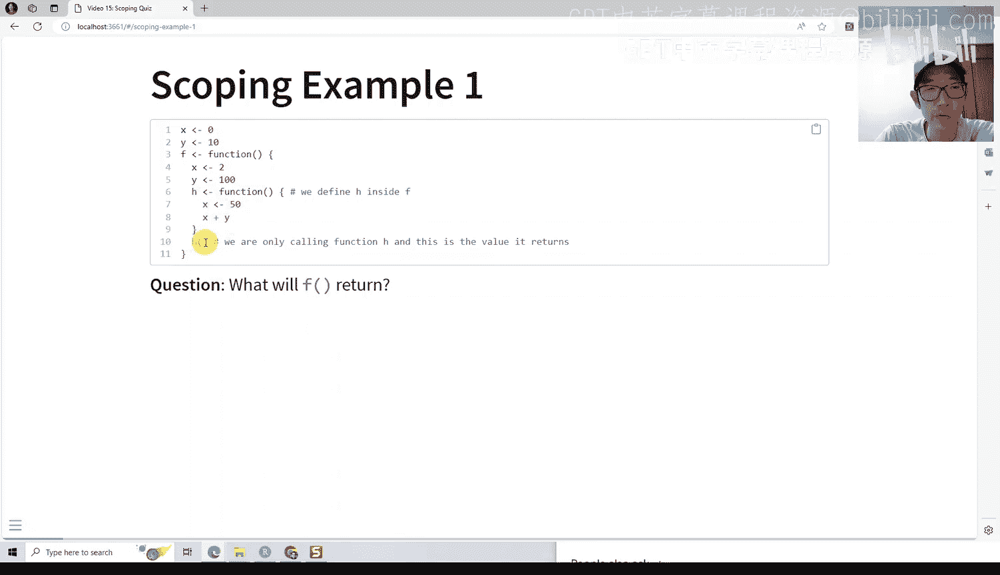

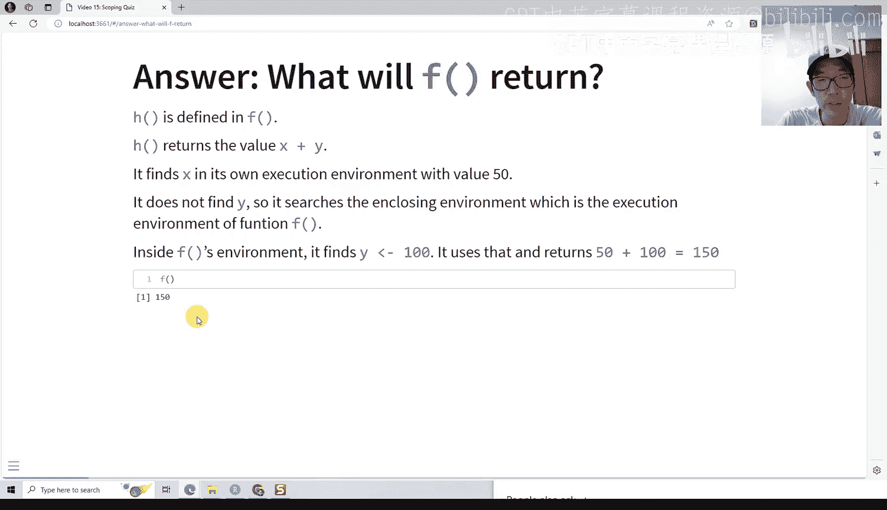

1.  在全局环境中，`x` 被赋值为 `0`，`y` 被赋值为 `10`。
2.  函数 `f` 在全局环境中被定义。
3.  调用 `f()` 时，创建 `f` 的局部执行环境。在该环境中，`x` 被赋值为 `2`，`y` 被赋值为 `100`。
4.  在 `f` 的环境中，函数 `h` 被定义。
5.  `f` 的最后一行执行 `h()`。
6.  执行 `h()` 时，创建 `h` 的局部环境。在该环境中，`x` 被赋值为 `50`。
7.  `h` 返回 `x + y`。查找 `x` 时，在 `h` 的局部环境中找到值 `50`。
8.  查找 `y` 时，在 `h` 的局部环境中未找到，于是向其**封闭环境**（即 `f` 的执行环境）查找，找到值 `100`。
9.  因此，`h()` 返回 `50 + 100 = 150`。
10. `f()` 返回 `h()` 的结果，即 `150`。

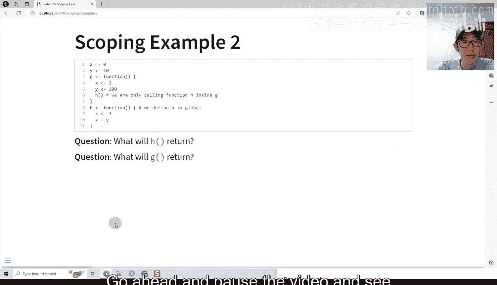

**结论**：函数 `f` 的返回值是 `150`。

---

## 示例二：函数定义环境的重要性

理解了嵌套函数后，我们来看一个强调函数定义环境的例子。

```r
y <- 10

h <- function() {
  x <- 3
  return(x + y)
}

g <- function() {
  x <- 2
  y <- 100
  return(h())
}
```

以下是代码执行步骤分析：

1.  在全局环境中，`y` 被赋值为 `10`。函数 `h` 在全局环境中被定义。
2.  执行 `h()`：在其局部环境中，`x` 被赋值为 `3`。它返回 `x + y`。
    *   查找 `x`：在 `h` 的局部环境中找到 `3`。
    *   查找 `y`：在 `h` 的局部环境中未找到，于是向其封闭环境（即全局环境）查找，找到 `10`。
    *   因此，`h()` 返回 `3 + 10 = 13`。
3.  执行 `g()`：在其局部环境中，`x` 被赋值为 `2`，`y` 被赋值为 `100`。然后它调用 `h()`。
4.  `h` 在全局环境中被定义，其封闭环境是全局环境，而非 `g` 的执行环境。因此，`h` 内部的 `y` 仍然指向全局环境的 `10`，而非 `g` 中的 `100`。
5.  所以，`g()` 返回 `h()` 的结果，即 `13`。

**结论**：`h()` 返回 `13`，`g()` 也返回 `13`。函数 `g` 内部的 `x` 和 `y` 赋值与 `h` 的执行无关。

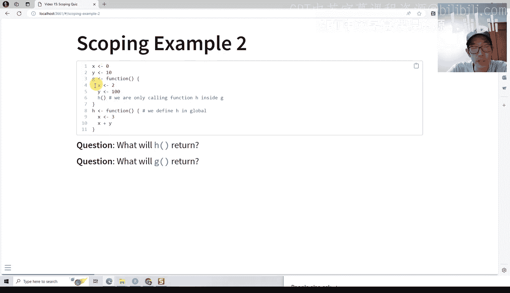

---

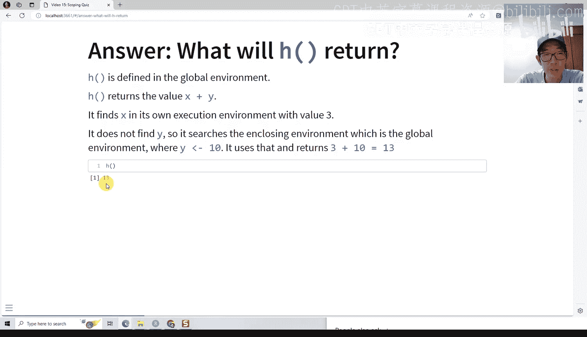

## 示例三：动态作用域简介

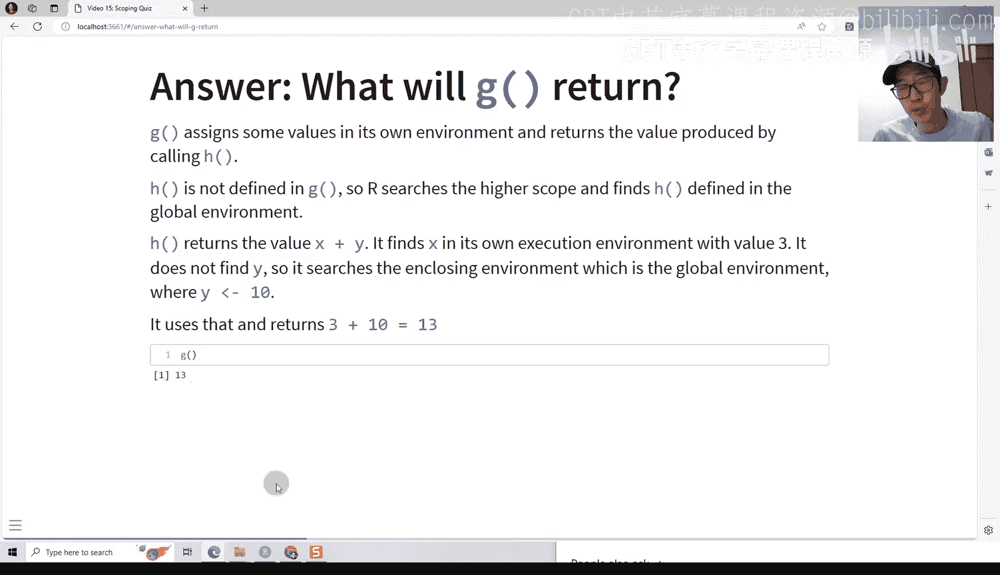

前面我们探讨的是R默认的词法作用域。现在，我们通过 `parent.frame()` 函数简要了解动态作用域的概念。

```r
x <- 0
y <- 10

p <- function() {
  y <- get(“y”， envir = parent.frame())
  x <- 3
  return(x + y)
}

r <- function() {
  x <- 2
  y <- 100
  return(p())
}
```

以下是代码执行步骤分析：

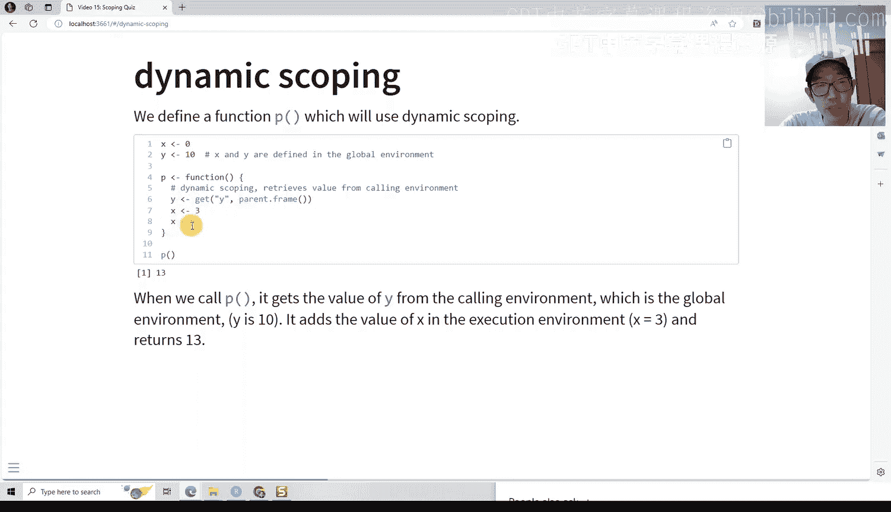

1.  `p` 函数使用 `get(“y”， envir = parent.frame())`。这表示从**调用环境**（而非定义环境）中查找 `y`。
2.  在全局环境中调用 `p()`：`parent.frame()` 指向全局环境，`y` 获得值 `10`。`p()` 返回 `3 + 10 = 13`。
3.  在 `r()` 中调用 `p()`：此时 `p` 的调用环境是 `r` 的执行环境。因此，`y` 从 `r` 的环境中获取值 `100`。
4.  `p()` 返回 `3 + 100 = 103`，故 `r()` 返回 `103`。

**核心概念**：`parent.frame()` 实现了**动态作用域**，变量的值取决于函数的调用栈，而非定义位置。

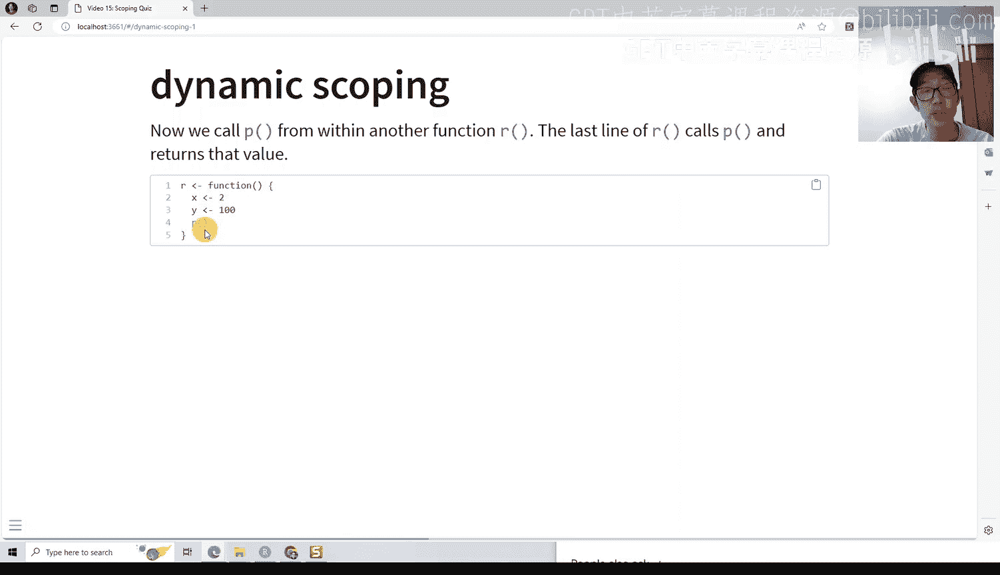

---

## 示例四至六：环境查找练习

以下是一组渐进式的练习，帮助我们巩固环境查找规则。

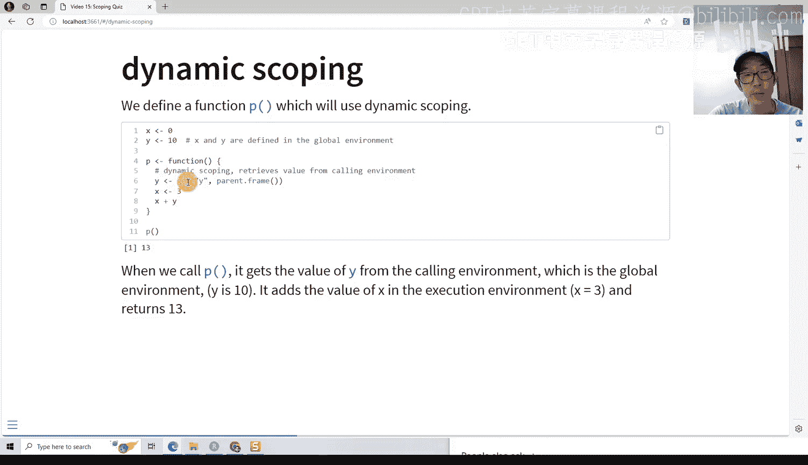

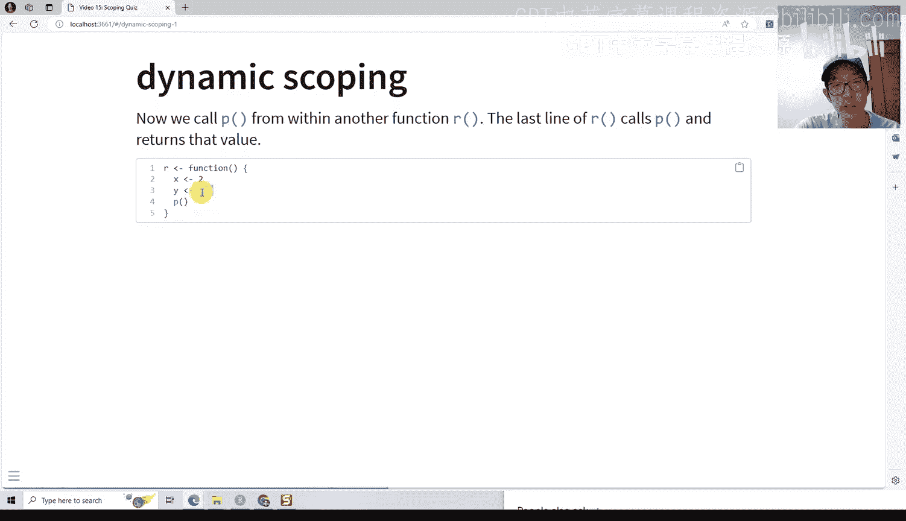

### 示例四：基础查找

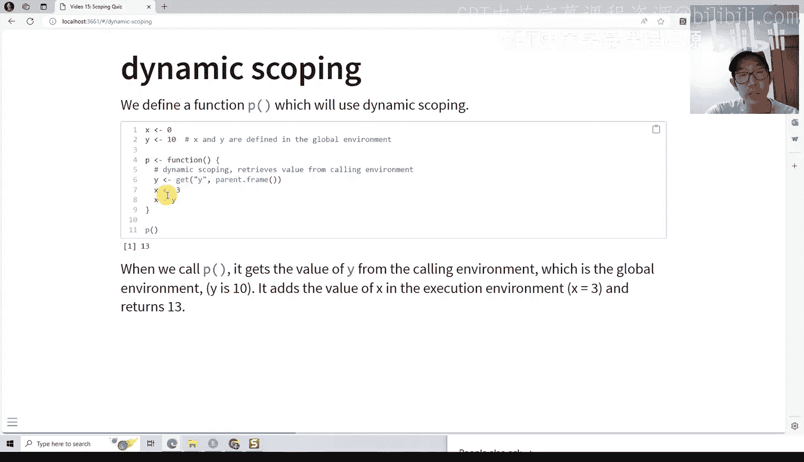


```r
a <- 1
b <- 2

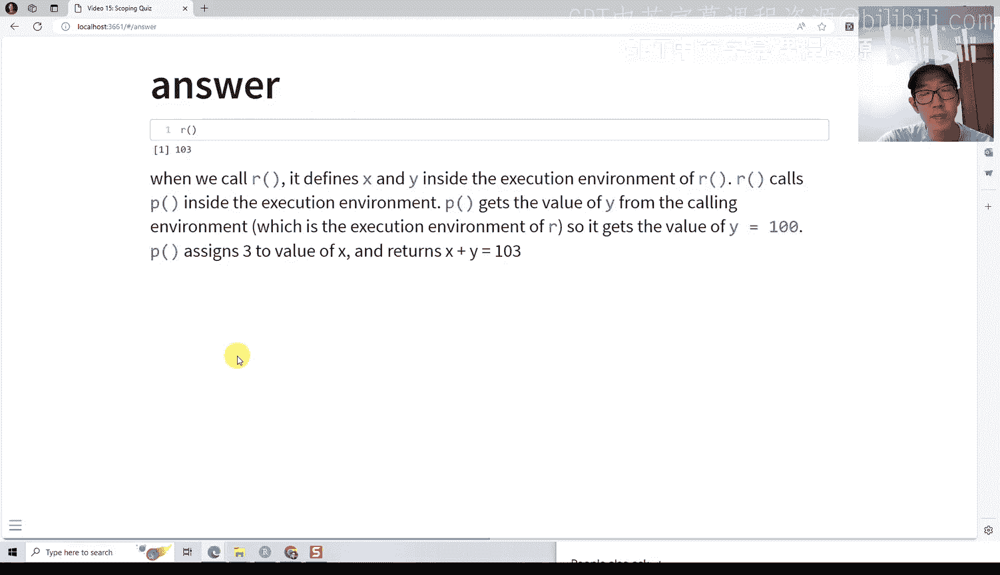

l <- function() {
  print(a)
  print(b)
}

l()
```

**执行过程**：`l` 在全局环境中定义。执行 `l()` 时，在局部环境中找不到 `a` 和 `b`，于是向封闭环境（全局环境）查找，找到 `a=1`， `b=2`。输出 `1` 和 `2`。

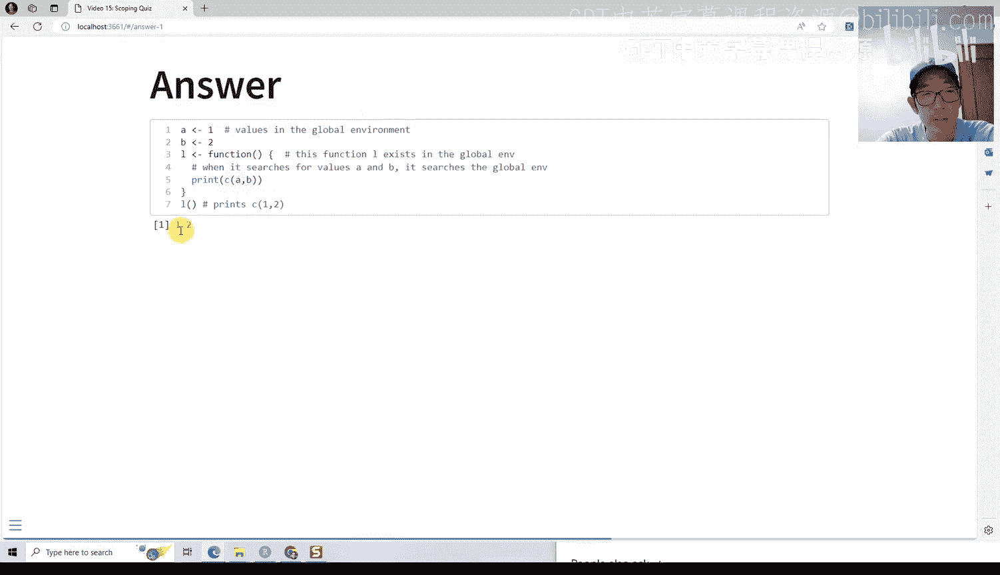

### 示例五：局部变量不影响封闭环境

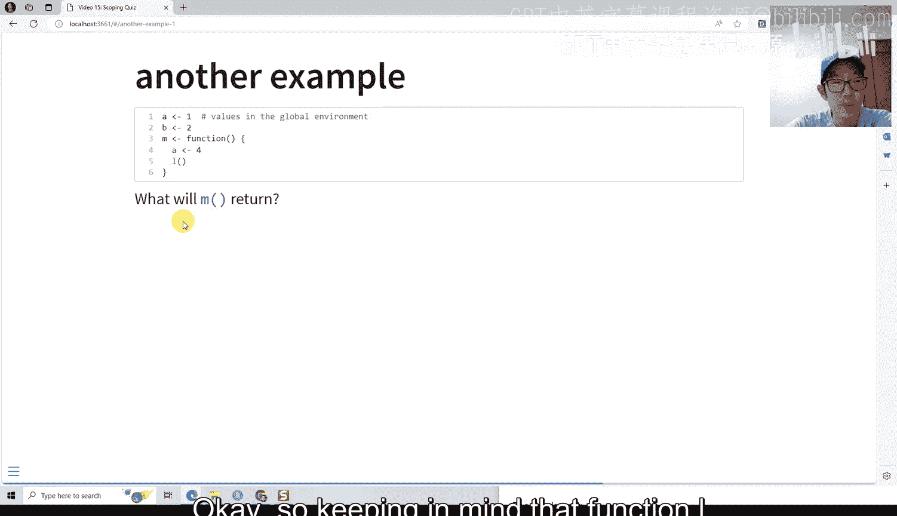

```r
m <- function() {
  a <- 4
  l()
}

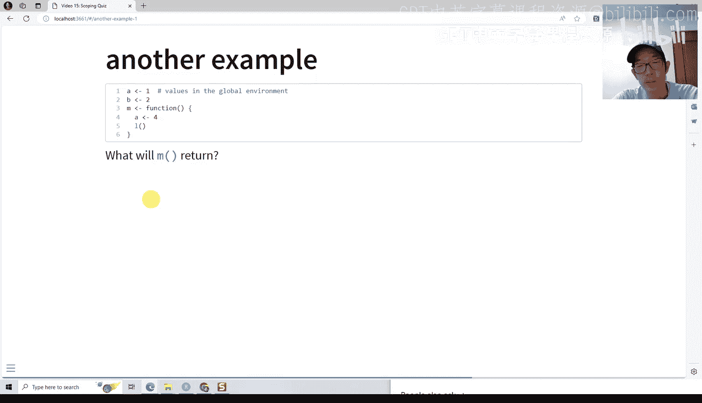

m()
```

**执行过程**：执行 `m()`，局部变量 `a` 被赋值为 `4`。然后调用 `l()`。`l` 的定义环境是全局环境，因此它仍然从全局环境中查找 `a` 和 `b`（值分别为 `1` 和 `2`）。输出 `1` 和 `2`。`m` 中的局部赋值不影响 `l` 的查找。

### 示例六：函数在何处定义至关重要

```r
n <- function() {
  a <- 4
  l <- function() {
    print(a)
    print(b)
  }
  l()
}

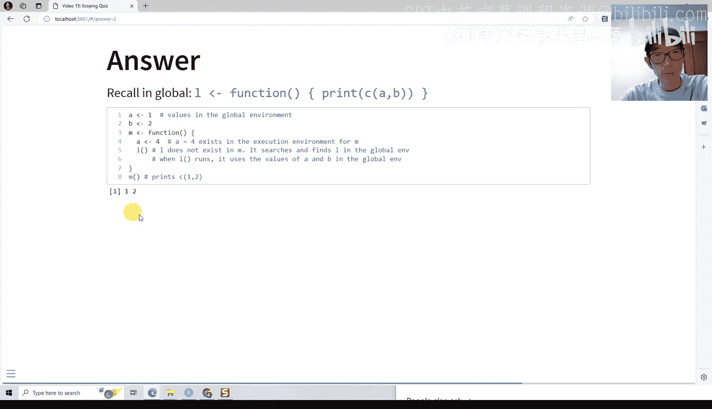

n()
```

**执行过程**：执行 `n()`，局部变量 `a` 被赋值为 `4`。在 `n` 的内部定义了函数 `l`。此时 `l` 的封闭环境是 `n` 的执行环境。调用 `l()` 时：
*   查找 `a`：在 `l` 的局部环境中未找到，向其封闭环境（`n` 的环境）查找，找到 `4`。
*   查找 `b`：在 `l` 和 `n` 的环境中均未找到，继续向全局环境查找，找到 `2`。
输出 `4` 和 `2`。

---

## 示例七：综合应用

最后，我们来看一个综合性的例子，融合了之前的各种概念。

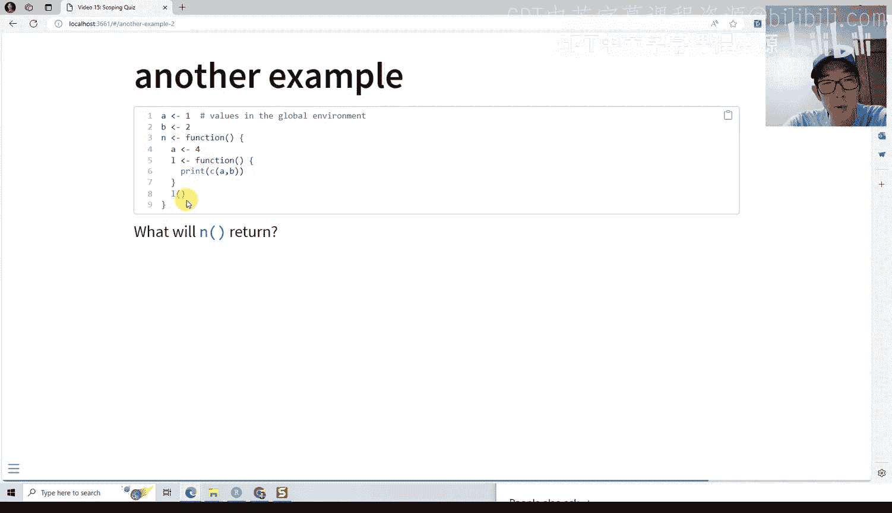

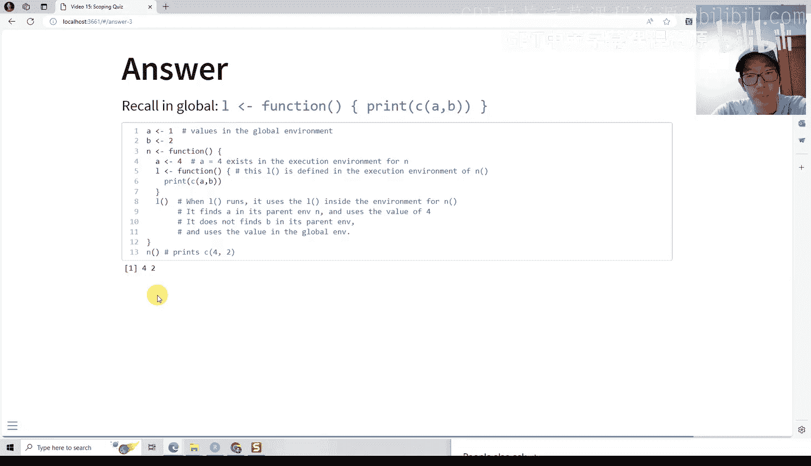

```r
a <- 1
b <- 2

l <- function() {
  print(a)
  print(b)
}

o <- function() {
  a <- 4
  l()                     # 第一次调用 l
  l <- function() {       # 在 o 内部重新定义 l
    print(a)
    print(b)
  }
  l()                     # 第二次调用 l (调用新定义的 l)
  b <- 5
  l()                     # 第三次调用 l (调用新定义的 l)
}

o()
```

以下是代码执行步骤分析：

1.  全局环境：`a=1`， `b=2`， 定义了函数 `l`（输出全局的 `a` 和 `b`）。
2.  执行 `o()`：
    *   局部变量 `a` 被赋值为 `4`。
    *   **第一次调用 `l()`**：此时 `o` 内部尚未定义 `l`，故调用的是全局环境中的 `l`。它输出全局的 `a` 和 `b`，即 `1` 和 `2`。
    *   在 `o` 内部**重新定义**了函数 `l`。这个新 `l` 的封闭环境是 `o` 的执行环境。
    *   **第二次调用 `l()`**：调用的是 `o` 内部新定义的 `l`。它查找 `a`，在 `o` 的环境中找到 `4`；查找 `b`，在 `o` 的环境中未找到，于是向全局环境查找，找到 `2`。输出 `4` 和 `2`。
    *   在 `o` 的环境中，将 `b` 赋值为 `5`。
    *   **第三次调用 `l()`**：仍然调用 `o` 内部定义的 `l`。此时在 `o` 的环境中，`a=4`， `b=5`。因此输出 `4` 和 `5`。

**最终输出顺序为**：`1 2`， `4 2`， `4 5`。

---

## 总结

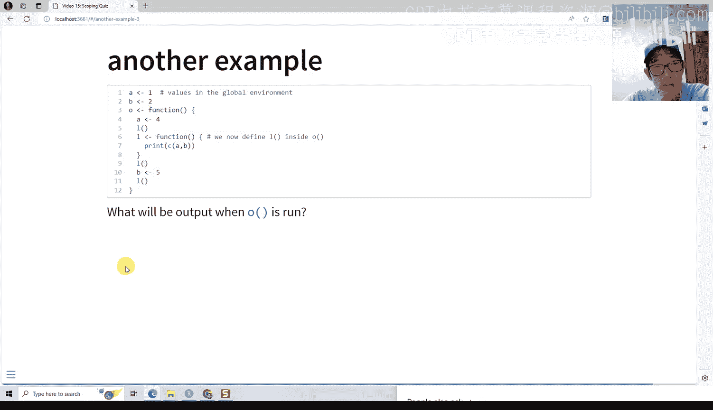

本节课中我们一起学习了R语言的作用域规则。我们通过多个自测题，深入理解了**词法作用域**是R的默认规则，即函数在定义时确定其变量的查找环境（封闭环境）。关键点包括：

1.  变量查找遵循“局部环境 -> 封闭环境 -> … -> 全局环境”的链式规则。
2.  函数的定义位置（即其封闭环境）决定了它如何查找非局部变量，而非其被调用的位置。
3.  使用 `parent.frame()` 可以实现动态作用域，让查找依赖于调用环境。
4.  在更复杂的环境中，函数可以被重新定义，从而改变其行为和作用域链。

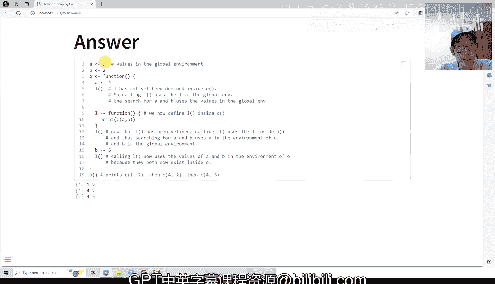

掌握这些概念对于编写正确、可预测的R代码至关重要。