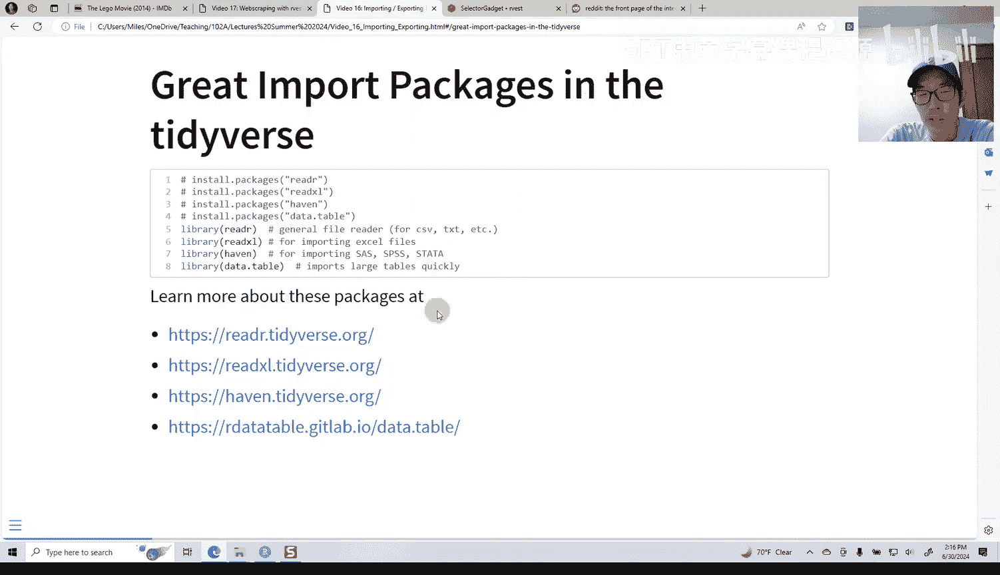
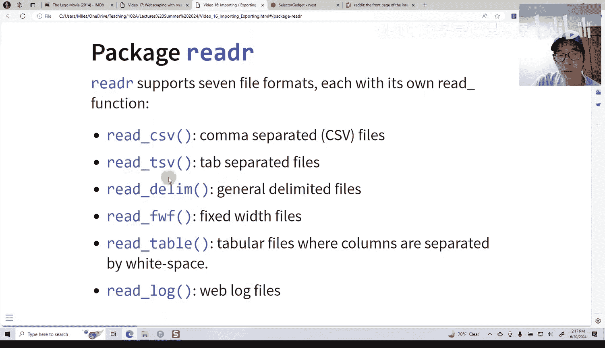
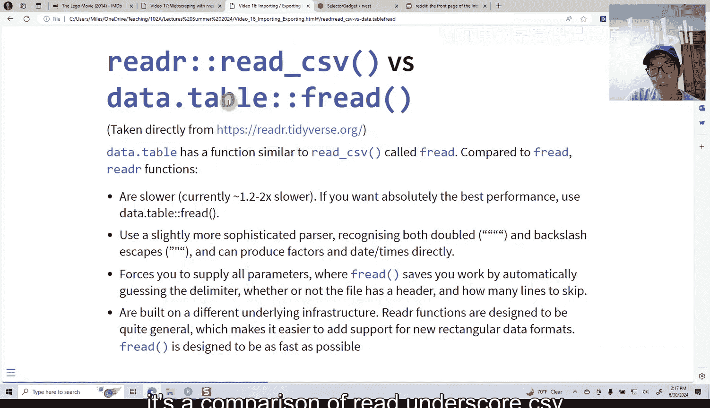
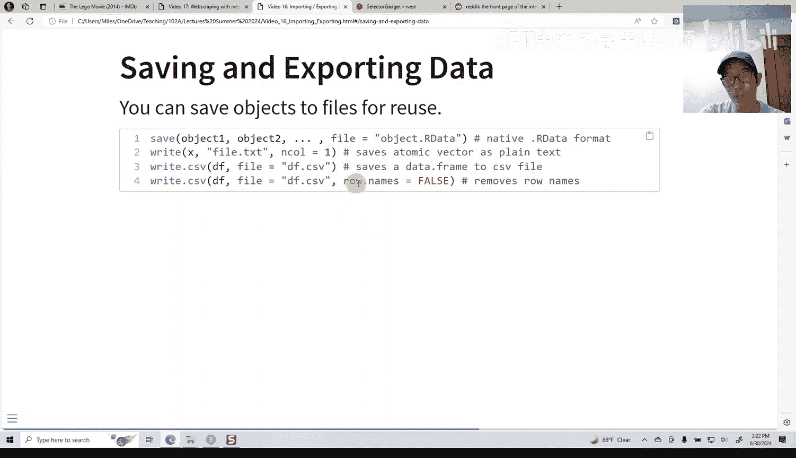
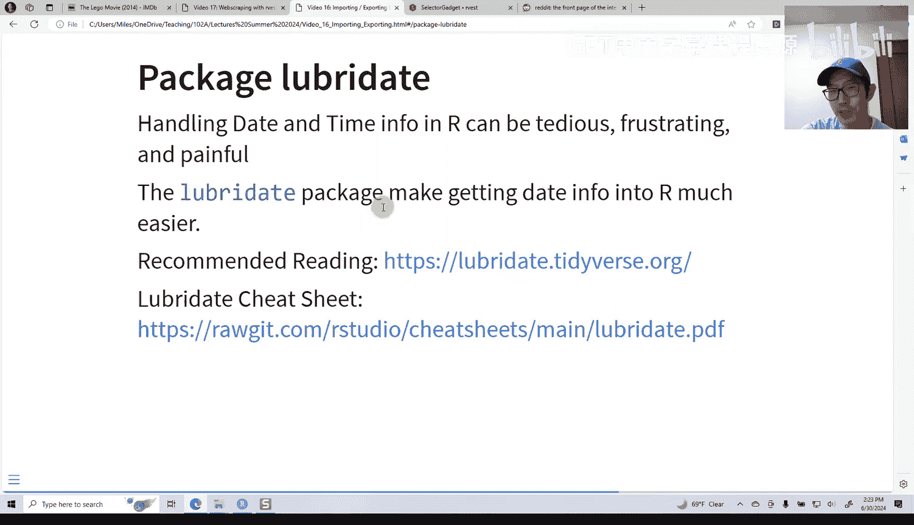
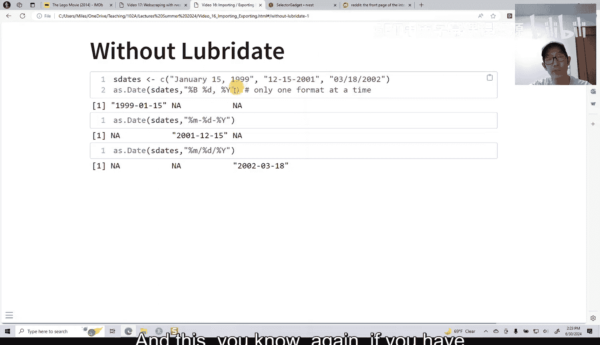
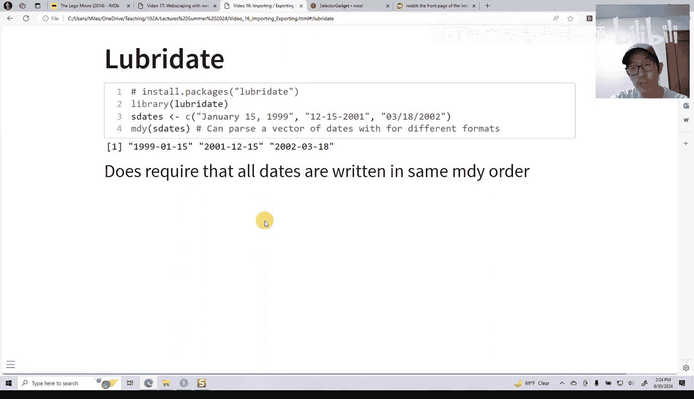
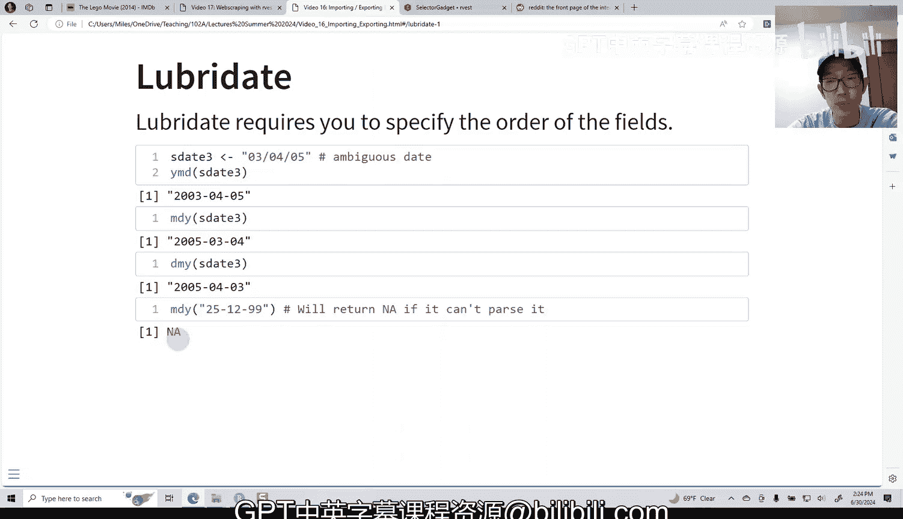

# 16：数据导入、导出与Lubridate包 🗂️

在本节课中，我们将要学习如何在R中导入和导出数据，并介绍一个处理日期数据的强大工具——Lubridate包。掌握这些技能是进行数据分析的基础。

## 数据导入 📥

上一节我们介绍了R的基础操作，本节中我们来看看如何将外部数据读入R环境。R提供了多种读取文件的函数。

以下是读取文件的基本命令：
*   `read.csv`：这是许多用户熟悉的函数，用于读取逗号分隔值文件。
*   `read.table`：读取表格数据的通用函数。
*   `readLines`：逐行读取文本文件。

有时`read.csv`会将字符串读为因子。虽然默认设置是`stringsAsFactors = FALSE`，但为了保险起见，我仍建议在调用时显式指定此参数。

除了基础R的函数，还有许多其他包可以更高效地处理数据导入。

以下是其他常用的数据导入包：
*   **readr**：`tidyverse`套件的一部分。我倾向于使用`readr`中的`read_csv`函数，它通常比基础的`read.csv`更快、更高效。
*   **readxl**：用于导入Excel文件（`.xls`或`.xlsx`格式）。
*   **haven**：允许你导入来自其他统计软件（如Stata、SPSS或SAS）的文件。
*   **data.table**：专为快速处理而设计，能很好地处理大型文件。如果你要处理数十万或数百万行的大型数据集，`data.table`是理想选择。

如果你加载了`readr`包，最常用的函数将是`read_csv`，它用于加载最常见的文本数据格式——逗号分隔值文件。

`readr`包还提供了读取其他格式文件的函数，例如制表符分隔文件、定界文件和固定宽度文件。你可以查阅这些不同函数的帮助文件以了解更多细节。

关于`data.table`，它专为追求最快性能而设计。如果你有一个庞大的数据文件，可以加载`data.table`包并使用`fread`（快速读取器）函数。它的操作方式与`read_csv`类似，但速度更快。

这里有一张幻灯片对比了`readr`包的`read_csv`和`data.table`包的`fread`的性能。

如果你想使用Excel文件，需要加载`readxl`库。你可以通过指定文件名来读取第一个工作表。

如果你的Excel文件包含多个工作表（因为Excel支持此功能），你可以通过工作表名称或工作表编号来指定要读取哪个工作表。

有时，你可能希望直接从网络加载数据。这在你想将脚本分享给同事或同学时特别有用，这样你就不需要同时提供脚本和数据文件本身。

以下是直接从网络下载数据的步骤：
1.  使用`downloader`包中的`download`函数。虽然R有原生的`download.file`函数，但它是一个早期的函数，在处理现在普遍使用的HTTPS安全协议时可能不太顺畅。
2.  在`download`函数中指定文件的URL地址和你希望保存到的本地文件名。
3.  文件下载到工作目录后，你就可以使用`read_csv`等函数将其加载到R中。

这种方法可以让你将下载数据的指令直接包含在R脚本中，当他人运行你的脚本时，数据会自动下载并加载。

## 数据导出 📤

上一节我们介绍了如何导入数据，本节我们来看看如何将R中的对象导出，以便在其他程序中使用或后续使用。

如果你想将对象保存为`.RData`文件格式（以便之后重新加载到R中），可以使用`save`函数。你需要指定要保存的对象列表和保存的文件路径。

如果你想将原子向量保存为纯文本，可以使用`write`函数。你需要指定对象名、文件名和列数，它会为你创建一列数值。

如果你有一个数据框并想将其保存为CSV文件，可以使用`write.csv`函数。你需要指定数据框的名称和要保存的文件名。默认行为是包含行名，我个人不喜欢这样，因此建议包含选项`row.names = FALSE`。

以上就是导出数据的方法。

## 使用Lubridate处理日期 📅

我想特别提请注意一个名为`lubridate`的包，它允许你轻松处理日期信息。很多时候，当你从外部下载CSV文件并导入R时，文件中可能包含日期信息。在R中处理日期信息可能非常繁琐和恼人，但`lubridate`包极大地简化了这个过程。

据我所知，Python中没有类似`lubridate`的包，因此这是R中一个非常出色的工具。在Python中，你仍然需要经历繁琐的格式化过程。

那个繁琐的格式化系统看起来像这样：你必须使用像`%B %d, %Y`这样的格式代码，并且要求非常严格。如果你搞错了一个细节，比如日期字符串是“January 15, 1999”，但你不小心漏掉了逗号，程序就无法理解。或者日期是“12-15-2001”带连字符，如果你漏掉了连字符，它也会出错。所以这很烦人。此外，如果你的数据中混合了多种日期格式，基础方法通常无法处理。

使用`lubridate`包，你可以处理混合格式的日期。你只需要告诉它日期字段的顺序（例如，月-日-年），它就能理解所有格式。无论是“January 15, 1999”、“12-15-2001”还是“03/18/2002”，所有这些格式都能正常工作。

`lubridate`非常棒，但它确实要求你指定字段的顺序。例如，“03-04-05”这样的日期是模糊的，它可能是“年-月-日”（2003年4月5日），也可能是“月-日-年”（2005年3月4日），还可能是“日-月-年”（2005年4月3日）。如果你尝试用“月-日-年”的格式去解析一个像“25-13-05”的日期（第25个月？），那显然不会成功，它会返回`NA`。

总之，这就是`lubridate`包。如果你预计需要处理日期信息，我强烈推荐使用它。

---

本节课中我们一起学习了在R中导入和导出数据的多种方法，包括使用基础函数、`readr`、`readxl`、`haven`和`data.table`等包。我们还重点介绍了强大的`lubridate`包，它极大地简化了日期数据的处理过程，是数据分析工作中不可或缺的工具。