# 18：Tidyverse 与 Tibbles 入门 🧹

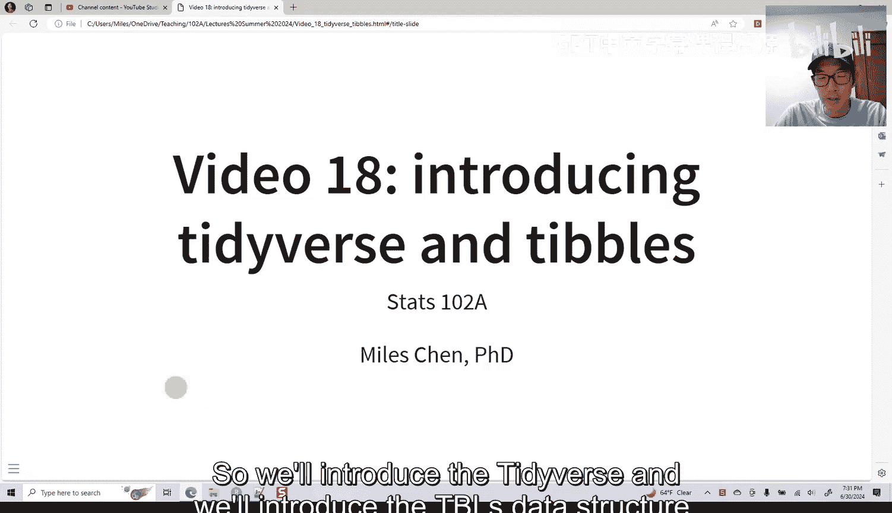

在本节课中，我们将学习 R 语言中一个非常重要的工具集——Tidyverse，并重点介绍其核心数据结构 **Tibble**。Tibble 是数据框（Data Frame）的现代化版本，它优化了显示和操作方式，使数据处理更加高效和直观。

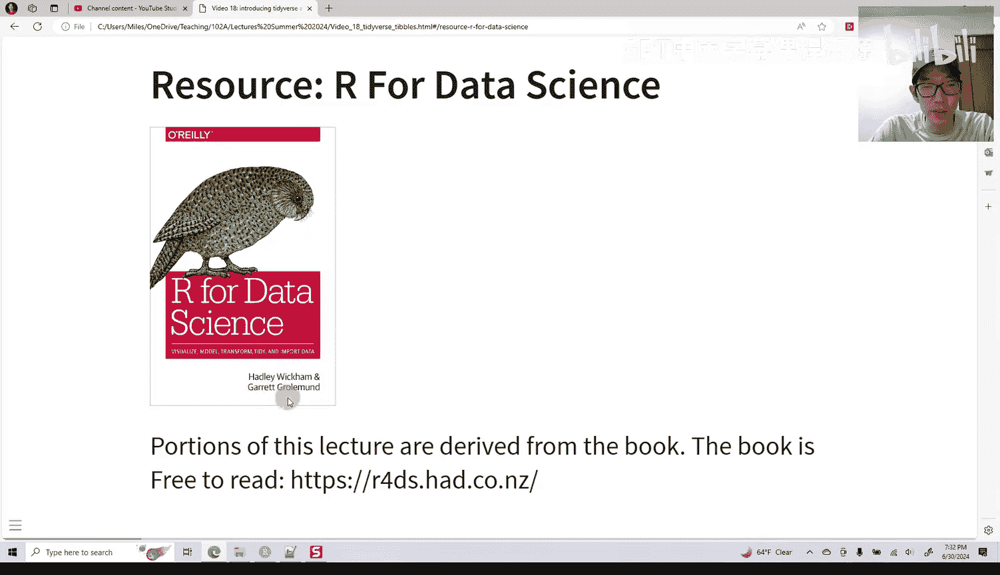

---

## 什么是 Tidyverse？ 📦

Tidyverse 是一个为数据科学设计的、包含一系列 R 包的“有主见”的集合。这些包共享相同的底层设计理念、语法和数据结构。当你加载 `library(tidyverse)` 时，会同时加载其核心包，例如 `dplyr` 和 `ggplot2`。当然，你也可以单独加载它们。

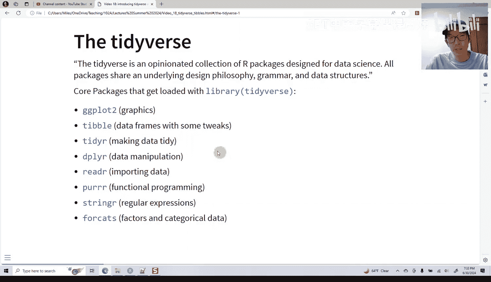

上一节我们介绍了 Tidyverse 的整体概念，本节中我们来看看它的核心数据结构——Tibble。

---

## Tibble：Tidyverse 的核心数据结构 📊

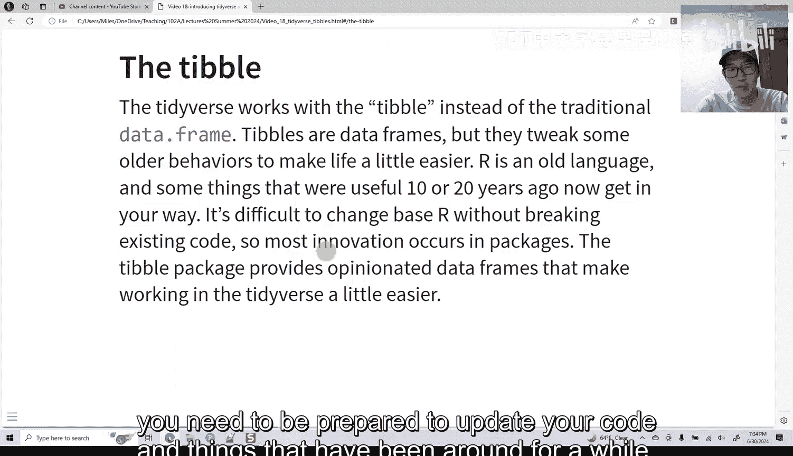

Tibble 是 Tidyverse 的中央数据结构。它本质上是一种数据框，但进行了一些优化，使其在现代数据科学工作流中更加实用。R 是一门有几十年历史的语言，其基础数据框的一些特性在当时很有用，但现在有时会带来不便。Tibble 的设计就是为了解决这些问题。

### Tibble 的创建

创建 Tibble 非常简单，你可以像创建数据框一样创建它。

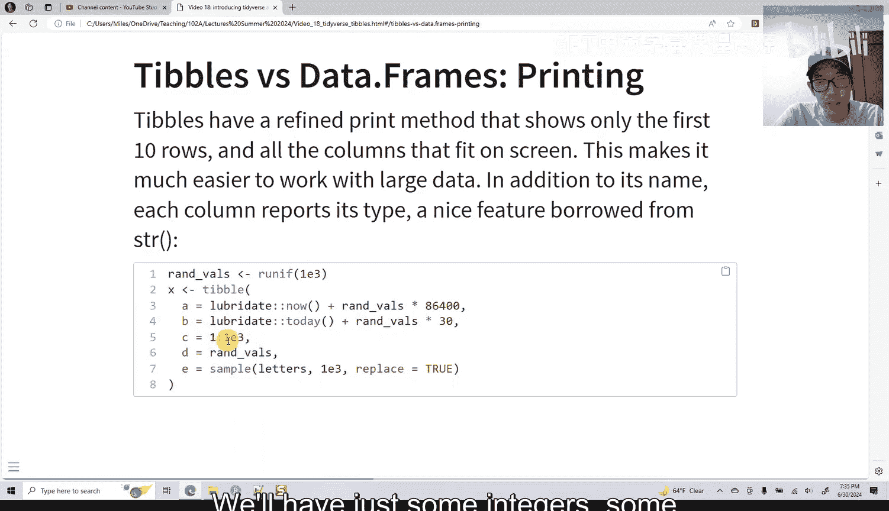

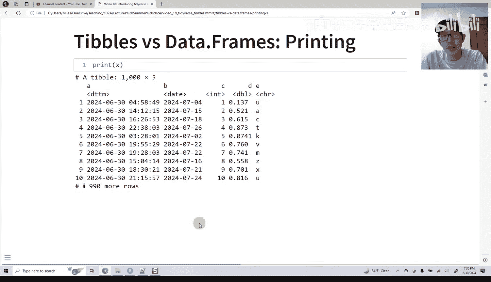

以下是创建 Tibble 的几种方法：

1.  **使用 `tibble()` 函数直接创建**：
    ```r
    library(tibble)
    my_tibble <- tibble(
      column_a = c(1, 2, 3),
      column_b = c("a", "b", "c")
    )
    ```

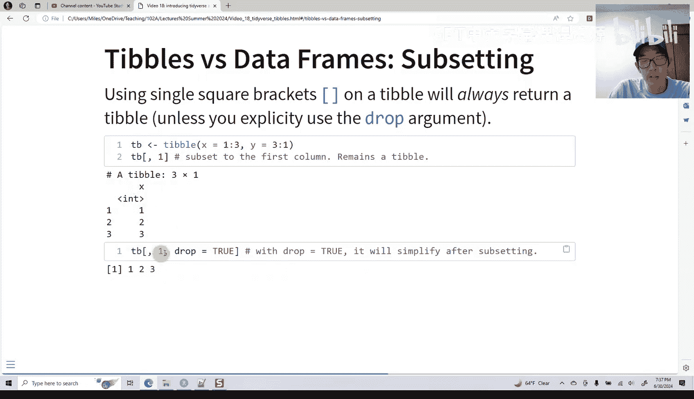

2.  **将现有数据框转换为 Tibble**：
    ```r
    mtcars_tibble <- as_tibble(mtcars)
    ```

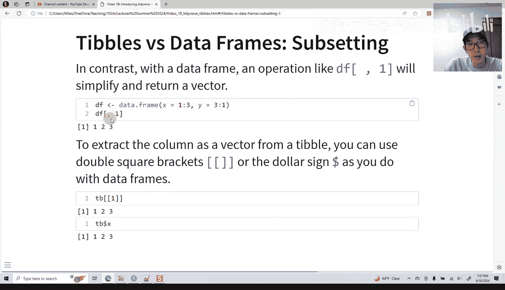

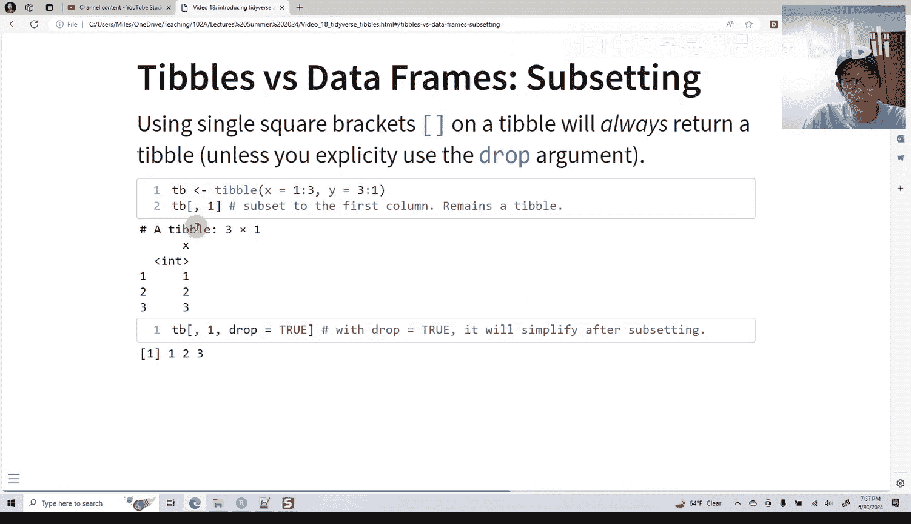

3.  **按行创建 Tibble**（便于阅读代码）：
    ```r
    tibble_rowwise <- tribble(
      ~column_a, ~column_b, ~column_c,
      "A", 1, TRUE,
      "B", 2, FALSE
    )
    ```

### Tibble 的显示特性

Tibble 的打印方法经过了优化，使其在处理大型数据时更友好。

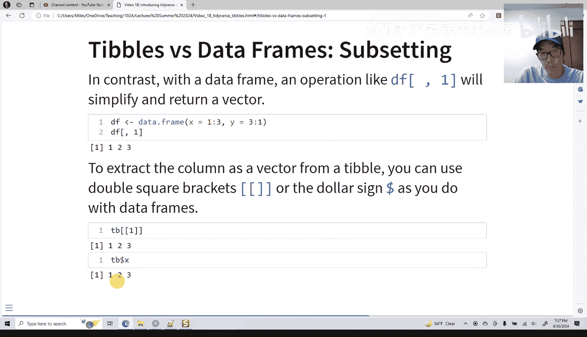

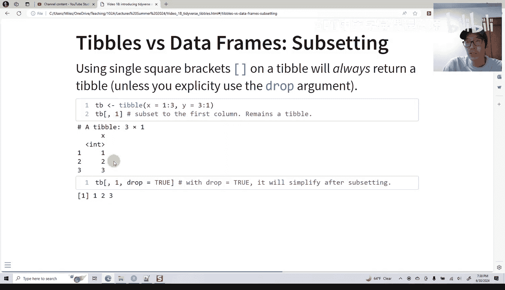

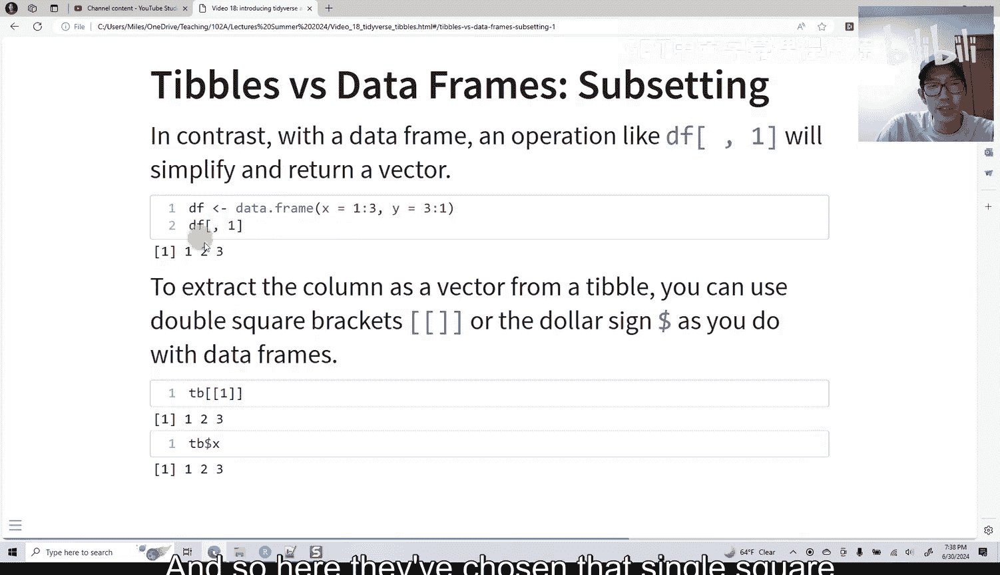

以下是 Tibble 的几个关键显示特性：

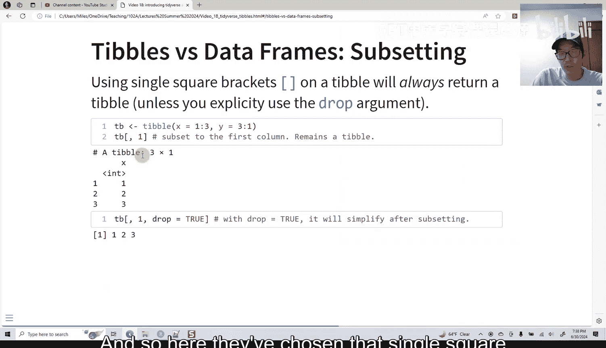

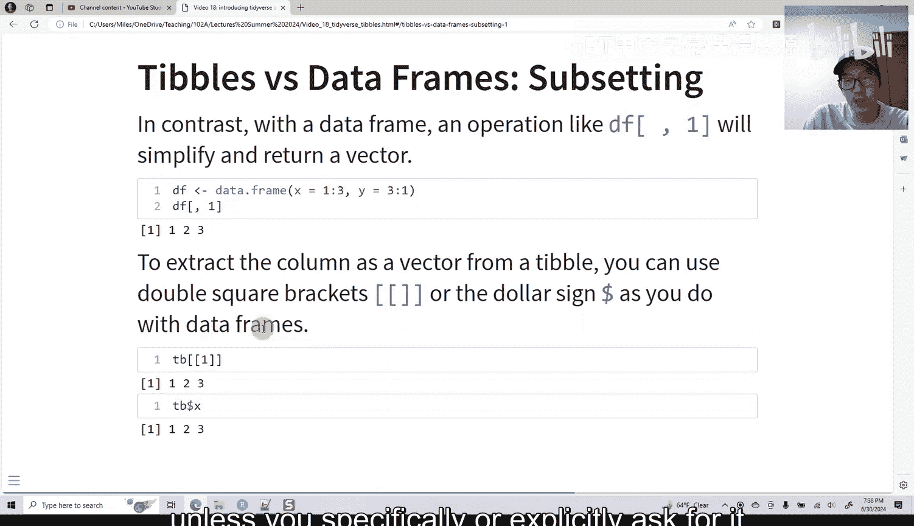

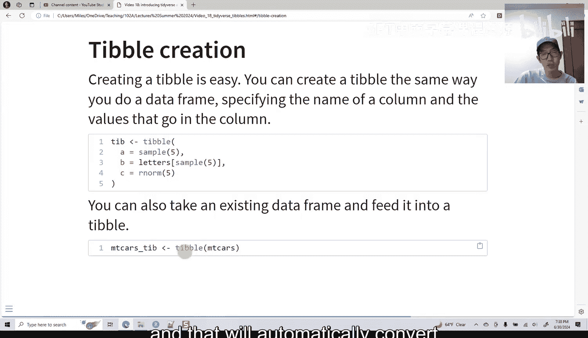

*   **智能显示**：默认只显示前10行，以及能在屏幕上完整显示的列。
*   **类型提示**：在列名下方会显示该列的数据类型（如 `<dbl>`, `<chr>`, `<date>`），无需调用 `str()` 函数。
*   **简洁数值**：为保持显示紧凑，默认只显示少数几位小数（内部数据精度保持不变）。
*   **无行名**：Tibble 不鼓励使用行名来存储信息，所有数据都应存储在列中。

### Tibble 与数据框的子集选取差异

在子集选取行为上，Tibble 与基础 R 的数据框有一个重要区别，这能提供更一致的行为。

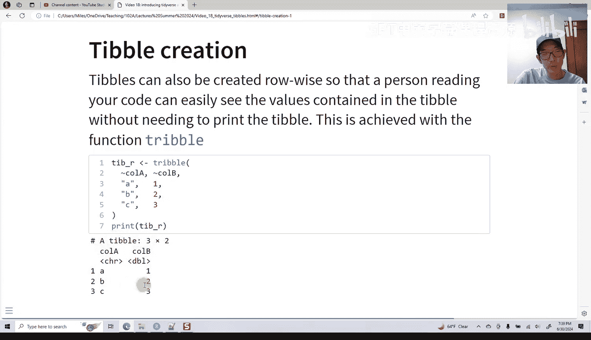

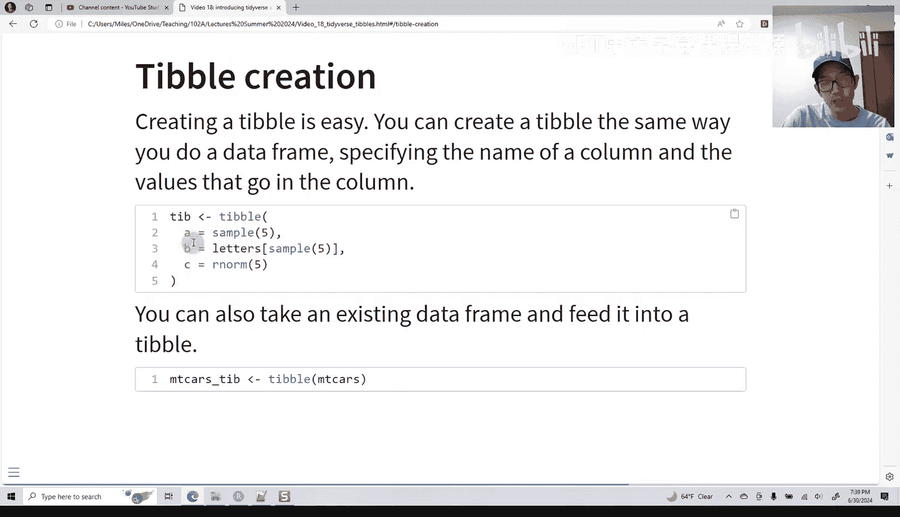

以下是 Tibble 子集选取的规则：

*   **单括号 `[ ]`**：始终返回 Tibble，即使只选取一列。
    ```r
    # 返回一个只包含一列的 Tibble
    my_tibble[, “column_a”]
    ```
*   **双括号 `[[ ]]` 或 `$`**：用于提取单个列为向量。
    ```r
    # 返回一个向量
    my_tibble[[“column_a”]]
    my_tibble$column_a
    ```
*   **强制简化**：如果想用单括号获取向量，需使用 `drop = TRUE` 参数。
    ```r
    my_tibble[, “column_a”, drop = TRUE]
    ```

相比之下，基础数据框在使用单括号选取单列时，默认会简化为向量，这种行为有时会导致意外结果。Tibble 的设计避免了这种不一致性。

### 控制 Tibble 的打印输出

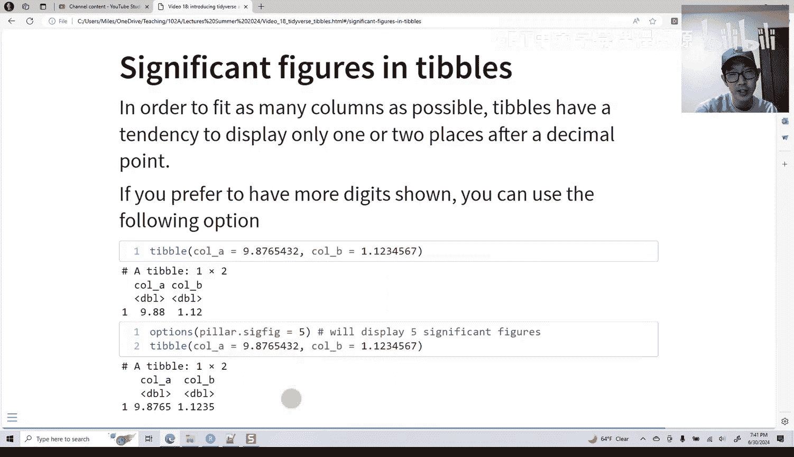

你可以通过 `print()` 函数的参数来控制 Tibble 的显示方式。

以下是控制打印输出的常用参数：

*   `n`：指定要打印的行数（例如 `print(my_tibble, n = 20)`）。
*   `width`：指定打印的宽度。
*   通过 `options(pillar.sigfig = 5)` 可以全局调整显示的有效数字位数。

---

## 总结 📝

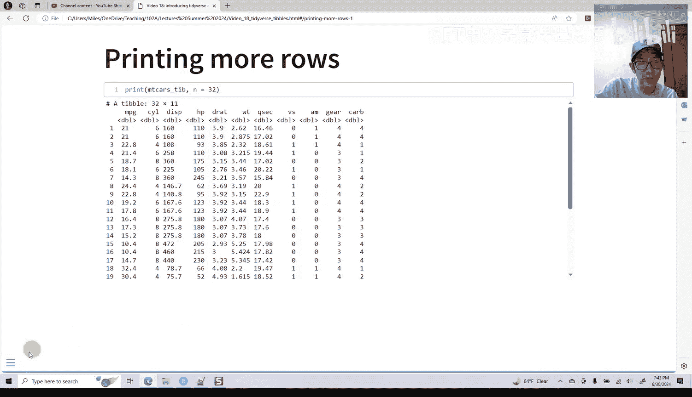

本节课中我们一起学习了 Tidyverse 及其核心数据结构 Tibble。我们了解到 Tibble 是数据框的增强版，它提供了更清晰的数据显示、更一致的子集选取行为，并鼓励更好的数据组织实践（如将信息存入列而非行名）。这些特性使得 Tibble 成为使用 Tidyverse 进行数据清洗、转换和分析的理想起点。在后续课程中，我们将深入利用 Tibble 来学习 `dplyr` 等强大的数据处理工具。