# 21：dplyr - group_by 与 summarise

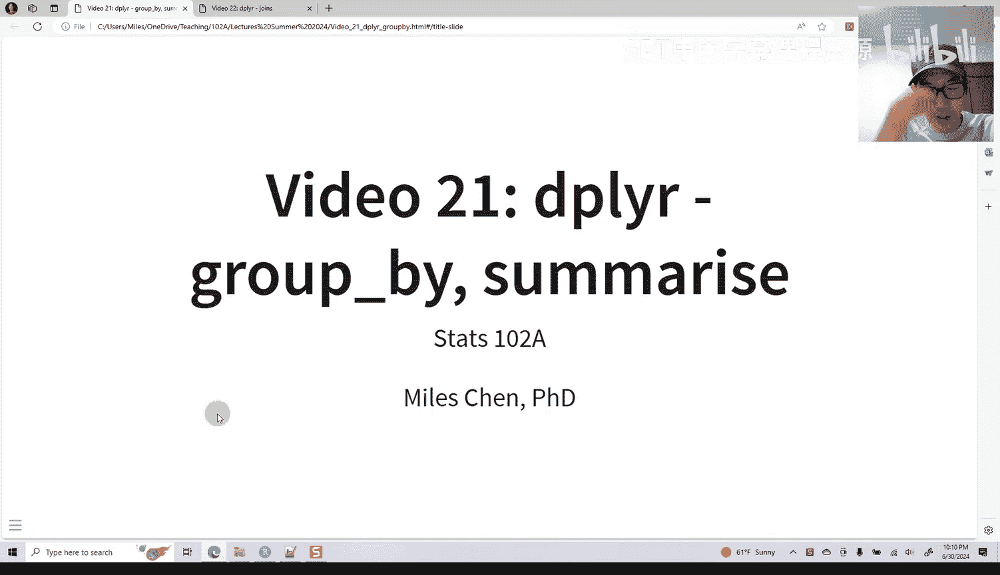


在本节课中，我们将继续学习 `dplyr` 包，重点介绍 `group_by` 和 `summarise` 这两个函数。它们能极大地释放数据处理的威力，允许我们按组计算汇总统计量。

## 概述

`summarise` 函数用于计算汇总值。汇总函数接收多个值，并将其缩减为一个值。例如，对100个值求均值，会得到一个均值；求中位数，会得到一个中位数。`group_by` 函数则用于根据分类变量对数据进行分组。当两者结合使用时，我们可以为每个组分别计算汇总统计量。

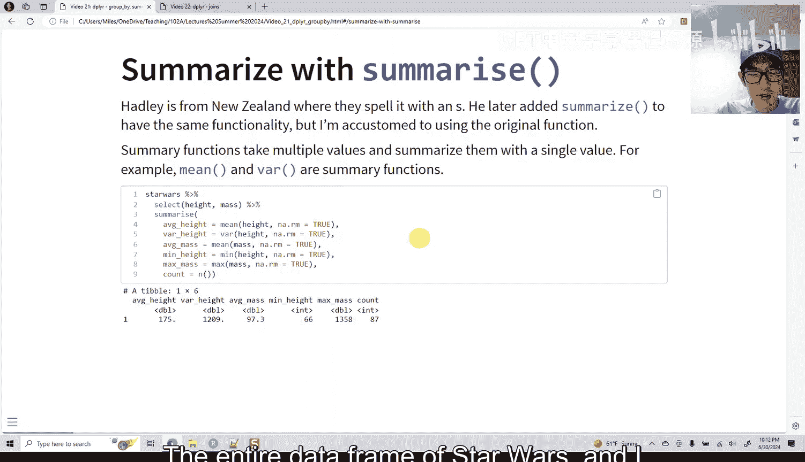


## 使用 summarise 函数

`summarise` 的拼写是 `summarise`（带“s”），这是 tidyverse 作者 Hadley Wickham（来自新西兰）的拼写习惯。后来也添加了 `summarize`（带“z”）版本，功能完全相同。我们将使用带“s”的版本。

调用 `summarise` 时，它会计算汇总值。例如，我们可以对整个 `starwars` 数据集（共87行）计算多个汇总统计量。

```r
starwars %>%
  summarise(
    average_height = mean(height, na.rm = TRUE),
    variance_height = var(height, na.rm = TRUE),
    average_mass = mean(mass, na.rm = TRUE),
    min_height = min(height, na.rm = TRUE),
    max_mass = max(mass, na.rm = TRUE),
    count = n()
  )
```

这段代码会计算身高的平均值、方差，质量的平均值，身高的最小值，质量的最大值，以及总行数。结果被汇总为一行。Tibble 默认只显示几位有效数字，但实际值包含更多小数位。

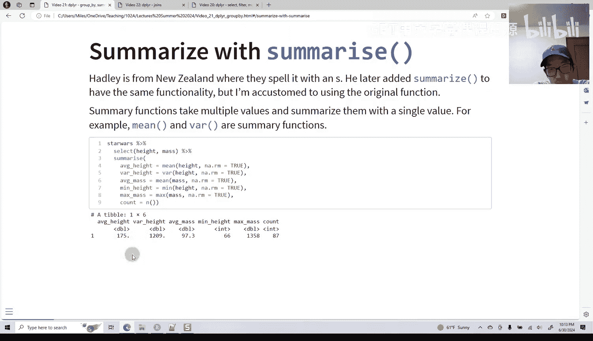

你可能会问，这和不使用 `dplyr` 直接计算 `mean(starwars$height, na.rm = TRUE)` 有什么区别？`summarise` 的优势在于它能与管道操作符流畅结合，并方便地一次性计算多个统计量。


## 结合 group_by 使用

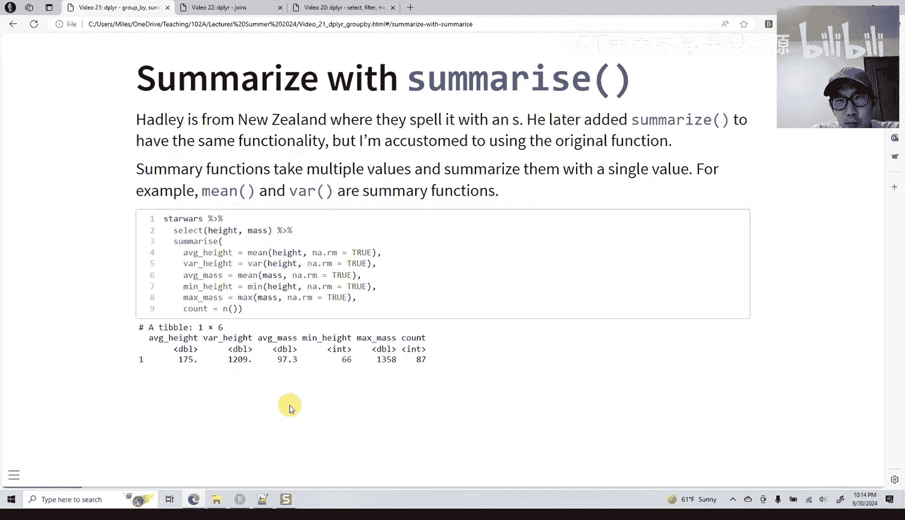

`summarise` 的真正威力在与 `group_by` 结合时才能完全展现。`group_by` 根据分类变量（如物种）形成分组。

首先，我们看看仅使用 `group_by` 的效果：


```r
starwars %>%
  group_by(species) %>%
  select(name, height, mass, species)
```


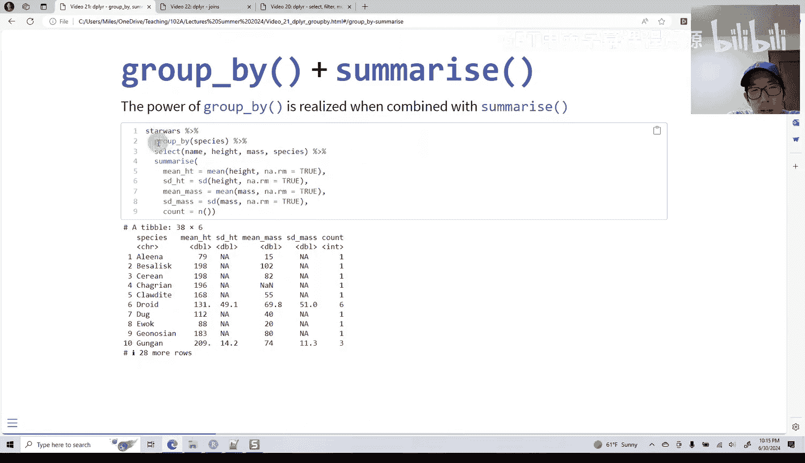

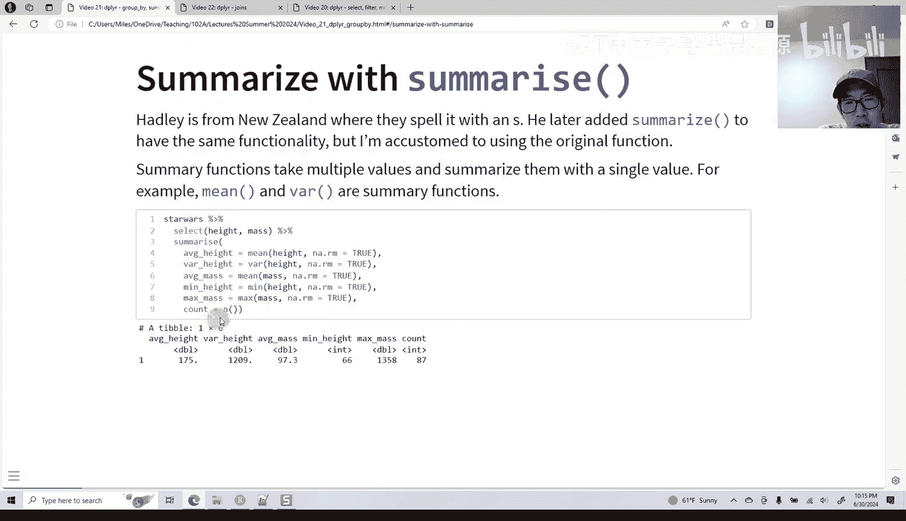

输出看起来和直接使用 `select` 相似，但会多出一行提示：`Groups: species [38]`。这表示数据已按38个不同的物种分组，但尚未进行任何计算。

现在，让我们加入 `summarise`：

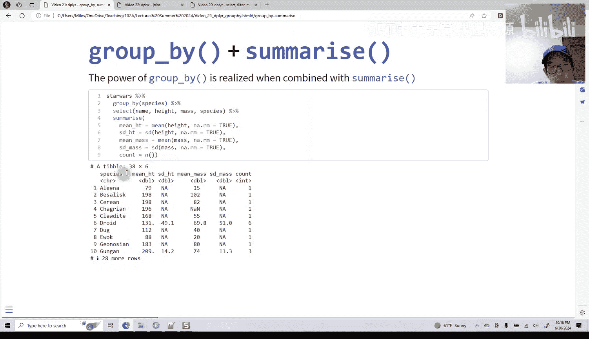


```r
starwars %>%
  group_by(species) %>%
  select(name, height, mass, species) %>%
  summarise(
    mean_height = mean(height, na.rm = TRUE),
    sd_height = sd(height, na.rm = TRUE),
    mean_mass = mean(mass, na.rm = TRUE),
    sd_mass = sd(mass, na.rm = TRUE),
    count = n()
  )
```

因为数据被分成了38个组（每个物种一个组），所以我们会得到38行结果，每行代表一个组的汇总统计。例如，对于“Droid”组（有6个个体），会计算其身高的均值、标准差等。

## 筛选与排序分组结果

我们可能只关心那些有多个个体的组，以便计算标准差更有意义。我们可以对汇总后的结果进行进一步处理。

```r
starwars %>%
  group_by(species) %>%
  select(name, height, mass, species) %>%
  summarise(
    mean_height = mean(height, na.rm = TRUE),
    sd_height = sd(height, na.rm = TRUE),
    mean_mass = mean(mass, na.rm = TRUE),
    sd_mass = sd(mass, na.rm = TRUE),
    count = n()
  ) %>%
  filter(count > 1) %>% # 只保留个体数大于1的组
  arrange(desc(count)) %>% # 按个体数降序排列
  head(6) # 查看前6行
```

这样，我们就得到了个体数最多的几个物种（如人类、机器人）的汇总信息。

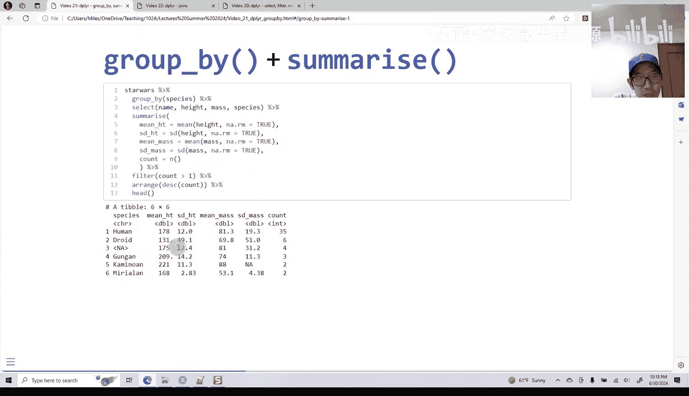

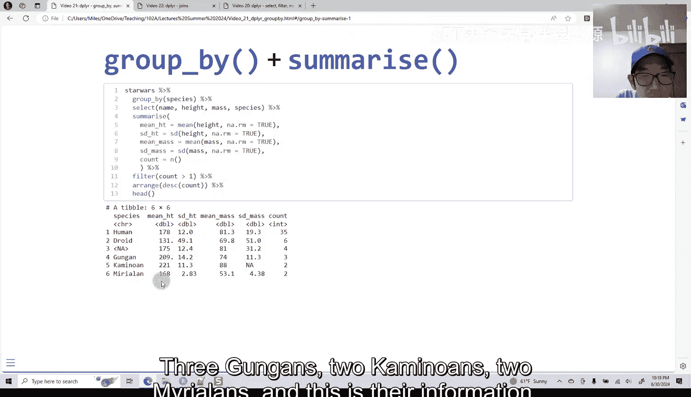

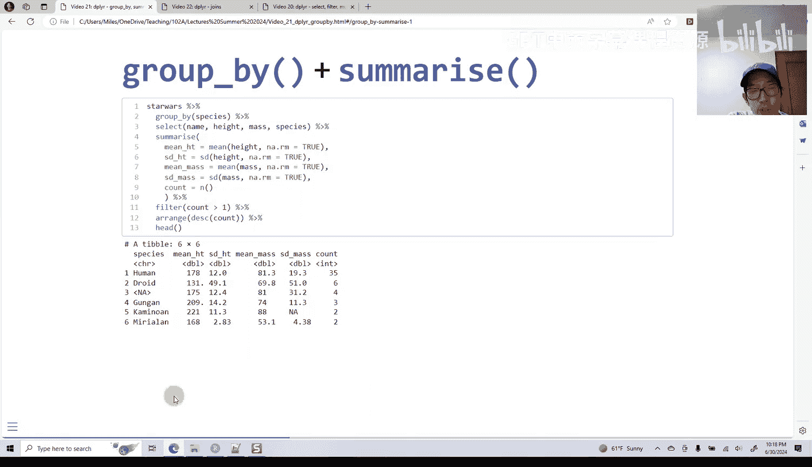

## 结合 group_by 与 mutate

`group_by` 也可以与 `mutate` 结合使用，用于按组计算新变量，例如计算组内的 z 分数。

```r
starwars %>%
  filter(species %in% c("Human", "Droid")) %>%
  select(name, species, height) %>%
  group_by(species) %>% # 按物种分组
  mutate(z_score_height = (height - mean(height, na.rm = TRUE)) / sd(height, na.rm = TRUE))
```

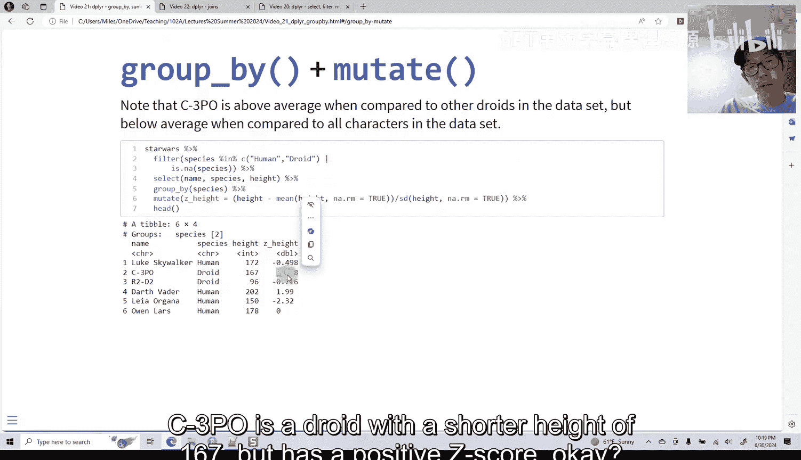

这段代码为人类和机器人分别计算了身高的 z 分数。z 分数的计算公式是：
`z = (x - μ) / σ`
其中 `x` 是单个值，`μ` 是组均值，`σ` 是组标准差。

因为按组计算，卢克·天行者（人类）的身高低于人类平均身高，所以他的 z 分数为负；而 C-3PO（机器人）的身高高于机器人平均身高，所以他的 z 分数为正。

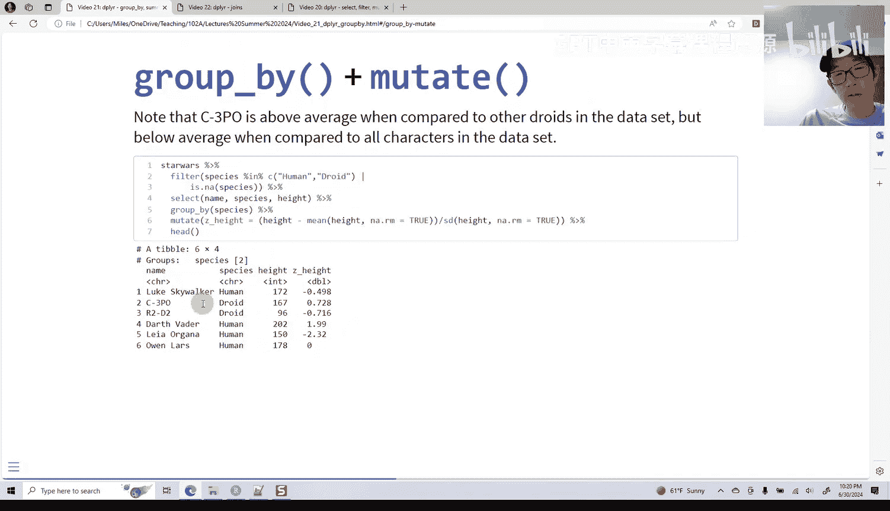

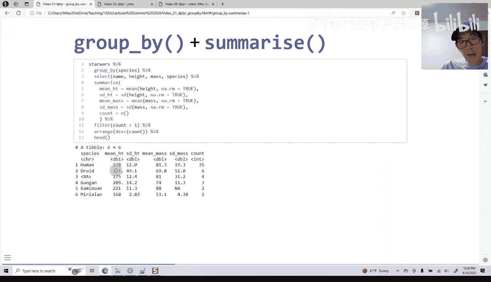

如果注释掉 `group_by(species)` 这一行，z 分数将在所有个体间计算，结果会完全不同。

## 多重分组

`group_by` 支持按多个变量进行分组。我们用一个简单的示例数据来说明。

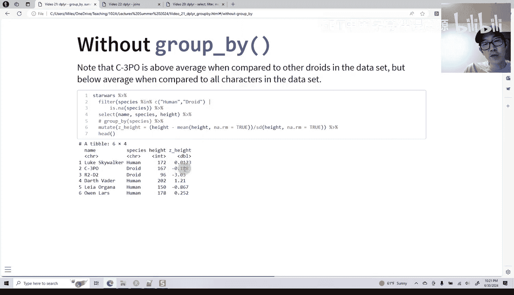

假设我们有以下数据：
- `country`: 国家（如阿富汗、巴西、中国）
- `year`: 年份（1999, 2000）
- `sex`: 性别（男、女）
- `cases`: 病例数

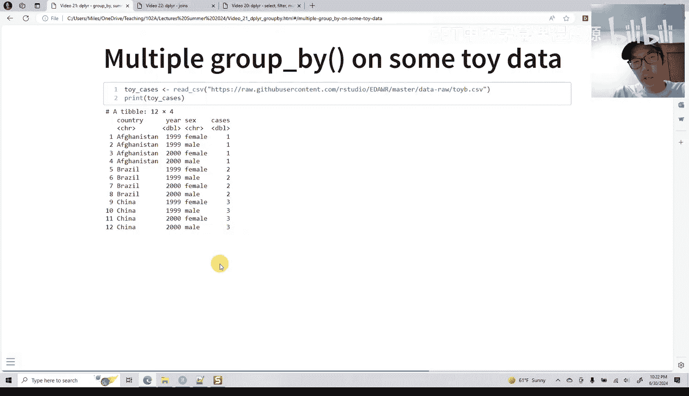

首先，我们按国家和年份分组并求和：

```r
toy_data %>%
  group_by(country, year) %>%
  summarise(total_cases = sum(cases))
```

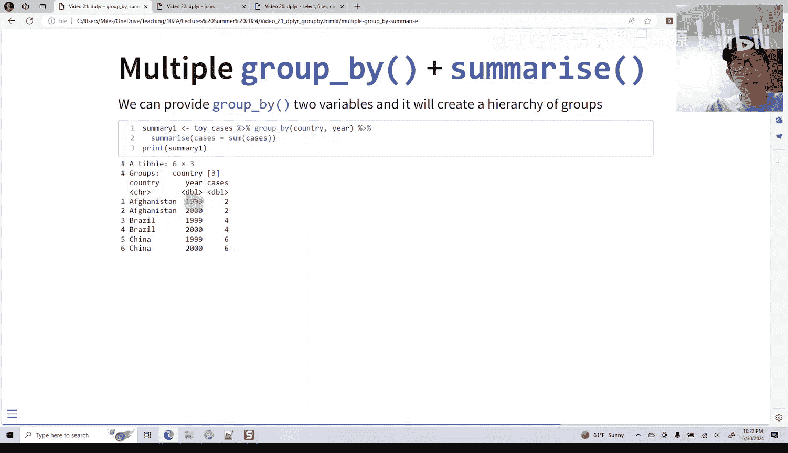

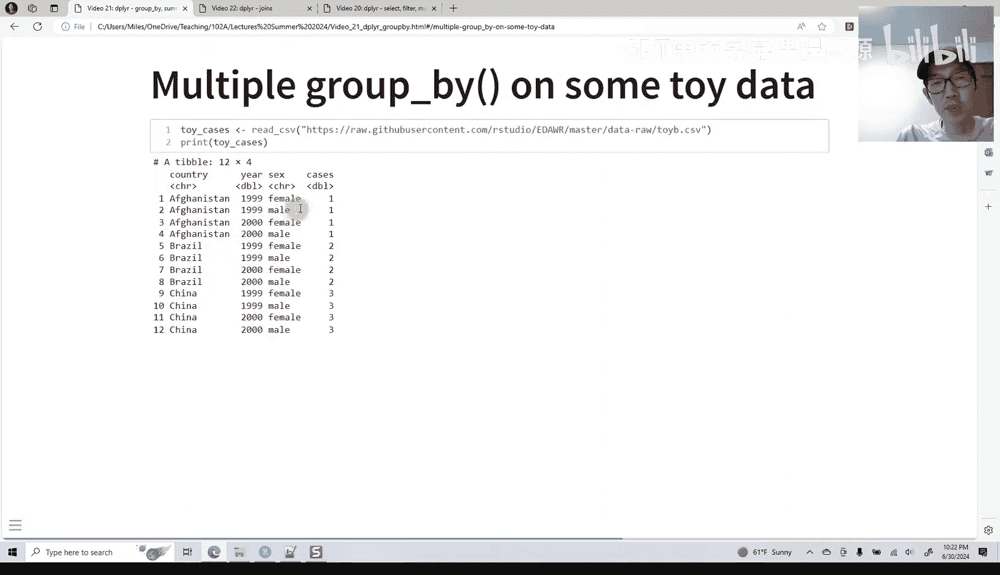

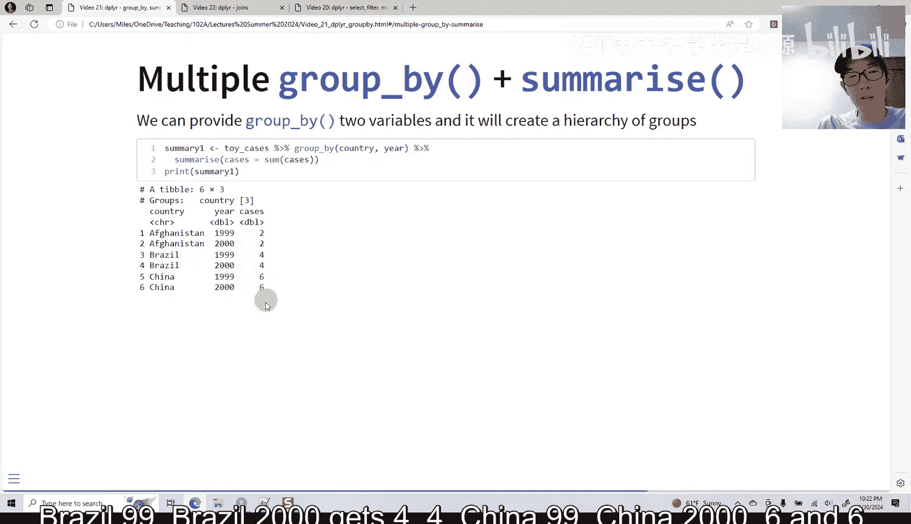

这会根据 `country` 和 `year` 的唯一组合形成多个组（例如阿富汗-1999、阿富汗-2000），并计算每个组的总病例数。

分组具有层次结构。如果在此基础上再次调用 `summarise`，它将移除最后一层分组（`year`），只按 `country` 进行汇总。

```r
toy_data %>%
  group_by(country, year) %>%
  summarise(total_cases = sum(cases)) %>%
  summarise(total_cases = sum(total_cases)) # 此时只按 country 分组
```

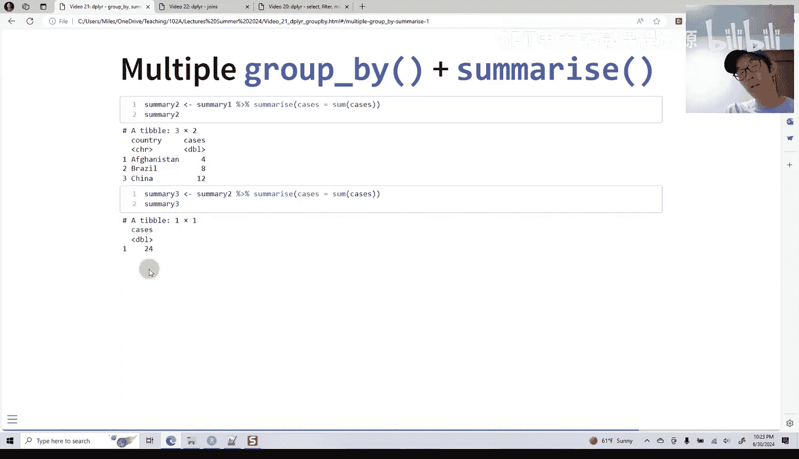

分组的顺序会影响结果的排序。`group_by(year, country)` 会先按年份排序，再在国家内部排序。

## 总结


本节课我们一起学习了 `dplyr` 包中 `group_by` 和 `summarise` 函数的强大功能。
- `summarise` 用于将多行数据汇总为单行统计值。
- `group_by` 用于根据一个或多个分类变量对数据进行分组。
- 两者结合，可以轻松计算每个组的汇总统计量（如均值、标准差、计数）。
- `group_by` 还可以与 `mutate` 联用，进行按组的计算（如 z 分数）。
- 理解多重分组的层次结构对于组织复杂的数据分析至关重要。


掌握 `group_by` 和 `summarise` 是进行高效数据聚合和分析的关键步骤，在后续的作业和实践中你会经常用到它们。