# 22：dplyr 连接操作 🧩

在本节课中，我们将要学习如何使用 `dplyr` 包中的连接操作来合并两个表格或 tibble。连接操作是数据整理中的核心技能，它允许我们基于共同的列将不同数据集的信息组合在一起。

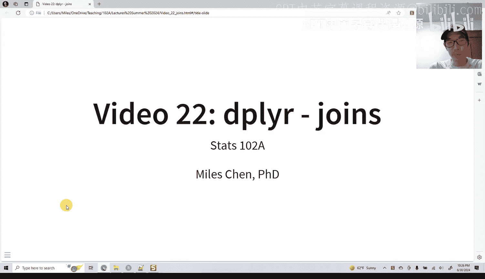

## 概述

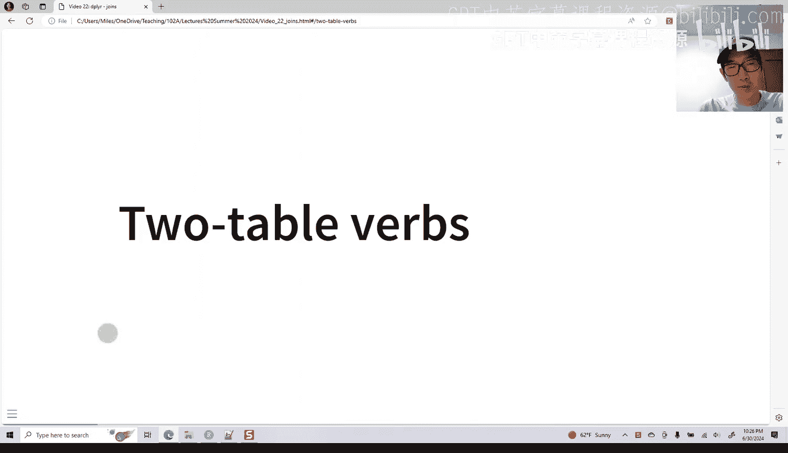

`dplyr` 提供了多种连接函数，用于将两个表格中的数据行进行组合。这些操作主要分为三类：**添加新变量的连接**、**筛选连接**和**集合操作**。本节课我们将重点介绍最常用的几种添加新变量的连接操作。

## 连接操作简介

上一节我们介绍了 `dplyr` 的基本数据操作。本节中我们来看看如何将两个表格连接在一起。连接操作的核心思想是，根据一个或多个关键列（key）的匹配情况，将两个表格的行进行组合。

如果你熟悉 SQL 语言，那么这些操作会非常熟悉。如果不熟悉，本节将是一个很好的入门介绍。

以下是 `dplyr` 中主要的连接函数：

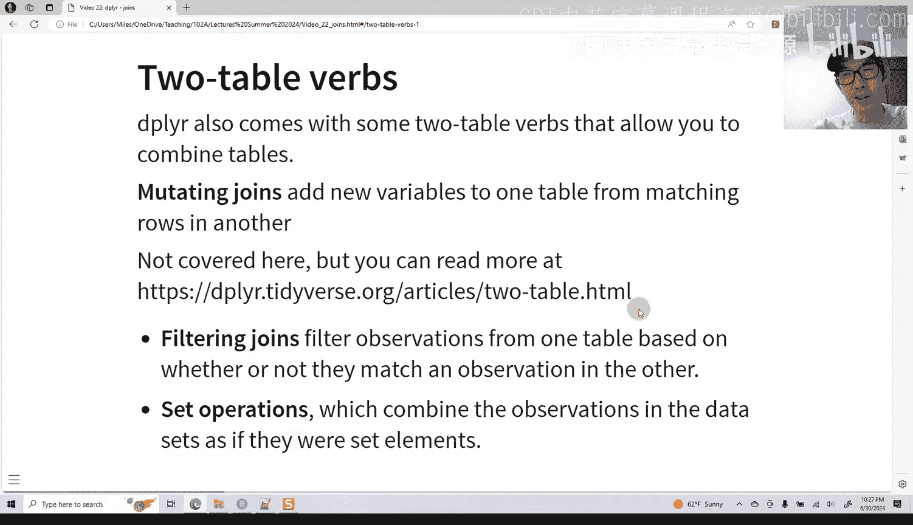

*   **`left_join()`**：保留左侧表格的所有行，并从右侧表格添加匹配的列。
*   **`right_join()`**：保留右侧表格的所有行，并从左侧表格添加匹配的列。
*   **`inner_join()`**：只保留两个表格中都能匹配上的行。
*   **`full_join()`**：保留两个表格中的所有行，无法匹配的位置用 `NA` 填充。

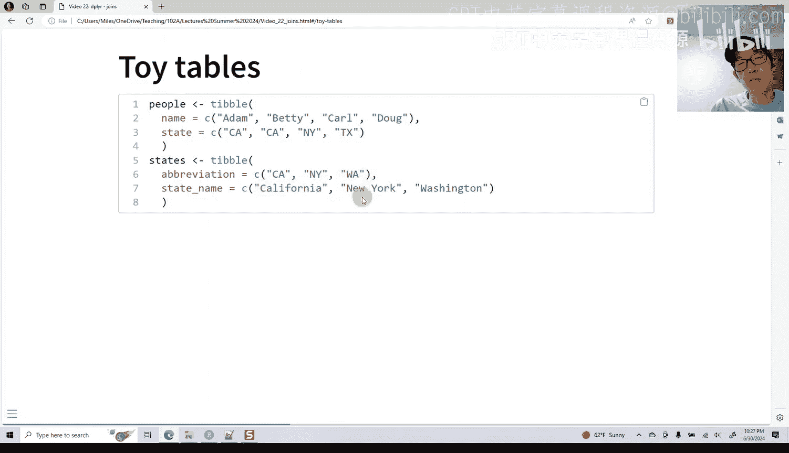

## 连接操作示例

为了清晰地理解这些连接的区别，我们通过一个简单的例子来演示。假设我们有两个表格：`people` 和 `states`。

`people` 表格包含人名及其所在州的缩写：

```r
# 代码示例：创建 people tibble
people <- tibble(
  name = c(“Adam”, “Betty”, “Carl”, “Doug”),
  state = c(“CA”, “CA”, “NY”, “TX”)
)
```

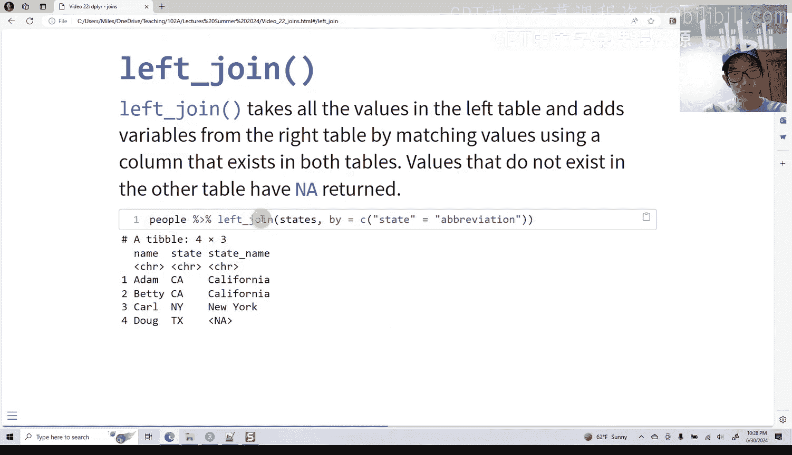

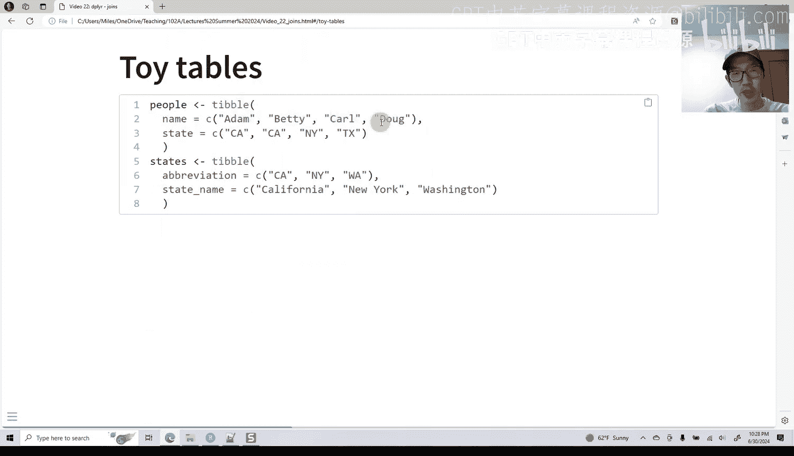

`states` 表格包含州缩写与州全名的对应关系：

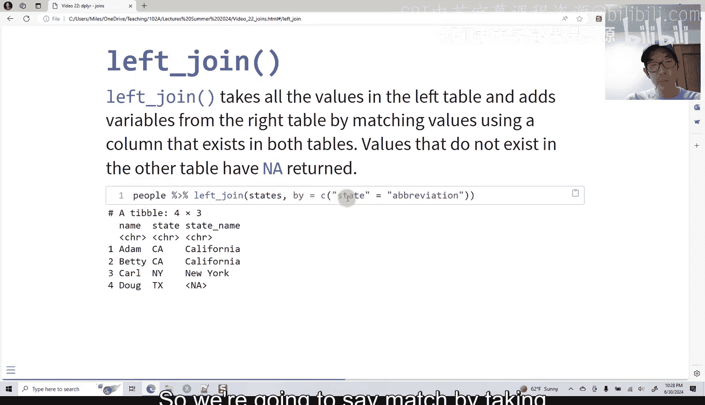

```r
# 代码示例：创建 states tibble
states <- tibble(
  abbrev = c(“CA”, “NY”, “WA”),
  name = c(“California”, “New York”, “Washington”)
)
```

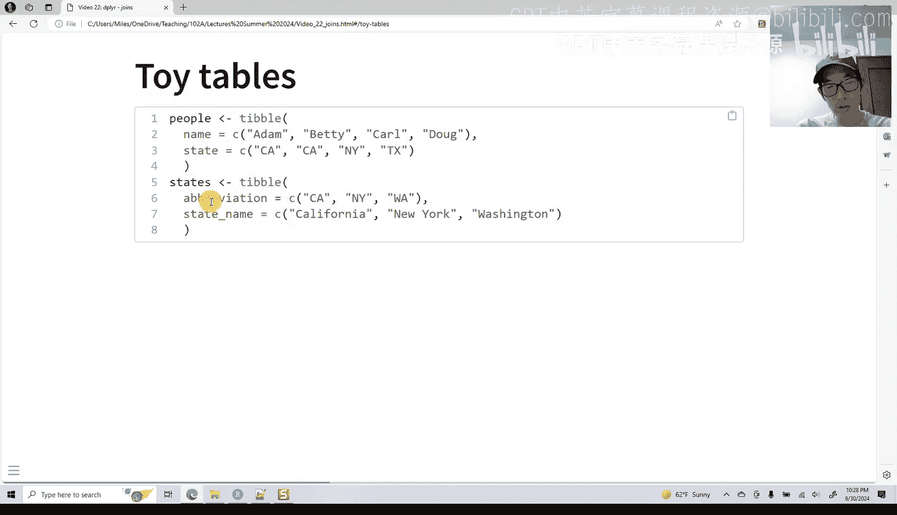

现在，让我们看看对这同一个 `people` 和 `states` 表格应用不同连接函数的结果。

### 左连接 (`left_join`)

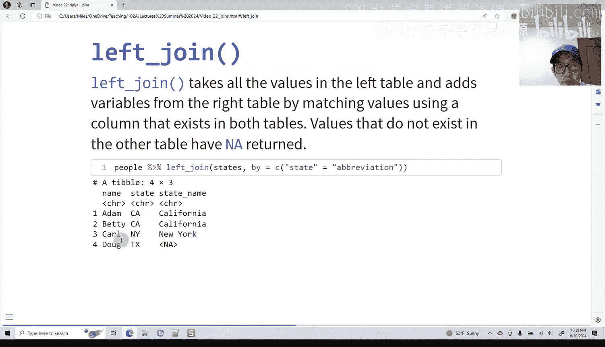

左连接会保留左侧表格（`people`）的所有行，然后从右侧表格（`states`）中寻找匹配的行来添加新列。

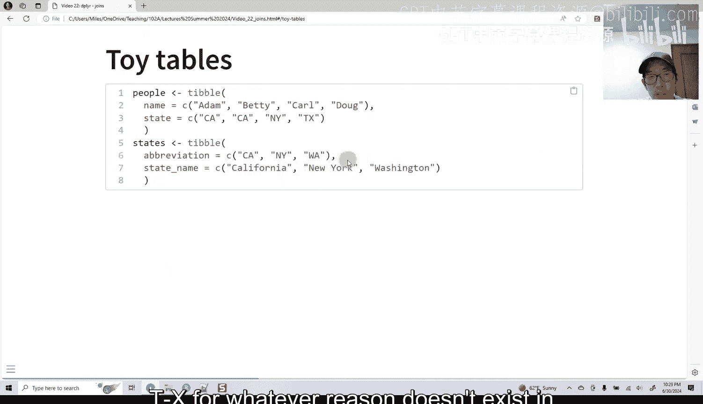

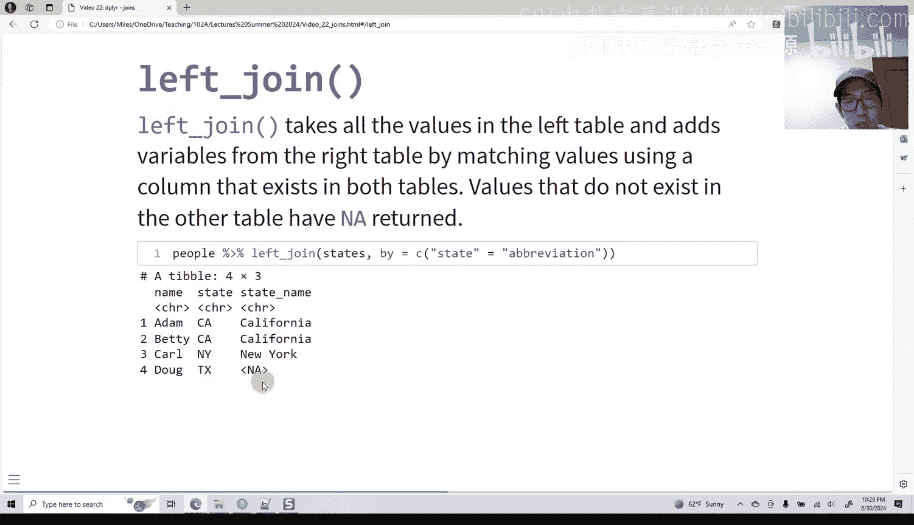

```r
# 代码示例：左连接
left_join_result <- left_join(people, states, by = c(“state” = “abbrev”))
```

**结果分析**：
*   Adam 和 Betty 的 `state` 是 “CA”，在 `states` 表中匹配到 “California”。
*   Carl 的 “NY” 匹配到 “New York”。
*   Doug 的 “TX” 在 `states` 表中没有对应的缩写，因此州全名 (`name.y`) 显示为 `NA`。
*   `states` 表中的 “WA” (Washington) 因为没有在 `people` 表中出现，所以不出现在结果中。

**公式表示**：`结果 = people 的所有行 + states 的匹配列`

### 右连接 (`right_join`)

右连接与左连接相反，它会保留右侧表格（`states`）的所有行，然后从左侧表格（`people`）中寻找匹配的行来添加新列。

```r
# 代码示例：右连接
right_join_result <- right_join(people, states, by = c(“state” = “abbrev”))
```

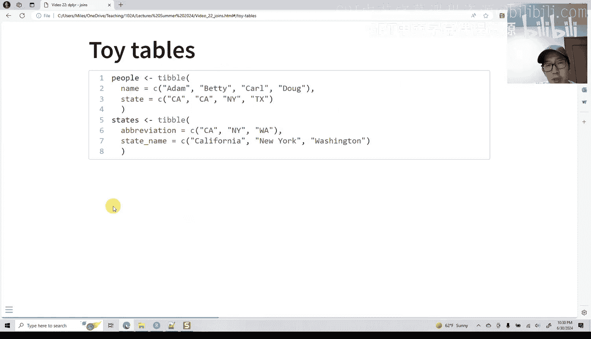

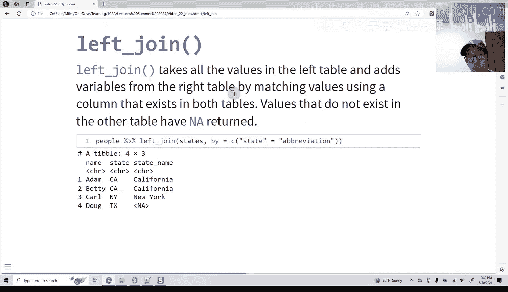

**结果分析**：
*   `states` 表中的 “CA” 匹配到了 Adam 和 Betty 两行。
*   “NY” 匹配到了 Carl。
*   “WA” 在 `people` 表中没有对应的人，因此人名 (`name.x`) 显示为 `NA`。
*   Doug (TX) 因为其州缩写不在右侧的 `states` 表中，所以不出现在结果中。

**公式表示**：`结果 = states 的所有行 + people 的匹配列`

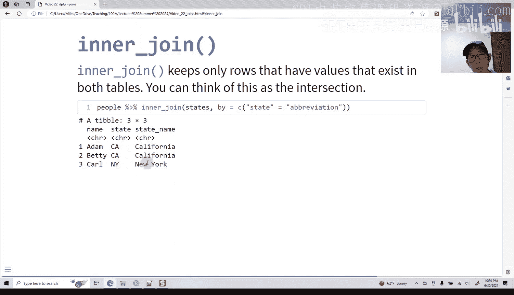

### 内连接 (`inner_join`)

内连接只返回两个表格中**都能匹配上**的行，相当于取交集。

```r
# 代码示例：内连接
inner_join_result <- inner_join(people, states, by = c(“state” = “abbrev”))
```

**结果分析**：
*   只有 “CA” 和 “NY” 这两个缩写同时出现在两个表中。
*   因此，结果只包含 Adam、Betty 和 Carl 这三行，以及他们对应的州全名。
*   Doug (TX) 和 Washington (WA) 因为无法在另一张表中找到匹配项，均被排除。

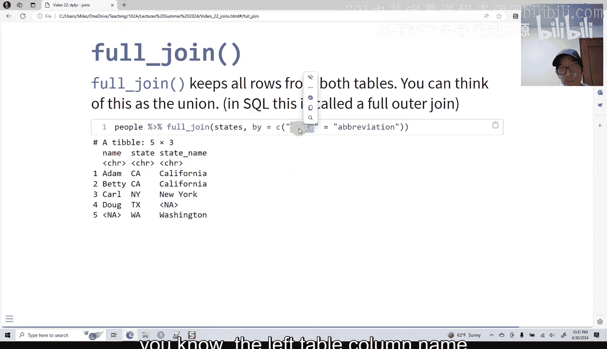

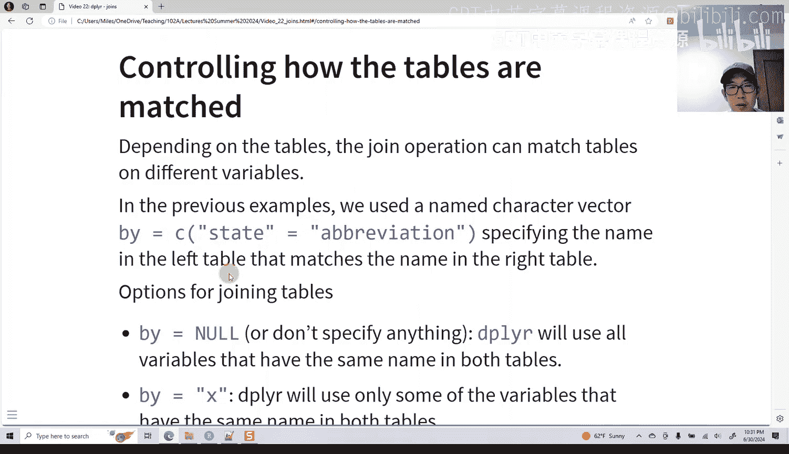

**公式表示**：`结果 = people 的行 ∩ states 的行`

### 全连接 (`full_join`)

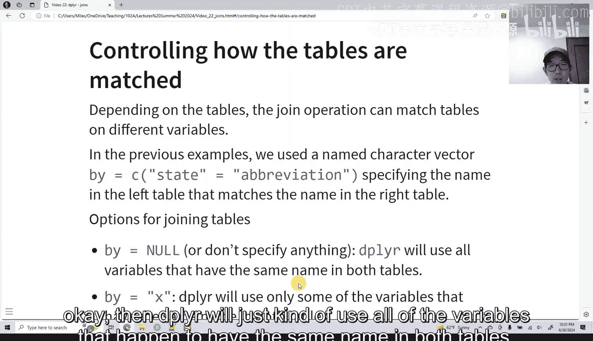

全连接会保留两个表格中的所有行，无论是否匹配。无法匹配的位置用 `NA` 填充，相当于取并集。

```r
# 代码示例：全连接
full_join_result <- full_join(people, states, by = c(“state” = “abbrev”))
```

**结果分析**：
*   包含了 `people` 表的所有四行和 `states` 表的所有三行。
*   Doug (TX) 的州全名是 `NA`。
*   Washington (WA) 对应的人名是 `NA`。

**公式表示**：`结果 = people 的所有行 ∪ states 的所有行`

## 指定连接键 (`by` 参数)

连接操作的关键在于指定用于匹配的列，这是通过 `by` 参数完成的。

*   **当列名相同时**：如果两个表格中用于匹配的列名相同（例如都叫 `id`），可以简写为 `by = “id”`。
*   **当列名不同时**：如果列名不同（如本例中的 `state` 和 `abbrev`），则需要使用一个命名向量来明确对应关系：`by = c(“左表列名” = “右表列名”)`。
*   **不指定 `by` 参数**：如果不指定，`dplyr` 会自动使用两个表格中所有同名的列进行匹配。

## 连接操作的挑战与建议

连接操作的成功与否，高度依赖于数据的整洁度。如果数据非常规范（例如来自设计良好的数据库），连接会非常顺畅。

然而，在实际工作中，数据往往不够整洁，这会使连接操作变得棘手。常见的挑战包括：
*   同一信息以不同格式存储（如 “姓，名” vs. 单独的 “姓” 列和 “名” 列）。
*   拼写不一致（如 “Jonathan” vs. “John”）。
*   存在多余的空格或标点符号。

处理不整洁的数据通常需要在连接前进行大量的数据清洗和文本处理工作，例如使用 `separate()`、`unite()` 或 `str_trim()` 等函数。

## 总结

本节课中我们一起学习了 `dplyr` 包中的四种基本连接操作：
1.  **`left_join()`**：以左表为基准，合并右表的匹配信息。
2.  **`right_join()`**：以右表为基准，合并左表的匹配信息。
3.  **`inner_join()`**：只保留两个表中完全匹配的行。
4.  **`full_join()`**：保留两个表中的所有行。

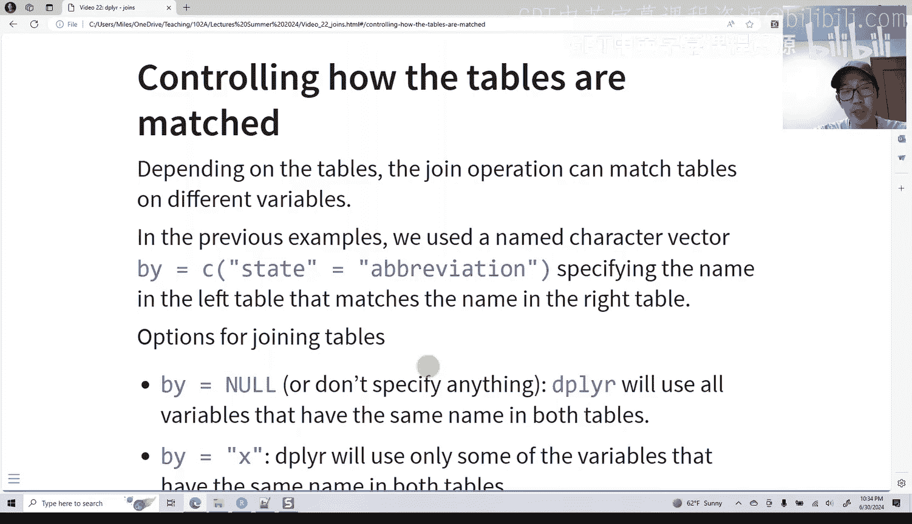

理解并熟练运用这些连接操作，是进行复杂数据整合与分析的基础。记住，清晰、整洁的数据是成功进行连接操作的前提。