# 23：R语言中的字符串处理 🧵

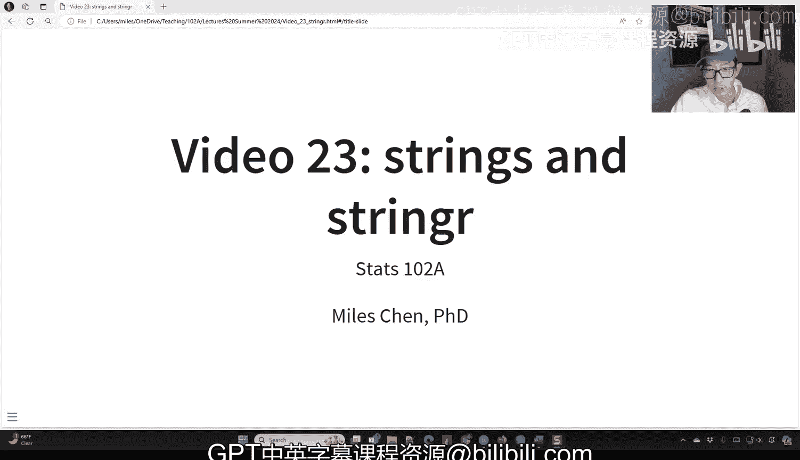

在本节课中，我们将学习如何在R语言中处理字符串（文本）数据。字符串处理是数据分析，特别是文本挖掘和自然语言处理领域的基础。我们将介绍创建字符串、连接字符串、格式化输出以及使用基础R函数和`stringr`包进行基本操作的方法。

到目前为止，我们的计算和计算方法主要处理数值数据。但越来越重要的是，能够处理文本数据。统计学和机器学习中有专门用于解释基于文本数据的整个领域，例如自然语言处理和文本挖掘。虽然本课程无法深入探讨文本分析的细节，但我们将涵盖一些基本的文本操作，特别是正则表达式，这非常重要。

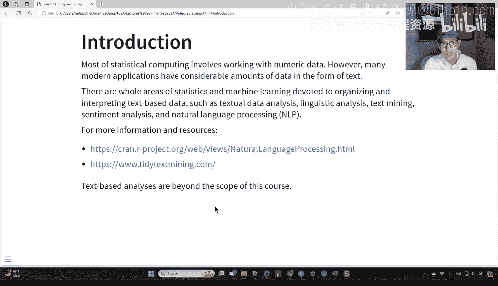


## 字符与字符串基础

在R中，我们通过字符和字符串来处理文本数据。字符串是一个包含一个或多个字符的字符变量，我们经常互换使用“字符”和“字符串”这两个术语。

存储为字符的值具有基本类型`character`。在R中打印它们时，会带有引号。

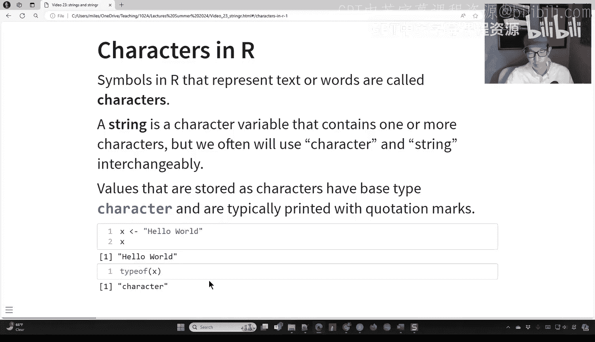

```r
x <- "Hello world"
x
# 输出: [1] "Hello world"
class(x)
# 输出: [1] "character"
```

### 创建字符串

你可以使用引号（单引号或双引号）创建字符串。双引号内可以使用单引号，反之亦然，但不能在单引号内再使用单引号，或在双引号内再使用双引号。

```r
# 双引号内使用单引号
s1 <- "It's a nice day."
# 单引号内使用双引号
s2 <- 'He said, "Hello!"'
```

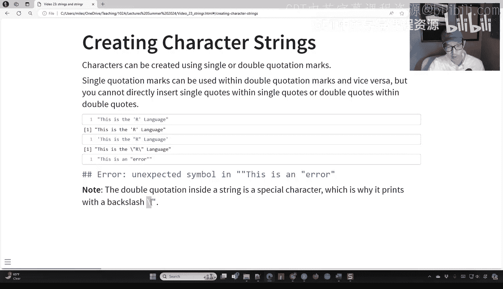

如果你想在字符串中包含与外围引号相同的引号，必须使用反斜杠`\`进行转义。

```r
# 错误示例：双引号内使用双引号（未转义）
# s3 <- "She said, "Wow!"" # 这会导致错误

# 正确示例：使用转义字符
s3 <- "She said, \"Wow!\""
```

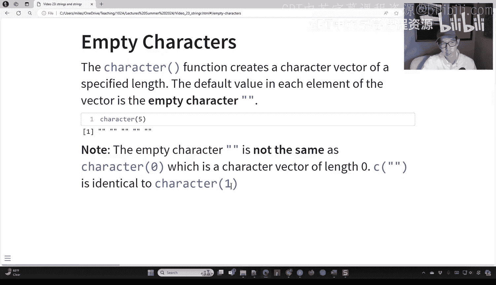

### `character()` 函数

`character()`函数用于创建指定长度的字符向量，每个元素的默认值是空字符`""`。

```r
char_vec <- character(5)
char_vec
# 输出: [1] "" "" "" "" ""
```

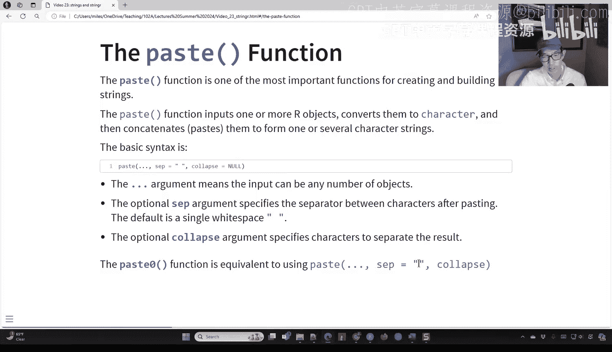

空字符`""`与`character(0)`（长度为0的字符向量）不同。单个空字符等同于`character(1)`。

## 连接字符串：`paste()` 与 `paste0()`

`paste()`函数是最重要的字符串处理函数之一。它接受一个或多个对象，将它们转换为字符，然后连接（粘贴）在一起形成一个或多个字符串。

基本语法是`paste(..., sep = " ", collapse = NULL)`。`sep`参数指定连接后字符之间的分隔符，默认为单个空格。`collapse`参数指定是否以及如何将结果向量折叠成一个字符串。

`paste0()`是一个相关函数，功能完全相同，只是默认分隔符`sep`是空字符`""`。

以下是`paste()`函数的工作原理示例：

```r
# 示例1：连接字符串和数值，使用默认空格分隔符
paste("I ate some", pi, "and it was delicious")
# 输出: [1] "I ate some 3.14159265358979 and it was delicious"

# 示例2：连接多个字符串，使用自定义分隔符
paste("bears", "beets", "Battlestar Galactica", sep = ", ")
# 输出: [1] "bears, beets, Battlestar Galactica"

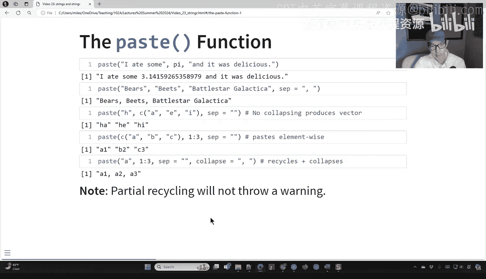

# 示例3：将一个字符与向量连接，sep为空
paste("H", c("A", "E", "I"), sep = "")
# 输出: [1] "HA" "HE" "HI"

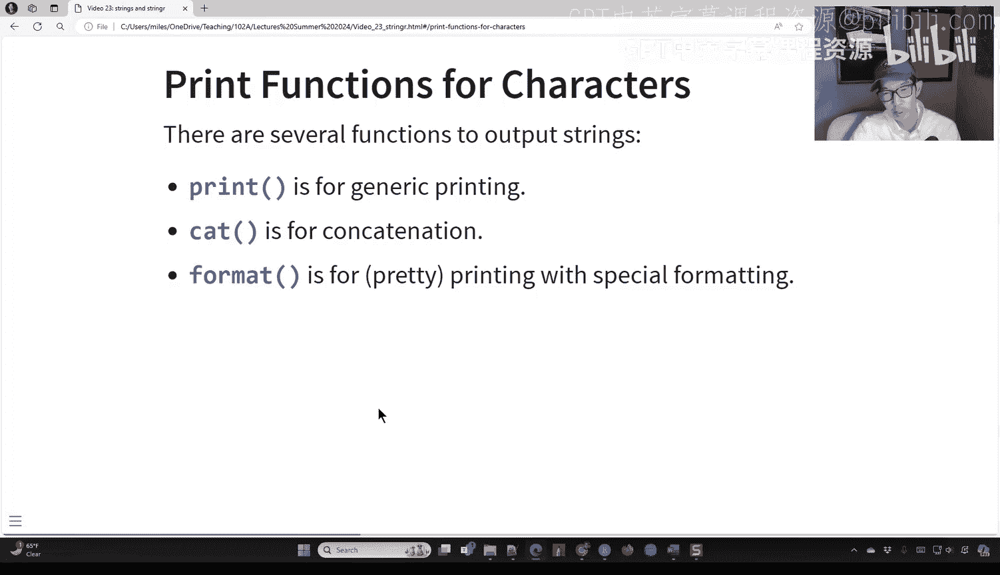

# 示例4：两个向量按元素连接
paste(letters[1:3], 1:3, sep = "")
# 输出: [1] "a1" "b2" "c3"

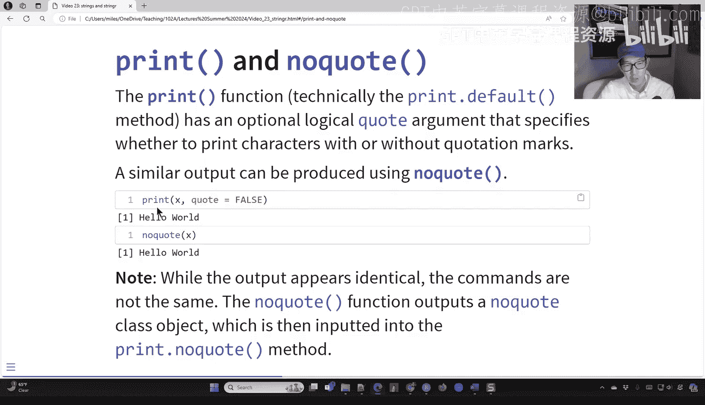

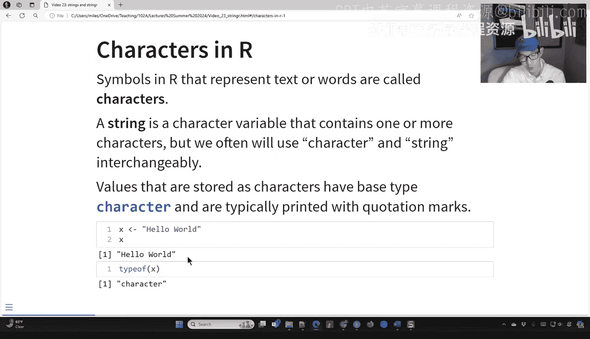

# 示例5：使用collapse参数将结果折叠成一个字符串
paste("a", 1:3, sep = "", collapse = ", ")
# 输出: [1] "a1, a2, a3"
```

## 字符串输出函数

R提供了几个用于输出字符串的函数：`print()`、`cat()`和`format()`。

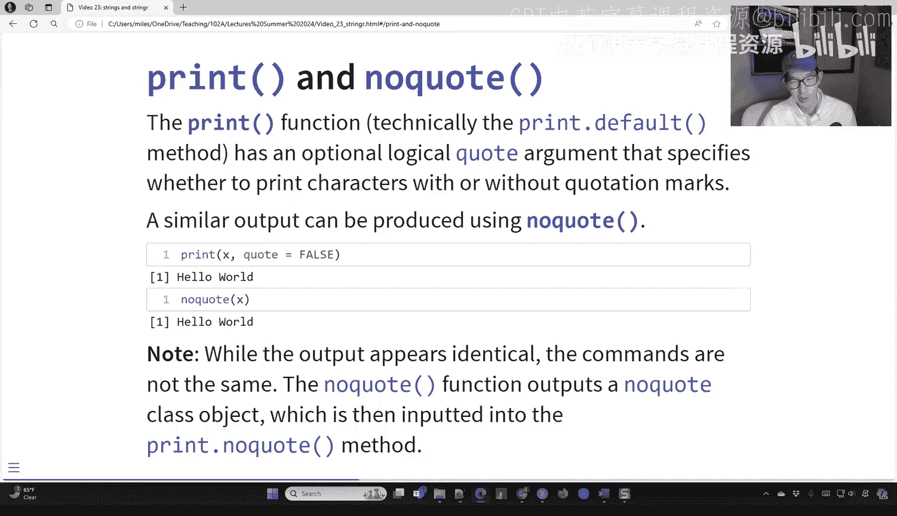

### `print()` 函数

`print()`是通用的打印函数。它有一个可选的逻辑参数`quote`，用于指定是否用引号打印字符。

```r
x <- "Hello world"
print(x)
# 输出: [1] "Hello world"
print(x, quote = FALSE)
# 输出: [1] Hello world
noquote(x) # 另一种无引号打印方式
# 输出: [1] Hello world
```

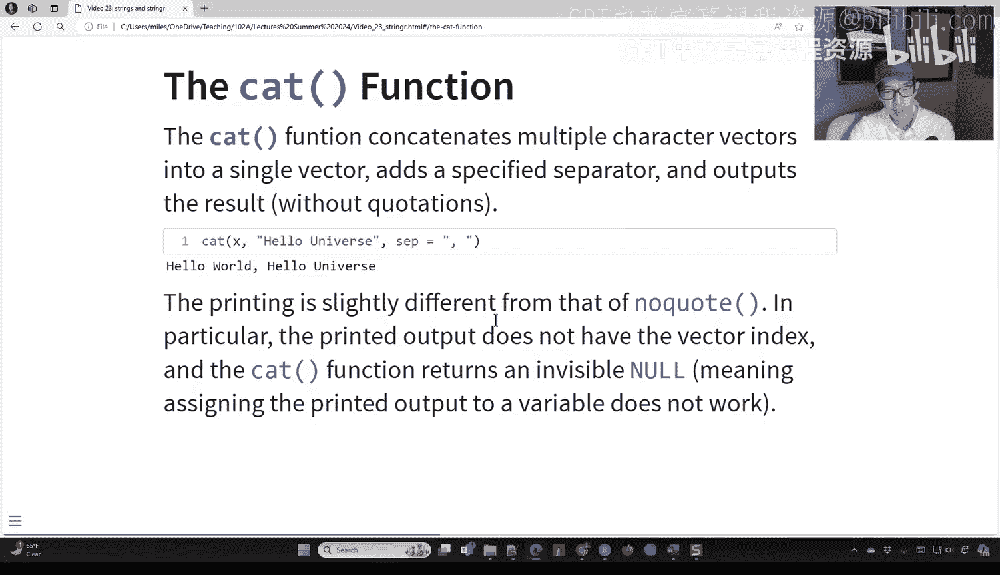

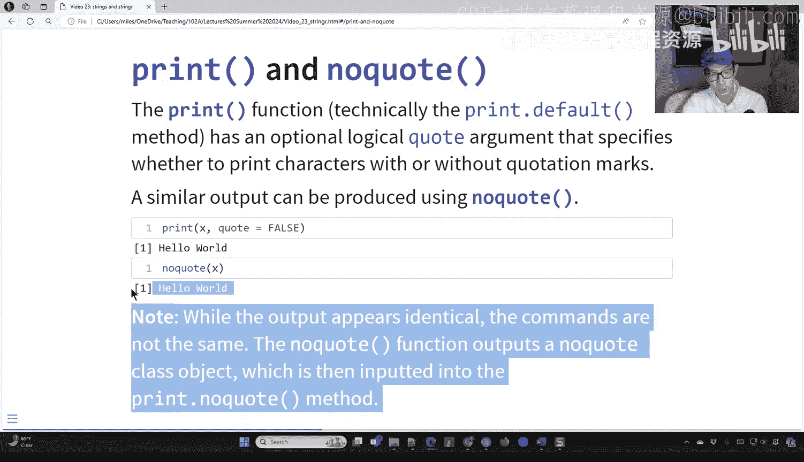

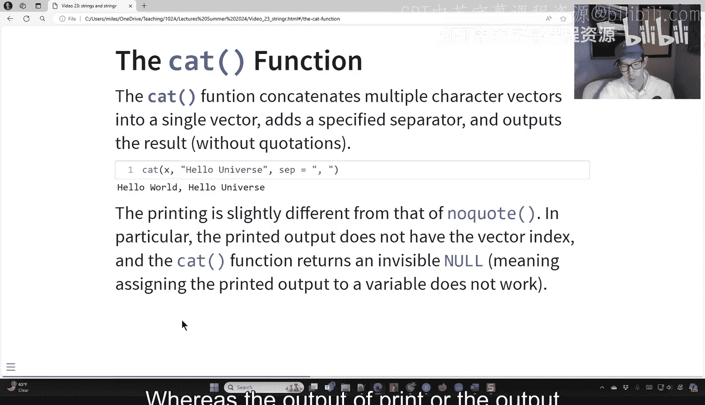

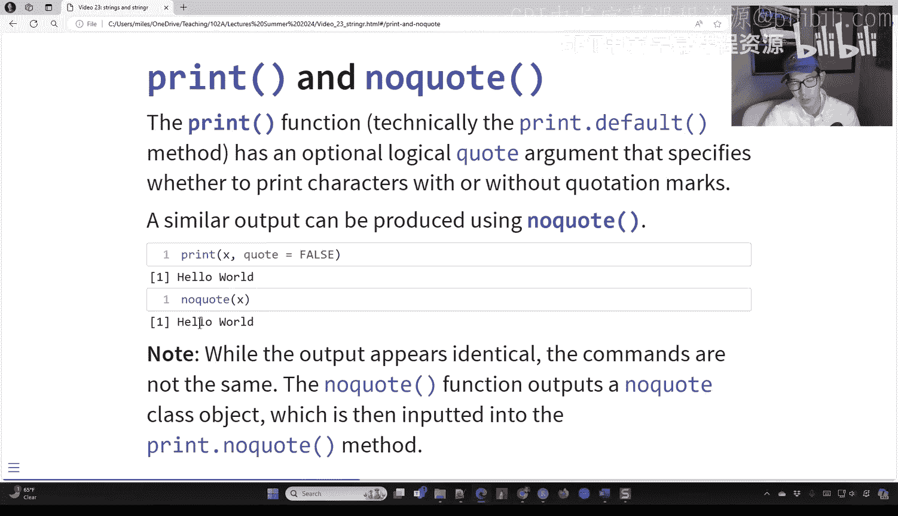

虽然`print(x, quote=FALSE)`和`noquote(x)`的输出看起来相同，但`noquote()`函数输出一个带有`noquote`类的对象，该对象在后续打印时也会保持无引号。

### `cat()` 函数

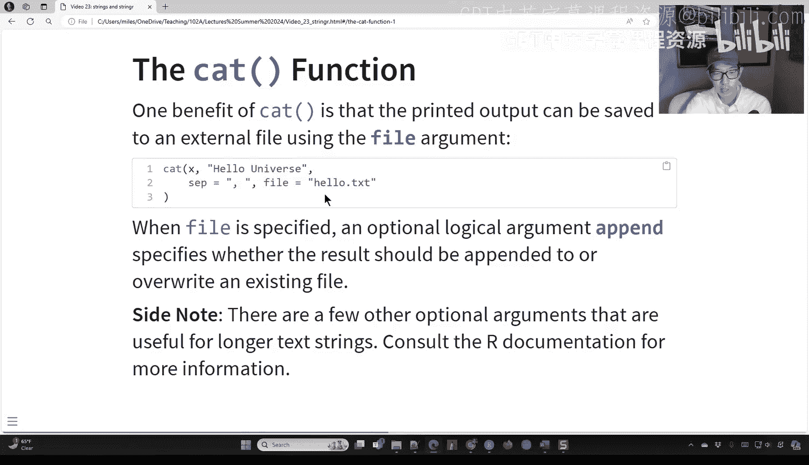

`cat()`函数将多个字符向量连接成一个向量，添加指定的分隔符，并在没有引号的情况下输出结果。它返回一个不可见的`NULL`值，因此其输出通常无法存储到变量中。

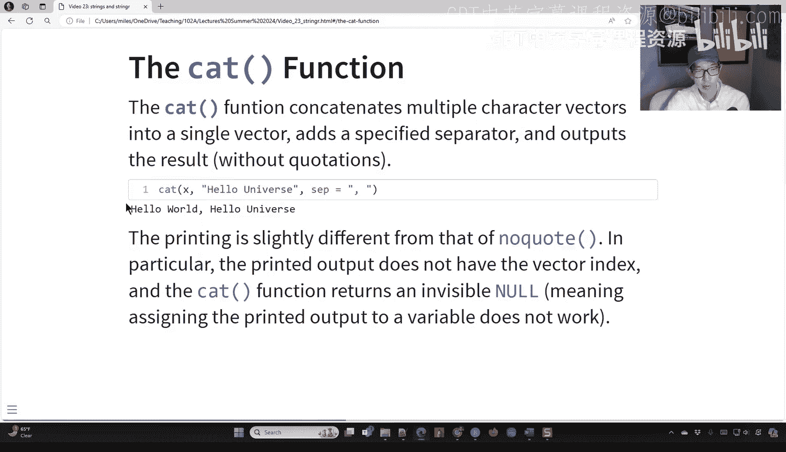

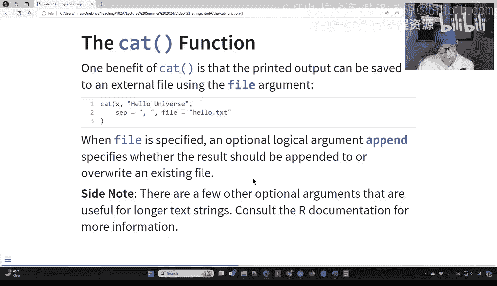

```r
cat(x, "hello universe", sep = ", ")
# 输出: Hello world, hello universe
```

`cat()`的一个好处是，可以使用`file`参数将打印的输出保存到外部文件。`append`参数决定是追加到现有文件还是覆盖它。

```r
cat(x, "hello universe", sep = ", ", file = "hello.txt")
```

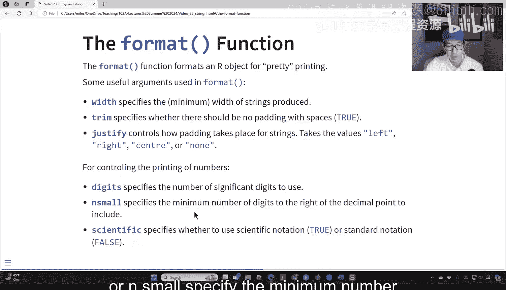

### `format()` 函数

`format()`函数用于对对象进行格式化以便美观地打印。一些有用的参数包括：
*   `width`：指定生成字符串的最小宽度。
*   `trim`：决定是否用空格填充。
*   `justify`：控制字符串的填充方式（左对齐`left`、右对齐`right`、居中`center`或无`none`）。
*   对于数字：`digits`（有效数字位数）、`nsmall`（小数点右侧最小位数）、`scientific`（是否使用科学计数法）。

```r
# 数字格式化
format(1 / 1:5, digits = 2)
# 输出: [1] "1.00" "0.50" "0.33" "0.25" "0.20"
format(1 / 1:5, scientific = TRUE, digits = 2)
# 输出: [1] "1.0e+00" "5.0e-01" "3.3e-01" "2.5e-01" "2.0e-01"

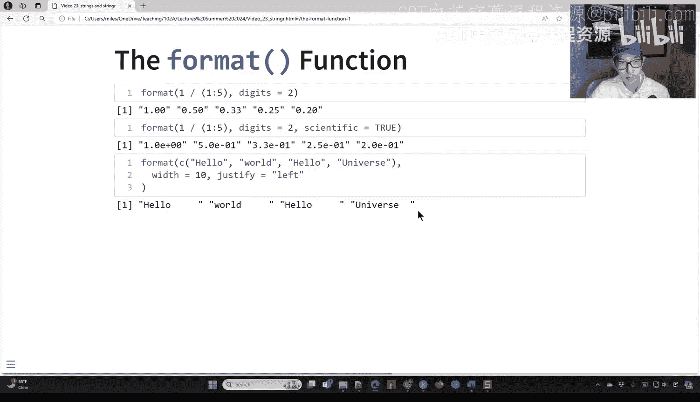

# 文本格式化
format(c("Hello", "world", "universe"), width = 10, justify = "left")
# 输出: [1] "Hello     " "world     " "universe  "
```

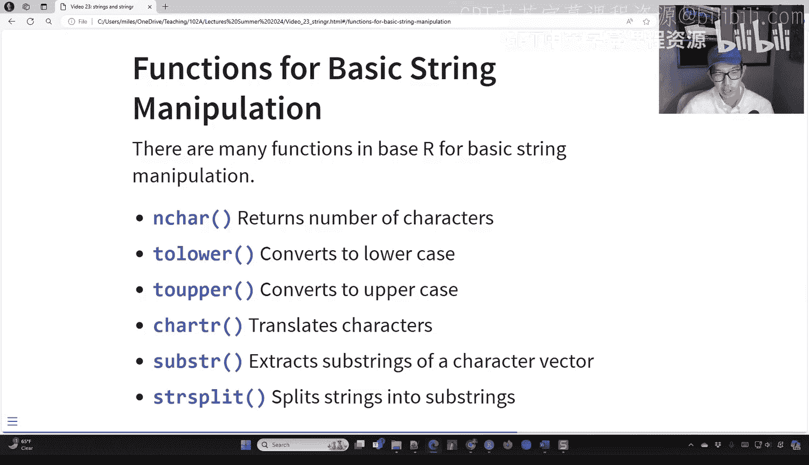

## 基础字符串操作函数

R提供了一些用于处理字符串的基本函数。

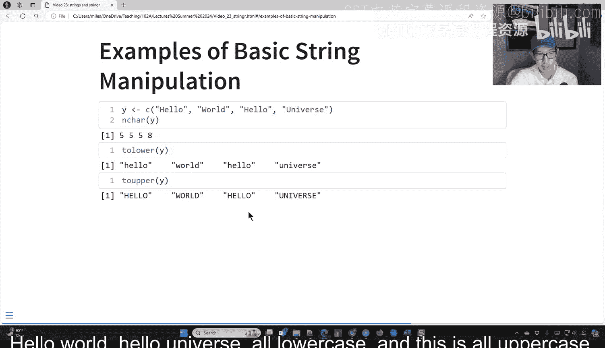

以下是几个核心函数及其作用：
*   `nchar()`：计算字符串中的字符数。
*   `tolower()` / `toupper()`：将字符串转换为全小写或全大写。
*   `chartr()`：进行字符翻译（替换）。
*   `substr()`：提取或替换子字符串。
*   `strsplit()`：根据分隔符拆分字符串。

```r
# nchar: 计算字符数
nchar(c("Hello", "world", "universe"))
# 输出: [1] 5 5 8

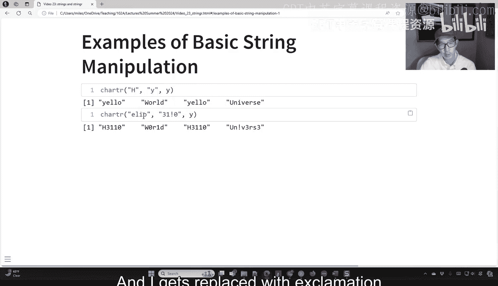

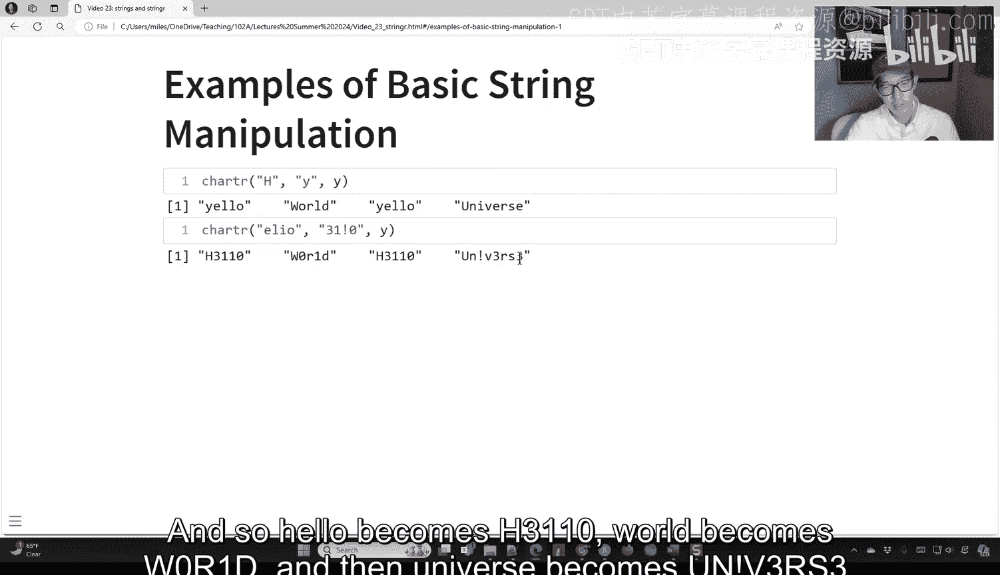

# tolower / toupper: 大小写转换
tolower(c("Hello", "WORLD"))
# 输出: [1] "hello" "world"
toupper(c("Hello", "world"))
# 输出: [1] "HELLO" "WORLD"

# chartr: 字符翻译（旧字符->新字符）
chartr("H", "y", c("Hello", "world", "Hello universe"))
# 输出: [1] "yello"             "world"             "yello universe"
chartr("eli", "31!", "Hello world universe")
# 输出: [1] "H31!o wor!d univ3rs3"

# substr: 提取子字符串
substr("Hello world", start = 2, stop = 9)
# 输出: [1] "ello wor"

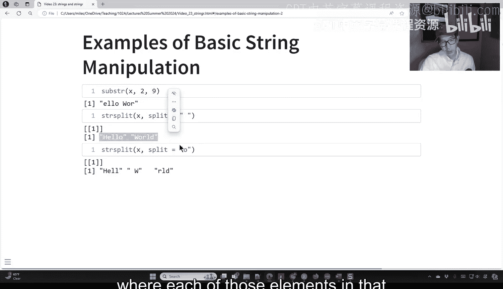

# strsplit: 拆分字符串
strsplit("Hello world", split = " ") # 按空格拆分
# 输出: [[1]] [1] "Hello" "world"
strsplit("Hello world", split = "o") # 按字母'o'拆分
# 输出: [[1]] [1] "Hell" " w"   "rld"
```

## `stringr` 包简介

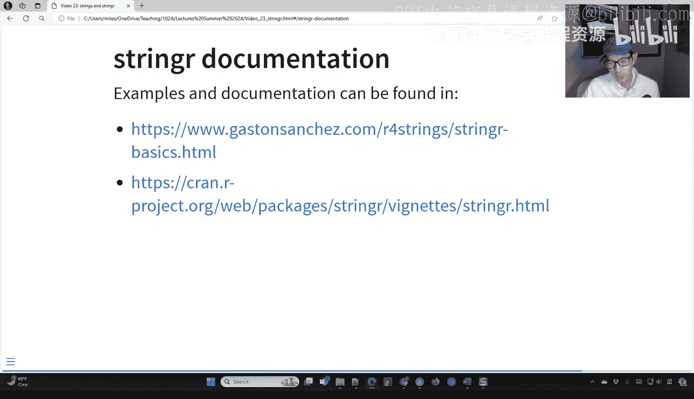

`stringr`是`tidyverse`生态系统中的一个包，它使字符串处理（在我看来）更加容易，尤其是在使用我们接下来要讲的正则表达式时。

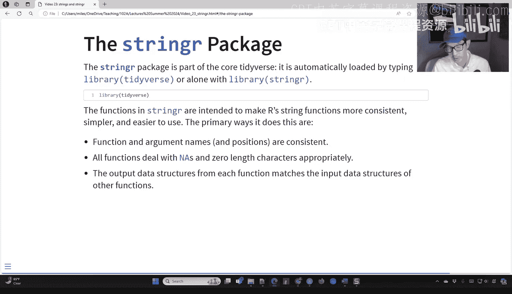

`stringr`中的函数旨在使R的字符串函数更加一致、简单和易用。主要改进包括：函数参数名称一致、所有函数都能正确处理`NA`值和零长度字符、以及各函数的输出数据结构能与其他函数的输入数据结构匹配。

`stringr`中的许多函数与基础R函数功能对应，但行为更一致。例如：
*   `str_c()` 类似于 `paste()`
*   `str_length()` 类似于 `nchar()`
*   `str_sub()` 类似于 `substr()`
*   此外，还有`str_dup()`、`str_trim()`、`str_pad()`、`str_wrap()`等实用函数。

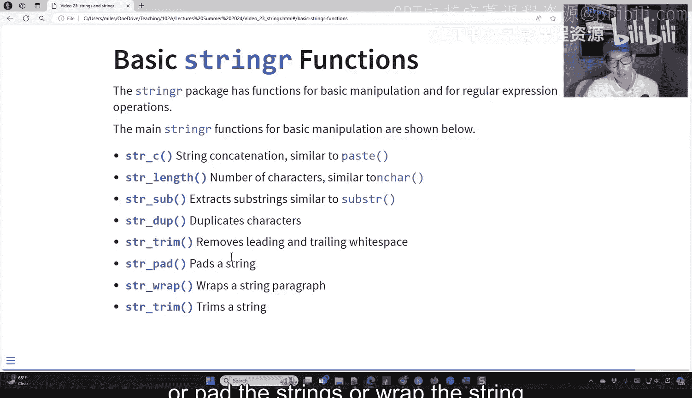

让我们看几个例子，比较`stringr`和基础R函数的行为差异：

```r
library(stringr)

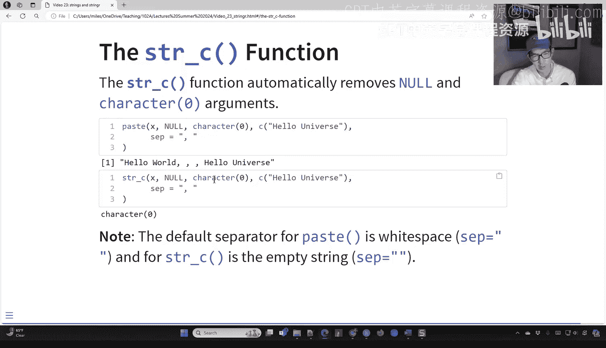

# 比较 paste 和 str_c 处理零长度向量的方式
paste("x", NULL, character(0), "hello universe")
# 输出: [1] "x  hello universe"
str_c("x", NULL, character(0), "hello universe")
# 输出: [1] "xhello universe" # 注意：str_c会忽略零长度输入

# 比较 nchar 和 str_length 处理因子的方式
fac <- factor(c("apple", "banana"))
# nchar(fac) # 这会报错：需要字符向量
str_length(fac) # 这可以正常工作
# 输出: [1] 5 6
```

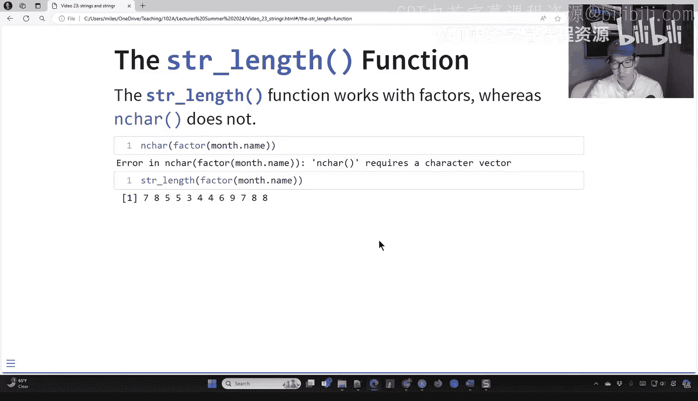

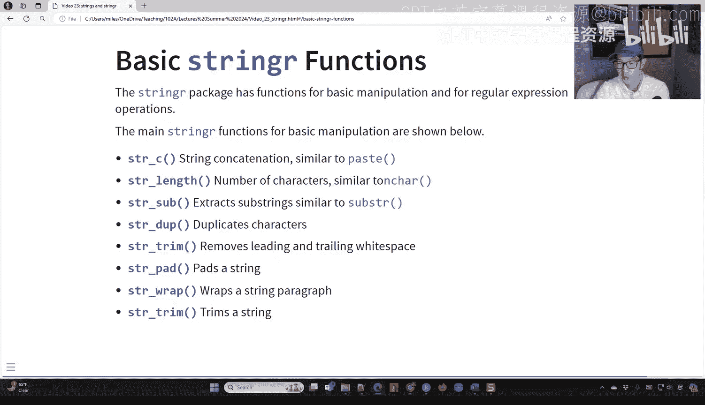

本节课中，我们一起学习了R语言中字符串处理的基础知识。我们了解了如何创建和操作字符串，使用`paste()`和`paste0()`进行连接，使用`print()`、`cat()`和`format()`进行输出格式化，以及使用`nchar()`、`tolower()`等函数进行基本操作。最后，我们简要介绍了更一致、更强大的`stringr`包。在下一节视频中，我们将开始学习强大的文本模式匹配工具——正则表达式。