# 24：正则表达式 - 字符集与字符类 🧩

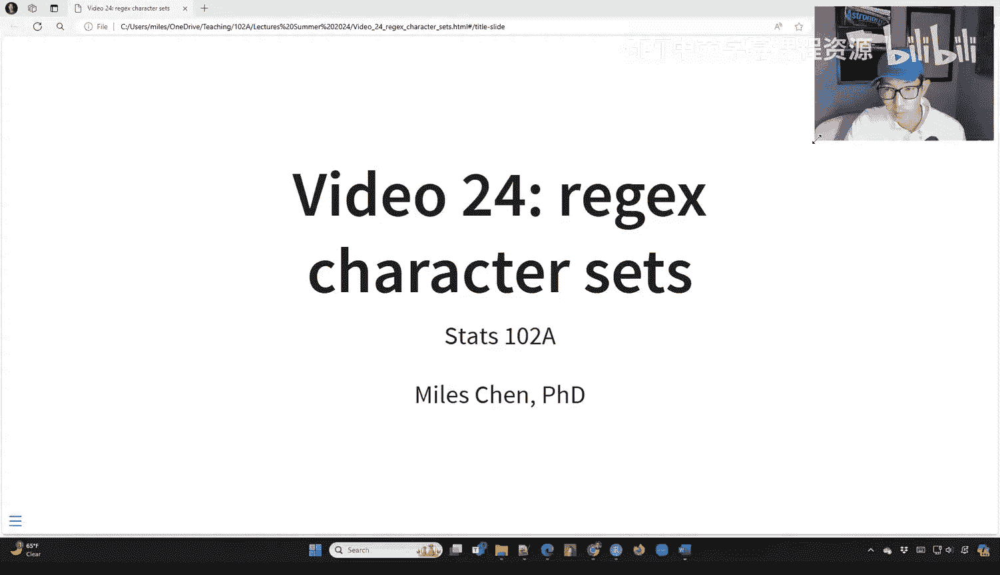

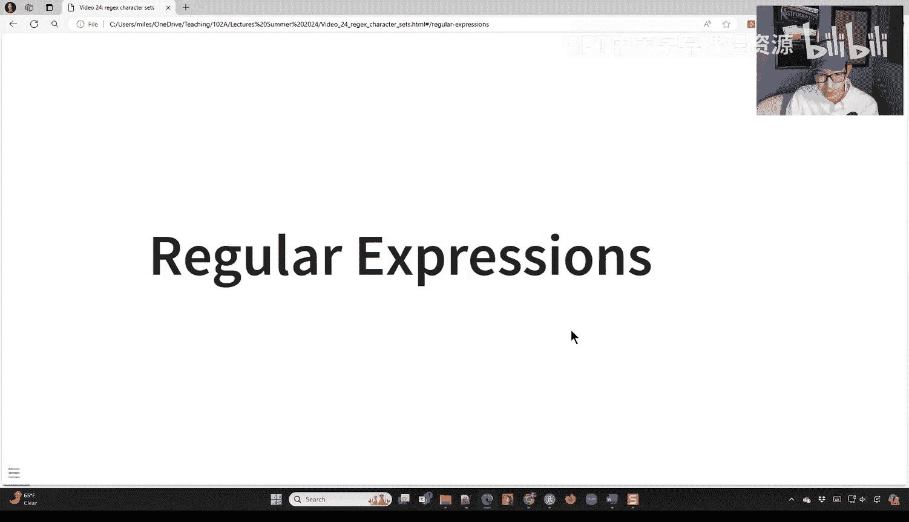

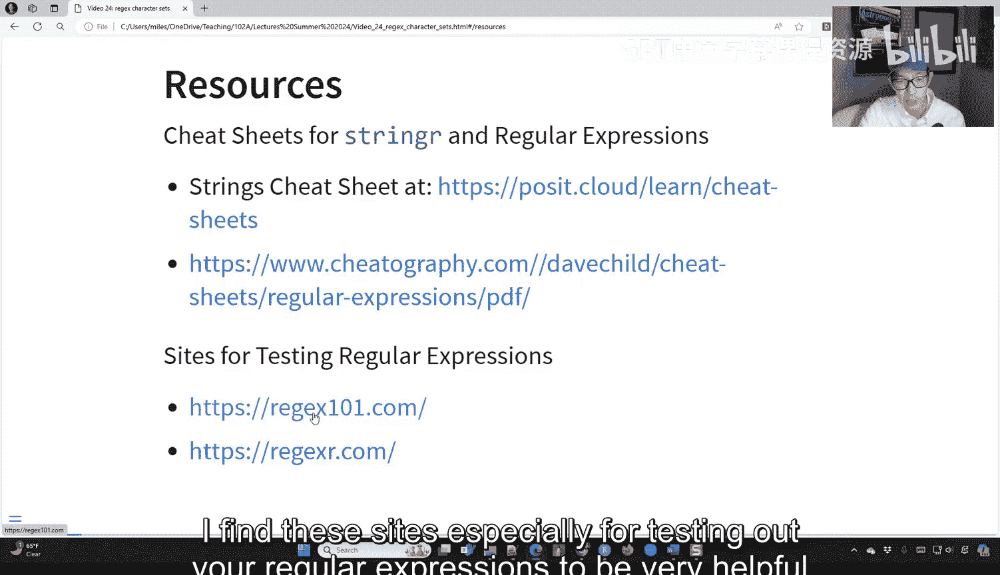

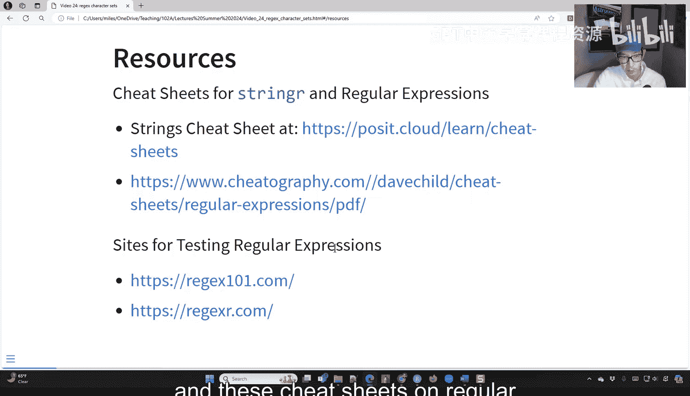

在本节课中，我们将学习正则表达式的基础知识，特别是字符集和字符类的概念。正则表达式是一种强大的工具，用于在文本中查找、匹配和操作特定模式。我们将从最基础的字符匹配开始，逐步介绍如何使用特殊符号（元字符）来构建更灵活的模式。

## 概述

正则表达式（常称为 RegEx）是一组描述文本模式的符号。它本质上是一种形式语言，其符号遵循一套明确定义的规则来指定所需的模式。正则表达式在数据验证、数据抓取、文本解析等方面非常有用。

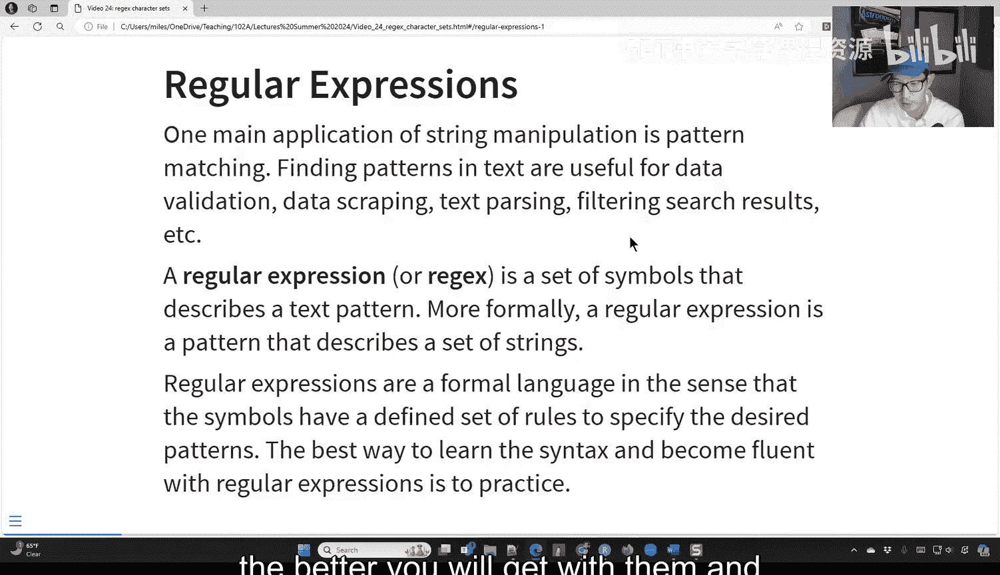

## 基础：字面字符匹配

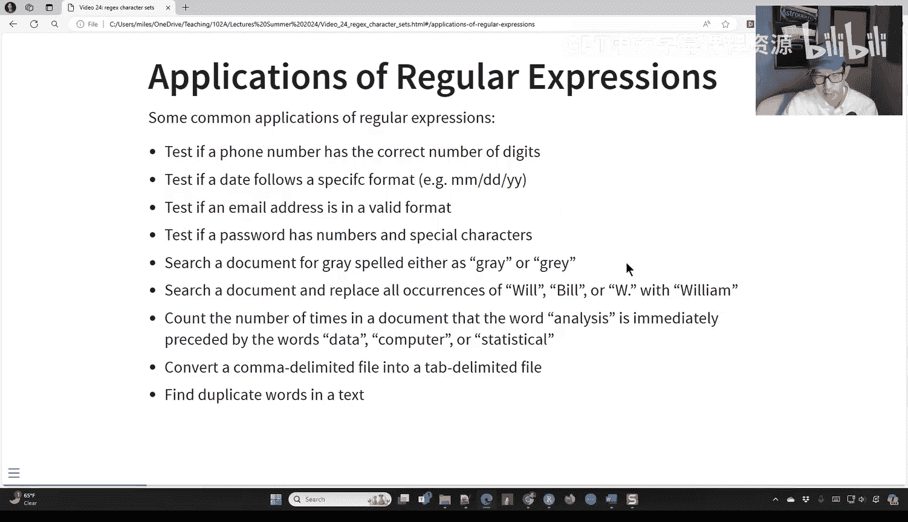

最基础的正则表达式类型是字面字符匹配，即字符匹配其自身。例如，模式 `R` 将匹配字符串中的字符 `R`。这类似于在文档或网页中使用“查找”功能。

英文字母表中的所有字母（大小写共52个）和数字0到9都属于字面字符。

以下是使用 `stringr` 包中函数进行匹配的示例：

```r
# 加载 stringr 包
library(stringr)

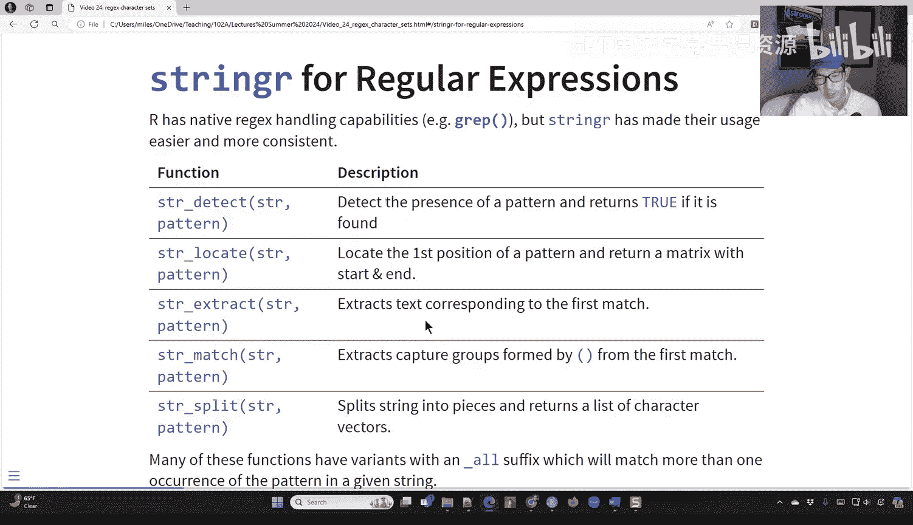

# 示例字符串
text <- "I love stats"

# 使用 string_locate 查找模式 "STAT"
string_locate(text, "STAT")
# 输出：start=8, end=11

# 区分大小写，查找 "stat" 将不匹配
string_locate("I love Stats", "stat")
# 输出：start=NA, end=NA

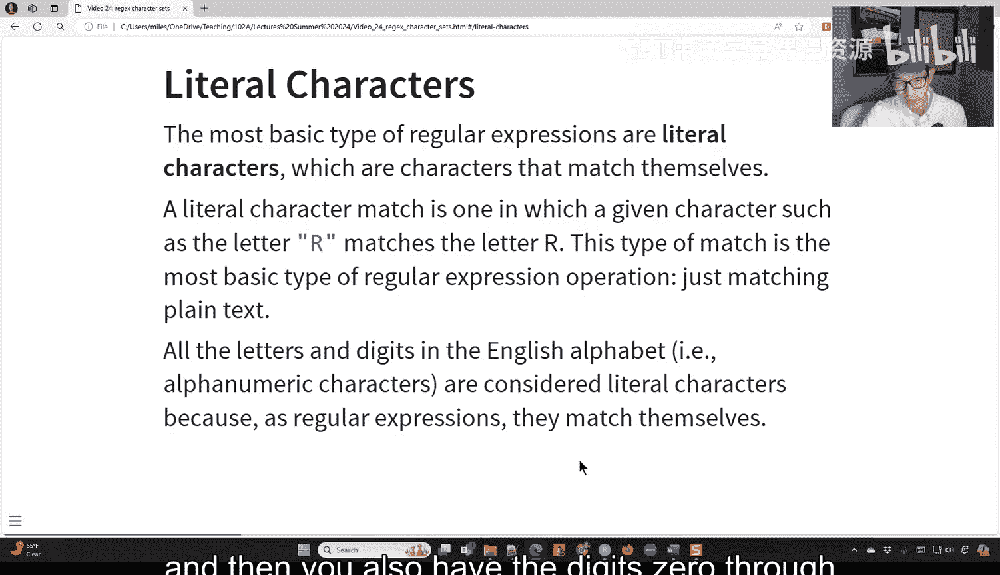

# 使用 string_locate_all 查找所有匹配项
text2 <- "I love statistics. I am a stats major."
string_locate_all(text2, "stat")
# 输出两个匹配项的位置
```

## 元字符与通配符

元字符是那些具有特殊含义的非字面字符。正则表达式的强大之处在于能够使用这些元字符来修改模式匹配的方式。

常见的元字符包括：`.`、`$`、`*`、`+`、`?`、`{}`、`[]`、`()`、`\`、`|`。

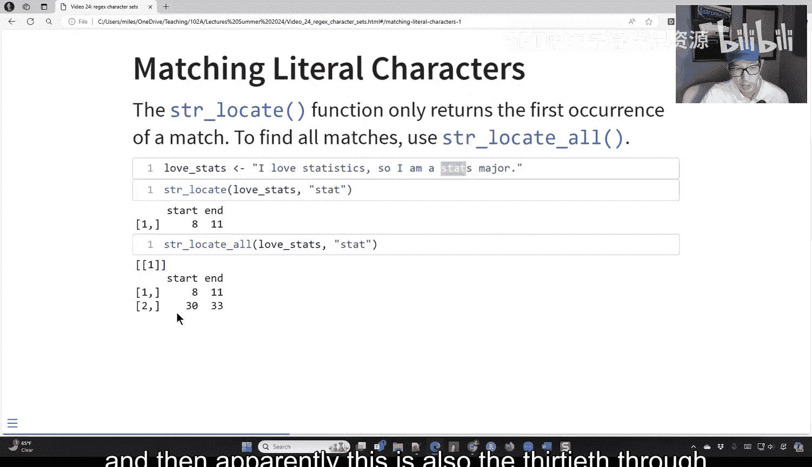

### 通配符 `.`

点号 `.` 是一个通配符，用于匹配除换行符外的任何单个字符（可以是字母、符号或空格）。

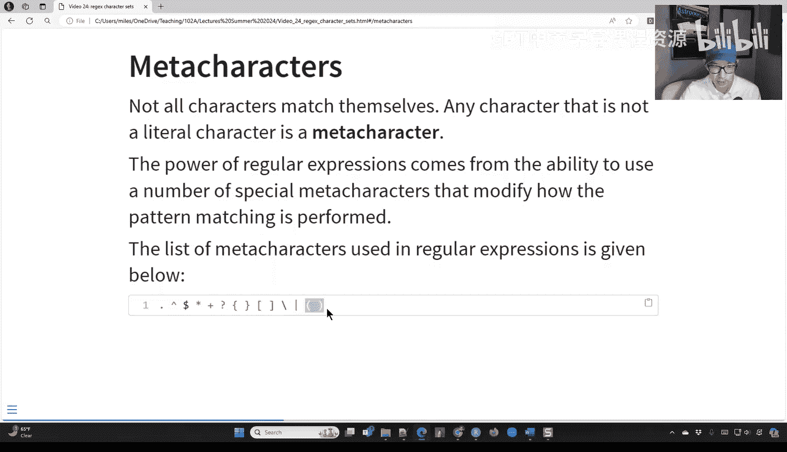

```r
# 示例向量
words <- c("note", "knot", "nut", "n t")

# 匹配模式 "n.任何字符.t"
string_detect(words, "n.t")
# 输出：TRUE, TRUE, TRUE, TRUE

# 匹配模式 "n.任何字符.任何字符.t"
string_detect(words, "n..t")
# 输出：TRUE, TRUE, FALSE, FALSE
```

### 转义元字符

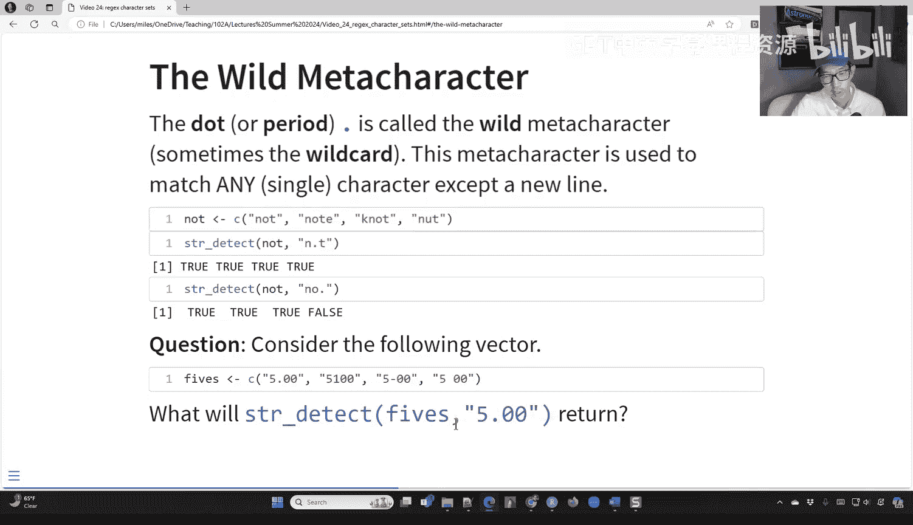

如果你想匹配元字符本身（例如，匹配一个实际的点号`.`），你需要使用反斜杠 `\` 对其进行转义。在R中，由于反斜杠本身也是字符串中的转义字符，因此需要使用双反斜杠 `\\`。

```r
# 示例：匹配字面点号
entries <- c("5.00", "5100", "5-00", "5 00")

# 错误：点号被当作通配符
string_detect(entries, "5.00")
# 输出：TRUE, TRUE, TRUE, TRUE

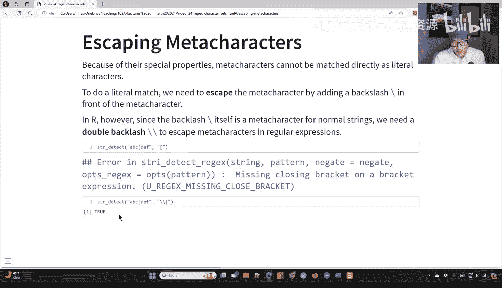

# 正确：转义点号以进行字面匹配
string_detect(entries, "5\\.00")
# 输出：TRUE, FALSE, FALSE, FALSE
```

## 字符集 `[ ]`

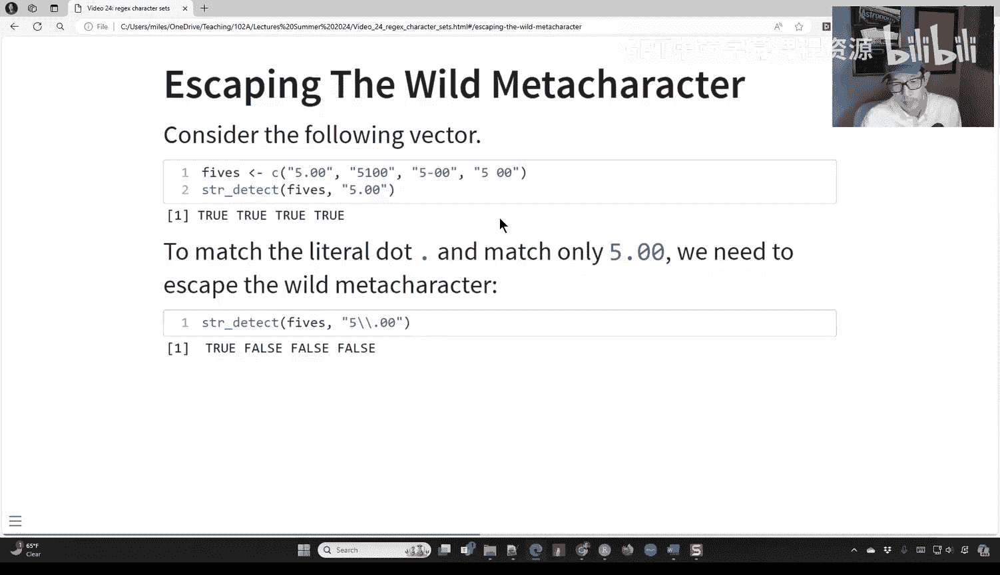

上一节我们介绍了通配符，它可以匹配任何字符。但有时我们只想匹配一组特定的字符。这时就需要使用字符集。

字符集使用方括号 `[ ]` 表示，它会匹配集合内的任意一个字符。重要的是，字符集只匹配一个字符，且集合内字符的顺序无关紧要。

例如，字符集 `[aeiou]` 将匹配任意一个小写元音字母。

```r
words <- c("pan", "pen", "pin", "p0n", "p.n", "paun", "pwn3d", "happiness")

# 匹配模式：p + (a/e/i/o/u中任意一个) + n
pattern <- "p[aeiou]n"
string_detect(words, pattern)
# 输出：TRUE, TRUE, TRUE, FALSE, FALSE, FALSE, FALSE, TRUE
# 解释：匹配 pan, pen, pin, happiness中的"pin"
```

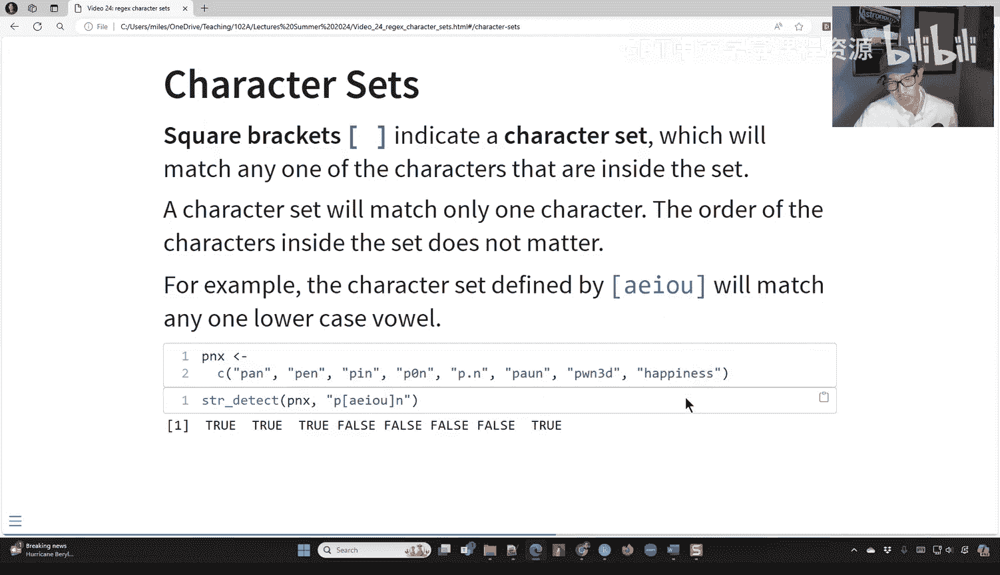

### 字符范围 `-`

在字符集中，连字符 `-` 是一个元字符，用于指定一个字符范围，这比列出所有字符更方便。

*   `[a-z]`: 所有小写字母。
*   `[A-Z]`: 所有大写字母。
*   `[0-9]`: 所有数字。
*   `[a-zA-Z]`: 所有字母。
*   `[0-7]`: 数字0到7。

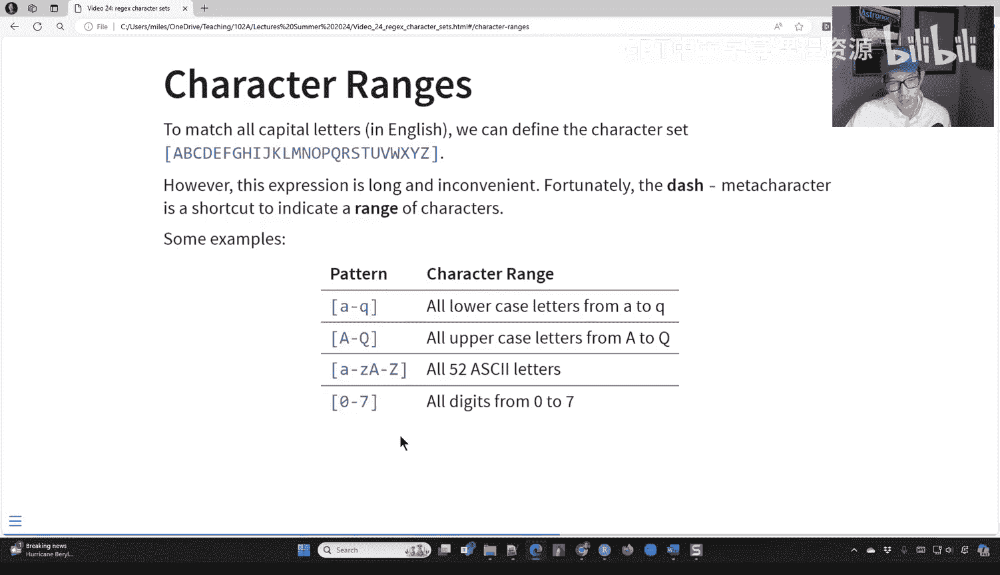

```r
vec <- c("123", "abc", "ABC", ":-)", "AB12", "A", "A8908AB")

# 匹配三个连续的数字
pattern_digits <- "[0-9][0-9][0-9]"
string_detect(vec, pattern_digits)
# 输出：TRUE, FALSE, FALSE, FALSE, FALSE, FALSE, TRUE
# 解释：匹配 "123" 和 "890"（在"A8908AB"中）

# 匹配三个连续的小写字母
pattern_lower <- "[a-z][a-z][a-z]"
string_detect(vec, pattern_lower)
# 输出：FALSE, TRUE, FALSE, FALSE, FALSE, FALSE, FALSE
```

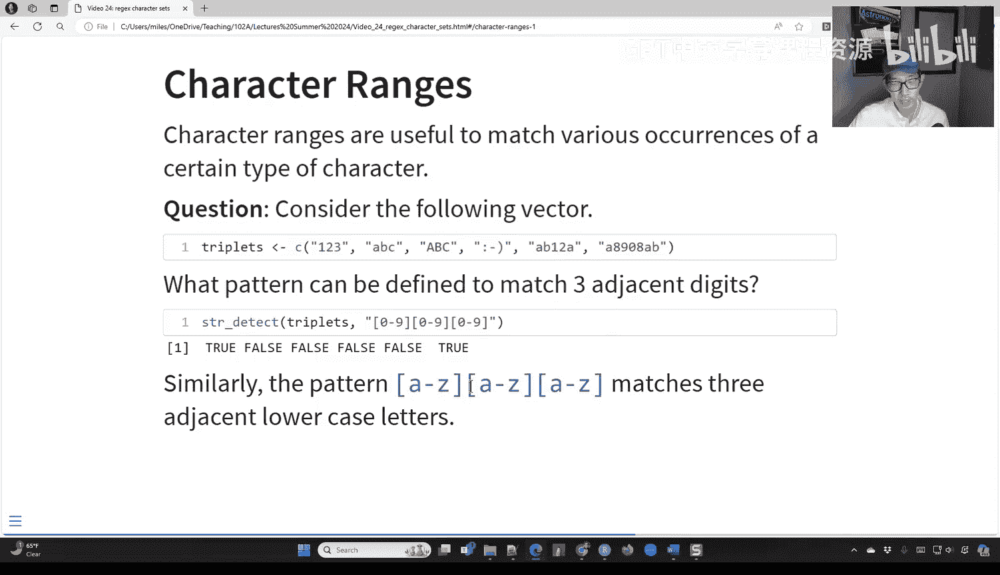

### 否定字符集 `[^ ]`

有时我们想匹配“除了某些字符之外”的任意字符。这时可以在字符集的开头使用脱字符 `^` 来创建否定字符集。

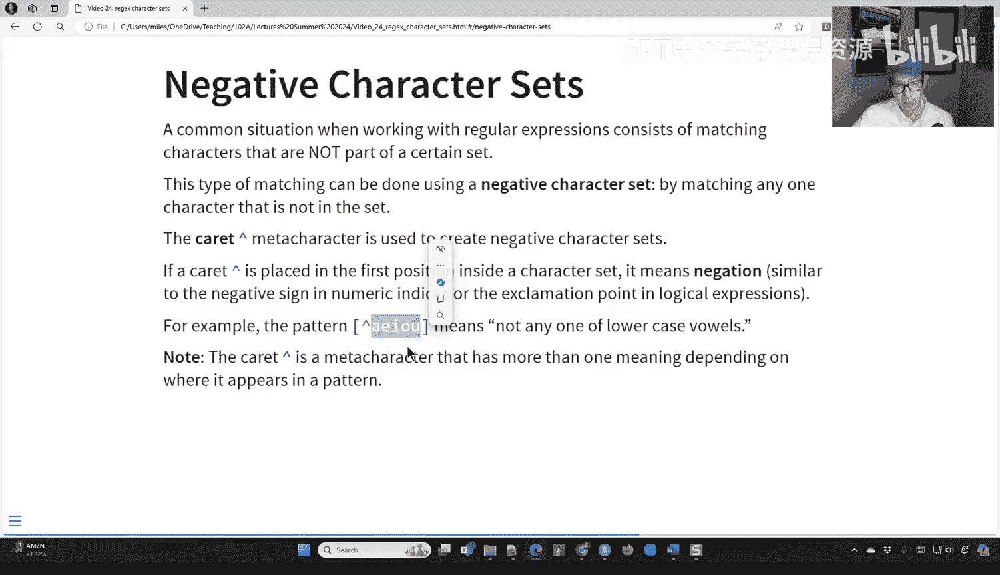

例如，`[^aeiou]` 匹配任意一个非小写元音字母的字符。

```r
chars <- c("A", "b", "?", "1", " ", "^")

# 匹配任何非大写字母 A-Z 的字符
pattern_neg <- "[^A-Z]"
string_detect(chars, pattern_neg)
# 输出：FALSE, TRUE, TRUE, TRUE, TRUE, TRUE
# 解释：只有 "A" 被排除，返回 FALSE

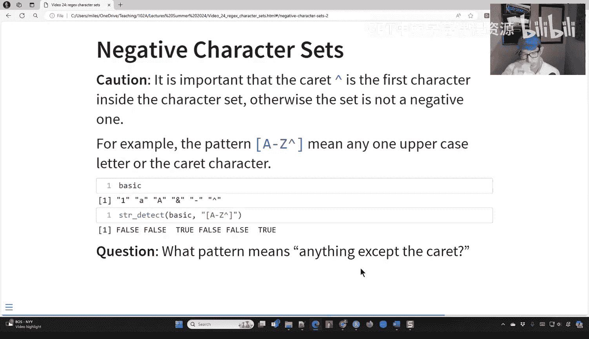

# 注意：如果 ^ 不在开头，则被视为普通字符
pattern_caret <- "[A-Z^]"
string_detect(chars, pattern_caret)
# 输出：TRUE, FALSE, FALSE, FALSE, FALSE, TRUE
# 解释：匹配 "A" 和 "^"
```

### 字符集内的元字符

在字符集内部，大多数元字符（如 `.`、`*`、`$`）都会失去特殊含义，被视为字面字符。主要的例外是：`]`、`[`、`-`（用于范围时）、`^`（在开头时）和 `\`。

```r
words <- c("pan", "pen", "pin", "p0n", "p.n", "paun", "pwn3d")

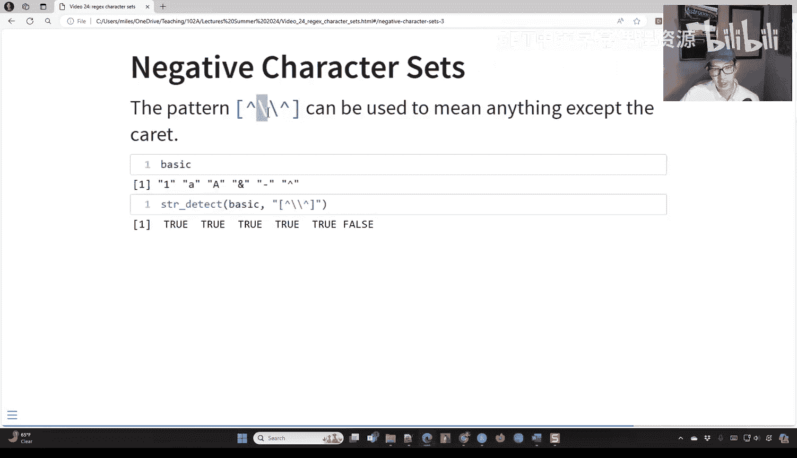

# 点号在字符集内被视为字面字符，匹配实际的点号"."
pattern <- "p[aeiou.]n"
string_detect(words, pattern)
# 输出：TRUE, TRUE, TRUE, FALSE, TRUE, FALSE, FALSE
# 解释：匹配 pan, pen, pin, p.n
```

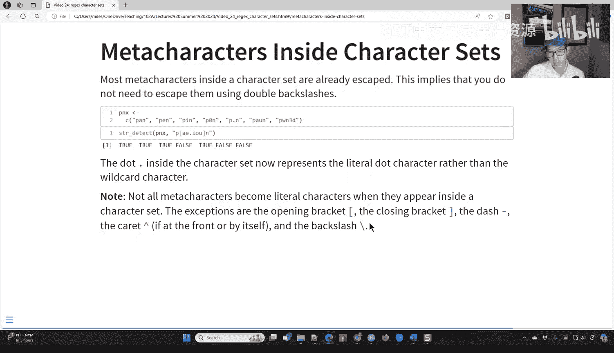

## 字符类

字符类是常见字符集的快捷方式。在R中，我们需要使用双反斜杠 `\\` 来表示它们。

*   `\\d`: 匹配任意数字。等价于 `[0-9]`。
*   `\\D`: 匹配任意非数字。等价于 `[^0-9]`。
*   `\\w`: 匹配任意单词字符（字母、数字、下划线 `_`）。等价于 `[a-zA-Z0-9_]`。
*   `\\W`: 匹配任意非单词字符。
*   `\\s`: 匹配任意空白字符（空格、制表符、换行符等）。
*   `\\S`: 匹配任意非空白字符。

```r
words <- c("pan", "pen", "pin", "p0n", "p.n", "paun", "pwn3d")

# 匹配 p 后接一个数字
string_detect(words, "p\\d")
# 输出：FALSE, FALSE, FALSE, TRUE, FALSE, FALSE, FALSE

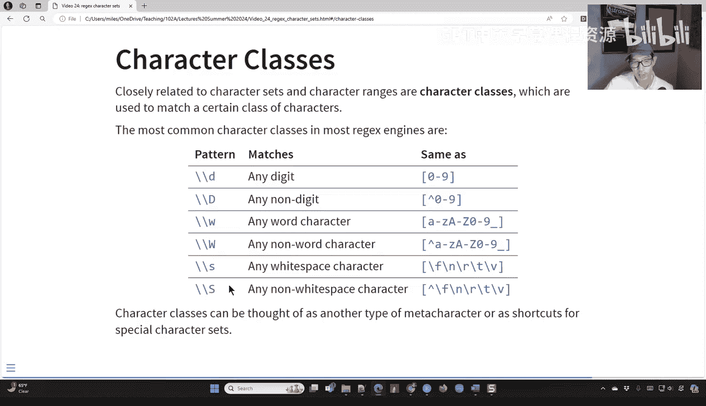

# 匹配 p 后接一个非数字
string_detect(words, "p\\D")
# 输出：TRUE, TRUE, TRUE, FALSE, TRUE, TRUE, TRUE

# 匹配 p 后接一个非单词字符（此处是点号）
string_detect(words, "p\\W")
# 输出：FALSE, FALSE, FALSE, FALSE, TRUE, FALSE, FALSE
```

### POSIX 字符类

POSIX 字符类提供了另一种指定字符集的快捷方式，在R中需要用双括号 `[[: :]]` 括起来。

*   `[[:alpha:]]`: 字母。
*   `[[:digit:]]`: 数字。
*   `[[:lower:]]`: 小写字母。
*   `[[:upper:]]`: 大写字母。
*   `[[:alnum:]]`: 字母数字。
*   `[[:punct:]]`: 标点符号。
*   `[[:space:]]`: 空白字符。

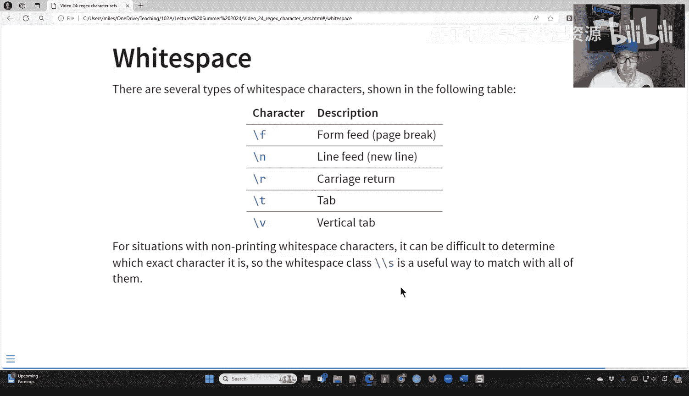

```r
words <- c("pan", "pen", "pin", "p0n", "p.n", "paun", "pwn3d")

# 匹配包含字母的字符串
string_detect(words, "[[:alpha:]]")
# 输出：全部为 TRUE

# 匹配包含数字的字符串
string_detect(words, "[[:digit:]]")
# 输出：FALSE, FALSE, FALSE, TRUE, FALSE, FALSE, TRUE
```

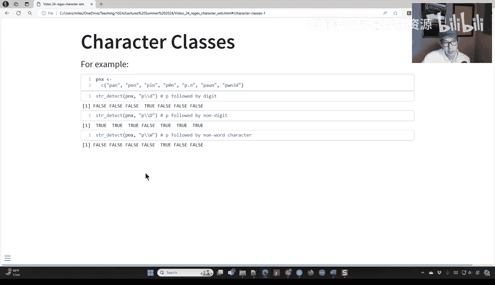

## 总结

本节课我们一起学习了正则表达式中字符集和字符类的核心概念。

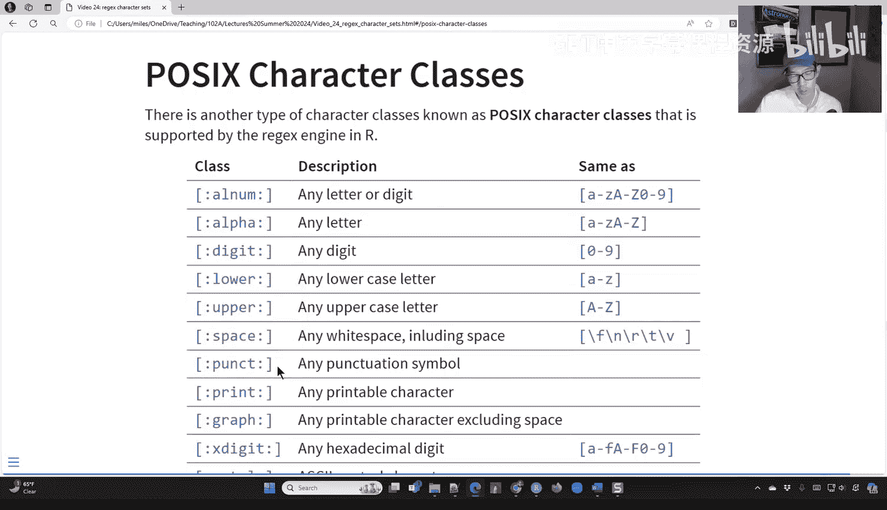

*   我们从最基础的字面字符匹配开始。
*   然后介绍了元字符，特别是通配符 `.` 及其转义方法 `\\`。
*   接着深入学习了字符集 `[ ]`，包括如何指定字符范围 `[a-z]` 和创建否定字符集 `[^aeiou]`。
*   最后，我们了解了更简洁的字符类（如 `\\d`, `\\w`）和 POSIX 字符类（如 `[[:alpha:]]`）。

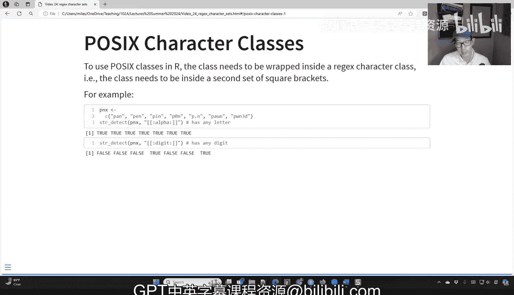

掌握这些基础是构建更复杂正则表达式模式的关键。下一讲，我们将学习如何指定模式的重复次数，例如匹配多个连续数字或可选字符。