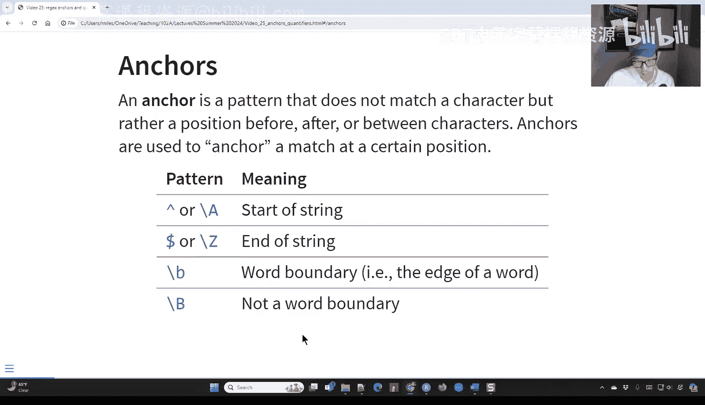
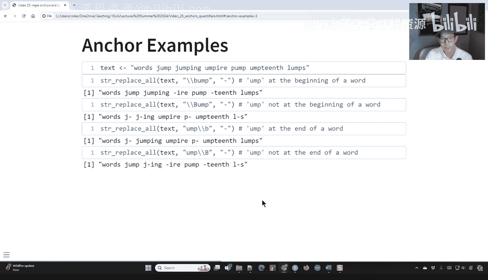
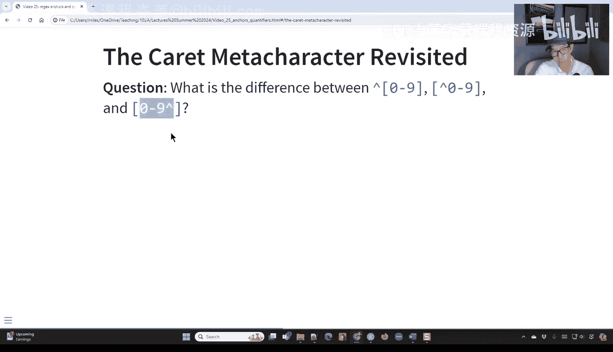
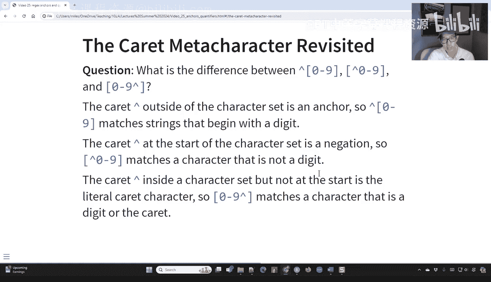
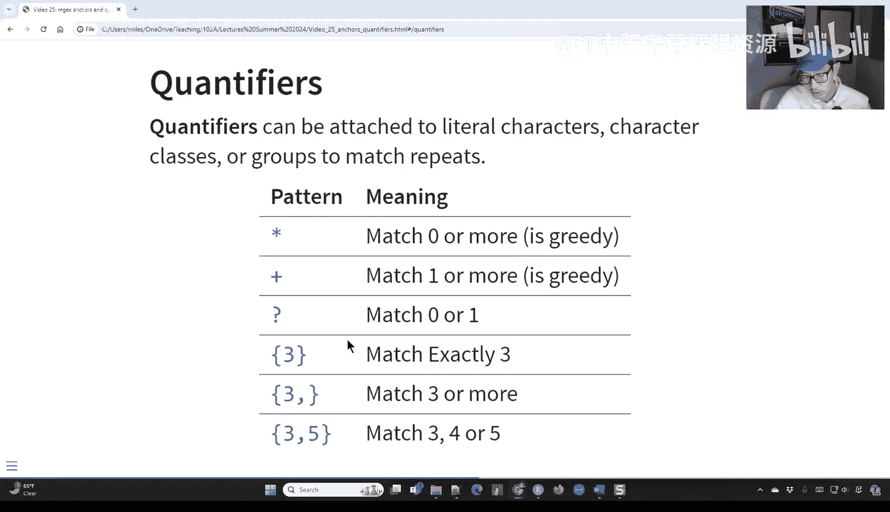
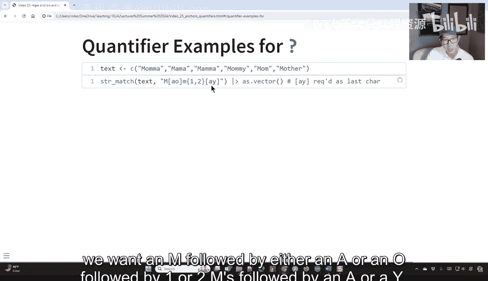
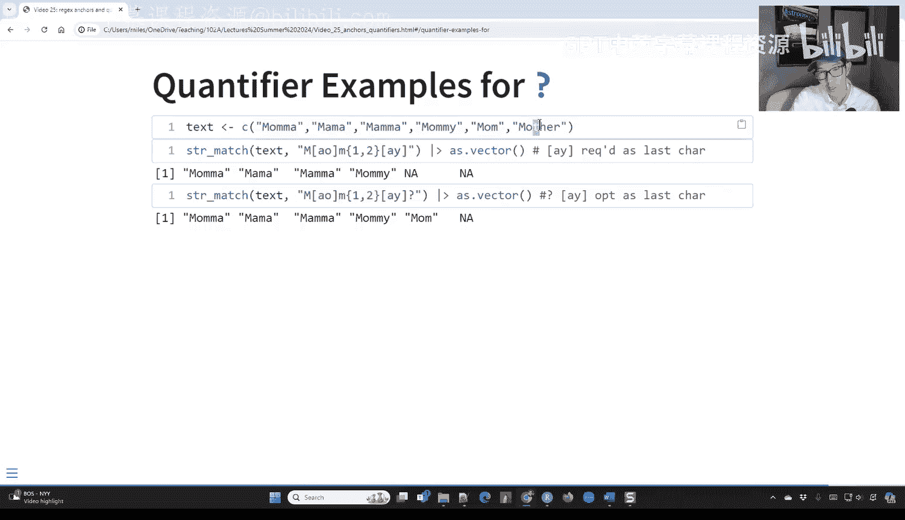
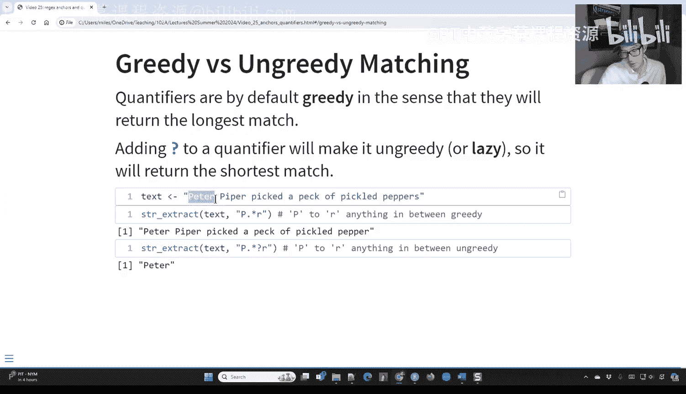
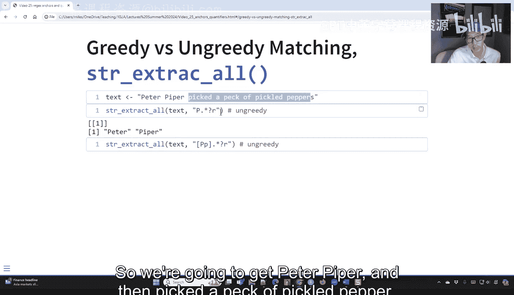
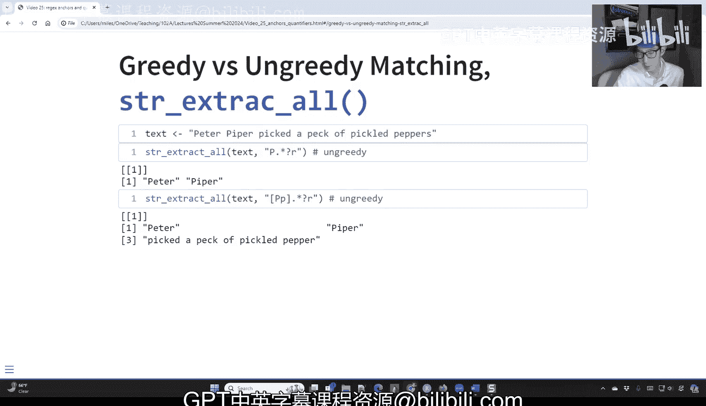

# 25：正则表达式中的锚点与量词 🔍

在本节课中，我们将学习正则表达式中两个核心概念：**锚点**和**量词**。锚点用于匹配字符串中的特定位置，而非具体字符；量词则用于指定模式重复的次数。掌握它们能让你更精确地控制文本匹配。

---

## 锚点：匹配位置而非字符

上一节我们介绍了字符集，本节中我们来看看锚点。锚点是模式的一部分，它不匹配任何字符，而是匹配字符串中的特定位置，例如字符串的开头、结尾或单词边界。

以下是常见的锚点符号及其含义：

*   `^`：匹配字符串的**开始**位置。
*   `$`：匹配字符串的**结束**位置。
*   `\b`：匹配一个**单词边界**（例如单词的开头或结尾）。
*   `\B`：匹配**非单词边界**的位置。

### 锚点应用示例

让我们通过一些例子来理解锚点的作用。假设我们有文本：`"The quick brown fox jumps over the lazy dog dog"`。

*   **无锚点匹配**：模式 `"THE"` 会匹配所有出现的 “THE”，并将其替换为 “-”。结果：`"- quick brown fox jumps over - lazy dog dog"`。
*   **起始锚点**：模式 `"^THE"` 只匹配位于字符串**开头**的 “THE”。结果：`"- quick brown fox jumps over the lazy dog dog"`。
*   **结束锚点**：模式 `"dog$"` 只匹配位于字符串**结尾**的 “dog”。结果：`"The quick brown fox jumps over the lazy dog -"`。

### 单词边界示例

考虑文本：`"words jump jumping umpire pump umpinth lumps"`。

*   **匹配单词边界**：模式 `"\b."` 会匹配所有紧跟在单词边界后的**单个字符**，并将其替换为 “-”。这有效地标记了所有单词的开头。
*   **匹配非单词边界**：模式 `".\B"` 会匹配所有**不**在单词边界前的字符，并将其替换为 “-”。这通常会替换单词内部的字母。

### 锚点与字符集的区别

初学者有时会混淆 `^` 在字符集内外的不同含义。

*   `"^[0-9]"`：这里的 `^` 是**锚点**，匹配**以数字开头**的字符串。
*   `"[^0-9]"`：这里的 `^` 在字符集 `[]` **内部**，表示**否定**，匹配**任何非数字**的字符。
*   `"[0-9^]"`：这里的 `^` 在字符集内部，但**不是第一个字符**，因此它匹配**数字 0-9 或字面字符 ‘^’**。

---

## 量词：控制模式重复次数

了解了如何匹配位置后，我们来看看如何控制模式的重复次数。量词附加在字面字符、字符类或分组之后，用于指定前面的元素可以出现多少次。

以下是主要的量词：

*   `*`：匹配前面的元素 **0 次或多次**。
*   `+`：匹配前面的元素 **1 次或多次**。
*   `?`：匹配前面的元素 **0 次或 1 次**（即可选）。
*   `{n}`：匹配前面的元素 **恰好 n 次**。
*   `{n,}`：匹配前面的元素 **至少 n 次**。
*   `{n,m}`：匹配前面的元素 **至少 n 次，至多 m 次**。

### 量词应用示例

假设我们有文本：`"WORDS 123,456 numbers 9,876"`。

*   **匹配一个或多个非空白字符**：模式 `"\S+"` 会找到所有连续的**非空白字符组**（如 “WORDS”, “123,456”, “numbers”, “9,876”），并将**每一组**替换为一个 “-”。结果：`"- - - -"`。
*   **匹配一个或多个数字**：模式 `"\d+"` 会找到所有连续的**数字组**（如 “123”, “456”, “9”, “876”），并将每一组替换为一个 “-”。结果：`"WORDS -, - numbers -, -"`。
*   **精确匹配三次**：模式 `"\d{3}"` 只匹配**恰好连续出现三次的数字**。它会匹配 “123” 和 “876”，但不会匹配 “456”（因为后面紧跟逗号，不是三个连续数字）或单个的 “9”。

### 问号 `?` 的两种用途

问号 `?` 有两种重要功能：

1.  **作为量词**：表示前面的元素出现 0 次或 1 次（即可选）。
    *   例如，模式 `"M(OM){1,2}(AY)?"` 可以匹配 “MOMMY” 和 “MOM”。`(AY)?` 使得 “AY” 成为可选部分，所以 “MOM” 也能匹配。

2.  **使其他量词“非贪婪”**：默认情况下，量词如 `*` 和 `+` 是“贪婪的”，会尽可能匹配最长的字符串。在它们后面加上 `?` 会使其变为“非贪婪”或“懒惰的”，匹配尽可能短的字符串。
    *   **贪婪匹配**：在文本 `"Peter Piper picked a peck"` 中，模式 `"P.*r"` 会从第一个 ‘P’ 开始，一直匹配到最后一个 ‘r’，得到 `"Peter Piper picked a peck"`。
    *   **非贪婪匹配**：模式 `"P.*?r"` 会进行最短匹配，首先得到 `"Peter"`，然后在剩余文本中继续匹配，可能得到 `"Piper"`。

---

## 总结

本节课中我们一起学习了正则表达式中两个强大的工具：**锚点**和**量词**。

*   **锚点**（如 `^`, `$`, `\b`）让你能够将匹配固定在字符串的特定**位置**，例如开头、结尾或单词边界，从而实现更精确的定位。
*   **量词**（如 `*`, `+`, `?`, `{n,m}`）让你能够指定一个模式应该**重复**多少次，从而灵活地匹配不同长度的内容。
*   特别要注意 `?` 的双重角色：作为独立量词表示“可选”，附加在其他量词后表示“非贪婪匹配”。

结合使用锚点和量词，你可以构建出极其强大和灵活的正则表达式模式，以应对各种复杂的文本匹配和提取任务。