# 26：正则表达式 - 捕获组与环视

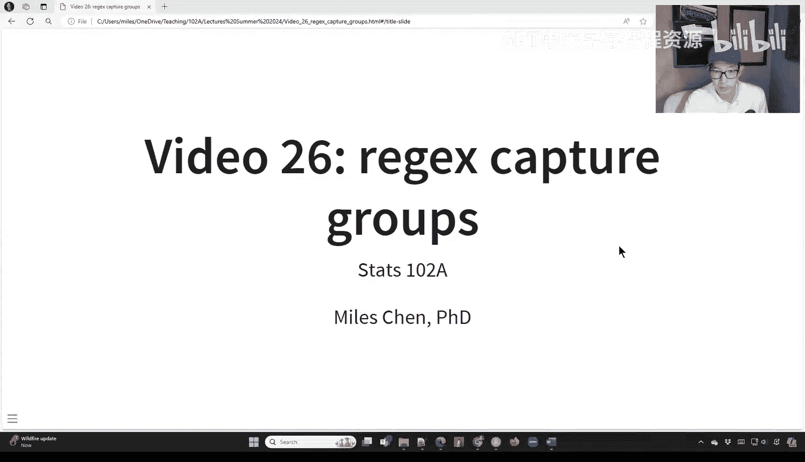

在本节课中，我们将学习正则表达式中两个强大的功能：捕获组和环视。捕获组允许我们提取和引用匹配文本的特定部分，而环视则让我们基于匹配项前后的内容进行条件匹配。掌握这些概念将极大地提升你处理和分析文本数据的能力。

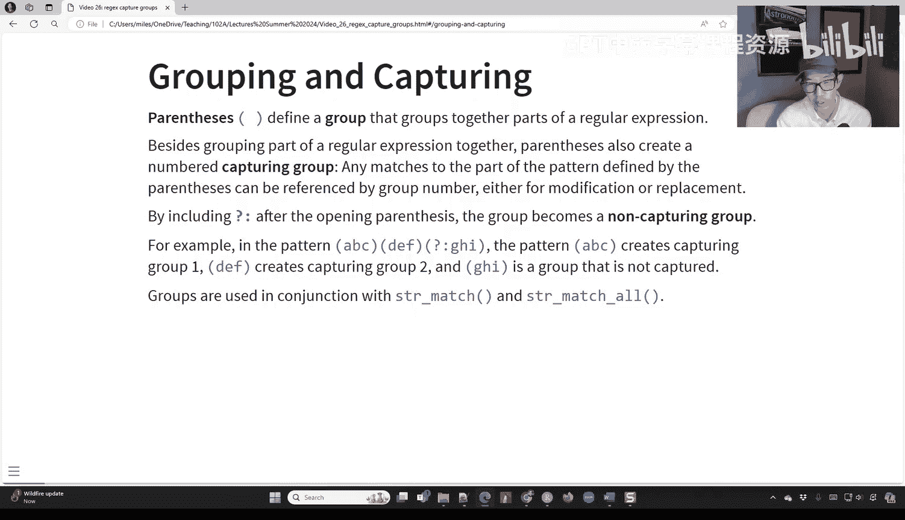

## 捕获组基础

上一节我们介绍了正则表达式的基本模式匹配。本节中，我们来看看如何使用括号 `()` 来创建捕获组。

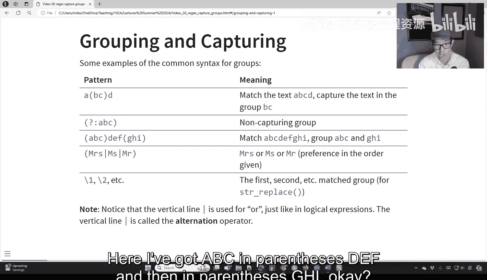

括号 `()` 有两个主要作用：
1.  将模式的一部分组合在一起。
2.  创建一个**编号的捕获组**。匹配括号内模式的内容可以被后续通过组号（如 `\1`， `\2`）引用，用于修改或替换。

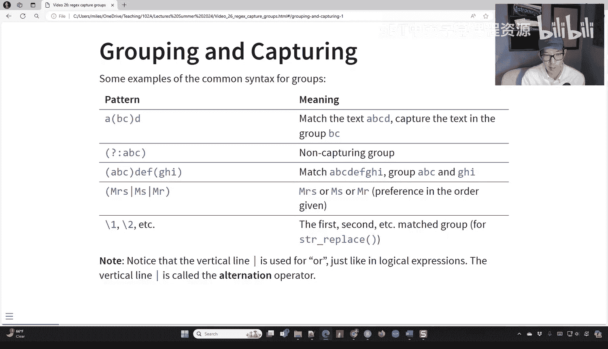

如果在开括号后立即加上 `?:`（例如 `(?:...)`），则该组变为**非捕获组**。它仅用于分组，不会被捕获和编号。

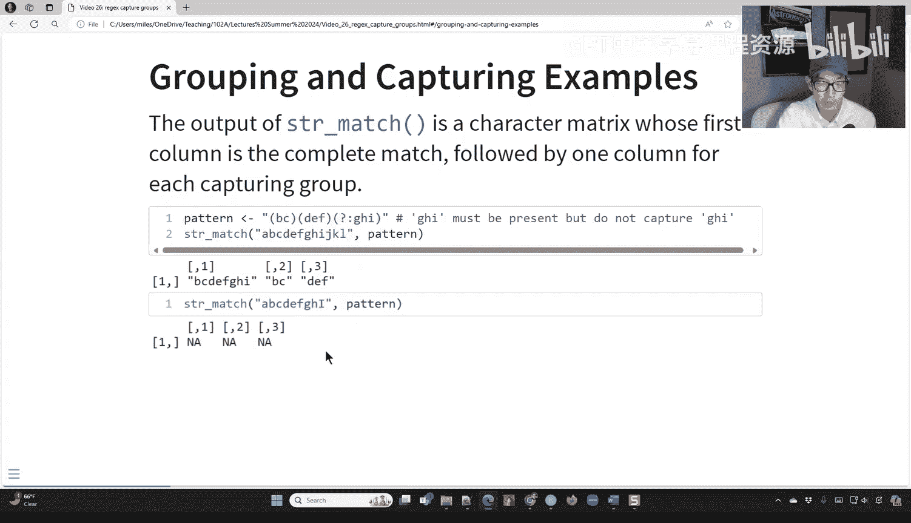

以下是一些基本模式示例：
*   `A(BCD)`：匹配 `ABCD`，并捕获 `BCD` 作为组1。
*   `A(?:BCD)EF(GHI)`：匹配 `ABCDEFGHI`，但只捕获 `GHI` 作为组1（因为 `BCD` 是非捕获组）。

捕获组通常与 `str_match()` 或 `str_match_all()` 等函数结合使用，以提取匹配的组。

## 组内的“或”操作与引用

在捕获组内部，我们可以使用竖线 `|` 来表示“或”逻辑。正则表达式会从左到右尝试匹配。

例如，模式 `(MRS|MS|MR)` 会按顺序优先匹配 `MRS`， 然后是 `MS`， 最后是 `MR`。

定义捕获组后，我们可以使用反斜杠加数字（如 `\1`， `\2`）来**反向引用**之前捕获的组。这在 `str_replace()` 等替换操作中非常有用。

## 捕获组应用示例

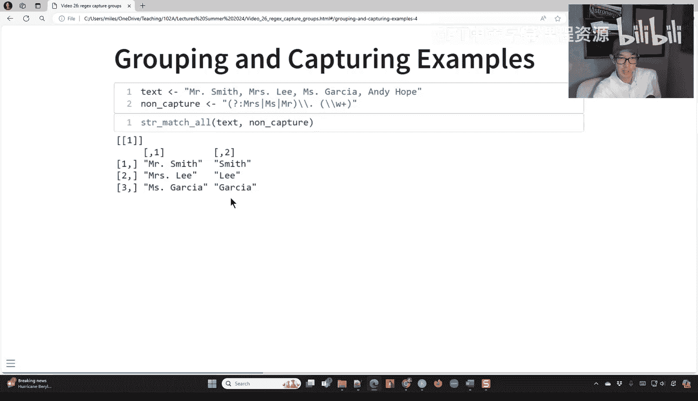

让我们通过几个具体例子来理解捕获组如何工作。

### 示例1：提取姓名与头衔

假设我们有以下文本：`"Mr. Smith, Mrs. Lee, Ms. Garcia, Andy Hope"`。

我们可以使用模式 `(MRS|MS|MR)\.\s(\w+)` 来匹配并提取头衔和姓氏。
*   `(MRS|MS|MR)`：捕获组1，匹配头衔。
*   `\.`：匹配字面量句点。
*   `\s`：匹配一个空白字符（如空格）。
*   `(\w+)`：捕获组2，匹配一个或多个单词字符（即姓氏）。

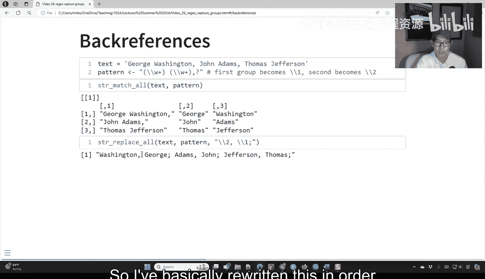

使用 `str_match_all()` 会返回一个矩阵，其中包含每个匹配项的全匹配以及对应的两个捕获组（头衔和姓氏）。`Andy Hope` 因为没有匹配的头衔，所以不会被捕获。

如果我们将模式改为 `(?:MRS|MS|MR)\.\s(\w+)`， 那么 `(?:MRS|MS|MR)` 就变成了非捕获组。此时，`str_match_all()` 返回的矩阵将只包含全匹配和**一个**捕获组（即姓氏）。

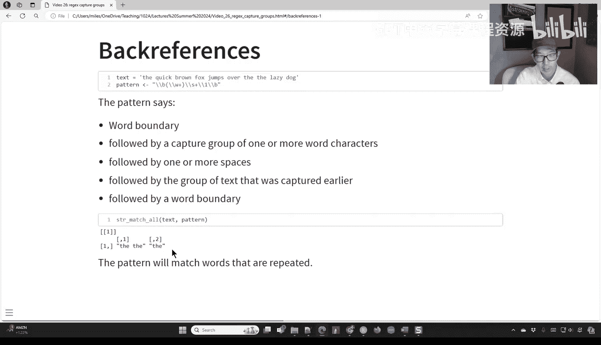

### 示例2：使用反向引用重排姓名

考虑文本：`"George Washington, John Adams, Thomas Jefferson"`。

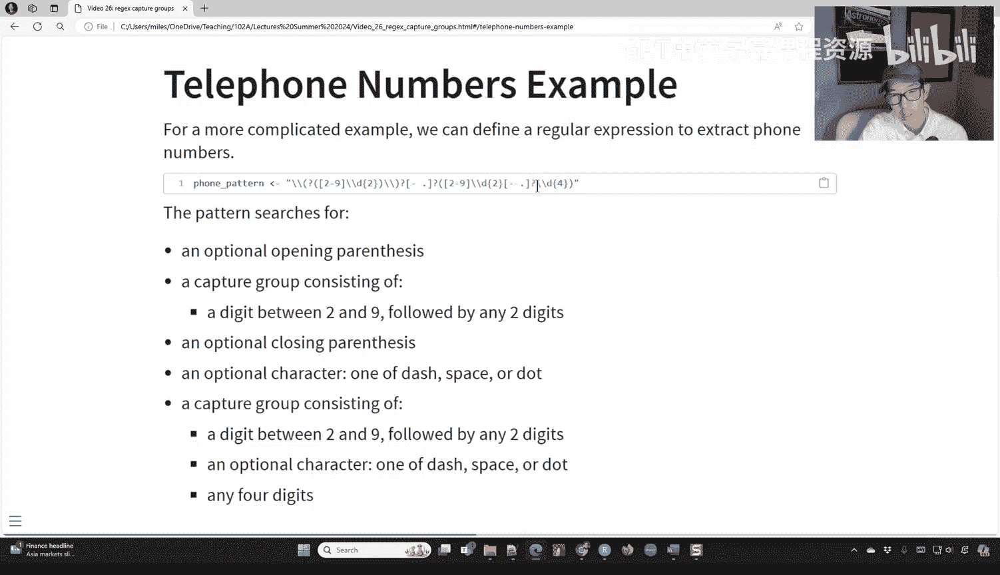

模式 `(\w+)\s(\w+),?` 可以匹配“名 姓”的结构，并分别捕获名和姓。
*   `(\w+)`：捕获组1，匹配名。
*   `\s`：匹配空格。
*   `(\w+)`：捕获组2，匹配姓。
*   `,?`：匹配一个可选的逗号。

现在，我们可以使用 `str_replace_all(text, pattern, "\\2, \\1;")` 进行替换。这里的 `\\2` 和 `\\1` 就是反向引用，分别代表第二个捕获组（姓）和第一个捕获组（名）。

替换结果是：`"Washington, George; Adams, John; Jefferson, Thomas;"`。我们成功地将“名 姓”的格式转换成了“姓， 名”的格式。

### 示例3：查找重复单词

模式 `\b(\w+)\s+\1\b` 可以用来查找文本中连续重复的单词。
*   `\b`：单词边界。
*   `(\w+)`：捕获组1，匹配一个单词。
*   `\s+`：匹配一个或多个空白字符。
*   `\1`：反向引用，必须匹配与捕获组1**完全相同**的单词。
*   `\b`：单词边界。

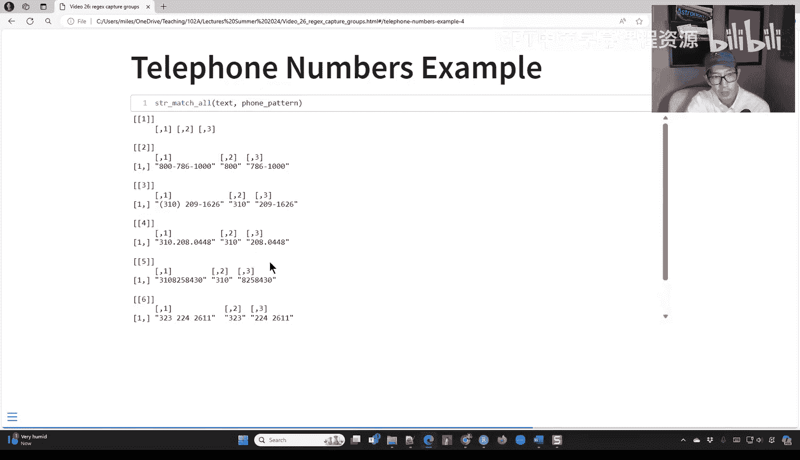

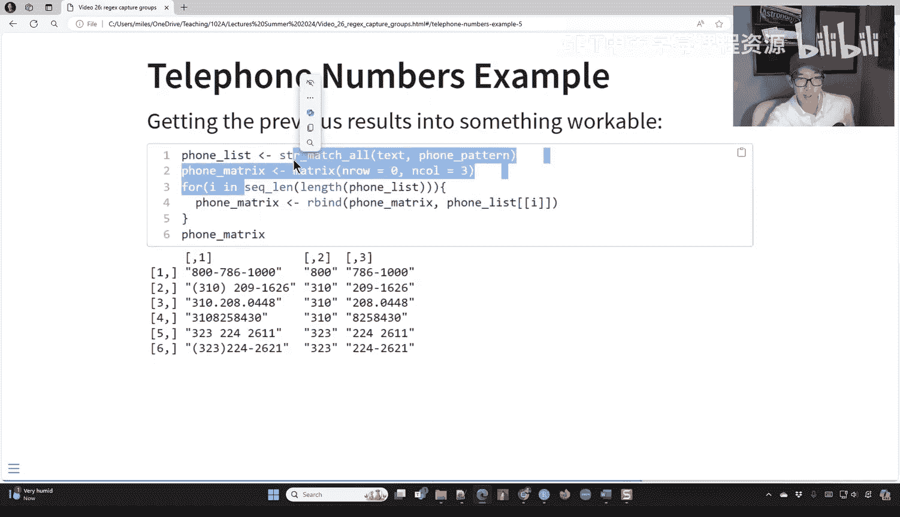

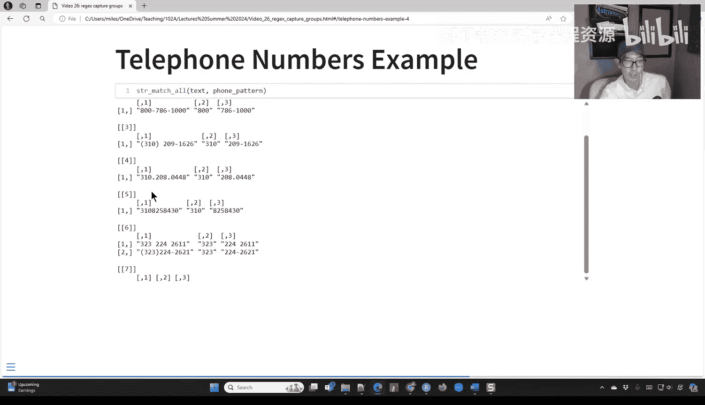

在句子 `"The quick brown fox jumps over the the lazy dog."` 中，这个模式会匹配到 `"the the"` 中的第一个 `"the"`（注意：匹配的是第一个“the”以及它后面的空格，但反向引用 `\1` 确保第二个“the”必须存在）。这对于文本校对和清理非常有用。

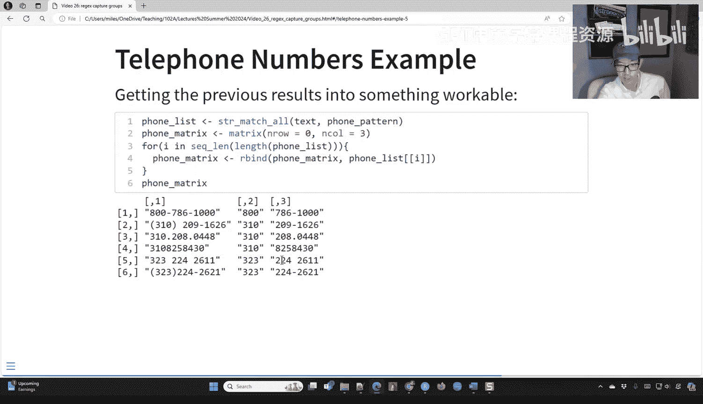

## 综合案例：提取和清理电话号码

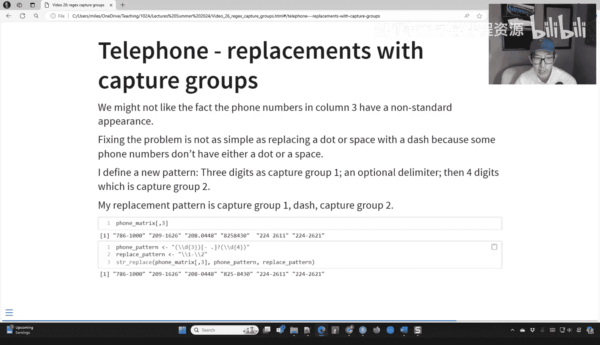

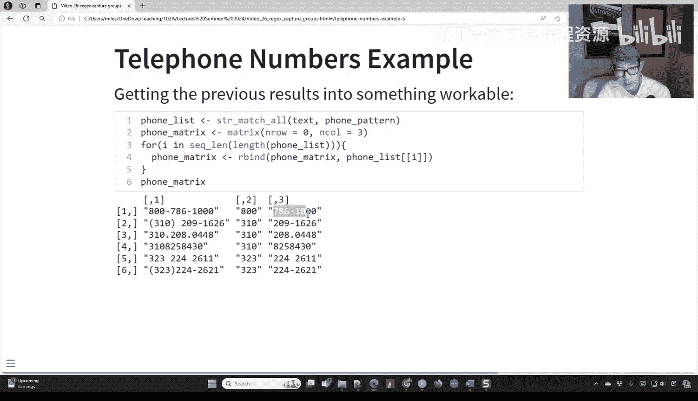

这是一个更复杂的例子，用于匹配北美常见的电话号码格式。

模式：`\(?([2-9]\d{2})\)?[- .]?([2-9]\d{2})[- .]?(\d{4})`
让我们分解一下：
*   `\(?`：匹配一个可选的左括号 `(`。
*   `([2-9]\d{2})`：**捕获组1**，匹配区号。区号首位是2-9，后跟任意两个数字。
*   `\)?`：匹配一个可选的右括号 `)`。
*   `[- .]?`：匹配一个可选的分隔符（短横线、空格或点）。
*   `([2-9]\d{2})`：**捕获组2**，匹配电话号码的前三位。
*   `[- .]?`：匹配一个可选的第二个分隔符。
*   `(\d{4})`：**捕获组3**，匹配电话号码的后四位。

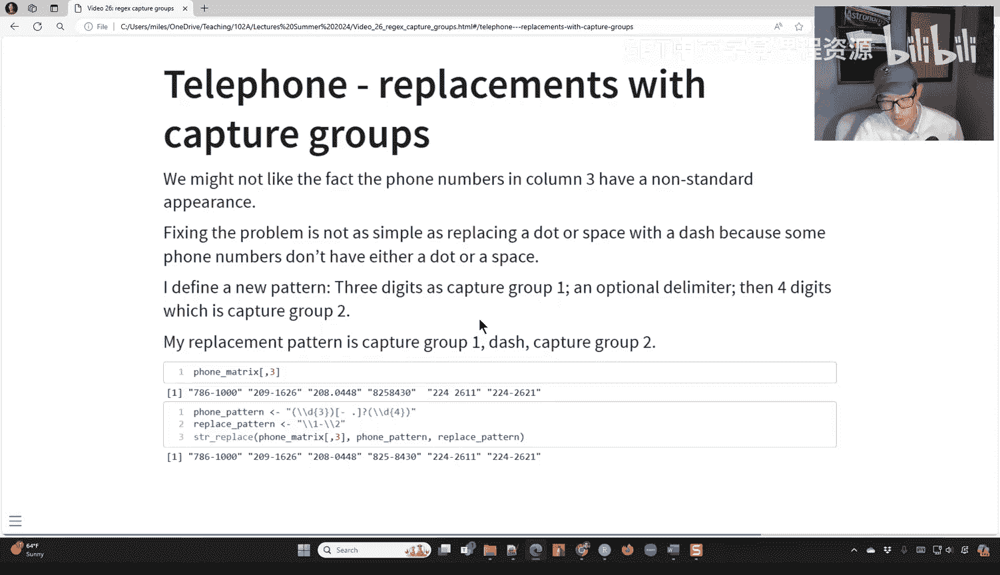

给定文本：`"Apple 1-800-613-1032, 209.162.6310, 208.0448, work 825-8430, home 323-242-6111"`， 使用 `str_match()` 可以提取出每个有效电话号码的区号和主体部分。

我们还可以利用捕获组进行标准化清理。例如，使用 `str_replace_all(phone_text, pattern, "\\1-\\2-\\3")` 可以将所有匹配的电话号码统一格式化为 `XXX-XXX-XXXX` 的形式。

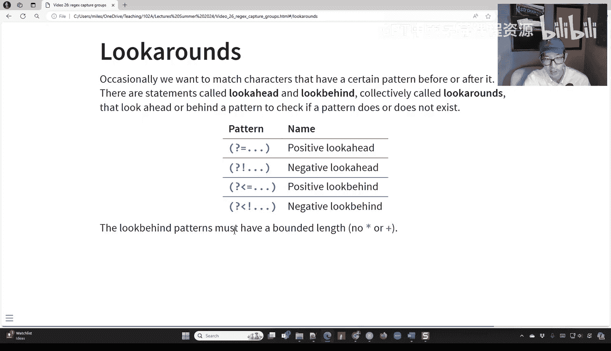

## 环视

有时我们需要匹配一个模式，但要求它前面或后面必须（或不能）跟着另一个模式。这称为**环视**。环视本身不消耗字符，也不属于匹配结果的一部分。

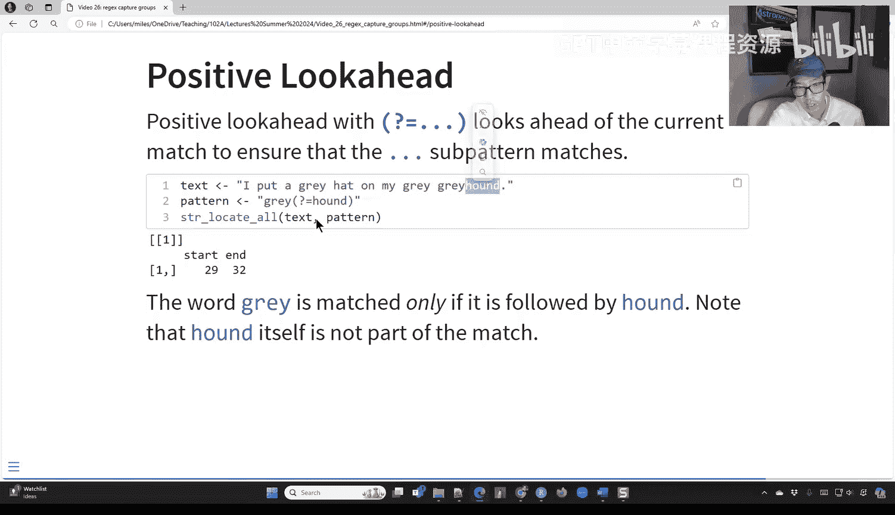

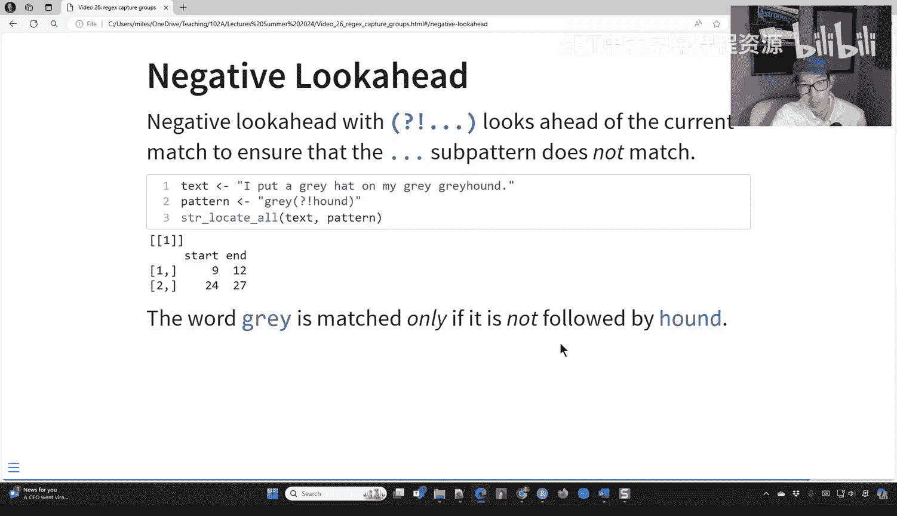

以下是四种环视结构：
1.  **肯定顺序环视** `(?=...)`：匹配后面跟着 `...` 的位置。
    *   示例：`gray(?=hound)` 在 `"I put a gray hat on my greyhound."` 中，只匹配 `"greyhound"` 前面的 `"gray"`（即 `"grey"`）， 而不匹配第一个 `"gray"`。
2.  **否定顺序环视** `(?!...)`：匹配后面**不**跟着 `...` 的位置。
    *   示例：`gray(?!hound)` 匹配后面不是 `"hound"` 的 `"gray"`。在上面的句子中，它会匹配第一个 `"gray"`， 而不匹配 `"greyhound"` 中的 `"grey"`。
3.  **肯定逆序环视** `(?<=...)`：匹配前面是 `...` 的位置。
    *   示例：`(?<=\\$)\\d+` 在 `"I withdrew $100 in $1 bills, $5 bills, and 5 $20 bills."` 中，只匹配紧跟在美元符号 `$` 后面的数字（`1`， `5`， `20`）， 而不匹配 `100` 或单独的 `5`。
4.  **否定逆序环视** `(?<!...)`：匹配前面**不**是 `...` 的位置。
    *   示例：`(?<!\\$)\\d+` 匹配前面没有美元符号 `$` 的数字。在上面的句子中，它会匹配 `100` 和第二个 `5`。

**注意**：逆序环视中的模式（`...` 部分）必须是固定长度的，不能使用 `*` 或 `+` 这类可变长度的量词。

## 总结

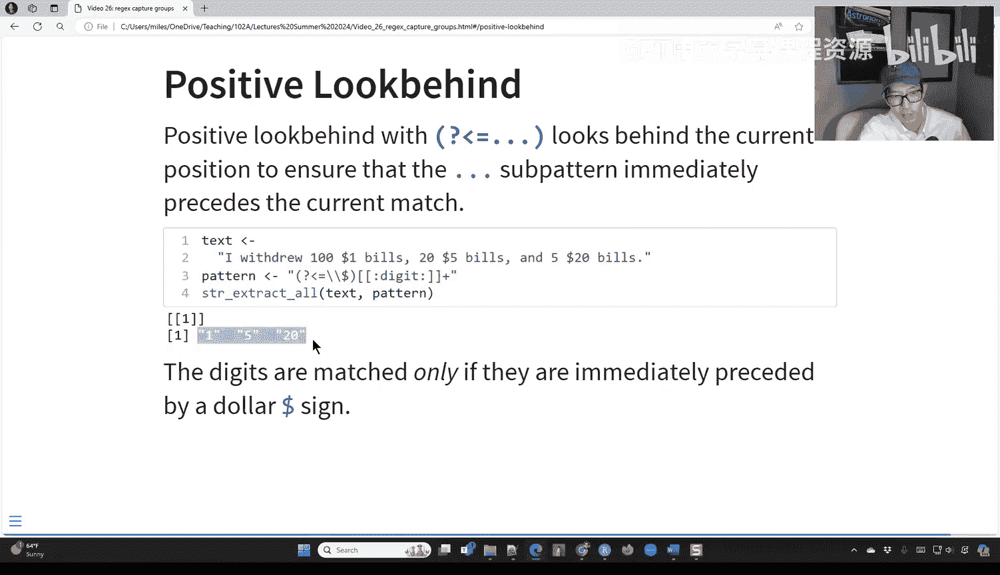

本节课中我们一起学习了正则表达式的两个高级特性：捕获组和环视。
*   **捕获组** `()` 允许我们提取和引用匹配文本的特定部分，通过编号（`\1`， `\2`）或使用 `?:` 创建非捕获组来灵活控制。
*   **反向引用**让我们能在同一表达式中或替换操作中复用已捕获的文本。
*   **环视**（`(?=)`， `(?!)`， `(?<=)`， `(?<!)`）提供了强大的条件匹配能力，让我们可以基于匹配项周围的上下文进行匹配，而不会将上下文本身包含在结果中。

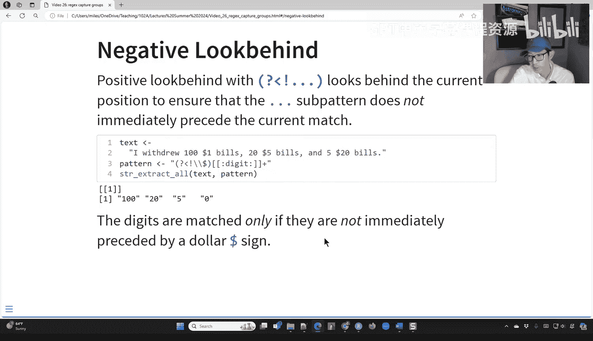

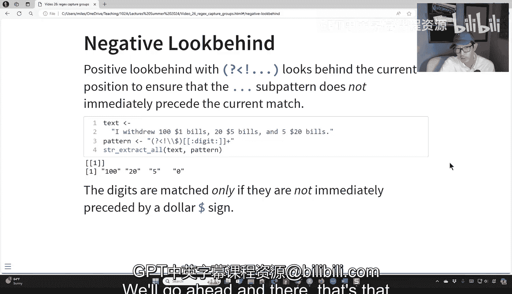

结合这些工具，你可以构建出极其强大和精确的正则表达式，用于复杂的数据提取、验证和清理任务，例如从非结构化文本中提取电话号码、电子邮件、重排数据格式或执行高级搜索。