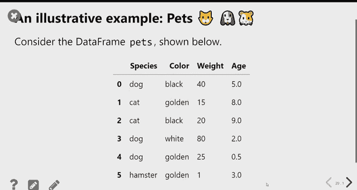
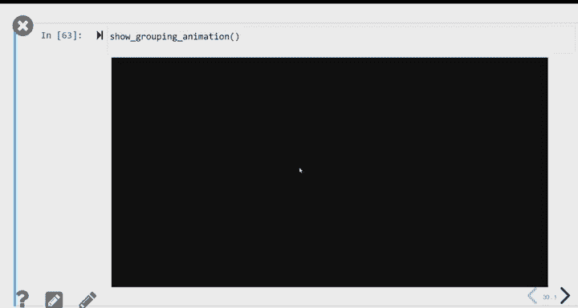
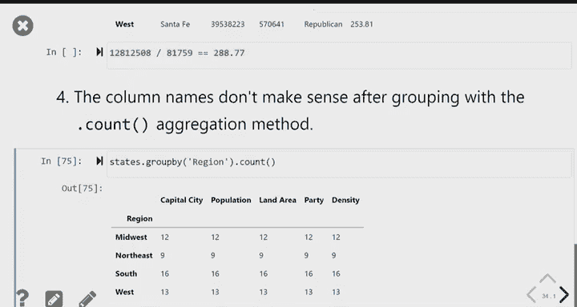

# 5：数据框查询与分组 🧮

在本节课中，我们将学习两种强大的数据框操作技术：**查询**与**分组**。我们将继续使用美国各州的数据集，通过编写代码来回答更复杂的问题。

---

## 概述

上一节课我们学习了多种数据框操作方法。本节课中，我们将重点学习如何从数据框中筛选出特定的行（查询），以及如何根据某一列的类别对数据进行汇总分析（分组）。这些是数据分析中的核心技能。

---

## 查询数据框：筛选特定行

查询（或称过滤）是指根据特定条件，从一个较大的数据集中筛选出符合条件的行。例如，我们想找出所有位于“西部”地区的州。

### 布尔值与比较运算

在Python中，比较两个值的结果是 **True**（真）或 **False**（假）。这种数据类型称为 **布尔型**。

*   **比较单个值**：`5 == 6` 的结果是 `False`。
*   **比较序列与值**：我们可以将整个数据列与一个值进行比较，Python会对序列中的每个元素逐一进行比较，这个过程称为“广播”。

以下是获取“西部”地区各州的步骤：

1.  获取“地区”列：`states.get(‘region’)`
2.  将该列与字符串 `’West’` 进行比较：`states.get(‘region’) == ‘West’`
3.  上述操作会生成一个由 `True` 和 `False` 组成的序列，其中 `True` 对应地区为“西部”的行。

### 执行查询

得到布尔序列后，我们可以用它来查询数据框。语法是：在数据框名称后加上方括号 `[]`，并在括号内放入布尔序列。

```python
# 查询所有位于“西部”地区的州
is_west = states.get(‘region’) == ‘West’
western_states = states[is_west]
```

方括号内的布尔序列就像一个过滤器：只保留对应值为 `True` 的行，过滤掉对应值为 `False` 的行。

### 获取数据框的形状

查询后，我们常需要知道结果有多少行。可以使用 `.shape` 属性。

```python
# 获取数据框的行数和列数
western_states.shape
# 输出类似 (13, 7)，表示13行，7列

# 仅获取行数
western_states.shape[0]
```

`.shape` 是一个属性，访问时不需要加括号。

---

## 组合多个条件进行查询

有时我们需要同时满足多个条件。例如，找出所有“南部”的“共和党”州。

我们可以使用逻辑运算符组合多个布尔序列：
*   **`&`** (与)：两个条件必须同时为真。
*   **`|`** (或)：至少一个条件为真。

**注意**：每个条件需要用括号括起来。

```python
# 找出南部且为共和党的州
is_south = states.get(‘region’) == ‘South’
is_rep = states.get(‘party’) == ‘Republican’
southern_rep_states = states[is_south & is_rep]
```

---

## 分组与聚合：按类别汇总数据

分组是一种强大的操作，它允许我们根据某一列的值（如“地区”）将数据分成若干组，然后对每组内的数据进行汇总计算（如求和、求平均）。

### 理解分组过程

假设我们有一个宠物数据框 `pets`，包含物种、颜色、体重和年龄。

```python
# 按物种分组，并计算每组的平均体重和年龄
pets.groupby(‘species’).mean()
```

这个过程分为两步：
1.  **分组**：`groupby(‘species’)` 将数据框按“物种”列的不同值（猫、狗、仓鼠）拆分成多个子数据框。
2.  **聚合**：`.mean()` 对每个子数据框中的数值列（体重、年龄）分别计算平均值。

结果是一个新的数据框，索引是分组的类别（物种），列是各数值列聚合后的结果。非数值列（如颜色）会被自动忽略。

### 常用的聚合方法





除了 `.mean()`，还有其他聚合方法：
*   `.sum()`：求和
*   `.max()`：最大值
*   `.min()`：最小值
*   `.median()`：中位数
*   `.count()`：计数（每组有多少行）

### 应用于州数据：找出人口最多的地区

现在，让我们用分组来解决“哪个地区人口最多”的问题。

```python
# 按地区分组，并计算每个地区的总人口
region_pop = states.groupby(‘region’).get(‘population’).sum()

# 按总人口降序排序，并获取排名第一的地区
most_populous_region = region_pop.sort_values(ascending=False).index[0]
```

**代码解释**：
1.  `states.groupby(‘region’)`：按“地区”分组。
2.  `.get(‘population’)`：只选取“人口”这一列进行后续操作。
3.  `.sum()`：对每个地区组内的人口求和。
4.  `.sort_values(ascending=False)`：将求和结果按降序排列。
5.  `.index[0]`：获取排序后索引（即地区名称）的第一个值，即人口最多的地区。

---

## 总结

本节课我们一起学习了数据框的两个核心操作：
1.  **查询**：我们学会了如何使用布尔比较创建条件，并通过 `df[boolean_series]` 的语法筛选出满足条件的行。我们还学习了如何使用 `&` 和 `|` 运算符组合多个条件。
2.  **分组**：我们掌握了 `groupby()` 方法，它能够根据某一列的值对数据进行分组，然后结合 `.sum()`, `.mean()` 等聚合方法，高效地对每个组进行统计分析。这使我们能轻松回答诸如“每个地区的总人口是多少”或“哪个类别平均值最高”等问题。



掌握查询和分组，你将能够从数据中提取出更具洞察力的信息，这是进行数据探索和分析的基础。