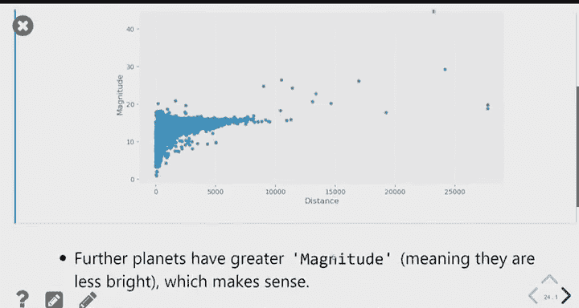
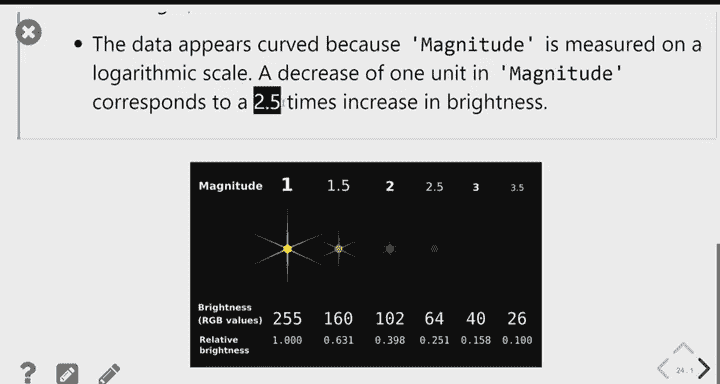
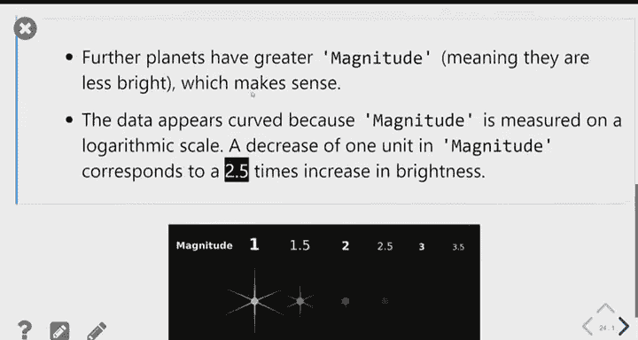
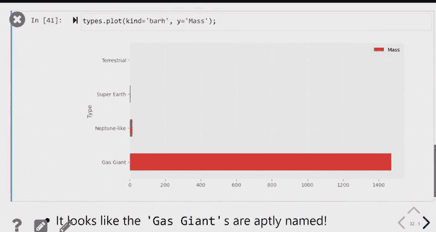
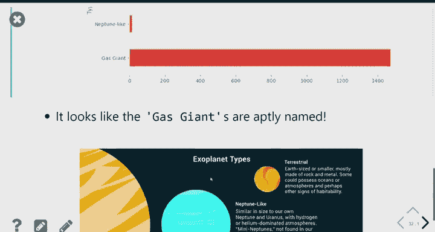
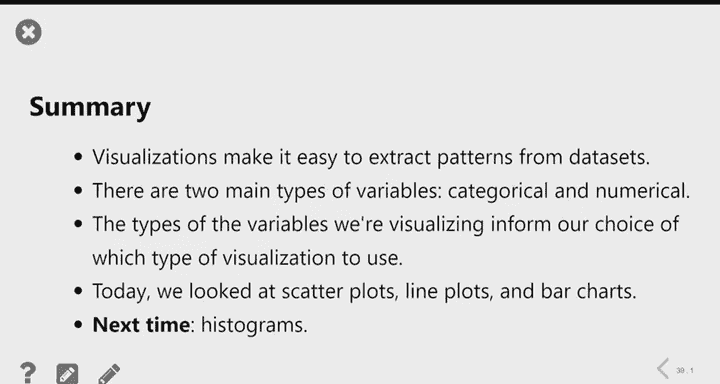

# 6：数据框操作与数据可视化 📊

在本节课中，我们将学习如何调整数据框的列，并介绍数据可视化的基本概念和几种核心图表类型。我们将使用`babypandas`库来实践这些操作。

---

## 🛠️ 数据框列操作

上一节我们介绍了数据分组和聚合。有时，聚合操作会产生冗余或命名不佳的列。本节中，我们来看看如何调整数据框的列名、顺序和数量。

以下是调整数据框列的三个核心方法：

*   **`.assign()`**：用于添加新列或重新分配现有列的值。
*   **`.get()`**：用于选择并保留特定的列，返回一个仅包含这些列的新数据框。当传入一个列名列表时，返回的是数据框；传入单个列名字符串时，返回的是序列。
*   **`.drop()`**：用于删除指定的列。

例如，我们有一个按地区分组并计数后的数据框`states_by_region`，其列名不具描述性且内容冗余。我们希望将其调整为仅包含一列名为`count`的数据框，用于显示每个地区的州数量。

```python
# 步骤1：添加新列‘count’，其值来自任意一个冗余列（例如‘party’）
states_by_region = states_by_region.assign(count=states_by_region.get('party'))

# 步骤2：使用.get()方法仅保留‘count’列，并得到一个整洁的数据框
states_by_region = states_by_region.get(['count'])
```

通过组合使用`.assign()`、`.get()`和`.drop()`方法，我们可以有效地重命名、重新排序和筛选数据框的列。

---

## 📈 数据可视化简介

数据可视化通过图形呈现数据，能帮助人们更直观、快速地理解信息。我们根据变量的类型（数值型或分类型）来选择不同的可视化图表。

变量分为两种类型：
*   **数值型变量**：其值可以进行算术运算（例如：薪资、利润）。
*   **分类型变量**：其值属于不同的类别，类别间可能有顺序（例如：电影类型、邮政编码）。即使类别用数字表示（如邮政编码），只要不用于算术比较，就属于分类型。

本节课我们将介绍三种图表：
1.  **散点图**：用于展示两个**数值型**变量之间的关系。
2.  **折线图**：通常用于展示一个**序列型**变量（如时间）与一个**数值型**变量之间的关系。
3.  **条形图**：用于展示一个**分类型**变量和一个**数值型**变量之间的关系。

---

## 🔵 散点图

散点图适用于探索两个数值型变量之间是否存在关系。

我们将使用系外行星数据集。例如，我们想探究行星的**距离**和**星等**（亮度，数值越小越亮）之间是否存在关联。

以下是创建散点图的代码：
```python
# 绘制距离（x轴）与星等（y轴）的散点图
exo.plot(kind='scatter', x='distance', y='magnitude')
```
如果数据点过于分散，我们可以先通过查询筛选数据，再绘制图表，以便更清晰地观察主要数据区域的关系。

---

## 📉 折线图







折线图常用于展示数据随时间或其他序列变化的趋势。

例如，我们想了解新发现系外行星的平均星等如何随时间变化。由于原始数据中每年有多个发现，我们需要先按年份分组并计算平均星等，得到一个每年一行的数据框。

以下是创建折线图的代码：
```python
# 按‘year’分组并计算均值
yearly_avg = exo.groupby('year').mean()

# 绘制折线图：x轴默认使用索引（年份），y轴使用‘magnitude’列
yearly_avg.plot(kind='line', y='magnitude')
```
折线图清晰地显示，随着时间的推移，我们发现的行星平均星等变高（即亮度变低），这表明我们的探测技术不断进步，能够发现更暗的天体。

---

## 📊 条形图

条形图用于比较不同类别在某个数值指标上的差异。

例如，我们想比较不同类型系外行星的平均半径。首先，我们按行星类型分组并计算平均半径。

以下是创建**水平条形图**的代码（水平条形图通常更便于阅读标签）：
```python
# 按‘type’分组并计算均值
types = exo.groupby('type').mean()

# 绘制水平条形图：x轴为数值（平均半径），y轴为类别（行星类型）
types.plot(kind='barh', x='type', y='radius')
```
在条形图中，条形的**长度**代表数值大小，条形的顺序本身通常没有意义，但按数值大小排序可以使图表更易于解读。

**注意**：对于水平条形图，`x`参数对应的是**数值列**，`y`参数对应的是**类别列**，这与图表上坐标轴的直观显示是相反的，这是由`barh`（水平）属性决定的。

---





## 🎨 叠加图表

我们可以在同一坐标系中叠加绘制多个数据系列。

例如，我们想在同一个条形图中同时展示每种行星类型的平均半径和平均星等。我们首先创建一个只包含所需列的数据框，然后进行绘制。

```python
# 从分组数据中仅选择‘radius’和‘magnitude’列
to_plot = types.get(['radius', 'magnitude'])

# 绘制图表。不指定y参数，将使用数据框中的所有列
to_plot.plot(kind='barh')
```
通过这种方式，我们可以在一张图上直观地比较多个指标在不同类别上的表现。

---

## 🎯 课程总结

本节课中我们一起学习了：
1.  使用`.assign()`、`.get()`和`.drop()`方法调整数据框的列。
2.  理解了数值型变量和分类型变量的区别。
3.  掌握了三种基本图表的用途和绘制方法：
    *   **散点图**（`kind='scatter'`）用于两个数值变量。
    *   **折线图**（`kind='line'`）用于展示序列趋势。
    *   **条形图**（`kind='barh'`）用于分类变量与数值变量的比较。
4.  学会了如何通过筛选数据和选择特定列来创建更清晰、更有针对性的图表。




这些技能是进行数据探索和有效传达数据见解的基础。