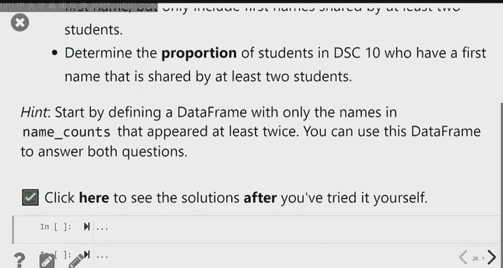
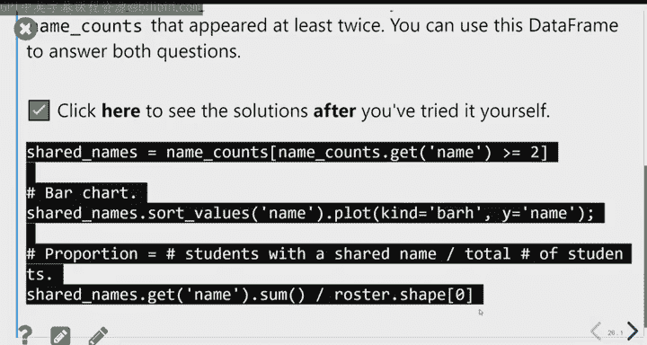
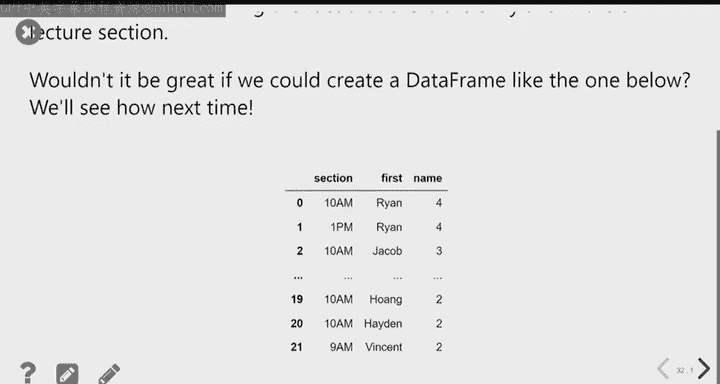

#  8：自定义函数与数据框应用 📘

在本节课中，我们将学习如何编写自己的函数，以及如何将这些函数应用到数据框（DataFrame）的列上，以处理和转换数据。我们将通过一个有趣的案例——分析课程中所有学生的名字——来实践这些概念。

---

## 🧮 第一部分：编写自定义函数

我们已经使用过许多Python内置函数（如 `max` 和 `len`）以及来自包（如 `numpy` 或 `math`）的函数。我们还使用过方法，这是为特定对象设计的特殊类型函数。现在，我们将学习如何创建自己的函数。

### 为什么需要自定义函数？

考虑一个数学问题：你开车去洛杉矶的一家餐厅，距离100英里。前50英里你以80英里/小时的速度行驶，后50英里以60英里/小时的速度行驶。你的全程平均速度是多少？

直觉上，你可能会认为平均速度是70英里/小时（即80和60的平均值）。但这是不正确的。平均速度的计算公式是总距离除以总时间。

总距离是100英里。总时间需要分段计算：第一段的时间是 `50 / 80` 小时，第二段的时间是 `50 / 60` 小时。因此，总时间为 `(50/80) + (50/60)` 小时。

平均速度公式为：
\[
\text{平均速度} = \frac{100}{\frac{50}{80} + \frac{50}{60}}
\]

简化后，公式变为：
\[
\text{平均速度} = \frac{2}{\frac{1}{80} + \frac{1}{60}}
\]

这个公式可以推广到任何两个正数 `a` 和 `b`，计算它们的调和平均数（Harmonic Mean）：
\[
\text{调和平均数} = \frac{2}{\frac{1}{a} + \frac{1}{b}}
\]

我们不想每次计算时都复制粘贴这个公式，因此我们创建一个函数来完成这个任务。

### 如何定义函数

在Python中，我们使用 `def` 关键字来定义函数。函数定义包括函数名、参数（输入）和函数体（执行的操作）。

以下是计算两个数调和平均数的函数定义：

```python
def harmonic_mean(a, b):
    """返回两个正数 a 和 b 的调和平均数。"""
    return 2 / (1/a + 1/b)
```

**函数定义解析：**
*   `def`: 定义函数的关键字。
*   `harmonic_mean`: 函数名。
*   `(a, b)`: 函数的参数（输入）。
*   `:`: 冒号表示函数头结束。
*   `"""..."""`: 文档字符串，描述函数功能（可选但推荐）。
*   `return`: 关键字，指定函数的输出。

定义函数后，我们可以像使用内置函数一样调用它：

```python
print(harmonic_mean(80, 60))  # 输出约 68.57
print(harmonic_mean(20, 40))  # 输出约 26.67
```

### 函数术语

*   **参数（Parameters）**: 函数定义中声明的变量（如 `a` 和 `b`），代表通用的输入。
*   **实参（Arguments）**: 调用函数时传递给参数的具体值（如 `80` 和 `60`）。
*   **函数体（Body）**: 缩进的代码块，定义了函数执行的操作。
*   **返回值（Return Value）**: `return` 语句后面的表达式结果，是函数的输出。

### 作用域（Scope）

函数内部定义的变量（包括参数）是**局部变量**，只在函数执行期间存在。函数外部无法访问它们。即使外部有同名变量，函数内部使用的也是传递给它的实参值。

```python
x = 15  # 全局变量 x

def triple(x):  # 参数 x 是局部变量
    return 3 * x

print(triple(12))  # 输出 36，使用局部变量 x (值为12)
print(x)           # 输出 15，全局变量 x 未改变
```

### 无参数函数与常见错误

函数可以有零个、一个或多个参数。

```python
def greeting():
    """一个简单的问候函数。"""
    return "Hi! 👋"

print(greeting())  # 输出: Hi! 👋
```

一个常见的混淆点是 `print` 和 `return` 的区别。`print` 只是在屏幕上显示信息，而 `return` 则是将值从函数中传递出来，以便后续使用（例如赋值给变量）。

```python
def pythagorean_print(a, b):
    """计算斜边并打印，但不返回值。"""
    c = (a**2 + b**2)**0.5
    print(c)

result = pythagorean_print(3, 4)  # 屏幕会打印 5.0
print(result)                     # 输出: None，因为函数没有返回值

def pythagorean_return(a, b):
    """计算斜边并返回值。"""
    c = (a**2 + b**2)**0.5
    return c

result = pythagorean_return(3, 4)  # 屏幕不打印
print(result)                      # 输出: 5.0
print(result + 10)                 # 输出: 15.0
```

**关键点**：`return` 语句会立即结束函数的执行，其后的代码不会运行。

---

## 🐼 第二部分：将函数应用于数据框

上一节我们介绍了如何编写自定义函数。本节中，我们来看看如何将这些函数应用到Pandas数据框的列上，以实现高效的数据处理。

我们将使用一个包含本课程所有学生姓名（为保护隐私，姓氏已替换为随机字符串）的数据集。我们的目标是找出班级中最常见的名字。

### 问题拆解

我们的数据框 `roster` 有一个 `"name"` 列，包含全名（如 "Jacob Ercuga"）。要按名字分组统计，我们首先需要从全名中提取出名字（First Name）。

我们已经知道如何为单个名字实现这个功能：

```python
def first_name(full_name):
    """从全名中提取名字（第一个空格前的部分）。"""
    return full_name.split(" ")[0]

# 测试函数
print(first_name("Pradeep Khosla"))  # 输出: Pradeep
print(first_name("Barack Obama"))    # 输出: Barack
```

但我们希望对数据框中的每一行都应用这个函数。手动操作442次是不现实的。

### 使用 `.apply()` 方法

Pandas Series 有一个强大的 `.apply()` 方法，它可以将一个函数应用到该Series的**每一个元素**上。

```python
# 从数据框中获取“name”列（这是一个Series）
name_series = roster.get("name")

# 将 first_name 函数应用到该Series的每个元素
first_names_series = name_series.apply(first_name)

# 查看结果（前几个）
print(first_names_series.head())
```

`.apply()` 方法接收**函数名**作为参数（注意不是函数调用，所以不加括号 `()`）。它会自动遍历整个Series，将每个元素（全名）作为输入传递给 `first_name` 函数，并收集所有输出，形成一个新的Series。

现在，我们可以将这个新的Series作为新列添加到原始数据框中：

```python
roster = roster.assign(first_name = first_names_series)
```

### 分析名字分布

有了 `first_name` 列，我们现在可以轻松找出最常见的名字：



```python
# 按 first_name 分组并计数
name_counts = roster.groupby("first_name").count()
# 按计数降序排序
name_counts = name_counts.sort_values("name", ascending=False)
print(name_counts.head())
```



结果显示，“Ryan”是班上最常见的名字，有9位同学叫Ryan。

### 实践活动：可视化共享名字

创建一个条形图，展示被多人共享的名字（即出现次数大于1的名字）及其出现频率。然后，计算班上拥有“名字伙伴”（共享名字）的学生比例。

以下是实现步骤：

1.  **筛选重复名字**：从 `name_counts` 中筛选出计数大于1的行。
2.  **创建条形图**：使用筛选后的数据框创建水平条形图。
3.  **计算比例**：统计共享名字的总人数，除以班级总人数。

```python
# 1. 筛选重复名字
shared_names = name_counts.query("name >= 2")

# 2. 创建条形图 (为使图表更美观，先按计数排序)
shared_names_sorted = shared_names.sort_values("name")
shared_names_sorted.plot(kind="barh", figsize=(10, 8))
plt.xlabel("Number of Students")
plt.title("Shared First Names in Class")
plt.show()

# 3. 计算拥有共享名字的学生比例
total_shared_students = shared_names.get("name").sum()
total_students = roster.shape[0]
proportion_shared = total_shared_students / total_students
print(f"拥有共享名字的学生比例: {proportion_shared:.1%}")
```

### 更复杂的应用：查找同课同名者

现在，我们提出一个更具体的问题：对于每位学生，其所在的小节（section）中，有多少人与他同名？

策略如下（以学生"Jacob Ercuga"为例）：
1.  找出 Jacob Ercuga 所在的小节。
2.  在整个花名册中，查询 `first_name == "Jacob"` 且 `section == Jacob的小节` 的所有行。
3.  统计行数。

我们可以将这个逻辑封装成一个函数，然后使用 `.apply()` 为每位学生计算。

```python
def shared_in_section(full_name):
    """返回与给定全名学生在同一小节中具有相同名字的人数。"""
    # 1. 找到该学生的行，获取其名字和小节
    student_row = roster.query("name == @full_name")
    stu_first_name = student_row.get("first_name").iloc[0]
    stu_section = student_row.get("section").iloc[0]

    # 2. 查询同小节同名的所有学生
    same_name_section = roster.query("first_name == @stu_first_name and section == @stu_section")
    # 3. 返回人数
    return same_name_section.shape[0]

# 测试函数
print(shared_in_section("Jacob Ercuga"))  # 输出可能是 3
print(shared_in_section("Runong Zpvmwy")) # 输出可能是 1

# 为数据框的每一行应用此函数，创建新列
roster = roster.assign(shared_in_my_section = roster.get("name").apply(shared_in_section))
print(roster.head())
```

新列 `shared_in_my_section` 中的数字表示每位学生在自己所在的小节中有多少位同名者。大多数值是1（表示没有同名伙伴），大于1的值则表明有同名伙伴在同一小节。

---

## 📝 总结

本节课中我们一起学习了：
1.  **自定义函数**：使用 `def` 关键字定义函数，理解参数、返回值和作用域的概念。
2.  **`.apply()` 方法**：这是将自定义函数高效应用于Pandas Series（数据框列）每个元素的强大工具。
3.  **数据操作流程**：通过编写解决特定问题的函数，并结合 `.apply()` 和分组聚合，我们可以从原始数据中提取有意义的洞察，例如分析名字的流行度或查找特定群体。




这些技能是数据科学工作流的核心，它们使你能够将复杂的数据处理任务分解为可重用、可读性高的代码块。