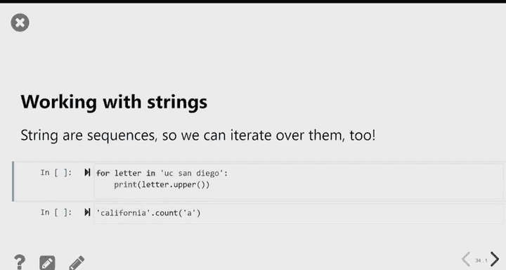

# 10：编程基础与迭代 🧑‍💻

在本节课中，我们将学习一些基础的编程概念，这些概念并非专门针对数据处理或Python，而是通用的编程技能。我们将在未来几周使用这些技能来分析数据。

## 布尔值与逻辑运算

上一节我们介绍了数据类型，本节中我们来看看布尔值。布尔数据类型只有两个值：`True` 或 `False`。我们通常通过比较运算来获得布尔值。

比较运算包括：
*   相等比较：`==`
*   不等比较：`!=`
*   数学比较：`>`， `<`， `>=`， `<=`

例如，我们定义两个变量：
```python
department = "DSC"
course = 10
```
我们可以进行如下比较：
```python
course < 20  # 结果为 True
```
这个操作就像在提问：“课程编号小于20吗？”，其结果是布尔值。

### `in` 操作符

`in` 操作符用于检查某个元素是否属于一个序列（如列表或数组）。在Python中，字符串也被视为序列。

对于字符串，`in` 操作符检查的是**子字符串**，且子字符串必须是连续的。
```python
"DS" in "DSC"  # 结果为 True
"DS" in "data science"  # 结果为 False（D和S不连续）
```

### 布尔运算符

有三个布尔运算符允许我们对布尔值进行类似算术的运算：`not`、`and` 和 `or`。

*   `not`：放在一个布尔值前，将其值从 `True` 变为 `False`，或从 `False` 变为 `True`。
*   `and`：放在两个布尔值之间，只有当**两边**都为 `True` 时，结果才为 `True`。
*   `or`：放在两个布尔值之间，只要**至少一边**为 `True`，结果就为 `True`。

与算术运算有运算顺序（PEMDAS）一样，布尔运算也有优先级顺序：`not` > `and` > `or`。建议使用括号来明确意图。

### 布尔序列运算

之前我们在用布尔序列查询数据框时，已经接触过“与”和“或”的概念，但那里使用的是符号 `&`（与）和 `|`（或）。区别在于：
*   关键字 `and` 和 `or` 用于**两个单独的布尔值**之间。
*   符号 `&` 和 `|` 用于**两个布尔值序列**之间，进行逐元素运算。

## 条件语句（`if` 语句）

我们学习布尔值的真正原因，是为了编写能根据不同情况执行不同操作的代码。`if` 语句允许我们实现这一点。

`if` 语句的写法是：`if` 后面跟一个条件（一个能计算出 `True` 或 `False` 的表达式），如果条件为 `True`，则执行其下方缩进的代码块。

### `else` 语句

通常，当条件不满足时，我们可能想做点别的事情。这时可以使用 `else` 语句。`else` 必须跟在 `if` 语句后面，它指定了当 `if` 条件为 `False` 时要执行的代码。`else` 是可选的，但你不能单独使用 `else`。

### `elif` 语句

有时逻辑可能更复杂，不止两个选项。你可以使用 `elif`（即 “else if”）来检查多个条件。

`elif` 的工作方式可以想象成一系列筛子：
*   第一个 `if` 筛子孔最大，符合条件的会被它“捕获”并执行相应代码。
*   只有没被前一个筛子捕获的，才会进入下一个 `elif` 筛子，它的孔更小一些。
*   可以有很多个 `elif`。
*   最后的 `else` 就像地面，所有通过前面所有筛子的最细颗粒都会掉到这里执行。

一个重要的结果是：当你评估某个 `elif` 条件时，你已经知道它前面所有的 `if` 和 `elif` 条件都是 `False`。

如果将所有的 `elif` 都换成 `if`，代码结构会改变，因为每个 `if` 都会被独立检查，可能导致多个代码块被执行。

## 函数中的条件语句与返回

在函数中使用条件语句时，`return` 语句会立即结束函数的执行。这意味着，如果某个条件满足并执行了 `return`，函数就不会继续检查后面的条件。

因此，在函数中，有时即使将所有 `elif` 换成 `if`，只要每个分支都使用 `return`，结果看起来也可能一样，因为函数在第一次 `return` 后就结束了。但如果将 `return` 换成 `print`，结果就会不同，因为 `print` 不会终止函数。

## 迭代与 `for` 循环

接下来我们谈谈迭代。迭代是指重复一个过程。`for` 循环允许我们实现迭代。

`for` 循环告诉Python为某个变量的不同值重复执行一段代码块。其结构是：`for` 一个变量 `in` 一个序列，然后执行缩进的代码体。

你可以这样理解：对于给定序列中的每个元素，重复执行这段代码。变量会自动依次取序列中的每个值。

`for` 循环通常用于压缩相似或相同的代码。没有 `for` 循环，你总是可以通过多次重复代码来达到目的，但 `for` 循环让代码更简洁。

### 遍历序列

字符串在Python中也被视为序列，因此你也可以用 `for` 循环遍历字符串中的每个字符。

### 使用索引遍历

有时，我们需要根据元素在序列中的位置（索引）来遍历。可以使用 `np.arange(len(sequence))` 来生成索引序列（0, 1, 2, ...），然后在循环中使用这个索引来访问序列中的元素。这在需要同时遍历两个或多个序列时特别有用。

### 循环变量

循环变量不一定非要在循环体中使用。你可以仅仅利用循环来重复执行某段代码固定的次数，而不关心循环变量的具体值。

### 缩进的重要性

只有被缩进的代码才会作为循环体的一部分被重复执行。循环体外的代码只执行一次。

## 累积模式与模拟

我们在本课程中使用 `for` 循环的主要场景是**累积模式**，用于模拟随机事件并记录结果。

### 累积结果：`np.append`

`np.append` 函数用于向数组末尾添加元素。需要注意的是，你必须将 `np.append` 的结果重新赋值给原数组变量，数组才会被真正修改和扩展。这就像在纸上记录实验结果，每做一次实验，就在列表末尾添加一个新结果。

### 模拟示例：抛硬币

通过模拟抛硬币多次，并记录每次得到正面的次数，我们可以了解这个随机过程的典型结果。我们使用一个 `for` 循环来重复实验（例如10,000次），每次实验后，使用 `np.append` 将结果（正面次数）累积到一个数组中。最后，我们可以通过直方图等方式查看结果的分布。

### 另一种累积：计数器

另一种累积结果是使用一个整数变量作为计数器。例如，在模拟彩票时，你可以将计数器初始化为0，如果中奖则将其加1，最后计数器就告诉你中奖的次数。

## 总结

本节课中我们一起学习了：
1.  **布尔逻辑**：包括比较运算、`in` 操作符以及 `not`、`and`、`or` 运算符。
2.  **条件语句**：使用 `if`、`elif` 和 `else` 来根据条件执行不同的代码路径，并理解了它们在函数中的行为。
3.  **迭代与 `for` 循环**：使用 `for` 循环来重复执行代码，可以遍历序列元素或单纯重复固定次数。
4.  **累积模式**：这是本课程中使用 `for` 循环的核心模式，用于通过模拟来理解随机过程，主要工具是 `np.append` 和计数器。




请注意，在处理数据框、序列或数组时，我们通常有更高效的方法（如分组、查询），因此不会用 `for` 循环来逐元素处理数据。我们主要将 `for` 循环用于上述的模拟和累积任务。