# 11：概率基础 🎲

在本节课中，我们将学习概率论的基本概念。概率是数据科学中用于理解和量化不确定性的核心工具。我们将从最简单的等可能情况入手，逐步学习事件、条件概率、乘法规则以及独立事件等核心概念。

## 概述与基本概念

概率研究的是看似随机的过程，例如抛硬币或掷骰子。我们首先需要理解几个基本术语。

*   **实验**：产生随机结果的过程，例如掷一次骰子。一个实验可以包含多个步骤，例如连续抛两次硬币。
*   **结果**：实验发生的具体情形。例如，掷一次骰子有6种可能的结果。
*   **事件**：一个或多个结果的集合。例如，“掷出偶数”这个事件对应结果集合 {2, 4, 6}。
*   **概率**：一个介于0和1之间的数字，表示事件发生的可能性。概率为0表示永远不会发生，概率为1表示总是会发生。我们用 **P(A)** 表示事件A的概率。

## 等可能结果的概率

概率最简单的情况是所有可能结果发生的可能性都相等，例如掷一个公平的骰子或抛一枚公平的硬币。

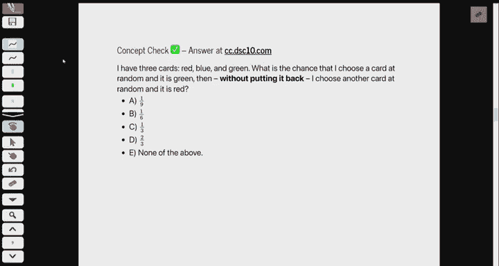

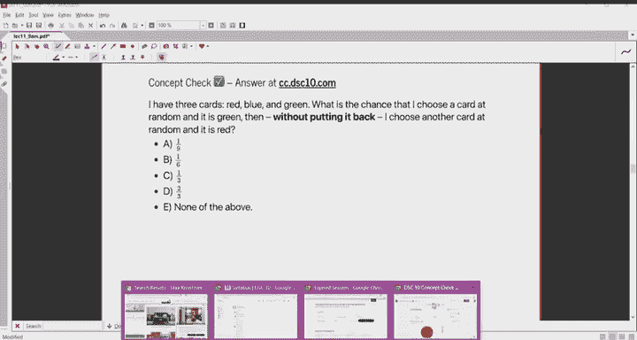

在这种情况下，事件A的概率计算公式为：
**P(A) = (事件A包含的结果数) / (所有可能的结果总数)**

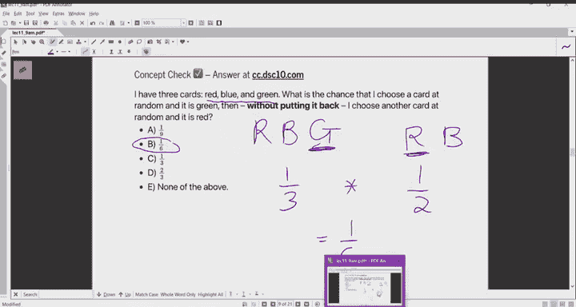

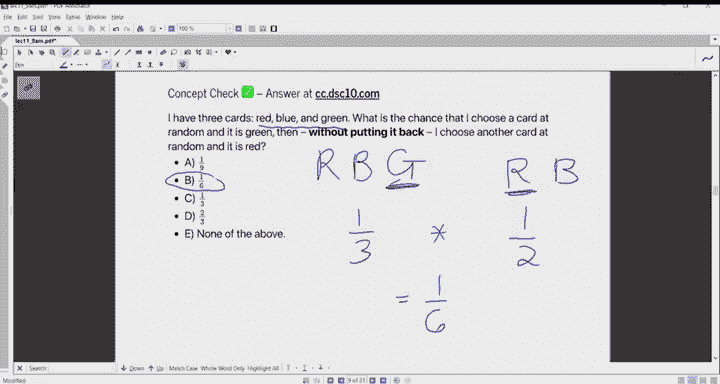

例如，抛两次公平硬币，求“至少出现一次正面”的概率。所有可能的结果是：{正正，正反，反正，反反}，共4种。“至少一次正面”包含 {正正，正反，反正}，共3种结果。因此，概率为 **3/4**。

**重要提示**：此公式仅在所有结果等可能时成立。如果某些结果更可能发生，则不能简单使用此公式。

## 条件概率

条件概率是指在已知某个事件（A）发生的情况下，另一个事件（B）发生的概率。记作 **P(B | A)**。

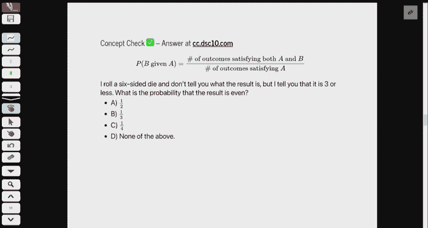

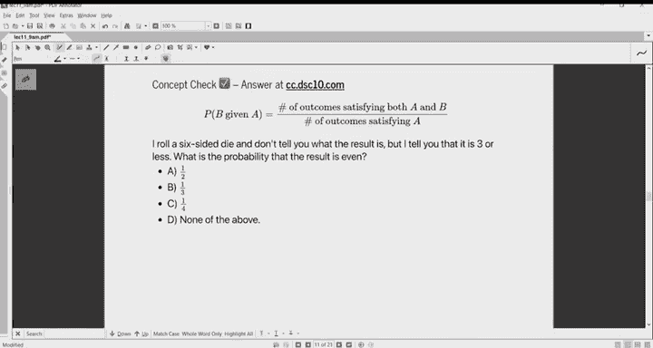

其计算公式为（在等可能前提下）：
**P(B | A) = (同时满足A和B的结果数) / (满足A的结果总数)**

可以理解为：在已知事件A发生的“世界”里，事件B也发生的比例。

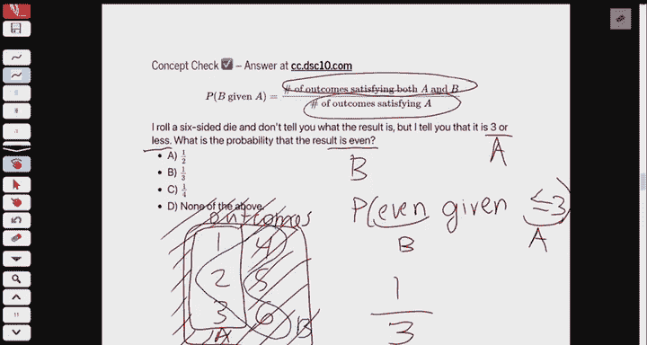

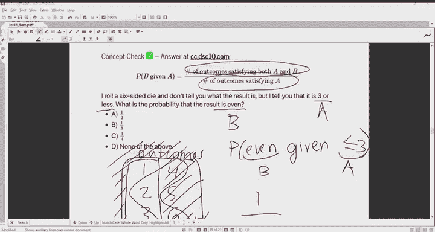

例如，掷一个公平的六面骰子，已知点数小于等于3，求点数为偶数的概率。
*   已知事件A（点数≤3）包含结果 {1, 2, 3}。
*   事件B（点数为偶数）包含结果 {2, 4, 6}。
*   同时满足A和B的结果只有 {2}。
因此，**P(偶数 | 点数≤3) = 1/3**。

## 事件的组合：“与”和“或”

上一节我们介绍了单一事件和条件概率，本节中我们来看看如何计算多个事件组合的概率。

### 事件“与”的概率

事件“A与B同时发生”的概率记作 **P(A and B)**。在等可能前提下，它等于同时满足A和B的结果数除以总结果数。

例如，掷骰子得到“点数≤3且为偶数”的概率。同时满足两个条件的结果只有 {2}，总结果有6个，所以概率为 **1/6**。

“与”概率可以通过乘法规则与条件概率联系起来：
**P(A and B) = P(A) * P(B | A)**

这表示，要使A和B都发生，可以先让A发生，然后在A发生的条件下再让B发生。此公式在结果非等可能时也成立。

### 事件“或”的概率

事件“A或B至少发生一个”的概率记作 **P(A or B)**。在等可能前提下，它等于满足A或B（或同时满足）的结果数除以总结果数。

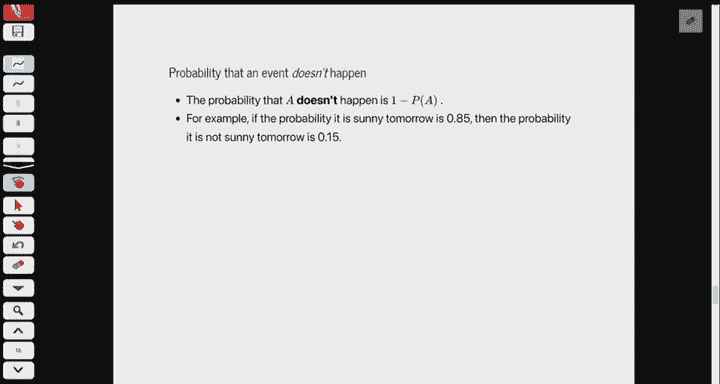

例如，掷骰子得到“偶数或点数≥5”的概率。
*   偶数结果：{2, 4, 6}
*   点数≥5结果：{5, 6}
*   满足至少一个的结果是：{2, 4, 5, 6}，共4个。
因此，概率为 **4/6 = 2/3**。

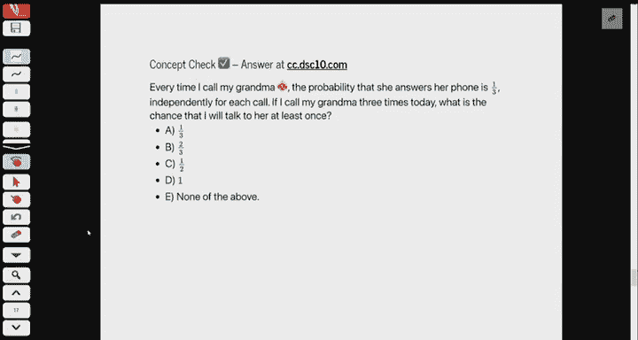

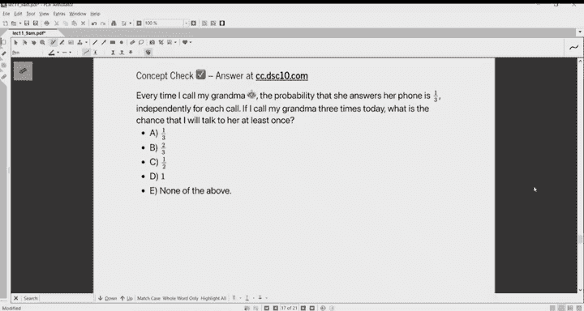

**注意**：不能简单地将P(A)和P(B)相加，因为同时属于A和B的结果（如数字6）会被重复计算。只有当A和B**互斥**（即没有重叠结果）时，才有 **P(A or B) = P(A) + P(B)**。

## 独立事件与乘法规则的特例

当两个事件**独立**时，即一个事件的发生不影响另一个事件发生的概率，条件概率 **P(B | A)** 就等于 **P(B)**。

此时，乘法规则简化为：
**P(A and B) = P(A) * P(B)**

例如，抛一枚有偏硬币（正面概率0.7），每次抛掷独立。连续抛5次都得到正面的概率为：
**0.7 * 0.7 * 0.7 * 0.7 * 0.7 = 0.7^5**

## 补事件概率

一个非常有用的规则是：事件不发生的概率等于1减去它发生的概率。
**P(not A) = 1 - P(A)**

这常用于简化“至少发生一次”这类问题的计算。例如，打电话给奶奶，每次接通的概率是1/3且独立。打3次电话，**至少接通一次**的概率，可以先计算**一次都没接通**的概率：**(2/3)^3 = 8/27**，然后用1减去它：**1 - 8/27 = 19/27**。

## 总结

本节课中我们一起学习了概率论的基础知识：
1.  在**所有结果等可能**的简单情况下，概率是“有利结果数”除以“总结果数”。
2.  **条件概率 P(B | A)** 是在已知A发生的情况下B发生的概率。
3.  计算“与”概率可以使用乘法规则：**P(A and B) = P(A) * P(B | A)**。当事件**独立**时，简化为 **P(A) * P(B)**。
4.  计算“或”概率需要小心重叠部分。仅当事件**互斥**时，才能直接相加：**P(A or B) = P(A) + P(B)**。
5.  利用补事件规则 **P(not A) = 1 - P(A)** 可以巧妙解决“至少一次”问题。

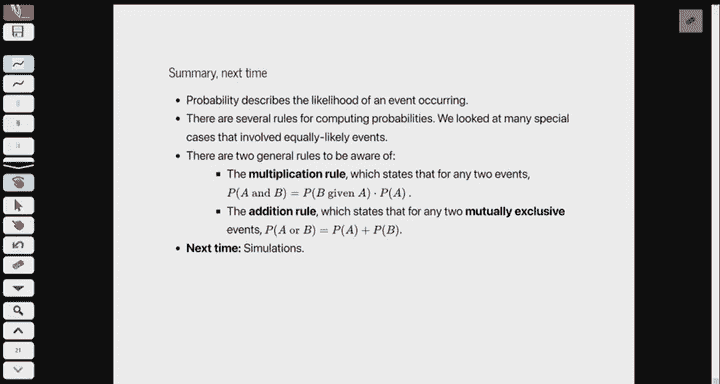

这些概念是理解数据中随机性和不确定性的基石，将在后续的统计推断和机器学习中反复应用。