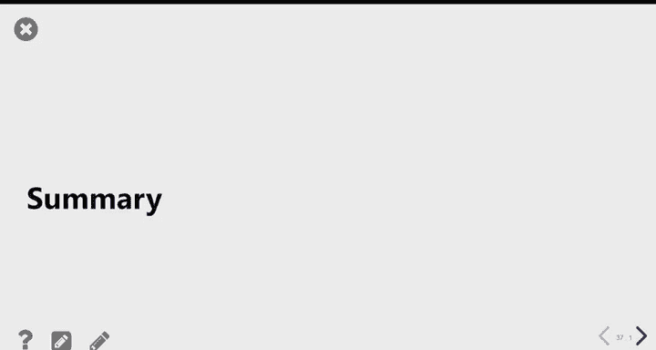

# 12：概率与模拟 🎲


在本节课中，我们将学习如何将编程与概率知识结合起来。我们将通过编写代码来模拟随机过程，从而估算那些难以直接计算的概率。课程将从复习循环开始，然后介绍如何使用循环来运行模拟实验。

## 复习：For循环与累加器模式

上一节我们介绍了概率的基本概念，本节中我们来看看如何用编程来辅助概率计算。首先，我们需要回顾一下用于重复执行代码的 `for` 循环。

`for` 循环会为序列中的每个元素重复执行一段代码。序列可以是列表、数组或字符串。

以下是一个 `for` 循环的例子：
```python
for x in ["my boyfriend", "a god", "the breeze", "a relaxing thought"]:
    print("Karma is", x)
```
这段代码会依次将 `x` 设置为列表中的每个值，并执行打印语句。

如果我们需要将循环的结果保存下来，而不是直接打印，就需要使用**累加器模式**。累加器模式是指：我们首先创建一个初始为“空”的变量，然后在每次循环中向其添加内容。

以下是累加器模式的几种常见形式：

*   **累加为字符串**：从空字符串开始，使用 `+` 进行拼接。
    ```python
    lyrics = ""
    for x in ["my boyfriend", "a god", "the breeze", "a relaxing thought"]:
        lyrics = lyrics + "Karma is " + x + "\n"
    ```
*   **累加为整数（计数）**：从0开始，当满足条件时增加计数。
    ```python
    count = 0
    for number in some_array:
        if number % 2 == 0: # 判断是否为偶数
            count = count + 1
    ```
*   **累加为数组**：从空数组开始，使用 `np.append` 添加元素。
    ```python
    results = np.array([])
    for i in np.arange(10):
        new_result = np.random.choice(["Heads", "Tails"])
        results = np.append(results, new_result)
    ```

## 练习：统计元音字母数量

为了巩固对循环和字符串操作的理解，我们来尝试一个练习：编写一个函数，统计给定字符串中元音字母（A, E, I, O, U）的数量。

以下是实现该函数的一种策略：
```python
def count_vowels(s):
    vowels_seen = 0
    for vowel in "AEIOU":
        how_many = s.count(vowel)
        vowels_seen = vowels_seen + how_many
    return vowels_seen
```
该函数的核心思路是：初始化一个计数器 `vowels_seen` 为0。然后遍历每个元音字母，使用字符串的 `.count()` 方法计算该元音在输入字符串 `s` 中出现的次数，并将次数累加到计数器上。

## 通过模拟估算概率

当我们遇到一个复杂、难以直接计算概率的问题时，可以通过**模拟**来估算概率。模拟的核心思想是：用计算机重复实验很多次，然后统计目标事件发生的频率，这个频率就近似于概率。

### 模拟随机选择

要进行模拟，我们首先需要让计算机能够做出随机选择。这可以通过 `np.random.choice` 函数实现。

`np.random.choice` 的基本用法是从一个序列中随机选取一个元素：
```python
np.random.choice(["Heads", "Tails"]) # 模拟抛一次硬币
np.random.choice([1, 2, 3, 4, 5, 6]) # 模拟掷一次骰子
```
你可以通过 `size` 参数一次性进行多次选择：
```python
np.random.choice(["Heads", "Tails"], size=10) # 模拟抛10次硬币
```
你还可以通过 `replace` 参数指定是否允许重复选择（即有放回或无放回）：
```python
# 无放回地选择3所不同的学院
colleges = ["Revelle", "Muir", "Marshall", "Warren", "Roosevelt", "Sixth", "Seventh"]
np.random.choice(colleges, size=3, replace=False)
```

### 示例1：估算抛硬币的概率

现在，让我们用模拟来估算一个概率问题：**抛掷100枚均匀硬币，得到60次或更多次正面朝上的概率是多少？**

我们的计划分为三步：
1.  编写能模拟一次实验（抛100次硬币并统计正面次数）的代码。
2.  将实验重复很多次（例如10,000次），并记录每次的结果。
3.  计算所有实验中，正面次数大于等于60的实验所占的比例。

首先，实现单次实验的函数：
```python
def coin_experiment():
    coins = np.random.choice(["Heads", "Tails"], size=100)
    heads_count = np.count_nonzero(coins == "Heads") # 统计"Heads"的数量
    return heads_count
```
这里，`coins == "Heads"` 会生成一个布尔值数组（True表示正面）。在Python中，True等价于1，False等价于0。因此，对这个布尔数组求和或使用 `np.count_nonzero` 都能得到正面的数量。

接着，重复实验多次并收集结果：
```python
repetitions = 10000
head_counts = np.array([]) # 初始化累加器数组

for i in np.arange(repetitions):
    hc = coin_experiment() # 进行一次实验
    head_counts = np.append(head_counts, hc) # 将结果累加
```
最后，计算估算的概率：
```python
# 计算正面次数>=60的比例
successes = np.count_nonzero(head_counts >= 60)
estimated_probability = successes / repetitions
# 或者等价地：estimated_probability = (head_counts >= 60).mean()
```
通过10,000次模拟，我们估算出的概率约为2.8%，这与通过数学公式计算出的精确概率非常接近。模拟次数越多，估算通常就越准确。

### 示例2：蒙提霍尔问题

蒙提霍尔问题是一个著名的概率谜题：假设你参加一个游戏节目，面前有三扇门，其中一扇后面有汽车（奖品），另外两扇后面是山羊。你选择一扇门后，知道答案的主持人会打开另一扇有山羊的门。然后问你：是坚持原来的选择，还是换到剩下的那扇门？哪种策略赢的概率更大？

我们可以通过模拟来找出答案。思路同样是模拟游戏很多次，分别测试“坚持”和“更换”策略的胜率。

以下是模拟“更换”策略一次游戏的函数核心逻辑（简化版）：
```python
def simulate_switch_strategy():
    # 奖品随机放在一扇门后
    prizes = ["Car", "Goat", "Goat"]
    # 参赛者随机初选一扇门
    original_choice = np.random.choice([0, 1, 2])
    # 主持人打开一扇有山羊且未被选择的门
    # ... (此处省略具体的主持人逻辑代码)
    # 参赛者更换到剩下的那扇门
    # ... (此处省略具体的更换逻辑代码)
    # 返回最终得到的奖品
    return final_prize
```
当我们重复这个游戏成千上万次后，统计得到汽车的比例。模拟结果清晰地显示：**更换策略的获胜概率约为2/3，而坚持策略的获胜概率仅为1/3**。因此，更换是更优的策略。

一个直观的解释是：如果你最初选中山羊（概率2/3），主持人必定会打开另一扇山羊门，此时更换一定会赢得汽车。如果你最初选中汽车（概率1/3），更换则会输掉。所以更换策略的胜率就是最初选中山羊的概率，即2/3。

## 总结



本节课中我们一起学习了如何将Python编程与概率论结合。我们复习了`for`循环和累加器模式，并利用`np.random.choice`函数引入随机性。通过“抛硬币”和“蒙提霍尔问题”两个实例，我们掌握了通过计算机模拟来估算复杂概率的完整流程：定义单次实验、重复多次并收集数据、最后分析结果计算频率。这种方法在理论计算困难时非常强大，也是数据科学中理解随机现象的重要工具。