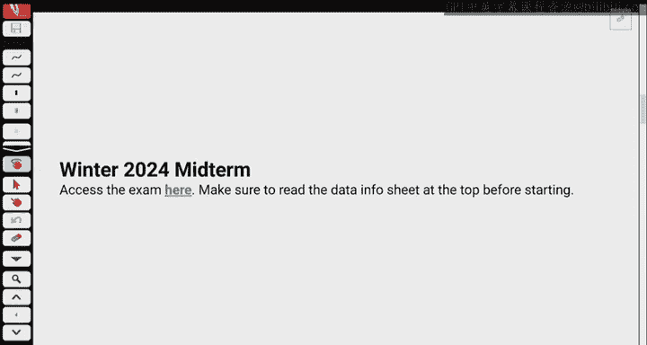
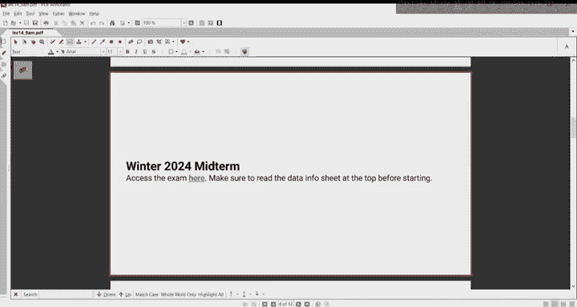
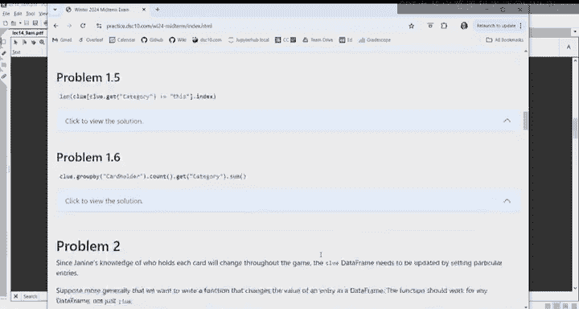
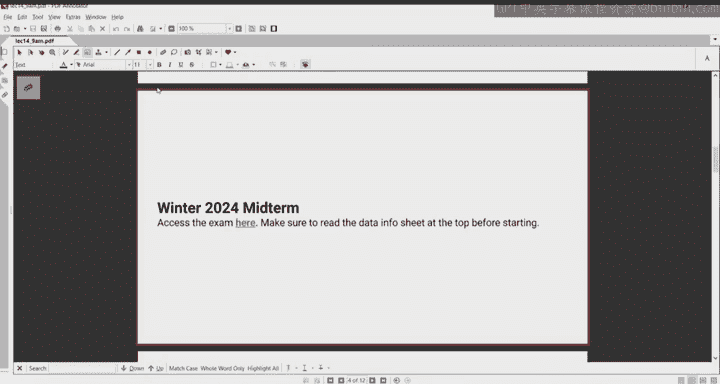
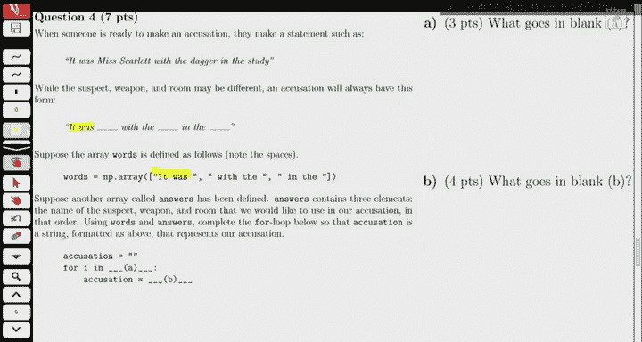
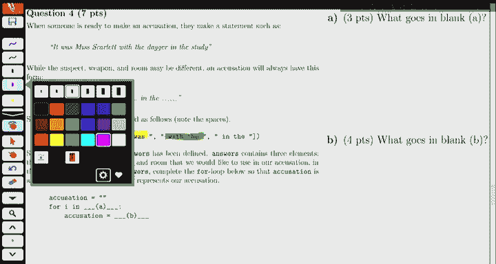
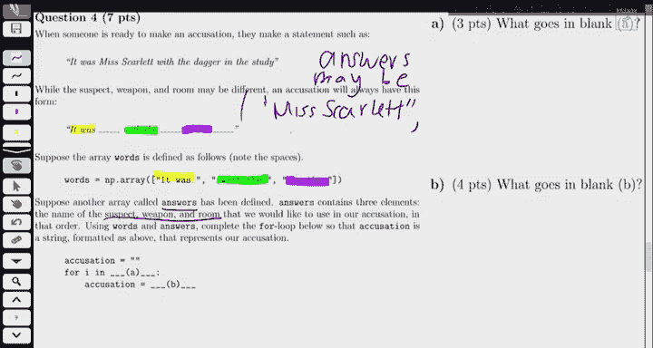
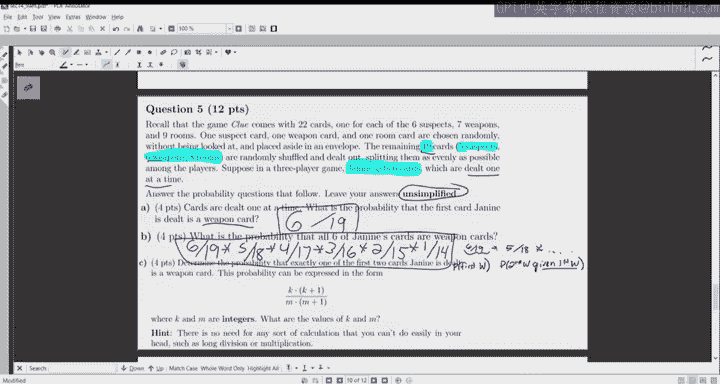
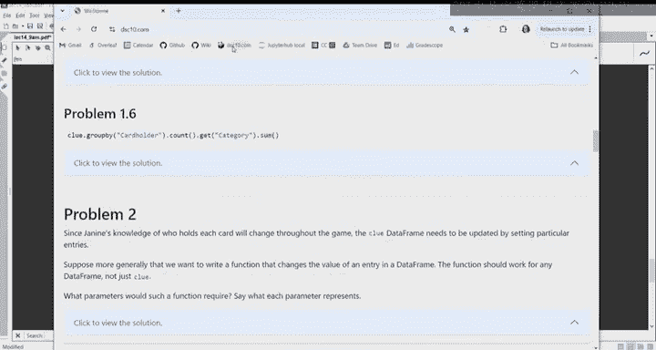
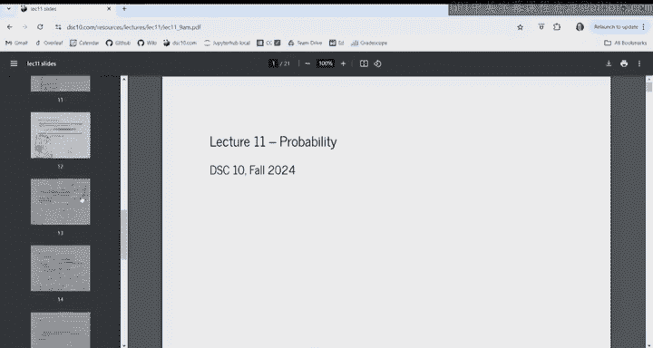

# 14：期中考试复习 📘

## 📋 概述
在本节课中，我们将通过分析一份往期期中考试试卷（2024年冬季学期）来复习关键概念。我们将模拟考试环境，专注于问题解决，而不运行代码。课程将涵盖数据框操作、条件筛选、概率计算和直方图解读等核心主题。

---

## 🎲 考试背景与数据说明
首先，我们来看考试的数据信息表。仔细阅读数据信息表非常重要，因为它包含了考试所需的所有细节。

本次考试围绕棋盘游戏《妙探寻凶》（Clue）展开。这是一个谋杀推理游戏，玩家通过排除法推断犯罪细节。游戏前提是：在一所大宅中发生了一起谋杀案，凶手是六名嫌疑人之一，使用了七种武器之一，发生在九个房间之一。

游戏共有22张卡牌（6张嫌疑人 + 7张武器 + 9张房间）。确定凶手的方法是：从每个类别中随机抽取一张卡牌（一名嫌疑人、一种武器、一个房间），放入一个信封。信封中的内容代表了谋杀的细节。这意味着有三张卡牌被放入信封。

剩下的19张卡牌被洗匀并分发给玩家。玩家查看自己手中的卡牌，可以知道这些卡牌不可能是信封中的卡牌（即不是凶器、凶手或案发房间）。这是一个通过排除法进行的游戏。玩家有机会看到其他玩家的手牌，进一步排除嫌疑人、武器和房间。第一个将可能性缩小到唯一的嫌疑人、武器和房间组合的玩家提出指控并获胜。

我们拥有的实际数据是关于一场特定游戏实例的信息。玩家是Janine、Henry和Page。Janine和Page各分到6张卡牌，Henry分到7张卡牌，总计19张。

数据框 `clue` 有22行，对应游戏中的每张卡牌，它代表了我对每张卡牌持有者的了解。开始时，我对许多卡牌持有者并不清楚，选项包括“unknown”或玩家姓名。`category` 列包含“suspect”、“weapon”或“room”。`cardholder` 列包含“Janine”、“Henry”、“Page”或“unknown”。数据框的索引是卡牌名称。

需要记住的是，`clue` 数据框代表我在游戏任意时间点的当前知识，不一定是游戏开始时的状态。在整个考试中，我们已经运行了 `import babypandas as bpd` 和 `import numpy as np`。

---

## 🔢 问题一：表达式求值
以下每个表达式都会求值为一个整数。请确定该整数的值，如果无法确定，请圈出“信息不足”。

以下是每个问题的解析：

**A. `(clue.get(‘cardholder’) == ‘Janine’).sum()`**
*   这部分求值结果是什么？它是一个布尔值序列（True和False）。
*   对布尔值序列求和会得到True的数量。
*   这基本上就是`cardholder`列等于“Janine”的行数。
*   根据游戏设定，我（Janine）被发了6张牌，并且我知道自己持有这6张牌。因此，答案是**6**。

**B. `np.count_nonzero(clue.get(‘category’).str.contains(‘p’))`**
*   我们获取`category`列，并检查哪些值包含字母‘p’。
*   `category`列包含三个特定值：“suspect”、“weapon”、“room”。哪些包含‘p’？“suspect”和“weapon”包含，‘room’不包含。
*   因此，这对应的是嫌疑人和武器卡牌的行数，即6 + 7 = **13**行。
*   `str.contains(‘p’)`生成一个布尔序列，`np.count_nonzero`计算其中非零（即True）的数量，所以答案是**13**。

**C. `clue[clue.get(‘category’) == ‘suspect’].query(‘cardholder == “Janine”’).shape[0]`**
*   这表示：在`category`为“suspect”的行中，查询`cardholder`为“Janine”的行，然后获取其行数（`shape[0]`）。
*   用中文解释就是：我手中有多少张嫌疑人卡牌？
*   我们知道我总共有6张牌，但这些牌可能是任意类别（嫌疑人、武器、房间）的组合。我们无法确定其中有多少张是嫌疑人卡牌。因此，答案是**信息不足**。

**D. `len(clue.take(np.arange(5, 20, 3)).index)`**
*   `np.arange(5, 20, 3)` 生成序列：5, 8, 11, 14, 17。
*   `.take` 方法根据位置索引（从0开始计数）获取数据框的特定行。因此，它获取的是第6行（索引5）、第9行（索引8）等。
*   最终会得到一个包含5行的新数据框。
*   `.index` 获取这个新数据框的索引，`len()` 计算其长度，即行数。所以答案是**5**。

**E. `clue.query(‘category >= “t”’).index.shape[0]`**
*   这是一个查询，条件是 `category` 列的值大于或等于字符串 “t”。
*   Python对字符串进行字母顺序比较。
*   “suspect” (s) < “t” -> False
*   “weapon” (w) > “t” -> True
*   “room” (r) < “t” -> False
*   因此，只有“weapon”类别的行会被保留，共有7行。
*   查询后得到一个7行的数据框，其索引长度为**7**。

**F. `clue.groupby(‘cardholder’).count().get(‘category’).sum()`**
*   `clue.groupby(‘cardholder’).count()` 会按`cardholder`的不同值（Janine, Henry, Page, unknown）进行分组，并计算每组中每列的非空值数量。由于所有列在每组中都有值，`count()`的结果列都表示该持有者拥有的卡牌数量（根据我的当前知识）。
*   例如，Janine对应的数字是我知道自己持有的卡牌数（6），Page和Henry对应的数字是我目前所见到的他们持有的卡牌数，unknown对应的数字是我尚不知道持有者的卡牌数。
*   然后，我们取出`category`列（选择哪一列并不重要，因为`count()`后所有列的值都相同）并求和。
*   这个和必须是**22**，因为总共有22张卡牌，每张卡牌都被某个持有者（包括unknown）所“拥有”。

---

## 🕵️ 问题二：判断指控时机
当玩家将可能性缩小到唯一的未知嫌疑人、武器和房间时，就意味着可以提出指控并赢得游戏。这部分定义了一些通过操作`clue`数据框得到的新数据框（`grouped`和`filtered`），问题是在空白处填上代码，使得当我有足够信息提出指控时，会打印“ready to accuse”。

我们需要理解对数据框进行操作后会发生什么。

首先，回忆一下`clue.reset_index()`后的样子：它会让`card`从索引变成一列，并引入默认索引0, 1, 2…。数据框将有三列：`card`, `category`, `cardholder`。

接着，我们按`category`和`cardholder`进行分组（`groupby([‘category’, ‘cardholder’])`）。当按多列分组时，会为这些列值的每个组合生成一行。例如，一行可能代表`category`为“suspect”且`cardholder`为“Page”的组合，另一行可能代表`category`为“weapon”且`cardholder`为“unknown”的组合。

然后，`.count()`会告诉我这个新数据框的列中会有什么数据。它计算的是每个组合中有多少张卡牌。例如，“嫌疑人 & Page”组合下的数字表示我知道Page有多少张嫌疑人卡牌；“武器 & unknown”组合下的数字表示有多少张武器卡牌对我来说还是未知的。

`grouped = clue.reset_index().groupby([‘category’, ‘cardholder’]).count().reset_index()` 这行代码执行了上述操作并重置索引以便于处理。

`filtered = grouped[grouped.get(‘cardholder’) == ‘unknown’]` 这行代码从`grouped`中筛选出`cardholder`为“unknown”的行。结果数据框会有3行，分别对应“weapon-unknown”, “suspect-unknown”, “room-unknown”。各列的值都相同，代表未知的武器、嫌疑人、房间的数量。

为了能够提出指控，我需要每个类别的未知数量都恰好为1（不能是0，因为信封中的卡牌永远不会被任何人持有，所以总是至少有一个未知项）。当每个未知数都变为1时，就意味着通过排除法，剩下的那个就是信封中的卡牌（即凶手、凶器、案发房间）。

因此，问题在于如何检查`filtered`数据框中的数字是否全为1。

**A部分**：代码是 `if filtered.get(‘card’)._____ == 3:`。我们需要选择一个Series方法填入空白，使得当可以指控时条件为真。
*   `max()`：如果最大值是1，由于未知数不可能小于1（信封里总有一张），这意味着所有值都是1。所以 `filtered.get(‘card’).max() == 1` 是有效的检查。
*   `min() == 1` 无效，因为如果值是1, 2, 3，最小值也是1，但并非所有类别都已被缩小到唯一。
*   `sum() == 3` 也有效，因为如果每个都是1，和就是3。
*   `count()` 不是Series方法，它是GroupBy后的聚合方法。
*   `shape[0]` 是DataFrame的属性，不适用于Series。即使对`filtered`使用`filtered.shape[0] == 3`，也总是成立，因为`filtered`总是有3行（三个类别各一行）。关键不是行数，而是行中的数值。

所以，对于A部分，`sum()` 和 `max()` 是可行的。题目中A部分用的是 `sum() == 3`。

**B部分**：代码是 `if filtered.get(‘card’)._____ == 1:`。根据上面的分析，这里应该填入 `max()`。因为最大值等于1意味着所有值都是1。

---

## 🔁 问题三：构建指控语句
当玩家准备提出指控时，他们会说类似“It was Miss Scarlet with the dagger in the study.”的句子。总是这种形式：“It was [嫌疑人] with the [武器] in the [房间].”

题目定义了两个数组：
*   `words = np.array([‘It was ‘, ‘ with the ‘, ‘ in the ‘])`
*   `answers = np.array([suspect, weapon, room])`，例如 `[‘Miss Scarlet’, ‘dagger’, ‘study’]`

目标是编写一个for循环，将这两个数组的内容交错组合，最终生成字符串 “It was Miss Scarlet with the dagger in the study.”

我们需要遍历索引。`words[0]`（’It was ‘）需要与`answers[0]`（嫌疑人）组合，`words[1]`需要与`answers[1]`组合，依此类推。

因此，循环应该遍历索引0, 1, 2。

**空白A**：需要定义循环变量`i`遍历的序列。可以是`[0, 1, 2]`，或者`np.arange(3)`，或者`np.arange(len(words))`等。

**空白B**：在循环体内，我们需要使用累加器模式构建最终的指控语句`accusation`。初始时`accusation`是空字符串，每次迭代我们添加`words[i] + answers[i]`。所以代码是 `accusation = accusation + words[i] + answers[i]`。

---

## 🎯 问题四：概率计算
回忆一下，《妙探寻凶》有22张卡牌。其中各一张（嫌疑人、武器、房间）被随机放入信封。剩下19张卡牌（5张嫌疑人、6张武器、8张房间）被洗匀并随机分发。我将获得其中的6张。

**A部分**：卡牌一张一张发出。我获得的第一张卡牌是武器卡的概率是多少？
*   总共有19张卡牌正在分发。
*   其中6张是武器卡。
*   因此，概率是 **6/19**。发牌过程可以理解为随机获得6张卡牌，第一张是武器卡的概率与此相同。

**B部分**：我的所有六张卡牌都是武器卡的概率是多少？
*   这是一个连续事件：第一张是武器，并且第二张也是武器，…，第六张也是武器。
*   概率为：(6/19) * (5/18) * (4/17) * (3/16) * (2/15) * (1/14)
*   答案以未简化形式写出即可。

**C部分**：确定我的前两张卡牌中恰好有一张是武器卡的概率。概率可以表示为 \(\frac{k \times (k+1)}{m \times (m+1)}\) 的形式，其中k和m是整数。求k和m的值。
*   **策略**：分成两种情况。
    1.  第一张是武器，第二张不是武器。
    2.  第一张不是武器，第二张是武器。
*   **情况1概率**：(6/19) * (13/18)。因为第一张后，剩下18张牌，其中非武器牌为19-6=13张。
*   **情况2概率**：(13/19) * (6/18)。因为第一张非武器后，所有6张武器牌都还在。
*   总概率 = (6*13)/(19*18) + (13*6)/(19*18) = (2 * 6 * 13) / (19 * 18) = (12 * 13) / (18 * 19)。
*   对比形式 \(\frac{k \times (k+1)}{m \times (m+1)}\)，可得 k=12, m=18。

---

## 📊 问题五：直方图解
直方图展示了两人和三人《妙探寻凶》游戏时长的分布（分钟），每个分布代表1000场游戏。这是一个叠加直方图。

**A部分**：游戏时间至少50分钟的三人游戏比两人游戏多多少场？答案取整到最近的10的倍数。
*   **聪明方法**：直接计算直方图中在50分钟以上区域，两人和三人分布之间的面积差。
*   观察50-60分钟区间：三人游戏的比例高度约为0.08，两人游戏的比例高度约为0。该区间宽度为10。
*   面积差代表的比例是 0.08 * 10 = 0.8？注意：密度轴的单位是“每分钟的比例”，所以矩形面积=高度(密度)*宽度(分钟数)。高度需要从纵轴读取。假设50-60分钟区间，三人游戏密度约为0.008（需要根据实际图形刻度确认，这里假设刻度为0.002, 0.004…），宽度为10，则面积=0.008*10=0.08。这代表8%的游戏。
*   1000场游戏的8%是80场。因此，答案大约是**80**。题目要求取整到10的倍数，所以是80。

**B部分**：两个直方图重叠部分的面积是多少？
*   **聪明方法**：每个直方图的总面积都是1。重叠面积等于1减去不重叠部分的面积。
*   不重叠部分（即只有一个分布覆盖的区域）的面积更容易计算。通常，这些区域位于分布的两端。
*   计算这些不重叠区域的面积（每个区域的面积=密度差*区间宽度），然后用1减去它，即可得到重叠面积。

---

## 📝 总结
本节课我们一起分析了一份期中考试样卷，重点复习了以下内容：
1.  对数据框进行布尔索引、字符串操作、分组聚合，并理解其结果的数值含义。
2.  通过操作和筛选分组后的数据框，来判断游戏中的特定状态（如是否可以提出指控）。
3.  使用循环和累加器模式构建字符串。
4.  应用概率论知识，计算在不放回抽样中的各种事件概率，包括利用分类讨论。
5.  解读叠加直方图，并通过计算面积差或利用总面积恒为1的特性来高效解题。

希望这次复习能帮助你为考试做好准备。祝你好运！