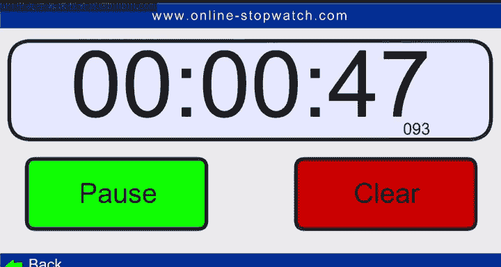

# 15：数据科学原理 - 考试指南 📝

在本节课中，我们将学习如何为数据科学考试做准备，并了解考试过程中的关键步骤和注意事项。我们将从考试前的准备开始，逐步介绍考试当天的具体流程。

---

## 概述

考试是检验学习成果的重要环节。一个有序的考试环境有助于每位考生发挥出最佳水平。本节将指导你如何开始考试，并确保整个过程顺利进行。

## 考试开始前的准备

上一节我们概述了考试的重要性，本节中我们来看看考试开始前需要完成的具体步骤。

考试开始时，监考人员会发出明确指令。你需要按照以下步骤操作，以确保考试顺利进行。

以下是考试开始时的关键步骤列表：

1.  打开你的试卷。
2.  撕下试卷的最后一页。
3.  将最后一页从试卷上分离。
4.  首先阅读这一页的内容。
5.  阅读完毕后，即可开始答题。

## 考试环境与纪律

在了解了开始步骤后，维持良好的考试环境同样至关重要。

由于人员离场可能造成混乱，因此在最后10分钟请所有考生留在座位上。此外，请确保关闭手机或将手机调至静音模式，以免打扰他人。

## 总结

本节课中我们一起学习了数据科学考试的启动流程和考场纪律。关键点包括：按时开始、遵循拆封和阅读说明的步骤、以及维护安静的考试环境。记住，充分的准备和遵守规则是成功完成考试的基础。