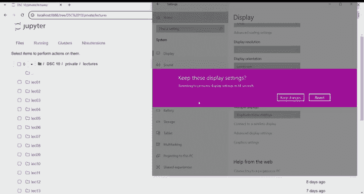
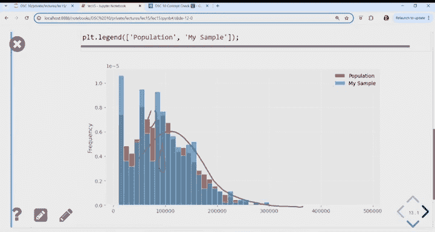

# 16：统计推断与自助法 (Bootstrapping) 📊



在本节课中，我们将学习统计推断的核心概念，特别是如何使用**自助法**来估计总体参数，并构建**置信区间**来量化估计的不确定性。我们将通过一个关于圣地亚哥市员工薪资的真实数据集来演示这些概念。

---

## 🏙️ 数据集介绍

我们今天将使用一个新的数据集：**圣地亚哥市员工薪资**。这是每年公开的完整人口数据，包含了为圣地亚哥市工作的每一位员工的信息。

这是2023年的最新数据。数据框预览显示有近14,000名员工和29列数据。由于列数太多，无法全部显示，我们可以使用 `.columns` 属性来查看所有列名。

```python
# 查看数据框的所有列名
df.columns
```

我们只关心其中的一列：`total_wages`（总薪资）。因此，我们创建一个只包含该列的小型数据框。

数据按降序排列。最高收入者年薪约为433,000美元，同时也有一些非常小的数字（例如2美元），这些可能不是全职员工。

通过查看总薪资的分布，我们可以了解典型的薪资水平。分布图显示有一个很高的第一个条形（代表极低薪资），其余数据大致呈峰值在略低于100,000美元，然后逐渐下降的形状。这被称为**长右尾**，在收入分布中很常见，因为薪资可以非常高但越来越罕见，而左侧受限于零（薪资不能为负）。

---

## 🎯 总体参数与样本统计量

我们首先查看**总体中位数薪资**，它可以代表员工的典型薪资。计算总薪资列的中位数：

```python
population_median = df['total_wages'].median()
```

结果是 **80,492美元**。这是一个**总体参数**，因为它描述了整个总体的单一数值。

然而，在现实中，我们通常无法获得整个总体的数据。这时，我们会采取**抽样**的方法。我们将总体视为完整的薪资数据框。当我们只抽取500人的薪资时，就得到了一个**样本**。

我们感兴趣的总体参数是**总体中位数**。由于无法直接计算，我们使用**样本中位数**作为替代，这是一个**统计量**（从样本中计算出的单一数值）。我们希望样本中位数与总体中位数相近。

让我们看看样本中位数的结果。我们使用 `.sample` 方法进行简单随机抽样（无放回抽样）。为了确保结果可重现，我们设置了随机种子。

```python
my_sample = df.sample(500, random_state=123)
sample_median = my_sample['total_wages'].median()
```

样本中位数是 **82,508美元**，比总体中位数（80,492美元）高出约2,000美元。这种差异源于我们随机抽到的特定样本。

---

## ❓ 核心问题：估计的可靠性

我们得到了一个估计值（82,508美元），但这个估计值依赖于我们抽到的随机样本。如果抽到不同的样本，估计值会如何变化？我们对这个单一估计值的信心，取决于这个问题的答案。

如果不同的500人组的中位数薪资差异很大，那么我们对任何一组样本的估计都不会有太大信心。反之，如果所有组的中位数都非常接近，那么任何一组样本的估计都相当可靠。

为了回答这个问题，我们需要理解**样本中位数的分布**。如果这个分布的直方图很窄，意味着不同的样本中位数都大致相同，我们对估计就更有信心。如果直方图很宽，意味着不同的估计值可能差异很大，我们对单一估计的信心就会降低。

---

## 🔄 理解样本中位数分布的第一种方法（不切实际）

第一种方法是直接查看其他样本的中位数。这需要我们从总体中抽取大量样本。虽然不切实际，但可以演示概念。

我们进行一个模拟：从总体中抽取1,000个样本（每个样本500人），计算每个样本的中位数，并查看这些中位数的分布。

```python
sample_medians = np.array([])
for i in np.arange(1000):
    # 从总体中抽取一个样本
    one_sample = df.sample(500)
    # 计算该样本的中位数
    median = one_sample['total_wages'].median()
    # 将中位数存入数组
    sample_medians = np.append(sample_medians, median)
```

这个直方图显示了样本中位数的**经验分布**。它告诉我们，当你抽取一个500人的样本并用其薪资中位数估计总体中位数时，你可能会偏差大约10,000美元（基于直方图的宽度）。

然而，这种方法的问题在于，在现实中我们无法反复从总体中抽样。如果我们能轻易获得总体数据，就直接计算总体参数了，无需抽样。

---

## 🚀 自助法：一个实用的解决方案

我们需要一个更实用的解决方案，能在不返回总体抽取新样本的情况下，获得类似的分布。关键思路在于：**利用我们已有的样本**。

比较总体分布（红色，14,000名员工）和我们抽取的样本分布（蓝色，500名员工）。虽然条形高度有差异，但蓝色样本的分布形状与红色总体大致相似。

既然样本分布与总体分布相似，我们可以用**样本分布来近似替代总体分布**。这就是**自助法**背后的核心思想。

自助法是一种捷径，它允许我们理解像样本中位数这样的统计量在不同样本中可能的表现，而无需返回总体抽取更多样本。这个捷径就是：**从样本本身中进行重抽样**。

过程如下：
1.  你获得一个初始样本（例如我们的500人，称为 `my_sample`）。
2.  你想知道其他样本的中位数会如何。
3.  你无法返回总体获取新样本，但你可以从你的初始样本中进行**重抽样**（即，从样本中抽样）。
4.  你从初始样本中抽取许多重抽样样本，并计算每个重抽样样本的中位数。
5.  这些重抽样中位数的分布，近似于从总体中抽取新样本得到的中位数分布。

之所以可行，是因为我们的初始样本看起来很像总体。这个过程被称为“自助法”，源于“靠自己的力量振作起来”这个古老说法，意指非常谨慎地利用所有资源。

---

## 🔁 重抽样：有放回 vs 无放回

每次抽样时，我们都要问：是**有放回**还是**无放回**？在我们的情境中，我们总是讨论固定大小的样本组（500人），以进行公平比较。

为了理解重抽样时是否需要放回，我们看一个简单例子。假设初始样本只有三个薪资：$7, $9, $4。

*   **无放回重抽样**：从{7, 9, 4}中抽取3个，不允许重复。你只会得到这三个数字的不同排列，例如[9,7,4]。每个重抽样的中位数总是相同的（排序后的中间数）。这意味着所有重抽样本质上都是同一个样本，没有提供新信息。
*   **有放回重抽样**：从{7, 9, 4}中抽取3个，允许重复。你可能得到[7,7,4]或[9,4,9]等。这些重抽样的中位数会有所不同（例如[7,7,4]的中位数是7）。

我们的目标是模拟从总体中抽取的**不同**样本组。无放回重抽样得到的样本都太相似，无法反映这种差异性。因此，我们必须使用**有放回重抽样**。这样，重抽样样本才能与原始样本略有不同（有些人被重复，有些人被省略），从而产生统计量（如中位数）的多样性。

---

## 💻 自助法代码实现

现在，我们来看完整的自助法代码。我们通过从初始样本 `my_sample` 中进行有放回重抽样，来模拟收集新样本的过程。

```python
# 设置随机种子以保证结果可重现
np.random.seed(123)

# 创建一个数组来存储每个重抽样样本的中位数
boot_medians = np.array([])

# 进行5000次重抽样
for i in np.arange(5000):
    # 从初始样本中抽取500个（有放回）
    resample = my_sample.sample(500, replace=True)
    # 计算该重抽样样本的中位数
    median = resample['total_wages'].median()
    # 将中位数存入数组
    boot_medians = np.append(boot_medians, median)
```

这段代码与之前不切实际方法的唯一区别在于抽样来源：之前是从总体 `df.sample(500)` 中抽样，现在是从初始样本 `my_sample.sample(500, replace=True)` 中抽样。其余部分（计算中位数并存储）完全相同。

通过这种方式，我们仅利用最初的一组500人数据，就得到了大量（5000个）可能的中位数估计值，从而“榨取”出尽可能多的信息。

---

## 📈 自助分布与点估计

让我们查看这个自助法生成的样本中位数分布。这个分布与我们直接从总体抽样得到的分布并不完全相同，但它仍然让我们对样本中位数可能的变化范围有了大致了解。

在这个分布图中，蓝色的点代表**总体中位数**（80,492美元），即我们试图估计的“正确答案”。

自助法的目的是从你初始样本的中位数（例如82,508美元）出发，去估计这个总体参数。仅凭一个样本，你只能给出一个点估计（“我认为总体中位数大约是82,500美元”），但无法说明这个估计有多接近真实值。

而通过自助法，你得到了一个完整的分布。这个分布显示，你的估计可能偏差高达10,000美元。因此，你可以做出更有信息的陈述，例如：“我认为总体中位数可能在70,000美元到88,000美元之间”，因为大部分数据落在这个范围内。

---

## 📊 百分位数

在构建区间之前，我们需要理解**百分位数**的概念。百分位数常用于描述数据位置。

*   **非正式定义**：对于数值数据集，第p百分位数是一个值，使得大约p%的数据小于或等于这个值。
*   **例子**：SAT考试的75百分位数是1400分，意味着75%的考生分数低于1400分，25%的考生分数高于1400分。

NumPy提供了计算百分位数的函数 `np.percentile`。

```python
data = np.array([3, 1, 6, 8, 4])
fiftieth_percentile = np.percentile(data, 50) # 计算第50百分位数（即中位数）
```

第50百分位数（中位数）是数据排序后处于中间位置的值。对于数组 `[1, 3, 4, 6, 8]`，中位数是4。

---

## 🎯 构建置信区间

我们使用自助法创建了样本中位数的分布。为了量化估计的不确定性，我们想要给出一个**区间**，一个我们认为参数（总体中位数）可能落入的数值范围。

这个区间被称为**置信区间**。我们特别构建一个**95%置信区间**，它旨在捕获自助法直方图中95%的数据面积。

我们的目标是找到两个点 `x` 和 `y`，使得：
*   直方图中 `x` 左侧的面积约为2.5%。
*   直方图中 `y` 右侧的面积约为2.5%。
*   这样，`x` 和 `y` 之间的面积就是中间的95%。

用百分位数表示：
*   `x` 是**第2.5百分位数**（2.5%的数据小于它）。
*   `y` 是**第97.5百分位数**（97.5%的数据小于它，即2.5%的数据大于它）。

我们使用NumPy的 `percentile` 函数来计算这些端点：

```python
left_endpoint = np.percentile(boot_medians, 2.5)
right_endpoint = np.percentile(boot_medians, 97.5)
confidence_interval_95 = (left_endpoint, right_endpoint)
```

这样得到的区间 `(left_endpoint, right_endpoint)` 就是我们对总体中位数的95%置信区间估计。它表示，基于我们的自助分布，我们有95%的信心认为总体中位数落在这个区间内。

---

## 🤔 置信区间的解释与局限性

将这个置信区间（例如70,000美元到86,000美元）画在自助分布直方图上，它会覆盖中间95%的区域。

蓝色的点（总体中位数）落在这个区间内吗？在这个演示中，因为我们知道总体答案，可以看到它确实落在区间内。然而，在现实中，你**永远无法确切知道**你的置信区间是否包含了真实的总体参数。这是统计推断中一个令人不安但必须接受的事实。

我们提供的是一个**估计过程**。我们将在后续课程中讨论如何从理论上保证这个过程在长期是有效的。但对于任何一次具体的估计，它可能成功也可能失败。

失败的主要原因在于你的**初始样本可能不具有代表性**。即使是大样本，也可能由于随机巧合而无法反映总体。自助法尤其容易受此影响，因为它严重依赖于初始样本的质量。如果初始样本有偏差，那么基于它的所有重抽样和结论都会有偏差。

---

## 🔧 调整置信水平

我们构建的是95%置信区间。如果我们想要一个**80%置信区间**呢？

80%置信区间意味着我们只想保留中间80%的数据，需要从两侧各截去10%的数据。

因此，代码需要修改端点百分位数：
*   左端点：第10百分位数 (`np.percentile(boot_medians, 10)`)
*   右端点：第90百分位数 (`np.percentile(boot_medians, 90)`)

与95%置信区间相比，80%置信区间会更**窄**（例如从75,000美元到85,000美元）。这体现了**置信水平**与**区间精度**之间的权衡：
*   **更高的置信水平（如95%）**：区间更宽，你更有可能捕获真实参数，但陈述的精确性较低。
*   **更低的置信水平（如80%）**：区间更窄，你的估计更精确，但捕获真实参数的信心（概率）更低。

“置信”这个词很贴切：你对一个更精确（更窄）的猜测信心较低，而对一个更保守（更宽）的猜测信心较高。

---

## 📝 本节课总结

在本节课中，我们一起学习了：

1.  **核心问题**：如何评估基于单一样本的参数估计的可靠性。
2.  **自助法原理**：通过从已有样本中进行有放回重抽样，来模拟从总体中多次抽样的过程，从而近似统计量的抽样分布。
3.  **置信区间构建**：利用自助法得到的分布和百分位数的概念，构建特定置信水平（如95%）的区间估计，以量化估计的不确定性。
4.  **关键权衡**：置信区间的宽度（精度）与置信水平（可靠性）之间存在权衡关系。




自助法是一个强大的工具，它允许我们仅利用单一样本数据就对估计的变异性做出推断。然而，它的有效性依赖于初始样本的质量，因此获取一个具有代表性的大样本至关重要。