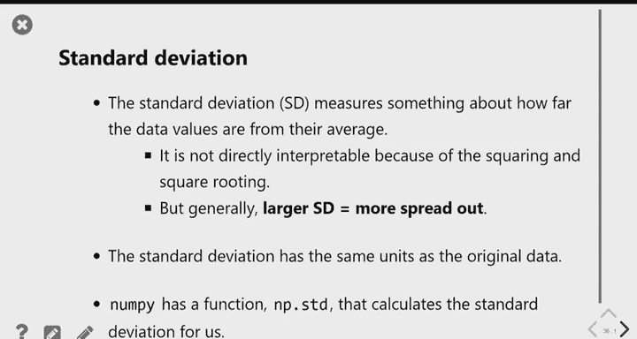

# 17：置信区间解读与中心/离散度测量 📊


在本节课中，我们将学习如何解读通过自助法（Bootstrapping）创建的置信区间，理解这种方法的适用场景与局限性。随后，我们将介绍衡量数据分布的两个关键概念：中心趋势（如均值和中位数）和离散度（如标准差）。

---

## 置信区间的解读

上一节我们介绍了如何使用自助法创建置信区间来估计总体参数（如中位数）。本节中，我们来看看如何正确解读这些区间，并理解“95%置信度”的确切含义。

我们通过以下三步流程创建了一个置信区间：
1.  从总体中获取一个样本。
2.  对该样本进行自助重采样，生成大量重采样样本。
3.  基于这些重采样样本的统计量（如中位数）分布，取中间95%的范围作为置信区间。

我们得到的区间（例如70,000到86,000美元）包含了自助重采样中位数的中间95%。由于样本统计量应该与总体参数相似，我们相当确信真实的总体中位数也会落在这个区间内。

以下是关于置信区间含义的关键点：

*   **置信度在于过程，而非单个区间**： “95%置信度”意味着，如果我们能多次重复上述三步流程（获取新样本、自助法、构建区间），那么大约有95%这样构建出来的区间会包含真实的总体参数。
*   **任何单个区间都可能出错**： 我们无法保证基于手头这一个样本构建的特定区间一定包含真值。它可能属于那“幸运”的95%，也可能属于“不幸”的5%。我们无法知晓。
*   **类比说明**： 想象蒙眼玩套圈游戏。柱子（真实参数）是固定的。每次扔出的圈（基于一个样本构建的区间）可能套中，也可能套不中。95%置信度意味着，如果你以这种方式扔很多次圈，大约有95%的圈会套中柱子。但这不保证你下一次扔出的特定圈一定能套中。

为了直观展示，我们模拟了200次从总体中抽样并构建置信区间的过程。结果显示，大约97%（本例中略高于95%）的区间包含了真实的总体中位数（蓝色竖线）。这验证了该流程的可靠性。


---

## 自助法的适用性与局限性

自助法功能强大且实用，因为它仅需一个样本就能模拟统计量的可能分布。然而，它并非万能，存在一些局限性。

以下是自助法的主要局限性：

1.  **不适用于敏感统计量**： 对于最大值、最小值这类对样本构成极其敏感的统计量，自助法效果很差。因为重采样不会引入原始样本之外的数据，导致自助分布严重低估或高估总体中的极端值。
    *   **示例**： 尝试用自助法估计城市员工的最高薪水。由于原始样本的最高薪水可能远低于总体最高薪水，导致所有重采样样本的最高薪水都受限于此，最终置信区间会严重偏离真实值。
    *   **代码示例**： 若将计算中位数的代码改为计算最大值，会得到误导性的结果。
        ```python
        # 错误示例：对最大值使用自助法
        boot_max = np.array([])
        for i in np.arange(5000):
            resample = original_sample.sample(500, replace=True)
            resample_max = resample.get('Salary').max()
            boot_max = np.append(boot_max, resample_max)
        ```
2.  **依赖于原始样本的质量**： 自助法假设原始样本是总体的良好近似。如果原始样本存在偏差（例如，采用方便抽样而非随机抽样），那么自助法只会放大这种偏差，导致构建的区间也不准确。因此，确保采用良好的抽样方法至关重要。

---

## 中心趋势的度量：均值与中位数

现在，我们切换话题，讨论如何描述数据分布的特征。首先来看中心趋势的度量，即“典型值”是什么。我们已经熟悉了均值（Mean）和中位数（Median）。

*   **中位数**： 将数据排序后位于正中间的值。在直方图上，中位数是使左右两侧面积各占50%的那个点。
*   **均值**： 所有数据的平均值。在直方图上，均值是分布的“平衡点”。

理解均值与中位数在对称和偏态分布中的关系非常重要：

*   **在对称分布中**： 均值与中位数相等。
*   **在右偏分布（长尾在右）中**： 均值 > 中位数。右侧的极端值会拉高均值。
*   **在左偏分布（长尾在左）中**： 均值 < 中位数。左侧的极端值会拉低均值。

**示例**： 航班延误时间通常是右偏分布。大多数航班准点或稍有延误（数据集中在左侧），但少数航班延误非常久（长尾在右侧）。这使得均值（受极端值影响大）通常大于中位数（对极端值不敏感）。

---

## 离散度的度量：标准差

除了中心，我们还需要度量数据的离散或分散程度。一个简单的方法是使用全距（最大值减最小值），但它只关注两个极端值，无法描述大部分数据的分布情况。

**标准差（Standard Deviation）** 解决了这个问题，它衡量的是数据点相对于均值的“典型”距离。计算步骤如下：

1.  计算数据集的均值。
2.  计算每个数据点与均值的差，称为“偏差”（Deviation）。
3.  由于偏差有正有负，直接求平均会相互抵消为0。因此，我们将每个偏差**平方**以消除负号。
4.  计算这些平方偏差的平均值，得到**方差（Variance）**。
5.  对方差取**平方根**，将其单位还原到与原始数据相同，这个结果就是**标准差**。

**公式表示**：
对于一个数据集 \( x_1, x_2, ..., x_n \)，其均值 \( \mu \) 和标准差 \( \sigma \) 的计算如下：
\[
\mu = \frac{1}{n} \sum_{i=1}^{n} x_i
\]
\[
\sigma = \sqrt{\frac{1}{n} \sum_{i=1}^{n} (x_i - \mu)^2}
\]

标准差越大，表示数据点越分散；标准差越小，表示数据点越集中在均值附近。

---

## 总结

本节课中我们一起学习了：
1.  **置信区间的正确解读**： 95%置信度描述的是重复抽样和构建区间这一过程的长期成功率，而非特定区间包含真值的概率。
2.  **自助法的局限性**： 自助法不适用于估计最大值、最小值等敏感统计量，且其效果严重依赖于原始样本的代表性。
3.  **中心趋势的度量**： 比较了均值和中位数，理解了在偏态分布中均值会偏向长尾方向。
4.  **离散度的度量**： 引入了标准差的概念，了解了它作为衡量数据点相对于均值典型距离的用途。

这些概念为我们后续学习数据分布的形状（如正态分布）以及更深入的统计推断打下了基础。

---




