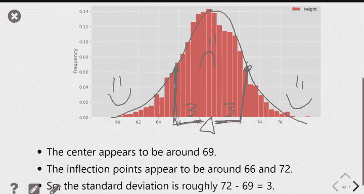

# 18：切比雪夫不等式与正态分布 📊

在本节课中，我们将学习一个重要的不等式——切比雪夫不等式，并深入了解一种在自然界和数据科学中极为常见的分布形态：正态分布。

---

## 📈 回顾：方差与标准差

上一节我们介绍了方差和标准差的概念。它们用于衡量数据集的离散程度。

对于一个数据集，我们首先计算每个数据点与均值（平均值）的差值，这称为“偏差”。偏差有正有负，直接求平均会相互抵消。因此，我们先将所有偏差平方，再求平均值，这个结果就是**方差**。

**方差公式**：
`方差 = (所有偏差的平方和) / (数据点数量)`

方差衡量了数据的离散程度，但其单位是原始单位的平方。为了得到一个与原始数据单位相同的度量，我们对方差取平方根，得到**标准差**。

**标准差公式**：
`标准差 = sqrt(方差)`

标准差越大，意味着数据越分散。我们可以使用Python的NumPy库轻松计算标准差：

```python
import numpy as np
data = [2, 3, 3, 9]
std_dev = np.std(data)  # 计算标准差
```

---

## 🎯 切比雪夫不等式

我们定义了标准差这个数字，它的意义何在？其中一个关键作用是，它可以告诉我们，需要从数据中心（均值）向外移动多远，才能“捕获”大部分数据。

无论数据分布的形状如何（直方图是何种奇怪形状），均值是它的平衡点。标准差就像一个合理的“跳跃”距离，你只需要向外跳跃几次（几个标准差），就能收集到大部分数据。

例如，比较期中考试成绩和薪水。考试成绩的标准差可能在5到10分之间，而薪水的标准差可能高达10000美元。这是因为数据本身所处的尺度不同。

我们可以将上述直觉表述得更精确，这就是**切比雪夫不等式**。

**切比雪夫不等式**：
在任何数值分布中，落在区间 `[均值 - z * 标准差， 均值 + z * 标准差]` 内的数据比例**至少**为 `1 - 1/z²`，其中 `z` 是任意大于1的数。

这个不等式给出了一个保证的下限。例如：
*   当 `z = 2` 时，至少有 `1 - 1/4 = 75%` 的数据落在均值±2个标准差的范围内。
*   当 `z = 3` 时，至少有 `1 - 1/9 ≈ 88.9%` 的数据落在均值±3个标准差的范围内。
*   当 `z = 5` 时，至少有 `1 - 1/25 = 96%` 的数据。

注意，`z=1` 时不等式成立但无意义（下限为0），因此通常使用 `z >= 2`。这个不等式非常通用，适用于**任何形状**的分布。

---

### ✈️ 实例：航班延误数据

让我们在航班延误数据上应用切比雪夫不等式。该数据集的平均延误时间约为16分钟。

我们首先计算延误时间的标准差：

```python
std_delay = np.std(flight_data[‘delay’]) # 结果约为40分钟
```

根据切比雪夫不等式：
*   至少有75%的航班延误落在 `[16 - 2*40, 16 + 2*40]`，即 `[-64, 96]` 分钟区间内。
*   至少有88.9%的航班延误落在 `[16 - 3*40, 16 + 3*40]`，即 `[-104, 136]` 分钟区间内。

我们可以通过查询实际数据来验证：

```python
# 计算落在红色条（±2个标准差）内的航班比例
within_two_std = flight_data.query(‘delay >= @(mean_delay - 2*std_delay) and delay <= @(mean_delay + 2*std_delay)’)
proportion = within_two_std.shape[0] / flight_data.shape[0] # 实际比例约为95.6%
```

实际比例（95.6%）高于切比雪夫不等式保证的下限（75%），这完全符合预期，因为不等式给出的是最坏情况下的保证。如果我们对数据的分布形状有更多了解，就可以做出更精确的断言。接下来，我们就来看一种特殊的分布。

---

## 🔔 正态分布

现在让我们转向一种新的数据集：5000名成年男性的身高和体重。分别绘制它们的直方图，会发现一个有趣的现象：两者具有**相似的形状**——都是中间高、两边低，呈单峰对称的“钟形”曲线。

尽管形状相似，但两个分布并不相同：
*   **中心位置不同**：身高的均值约69英寸，体重的均值约187磅。
*   **离散程度不同**：身高的数据更集中，体重的数据更分散。

这种形状的分布被称为**正态分布**或**高斯分布**，其曲线被称为**钟形曲线**。自然界中许多现象（如身高、体重、睡眠时间）都近似服从正态分布。

正态分布由一个**均值**和一个**标准差**唯一确定。均值决定中心位置，标准差决定曲线的“胖瘦”或分散程度。因此，存在无数种不同的正态分布。

---

## 📏 标准化

虽然身高和体重的原始分布不同，但它们的形状相同。我们可以通过一种称为**标准化**的转换，将它们调整到同一个尺度和中心上。

标准化的过程如下：对于数据中的每一个原始值 `x_i`，我们减去整个数据集的均值 `μ`，再除以标准差 `σ`。

**标准化公式**：
`标准单位值 = (x_i - μ) / σ`

这个计算结果的解释是：
*   `(x_i - μ)`：该值高于（或低于，如果为负）均值的原始单位数。
*   除以 `σ`：将单位从“原始单位”转换为“标准差个数”。结果是一个**无量纲**的数字，表示该值高于均值多少个标准差。

例如，某人体重225磅。已知平均体重 `μ = 187` 磅，标准差 `σ ≈ 19` 磅。
1.  计算高于均值的磅数：`225 - 187 = 38` 磅。
2.  转换为标准差个数：`38 / 19 = 2`。
这意味着此人的体重比平均体重高**2个标准差**。

对整个数据集的列进行标准化后，新数据具有两个重要性质：
1.  **均值为0**：因为我们减去了原始均值。
2.  **标准差为1**：因为我们除以了原始标准差。

如果我们分别绘制标准化后的身高和体重分布，会发现它们几乎完全重合！这是因为标准化过程消除了原始数据在中心和尺度上的差异，只保留了共同的“形状”。这个均值为0、标准差为1的特殊正态分布，称为**标准正态分布**。

---

## 📊 标准正态分布与面积计算

标准正态分布是一条完美的、光滑的钟形曲线。与直方图类似，曲线下的总面积等于1。曲线在任意两点之间的面积，代表了数据落在该区间的比例。

那么，如何计算这条光滑曲线下的面积呢？这通常需要微积分，但我们有一个更简单的方法：使用Python函数 `scipy.stats.norm.cdf()`。`CDF` 是“累积分布函数”的缩写，对于标准正态分布，`norm.cdf(z)` 给出了曲线下在 `z` 点**左侧**的面积（比例）。

**核心函数**：
```python
from scipy.stats import norm
area_left = norm.cdf(z)  # 计算标准正态曲线下，z点左侧的面积
```

利用这个函数和一些技巧，我们可以计算各种面积：
*   **右侧面积**：`1 - norm.cdf(z)`。
*   **区间面积**：`norm.cdf(b) - norm.cdf(a)`，即 `[a, b]` 区间内的面积。
*   **利用对称性**：标准正态分布关于0对称。因此，`norm.cdf(-z)` 等于 `z` 点右侧的面积。

---

### 🔄 应用：估计比例

假设我们想知道体重在200磅到225磅之间的男性比例。我们已知体重近似正态分布，均值 `μ = 187`，标准差 `σ = 19`。

解决步骤：
1.  **标准化**：将边界值转换为标准单位。
    *   `200` 磅转换为：`(200 - 187) / 19 ≈ 0.68`
    *   `225` 磅转换为：`(225 - 187) / 19 ≈ 2.00`
2.  **问题转化**：原问题等价于求标准正态分布在区间 `[0.68, 2.00]` 下的面积。
3.  **面积计算**：
    ```python
    area_between = norm.cdf(2.00) - norm.cdf(0.68) # 结果约为23%
    ```

因此，我们估计大约有23%的男性体重处于200-225磅之间。通过查询原始数据计算的实际比例与此非常接近，这验证了体重分布非常近似于正态分布。

**重要提示**：标准化本身**不会**将一个分布变成正态分布。它只是进行平移和缩放。上述方法仅在原始数据**本身近似正态分布**时才有效。

---

## ⚖️ 正态分布与切比雪夫不等式

现在我们可以联系起本节课开头的两个主题。切比雪夫不等式对任何分布都给出了一个保守的（较低的）比例下限。但对于正态分布这种特定形状，我们可以得到更精确、更高的比例。

以下是两者的对比：

| 标准差倍数 (z) | 切比雪夫不等式 (至少) | 正态分布 (约) |
| :------------: | :-------------------: | :-----------: |
|       1        |          0%           |     68%       |
|       2        |         75%           |     95%       |
|       3        |        88.9%          |     99.7%     |

对于正态分布，大约有68%的数据落在均值±1个标准差内，95%落在均值±2个标准差内，99.7%落在均值±3个标准差内。这些精确的比例来自于标准正态分布CDF的计算。正态分布的数据更集中于中心，因此当偏离同样距离时，能捕获的数据比例远高于切比雪夫不等式给出的通用下限。

---

## 📍 拐点

最后介绍一个有助于直观理解标准差的概念：**拐点**。拐点是曲线改变弯曲方向的点（例如从“微笑”的凸形变为“皱眉”的凹形）。

对于标准正态分布，其拐点恰好位于 `z = ±1` 的位置。这意味着，对于任何正态分布曲线，其拐点总是位于**均值 ± 1个标准差**处。

这个性质可以帮助我们目测标准差。例如，在身高分布图中，均值约69英寸，目测拐点大约在66英寸和72英寸，两者与均值相差约3英寸，这提示我们身高的标准差大约就是3英寸。

---

## 📝 总结

本节课我们一起学习了两个核心内容：
1.  **切比雪夫不等式**：一个强大的通用工具，它告诉我们，对于**任何**分布，只需从均值向外移动几个标准差，就一定能捕获大部分数据（有明确的比例下限保证）。
2.  **正态分布**：一种在自然界中常见的钟形分布。我们学习了如何通过**标准化**将任何正态分布转化为**标准正态分布**（均值为0，标准差为1）。利用标准正态分布的**累积分布函数**，我们可以计算数据落在任意区间的比例。与切比雪夫不等式的通用下限相比，正态分布允许我们做出更精确的比例估计。




理解这些概念，将为我们后续学习统计推断（如置信区间）打下坚实的基础。