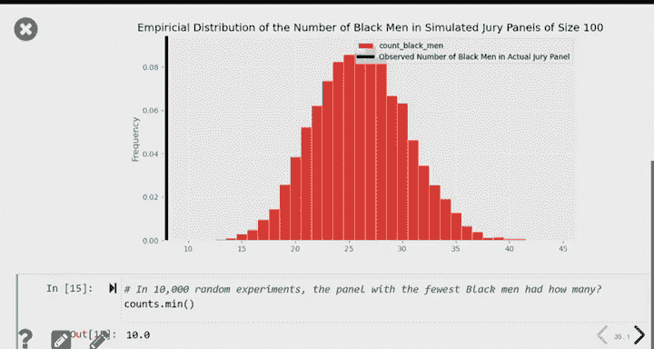

# 20：中心极限定理、样本量选择与统计模型入门 📊

在本节课中，我们将要学习中心极限定理（CLT）的实际应用，特别是如何利用它来确定满足特定精度要求的样本量。随后，我们将引入“统计模型”的概念，学习如何通过数据来检验一个假设或模型是否合理。

---

## 🔍 中心极限定理回顾

上一节我们介绍了中心极限定理的基本思想。本节中，我们来看看如何将其与样本量选择联系起来。

中心极限定理描述了从总体中抽取样本时，样本均值的分布规律。具体来说：
*   我们有一个总体（分布A）。
*   从中抽取一个样本（分布B）。
*   如果我们抽取**许多**样本，并计算每个样本的均值，这些样本均值会形成一个**新的分布**（分布C）。

中心极限定理指出，无论原始总体是什么形状，只要样本量足够大，这个样本均值的分布（分布C）就会近似于**正态分布（钟形曲线）**。

关于这三个分布，我们知道：
*   **中心位置**：分布A（总体）、分布B（样本）和分布C（样本均值分布）的均值大致相同。
*   **离散程度**：分布A和B的离散程度（标准差）相似。但分布C的离散程度要小得多。
*   **计算公式**：分布C的标准差等于分布A的标准差除以样本量的平方根。公式表示为：
    `SD(分布C) = SD(总体) / sqrt(样本量)`
    实践中，我们不知道总体的标准差，因此用样本的标准差来近似。

中心极限定理为我们提供了一种理解样本均值分布的捷径，无需进行大量的自助法（Bootstrap）重采样计算。

---

## 🎯 利用CLT选择样本量

现在，我们来看看如何利用中心极限定理来解决一个实际问题：为了达到特定的估计精度，我们需要多大的样本量？

### 问题场景

假设我们想估计UCSD学生中使用语言学习App“Duolingo”的比例（一个总体参数）。我们计划随机调查一部分学生（是/否问题），并希望构建一个95%置信区间。我们要求这个置信区间的**宽度不超过0.06**。

这意味着，如果我们最终估计比例在21%到27%之间（宽度0.06），这个精度是可以接受的。但如果区间是21%到28%（宽度0.07），则被认为信息不够精确。

### 从置信区间宽度出发

根据中心极限定理，一个95%置信区间的构造公式为：
`样本均值 ± 2 * (样本标准差 / sqrt(样本量))`

因此，置信区间的总宽度为：
`宽度 = 4 * (样本标准差 / sqrt(样本量))`

我们希望这个宽度 ≤ 0.06，即：
`4 * (样本标准差 / sqrt(样本量)) ≤ 0.06`

### 解决“先有鸡还是先有蛋”的困境

我们需要解出“样本量”，但公式中的“样本标准差”在真正抽取样本之前是未知的。为了解决这个问题，我们考虑样本标准差所有可能取值中的**最大值**。使用最大值是保守的做法，能确保计算出的样本量一定足够大。

我们的数据是0（不使用）和1（使用）的集合。对于这种0/1数据，其标准差有一个确定的上限。

以下是0/1数据标准差的计算公式及其特性：
*   **公式**：对于一组0和1的数据，其标准差 = `sqrt(比例_0 * 比例_1)`。
*   **特性**：当数据中0和1各占一半（比例均为0.5）时，标准差达到最大值0.5。如果数据全为0或全为1，则标准差为0。

因此，在调查之前，我们可以保守地使用**0.5**作为样本标准差的最大可能值。

### 计算所需样本量

将样本标准差的最大值0.5代入不等式：
`4 * (0.5 / sqrt(样本量)) ≤ 0.06`

解这个不等式：
1.  两边乘以 `sqrt(样本量)`：`4 * 0.5 ≤ 0.06 * sqrt(样本量)`
2.  两边除以0.06：`(4 * 0.5) / 0.06 ≤ sqrt(样本量)`
3.  计算左边：`2.0 / 0.06 ≈ 33.33`
4.  两边平方：`样本量 ≥ (33.33)^2 ≈ 1111.11`

由于样本量必须是整数，我们需要向上取整。因此，**最小的所需样本量是1112**。

这意味着，为了有95%的信心使我们的估计区间宽度不超过0.06，我们需要至少调查1112人。

### 理解公式中的数字

*   **4**：源于构建95%置信区间时，需要在均值两侧各延伸约2个标准误。
*   **0.5**：0/1数据标准差的最大可能值。
*   **0.06**：我们期望的置信区间最大宽度。
*   **平方**：源于中心极限定理公式中的平方根，解方程时需要进行平方运算。

如果需要更高的精度（例如，宽度要求更小），所需的样本量会急剧增加。例如，如果要求宽度为0.03（精度提高一倍），根据公式计算，所需样本量将是原来的4倍，即至少需要4445人。这体现了提高估计精度需要付出巨大的数据收集成本。

---

## 🤔 引入统计模型：提出“是/否”问题

到目前为止，我们专注于**参数估计**（如使用自助法或CLT构建置信区间）。现在，我们将转向另一类统计推断问题：回答关于样本与总体之间关系的**“是/否”问题**。

以下是两个我们将要研究的例子：
1.  某个陪审团名单是否是从符合条件的陪审员总体中随机抽取的？
2.  一系列硬币抛掷结果是否看起来来自一枚公平的硬币？

这些问题都属于统计推断，因为它们都使用样本数据来对总体或数据生成过程进行推断。

### 什么是统计模型？

一个**统计模型**是一套关于数据来源的假设。
*   例如，对于一枚在地上捡到的硬币，我们的模型（假设）是“这是一枚公平的硬币”。
*   正如一句名言所说：“所有的模型都是错的，但有些是有用的。”模型是对现实世界的简化，一个好的近似模型非常有价值。

我们的新任务是**评估一个模型**。我们有一些先验的假设（模型），然后通过收集数据来检验这些假设是否与事实相符。
*   如果数据与模型假设高度一致，我们可能维持原假设。
*   如果数据与模型假设严重矛盾，我们就需要拒绝原假设，因为数据代表现实。

伽利略挑战“重物下落更快”的旧观念就是一个经典例子。他通过实验（数据）证明了旧模型（假设）是错误的。

---

## ⚖️ 案例研究：Swain诉阿拉巴马州案（1965年）

让我们通过一个真实的法律案例来实践模型评估。

### 背景
罗伯特·斯温（Robert Swain）是一名黑人男性，在1965年被判有罪。他上诉至最高法院，理由是所在县系统性地将黑人排除在陪审团名单之外，导致陪审团不能代表社区人口构成。

### 陪审团筛选过程
1.  **合格总体**：有资格担任陪审员的人群（当时主要是21岁以上的男性公民）。
2.  **陪审团名单**：从合格总体中**随机抽取**的人员，被传唤参加陪审团选拔。
3.  **最终陪审团**：从名单中经过询问等（非完全随机）过程选出的人员。

斯温案的关键在于第一步。在他所在的县，**合格总体中约有26%是黑人**。如果随机抽取，陪审团名单中也应有约26%的黑人。

### 数据与模型
*   **观察到的数据**：斯温的陪审团名单上有100名男性，其中只有**8名黑人（8%）**。
*   **我们的模型（假设）**：陪审团名单是从一个26%为黑人的总体中随机抽取的。

**核心问题**：我们观察到的数据（8/100）是否与我们的模型相符？或者说，在模型成立的假设下，观察到如此少黑人的情况是常见的还是极不寻常的？

### 通过模拟进行评估
我们的方法是**模拟**。我们假设模型成立（即随机抽取），然后重复模拟抽取100人陪审团名单的过程成千上万次，每次记录抽到的黑人数。

以下是使用Python进行单次模拟的核心代码：
```python
# 假设总体中黑人的比例是0.26
# 使用多项分布模拟抽取100人
demographics = [0.26, 0.74] # [黑人比例， 非黑人比例]
结果 = np.random.multinomial(100, demographics)
黑人数量 = 结果[0]
```

我们重复此过程多次（例如10,000次），并统计所有结果。

### 模拟结果与结论
模拟结果显示，在10,000次随机抽取中，**从未**得到过像8这么少的黑人数（最少也有10人左右）。典型的黑人数在20-35人之间。

这意味着，如果陪审团名单真是随机抽取的，观察到仅有8名黑人的概率极低。因此，数据**强烈反驳**了“随机抽取”的模型假设。实际情况更可能是存在系统性的种族排除。这个分析表明，当年最高法院认为“8%与26%的总体差异不大”的结论在统计上是站不住脚的。

这种模拟方法是一种强大的工具，它允许我们用数据来挑战和检验任何假设或模型的合理性。

---

## 📝 总结

本节课中我们一起学习了：
1.  **中心极限定理的应用**：理解了样本均值分布的规律，并学会了如何利用它来构建置信区间。
2.  **样本量选择**：掌握了如何根据期望的置信区间宽度和置信水平，计算所需的最小样本量。关键在于理解0/1数据标准差的最大值，并保守地用于计算。
3.  **统计模型入门**：引入了统计模型的概念，即关于数据生成过程的假设集。
4.  **模型评估**：学习了通过模拟方法来评估一个模型是否与观察数据相符。我们以Swain诉阿拉巴马州案为例，展示了如何用数据有力地挑战一个关于“随机性”的假设。




这些工具将帮助我们不仅能够估计未知参数，还能对关于世界的具体假设进行严格的检验。