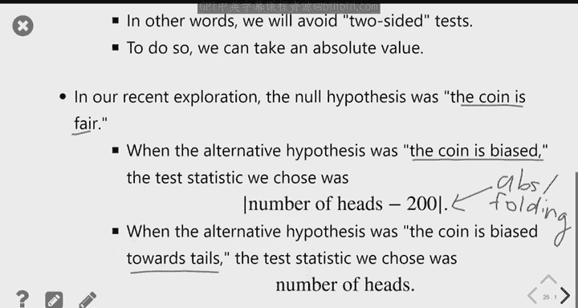

# 21：假设检验入门 🧪

在本节课中，我们将学习假设检验的基本框架。我们将通过两个具体例子——陪审团选拔和硬币公平性检验——来理解如何使用数据评估模型假设，并学习如何选择和使用检验统计量。

---

## 回顾：什么是统计模型？ 🔍

上一节我们介绍了统计模型的概念。模型是我们对数据生成方式的假设。

在罗伯特·斯旺（Robert Swain）的陪审团案例中，我们的模型假设是：陪审团是从符合条件的总人口中随机抽取的，而该人口中黑人比例为26%。我们收集到的实际数据是：一个100人的陪审团中只有8名黑人。我们的目标是判断，实际数据是否与模型假设一致。

我们的方法是进行模拟。如果模型为真（即确实是从26%为黑人的总体中随机抽取），我们模拟抽取成千上万个100人的陪审团，并计算每个陪审团中的黑人数。然后，我们将模拟结果与实际观察到的数字（8）进行比较。

---

## 模拟工具：`np.random.multinomial` 🛠️

以下是模拟抽取单个陪审团的具体方法。我使用了一个名为 `np.random.multinomial` 的新函数。

该函数帮助我们从已知的分类分布中进行随机抽样。它适用于我们不知道总体具体大小，但知道各类别比例的情况。

其用法如下：
```python
np.random.multinomial(样本大小, 总体分布)
```
参数 `总体分布` 是一个数组或序列，表示每个类别的概率，总和应为1。

该函数的作用是：根据给定的概率分布，有放回地随机抽取个体。

对于陪审团例子，总体分布是 `[0.26, 0.74]`（26%黑人，74%非黑人）。运行以下代码：
```python
demographics = [0.26, 0.74]
np.random.multinomial(100, demographics)
```
输出是一个包含两个值的数组，例如 `[24, 76]`。第一个值代表样本中属于第一个类别（黑人）的数量，第二个值代表属于第二个类别（非黑人）的数量。由于我们抽取了100个样本，数组中的值总和总是100。

我们真正感兴趣的是第一个数字（黑人数），可以通过索引 `[0]` 提取。

---

## 案例一：陪审团选拔的假设检验 ⚖️

我们编写了以下代码来模拟抽取一个陪审团，并计算其中的黑人数：
```python
def count_black_in_panel():
    demographics = [0.26, 0.74]
    sample = np.random.multinomial(100, demographics)
    return sample[0]
```
然后，我们通过一个循环重复此过程数千次，将所有结果存入一个名为 `counts` 的数组，并绘制了直方图。

模拟结果显示，在10000次试验中，黑人数最少为11，从未出现过8。我们观察到的实际数据（8）在模拟中极其罕见。

因此，我们的结论是：模拟表明，从该总体中随机抽取100人，得到像罗伯特·斯旺陪审团那样（仅8名黑人）的结果可能性极低。既然真实数据确实如此，我们认为关于数据来源的假设（随机抽样）很可能是错误的。有其他因素（而非偶然性）导致了陪审团中黑人数量过少。

---

## 引入假设检验框架 📐

现在，我们将使用相同的框架来分析另一个例子，并在此过程中引入一些术语。

这个例子是：你在地上发现一枚硬币，不确定它是否公平。你通过多次抛掷来检验。

假设你抛掷了400次，得到了212次正面和188次反面。问题是：基于这个数据，我们认为硬币是公平的吗？

这引出了假设检验的概念。假设检验是一种基于样本数据，在两个不同的世界观（即假设）之间做出选择的框架。

两个假设分别称为**原假设**和**备择假设**。其中一个假设（通常是原假设）必须是一个定义明确的概率模型，说明数据是如何生成的。“定义明确”意味着它必须有具体的数字，因为我们需要用它进行模拟。

在硬币例子中：
*   原假设 (H₀)：硬币是公平的（正面概率=50%，反面概率=50%）。这是一个精确的假设。
*   备择假设 (H₁)：硬币是不公平的。这是一个不精确的假设，因为它包含多种可能性（正面概率可以是任何非50%的值）。

---

## 案例二：检验硬币是否公平 🪙

我们的方法是：首先假设原假设为真（即硬币公平）。然后模拟抛掷一枚公平硬币400次，记录正面次数。我们重复此模拟多次。

我们最初选择的**检验统计量**是**正面次数**。在实际数据中，我们观察到的正面次数是188，这是我们的**观察统计量**。

我们通过模拟生成数千个“在公平假设下抛掷400次得到的正面次数”，并绘制其分布直方图。我们发现，观察到的188次正面位于分布的中间区域，并不罕见。

为了更清晰地进行决策，我们希望将分布划分为两个区域：一个区域的值支持“硬币公平”，另一个区域的值支持“硬币不公平”。然而，正面次数的分布是对称的，中间值（接近200）支持公平，而极高或极低的值都支持不公平。

解决方案是“折叠”分布。我们不再使用“正面次数”作为检验统计量，而是使用“正面次数与期望值200的**绝对差值**”。即：
```python
test_statistic = abs(number_of_heads - 200)
```
对于观察数据，这个新的检验统计量值为 `abs(188 - 200) = 12`。

我们再次进行模拟，但这次计算并绘制这个新统计量的分布。这个分布是右偏的，大部分值集中在0附近（即接近200次正面），值越大表示越极端。

在模拟分布中，我们观察统计量12的位置。我们发现，出现12或更大差值的情况并不少见。因此，我们观察到的数据与原假设（硬币公平）是相容的。

---

## 假设检验的决策与术语 🧮

假设检验的决策基于比较观察统计量与模拟统计量的分布。

*   如果观察统计量落在模拟分布的**极端区域**（即，在模拟中，出现像观察值一样极端或更极端值的情况非常罕见），那么我们就有证据反对原假设。我们**拒绝原假设**。
*   如果观察统计量落在模拟分布的**常见区域**（即，出现像观察值一样极端或更极端值的情况很常见），那么数据与原假设是相容的。我们**未能拒绝原假设**。注意，我们不说“接受”原假设，只是说目前没有足够证据拒绝它。

在硬币公平性检验中，观察到的绝对差值为12，这属于常见情况，因此我们“未能拒绝”硬币公平的原假设。

---

## 检验统计量的选择取决于备择假设 🎯

检验统计量的选择至关重要，它取决于我们想要区分的具体备择假设。

之前，我们的备择假设是“硬币不公平”（任何方向的偏差）。我们使用了绝对差值 `abs(number_of_heads - 200)`，因为大的差值（无论正负）都指向“不公平”。

现在，考虑一对新的假设：
*   原假设 (H₀)：硬币是公平的。
*   备择假设 (H₁)：硬币偏向反面。

此时，绝对差值就不再适用了，因为它无法区分偏差的方向（正面太多还是反面太多）。我们需要一个能特异性检测“偏向反面”的统计量。

一个合适的检验统计量是**正面次数**。因为如果硬币偏向反面，我们预期会看到较少的正面。所以：
*   极低的正面次数 → 支持备择假设（偏向反面）。
*   较高的正面次数 → 支持原假设（公平）或至少不支持“偏向反面”。

我们再次进行模拟，这次检验统计量就是正面次数。观察统计量仍是188。在公平硬币的模拟分布中，188次正面并不极端（不是特别低）。因此，我们再次“未能拒绝”原假设。如果我们观察到像172这样极低的正面次数，我们可能就会拒绝原假设，认为硬币偏向反面。

---

## 总结 📝

本节课我们一起学习了假设检验的基本原理。

1.  **核心思想**：通过比较实际观察数据与在原假设下模拟生成的数据分布，来评估原假设的合理性。
2.  **关键步骤**：建立原假设和备择假设 → 选择检验统计量 → 在原假设下模拟数据并计算统计量分布 → 将观察统计量与模拟分布比较并做出决策（拒绝或未能拒绝原假设）。
3.  **统计量选择**：检验统计量的选择直接依赖于备择假设。我们需要确保统计量能有效区分两种假设。对于检测任何偏差（双尾检验），可以使用像绝对差值这样的统计量；对于检测特定方向的偏差（单尾检验），则需要选择能反映方向的统计量（如正面次数本身）。
4.  **决策术语**：当数据极端时“拒绝原假设”；当数据不极端时“未能拒绝原假设”。




通过陪审团选拔和硬币公平性两个案例，我们实践了从模拟到决策的完整假设检验流程。理解如何根据问题背景选择合适的检验统计量，是掌握假设检验的关键。