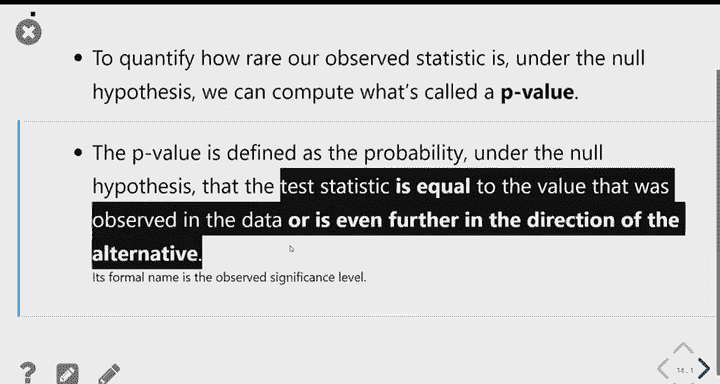
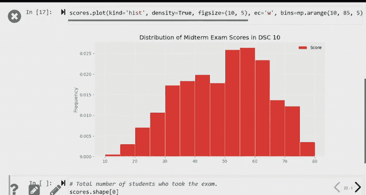
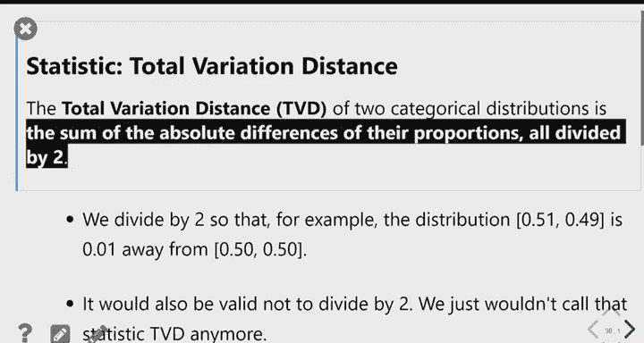

# 22：假设检验与P值详解 📊

在本节课中，我们将深入学习假设检验的核心流程，并通过三个具体案例（硬币公平性检验、期中成绩分析和陪审团种族构成研究）来掌握如何设定假设、选择检验统计量、进行模拟计算P值，并基于此做出统计推断。

---

## 🪙 案例一：硬币公平性检验

上一节我们介绍了假设检验的基本框架。本节中，我们来看看如何将其应用于判断一枚硬币是否公平。

### 假设设定
首先，我们需要明确两种对立的观点：
*   **零假设 (H₀)**：硬币是公平的。即每次抛掷出现正面的概率为 0.5。
*   **备择假设 (H₁)**：硬币是不公平的。

零假设必须是具体、可模拟的。备择假设通常是你试图证明的情况。

### 检验统计量的选择
为了区分这两种假设，我们需要选择一个**检验统计量**。在模拟零假设（抛掷公平硬币）时，我们将反复计算这个统计量。

对于“公平 vs. 不公平”的检验，一个常用的统计量是**正面次数与期望次数（200次）的绝对差值**：
`| 观测到的正面次数 - 200 |`

这个统计量的值域是 0 到 200。值越小（接近0），越支持硬币公平；值越大（接近200），越支持硬币不公平。

### 模拟与P值计算
接下来，我们在零假设（硬币公平）下进行模拟。例如，模拟抛掷一枚公平硬币400次，重复此过程10,000次，每次记录上述统计量的值，从而得到该统计量在零假设下的经验分布。

**P值**的定义是：在零假设为真的前提下，得到与观测数据**同样极端或更极端**结果的概率。

在我们的例子中，如果我们观测到170次正面，那么“更极端”意味着正面次数**小于或等于170**（因为更少的正面更支持“不公平”的备择假设）。P值就是模拟结果中，统计量值 ≤ 170 的比例。

### 决策与显著性水平
如何根据P值做决策？统计学中有一个常用但人为设定的阈值——**显著性水平**，通常设为 0.05。

*   如果 **P值 ≤ 0.05**，我们认为观测结果在零假设下过于罕见，因此**拒绝零假设**，结论具有“统计显著性”。
*   如果 **P值 > 0.05**，我们没有足够证据拒绝零假设，因此**不拒绝零假设**。

例如，若某硬币抛400次得到188次正面，计算出的P值为0.125 > 0.05，我们则结论为“没有足够证据认为该硬币不公平”。

**核心要点**：P值计算的方向（左尾、右尾或双尾）取决于备择假设的方向。选择检验统计量时，应确保其极端值方向与备择假设一致。

---

## 📝 案例二：期中成绩分析

现在，我们将假设检验应用于现实教育数据，分析不同班级的期中平均分差异是否纯属偶然。

### 问题背景
在DSC10课程某学期中，四个班级参加了同一场考试。数据显示，C班的平均分（46.17）显著低于其他班级（约50分）。C班讲师想知道：这种差异是否可能只是随机抽样的结果？

### 假设设定
*   **零假设 (H₀)**：C班学生的成绩是从整个课程学生群体中**随机抽样**得到的。班级间无真实差异。
*   **备择假设 (H₁)**：C班的平均分**低于**随机抽样下的预期水平。

### 模拟与检验
我们通过模拟来评估零假设：
1.  **模拟过程**：从全体学生名单中，**无放回地**随机抽取108名学生（C班实际人数），计算他们的平均分。
2.  **重复**：将此过程重复大量次数（如10,000次），得到在零假设下“随机C班”平均分的分布。
3.  **检验统计量**：直接使用**样本平均分**。
4.  **计算P值**：比较C班的实际平均分（46.17）与模拟分布。P值等于模拟中平均分 ≤ 46.17 的比例。

### 结果与解读
模拟结果显示，实际观测到的46.17分位于模拟分布的极端左尾。计算出的P值极小（<0.01），属于“高度统计显著”。

因此，我们**拒绝零假设**。有强有力的统计证据表明，C班的低平均分不太可能仅由随机抽样导致。可能的原因包括上课时间差异、学生选课偏好等非随机因素，但假设检验本身并不能告诉我们具体是哪种原因。

---

## ⚖️ 案例三：陪审团构成差异检验

最后，我们探讨一个更复杂的案例：如何量化比较两个分类分布之间的整体差异。

### 问题背景
美国公民自由联盟调查了某县陪审团名单的种族构成。他们拥有两份数据：
1.  **合格人口**分布（该县居民的种族比例）。
2.  **实际陪审团名单**的分布。

数据显示，某些种族在陪审团名单中的比例与合格人口比例存在肉眼可见的差异（例如亚裔比例偏高，非裔比例偏低）。问题是：这种差异是否超出了随机波动的范围？

### 假设设定
*   **零假设 (H₀)**：陪审团名单是从合格人口中**随机抽取**得到的。
*   **备择假设 (H₁)**：陪审团名单的种族构成**不是**从合格人口中随机抽取的结果。

### 检验统计量：总变异距离
挑战在于如何用一个数字来概括两个分布（五个种族类别）的整体差异。我们引入一个新的统计量——**总变异距离**。

以下是计算总变异距离的步骤：
1.  计算每个种族类别在“合格人口”与“陪审团名单”中的比例之差。
2.  取这些差值的**绝对值**（避免正负抵消）。
3.  将所有绝对差值**相加**。
4.  将总和**除以2**。

公式表示为：
`TVD = (1/2) * sum(| 合格人口比例_i - 陪审团名单比例_i |)`

总变异距离的值介于0到1之间。值越大，表示两个分布差异越大；值为0表示两个分布完全相同。

### 后续检验思路
在下一节课中，我们将完成这个检验：
1.  **模拟**：在零假设（随机抽样）下，从合格人口分布中反复生成与观测陪审团名单同大小的模拟样本。
2.  **计算**：对每个模拟样本，计算其种族分布与合格人口分布之间的总变异距离。
3.  **P值**：将观测到的实际总变异距离与模拟得到的分布进行比较。P值等于模拟中总变异距离 **≥** 观测值的比例（因为更大的距离更支持备择假设）。
4.  **决策**：根据P值判断差异是否统计显著。

---

## 📚 本节课总结

本节课中我们一起学习了：
1.  **假设检验的完整流程**：从设定假设（H₀, H₁）、选择检验统计量，到模拟零假设分布、计算P值并做出推断。
2.  **P值的核心概念**：P值是零假设为真时，得到观测结果或更极端结果的概率。它是衡量证据强度的连续指标。
3.  **统计显著性**：使用0.05或0.01等阈值进行二元决策是一种惯例，但报告P值本身能提供更多信息。
4.  **三类应用案例**：
    *   **硬币检验**：演示了方向性（单尾）检验。
    *   **成绩分析**：展示了如何检验样本均值是否来自已知总体。
    *   **陪审团构成**：引入了**总变异距离**，用于量化两个分类分布的整体差异，为比较分布提供了有力工具。

通过这三个案例，我们看到了假设检验如何帮助我们在数据存在随机性的情况下，对世界做出有理有据的判断。