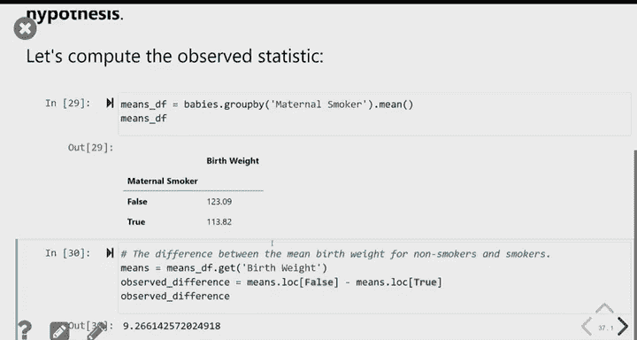

# 23：假设检验进阶与置换检验 🧪

在本节课中，我们将学习如何比较两个分类分布，探索置信区间与假设检验之间的联系，并初步了解一种特殊的假设检验方法——置换检验。

---

## 总变异距离：比较分类分布 📊

上一节我们讨论了如何检验单一类别（如种族）的分布差异。本节中，我们来看看当数据涉及多个类别时，如何量化两个分类分布之间的整体差异。

总变异距离（Total Variation Distance, TVD）是一种用于比较两个分类分布相似性的方法。其核心思想是计算两个分布在每个类别上比例差的绝对值之和，然后除以2。

以下是计算TVD的步骤：
1.  对于每个类别，计算两个分布的比例差。
2.  取每个差的绝对值。
3.  将所有绝对差相加。
4.  将总和除以2。

**公式**表示为：
`TVD = (1/2) * Σ |p_i - q_i|`
其中 `p_i` 和 `q_i` 分别是两个分布在类别 `i` 上的比例。

TVD可以解释为一个分布相对于另一个分布的“总超额量”或“总不足量”。例如，在陪审团案例中，TVD为0.14意味着某些族裔在陪审团中的比例比合格人口中的比例总共超出了14%。

---

## 置信区间与假设检验的联系 🔗

我们已经分别学习了置信区间和假设检验。现在，我们来看看当假设检验的零假设涉及总体参数等于某个特定值时，两者如何联系起来。

当零假设为“总体参数 = 某个值”，备择假设为“总体参数 ≠ 某个值”时，我们可以使用置信区间来进行检验。

**方法**如下：
1.  根据样本数据，构建一个 `(100 - p)%` 的置信区间（例如，使用5%的显著性水平 `p`，则构建95%置信区间）。
2.  观察零假设中声称的那个特定值是否落在这个置信区间内。
    *   如果该值**不在**置信区间内，则拒绝零假设。这意味着数据不支持参数等于该值的说法。
    *   如果该值**在**置信区间内，则无法拒绝零假设。这意味着该值是参数的一个合理可能值。

例如，在人体体温案例中，我们检验平均体温是否为98.6华氏度。通过计算样本均值的95%置信区间（约为98.12至98.37），发现98.6远在该区间之外，因此我们拒绝零假设，认为平均体温并非98.6度。

---

## 引入A/B测试与置换检验 🧬

到目前为止，我们的假设检验都是回答“这个样本是否来自某个已知总体”的问题。现在，我们考虑一种新问题：我有**两个样本**，我想知道它们是否来自同一个总体（或分布）。

这类问题在比较两种处理效果时非常常见，例如：
*   吸烟母亲与非吸烟母亲所生婴儿的体重分布是否相同？
*   两个不同版本的网页设计，哪个带来更多的用户注册？

这种方法被称为**A/B测试**。我们将学习一种解决A/B测试问题的强大方法——**置换检验**。

置换检验的核心思路是：如果两个样本真的来自同一个总体，那么将它们的观测值完全混合后随机重新分配成两组，所计算出的组间差异（如均值差）应该与我们原始观测到的差异类似。通过大量重复这种随机重排并计算差异，我们可以评估原始观测差异是否“异常”到足以拒绝“两组来自同一总体”的零假设。

在下一讲中，我们将详细学习置换检验的步骤，并将其应用于婴儿体重和“放气门”足球等实际案例。

---

## 总结 📝

本节课中我们一起学习了：
1.  **总变异距离（TVD）**：用于量化两个分类分布整体差异的统计量。
2.  **置信区间与假设检验的联系**：当零假设为参数等于某特定值时，可以通过检查该值是否落在置信区间内来进行假设检验。
3.  **A/B测试与置换检验的引入**：介绍了如何检验两个样本是否来自同一总体的问题框架，并引出了下节课将深入讲解的置换检验方法。

这些工具将帮助我们更系统地分析比较数据，并得出更可靠的统计结论。