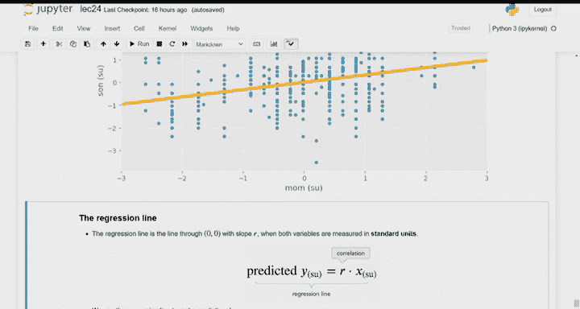

# 25：相关性与预测入门 📊

## 📝 概述
在本节课中，我们将要学习数据科学中的一个新主题：**预测**。我们将从回顾统计推断的知识开始，然后重点介绍**线性回归**的基础——**相关性**。我们将学习如何通过散点图观察变量间的关系，如何计算和解释相关系数，并初步了解如何利用相关性进行简单的线性预测。

---

## 🔄 课程回顾与过渡
在课程的第二部分，我们学习了统计推断。我们通过样本去了解总体。当对总体有所预期时，我们使用标准的假设检验，询问样本是否看起来来自这个总体。置换检验用于比较两个样本是否来自同一个未知的总体分布。自助法和中心极限定理都是估计参数的方法，它们都能给出置信区间，即对总体中某个未知参数值的猜测。

我们还看到了自助法、中心极限定理与假设检验的结合应用，例如在人体体温的例子中，我们通过构建参数的置信区间来检验假设。

以上是我们学到的核心统计技术。在接下来的三节课中，我们将进入一个全新的主题：**预测**。给定一个样本，我们如何预测不在该样本中的数据？我们将聚焦于**线性回归**，这是一种最直接的预测技术，也是许多更复杂机器学习算法的基础。

---

## 🎯 预测问题
假设我们有一个至少包含两个数值变量的数据集，我们想根据其中一个变量的值来预测另一个变量。

**例如：**
*   给定某人的教育水平（量化为数值，如受教育年限），预测其收入。
*   给定我的身高，预测我孩子成年后的身高。
*   给定我的年龄，预测我去过的国家数量。

只有当变量之间存在某种**关系**或**模式**时，进行预测才有意义。如果变量之间没有关联（例如，根据身高预测去过的国家数量），预测就缺乏依据。

因此，当我们希望进行预测时，首先要做的就是通过**散点图**来检查变量间是否存在模式。

---

## 📈 散点图与关联
当我们绘制散点图时，我们寻找的是变量之间的任何关系，这被称为**关联**。
*   **正关联**：一个变量增加时，另一个变量也增加。
*   **负关联**：一个变量增加时，另一个变量减少。

关联可以是线性的，也可以是非线性的。任何模式都有助于我们根据一个变量预测另一个变量。

我们将使用一个早期混合动力汽车的数据集进行演示。数据集包含年份、价格、加速度和每加仑英里数等数值变量。

以下是绘制散点图的示例观察：
*   **价格 vs. 加速度**：呈现**正关联**。加速更快的汽车通常更昂贵。
*   **价格 vs. 每加仑英里数**：呈现**负关联**。燃油经济性更好（更环保）的汽车反而更便宜。这似乎有悖常理，但结合第一个图可以发现，加速性能强的汽车（价格高）往往油耗也高（每加仑英里数低），这反映了当时消费者对混合动力汽车加速性能的看重。

通过散点图，我们可以直观判断变量间是否存在关联以及关联的方向。但我们还需要一个更具体的度量来衡量这种关联的强度。

---

## 🔢 相关系数
为了更具体地度量两个变量之间**线性关联**的强度，我们使用**相关系数**，通常用字母 **r** 表示。

相关系数 **r** 衡量的是两个变量之间线性关系的强弱，即散点图中的点围绕一条直线的紧密程度。

**r** 的计算公式如下：
`r = (x和y标准单位值的乘积)的平均值`

其中，**标准单位**的转换方法为：`标准单位值 = (原始值 - 均值) / 标准差`

**r** 的值始终在 **-1** 和 **1** 之间，这为我们提供了一个解释尺度。

---

## 📊 相关系数示例与解释
以下是一些不同数据集的相关系数示例图：
*   **r = 1**：所有点完全落在一条向上倾斜的直线上（完美正线性关联）。
*   **r = 0.66**：点大致围绕一条向上倾斜的直线分布，但更为分散。
*   **r = 0.33**：向上的趋势更弱，点更分散。
*   **r = 0**：点呈云状随机分布，没有明显的线性方向（不相关）。
*   **r = -0.33**：点大致围绕一条向下倾斜的直线分布。
*   **r = -0.66**：向下的趋势更强，点更紧密。
*   **r = -1**：所有点完全落在一条向下倾斜的直线上（完美负线性关联）。

**符号（正/负）** 表示关联的方向。**绝对值大小** 表示线性关联的强度，越接近1或-1，点围绕直线的聚集程度越高。

在我们的汽车数据示例中：
*   价格与加速度的 **r ≈ 0.69**，表明较强的正线性关联。
*   价格与每加仑英里数的 **r ≈ -0.5**，表明中等强度的负线性关联，且其散点图呈曲线状，这也解释了为何其线性相关系数的绝对值不是特别高。

---

## 🤔 为何使用标准单位？
计算 **r** 时转换为标准单位，是一种线性变换（即对每个值进行加减乘除常数操作）。线性变换会改变图形的刻度、位置（如平移）和缩放（如拉伸压缩），但**不会改变散点图形状本身**。

因此，转换为标准单位：
1.  **不会改变**变量间的线性关系模式。
2.  其目的是**消除量纲影响**，使结果不依赖于变量原始的单位（如美元 vs. 日元），让我们只关心变量关系的形状。
3.  使得 **r** 具有**对称性**：变量x和y的相关系数与y和x的相关系数相同。

---

## 🧮 相关系数的几何理解
将两个变量转换为标准单位后绘制散点图，坐标原点 (0, 0) 代表两个变量的平均值点。

*   **正关联**：数据点主要分布在第一象限（x正，y正）和第三象限（x负，y负）。在这两个象限中，标准单位值的乘积为正。因此，大多数数据点的乘积为正，其平均值 **r** 为正。
*   **负关联**：数据点主要分布在第二象限（x负，y正）和第四象限（x正，y负）。在这两个象限中，标准单位值的乘积为负。因此，大多数数据点的乘积为负，其平均值 **r** 为负。
*   **无关联**：数据点随机分布在各个象限，正负乘积相互抵消，其平均值 **r** 接近零。

这种基于乘积平均的计算方法，巧妙地用一个数字概括了变量间的线性关系信息。

---

## ⚠️ 关联与相关的区别
**重要术语区分**：
*   **关联**：指变量间存在任何模式或关系，可以是线性的，也可以是非线性的（如曲线）。
*   **相关**：特指**线性关联**。相关系数 **r** 只度量线性关系的强度。

例如，对于关系 `y = x²` 的数据，散点图呈抛物线形，存在明显的**关联**（模式），但其**相关系数 r 为 0**，因为不存在线性关系。

---

## 🔮 从相关性到预测
我们现在来看相关性如何与预测问题联系起来。我们将使用弗朗西斯·高尔顿在19世纪收集的关于父母与子女身高的历史数据集（注：高尔顿收集数据的初衷涉及优生学，我们在此仅将其作为统计学发展的一个历史案例使用）。

我们关注其中**母亲与儿子身高**的数据子集。散点图显示存在**正关联**：母亲较高，儿子也倾向于较高，但并非紧密围绕直线，关联强度中等。

**预测目标**：找到一条简单的规则，根据母亲身高预测儿子身高。

1.  **最简单（朴素）的预测**：如果忽略母亲身高的信息，对所有人的最佳单一预测值是**儿子的平均身高**（在标准单位下为0）。
2.  **更好的预测**：利用母亲与儿子身高之间的线性关联。我们的预测线应该穿过原点 (0, 0)，即“身高处于平均水平的母亲，其儿子身高也处于平均水平”，这很合理。
3.  **最佳斜率**：这条预测线的最佳斜率，恰好就是母亲身高与儿子身高之间的**相关系数 r**。

在这个数据集中，`r ≈ 0.33`。因此，在标准单位下，根据母亲身高 (x_su) 预测儿子身高 (y_su) 的直线方程为：
`预测的 y_su = r * x_su`
即 `预测的 y_su = 0.33 * x_su`

这条线被称为**回归线**。它提供了一种基于另一个变量进行线性预测的简单方法。

---

## 📚 总结
本节课中我们一起学习了：
1.  **预测**问题的引入，其基础是变量间存在的**关联**。
2.  通过**散点图**可视化并判断关联的方向（正/负）。
3.  使用**相关系数 r** 量化两个数值变量间**线性关联**的强度和方向。r 介于 -1 与 1 之间，通过变量标准单位值的乘积平均值计算得出。
4.  理解了**关联**（任何模式）与**相关**（特指线性模式）的区别。
5.  初步探索了如何利用**相关系数 r** 作为斜率，构建一条穿过原点的直线，进行简单的线性预测，这为下一讲深入探讨回归线奠定了基础。

下次课，我们将进一步学习如何解释和使用这条回归线进行预测。