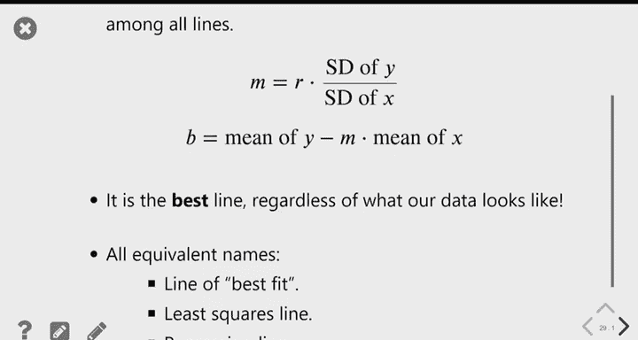

# 26：回归分析进阶 📊

在本节课中，我们将深入学习回归分析，特别是回归线的概念、计算方法及其性质。我们将探讨如何利用回归线进行预测，理解其数学原理，并了解异常值对回归分析的影响。

---

## 回顾：相关系数与回归线

上一节我们讨论了如何利用直线进行预测，并在最后学习了回归线。

我们使用的数据来自高尔顿，他试图通过研究人类特征进行优生学实验。这是一个关于母亲身高与成年儿子身高的数据集。

散点图显示，母亲身高与儿子身高之间存在一定的关系。图形从左到右呈略微上升的趋势，这意味着身高较高的母亲往往有身高较高的儿子。

我们可以通过相关系数来量化这种线性关系的强度。相关系数的定义是：当两个变量都以标准单位衡量时，其乘积的平均值。

以下是计算相关系数的函数：
```python
def standard_units(col):
    return (col - np.mean(col)) / np.std(col)

def calculate_r(x, y):
    x_su = standard_units(x)
    y_su = standard_units(y)
    return np.mean(x_su * y_su)
```
对于母亲和儿子的身高数据，相关系数约为三分之一。这表明变量之间存在线性关系，且呈上升趋势，但关系并非特别强。

我们讨论了不同的预测方法。如果不考虑母亲身高，我们可能会预测所有儿子的身高都等于平均身高。但如果允许将母亲身高作为预测因素，我们就需要一条有斜率的直线。

一个很好的方法是让这条直线的斜率等于相关系数 R。同时，这条直线会经过原点 (0, 0)。原点代表平均 x 和平均 y 的点。这意味着，如果一位母亲身高处于平均水平，我们预测她的儿子身高也处于平均水平。如果母亲身高高于平均水平，我们预测儿子身高也高于平均水平。

---

## 回归线的公式与应用

回归线的公式是：当变量处于标准单位时，预测的 y 值等于 x 值乘以相关系数 R。

公式为：`预测的 y (标准单位) = R * x (标准单位)`。

例如，如果母亲身高比平均值高 0.5 个标准差，相关系数为 0.32，那么我们预测她的儿子身高将比平均值高 `0.5 * 0.32 = 0.16` 个标准差。

这引出了高尔顿对回归线的失望。他发现，无论母亲的身高多么极端，预测的儿子身高总是更接近平均值。他将这种现象称为“回归”，意为“倒退”，因为后代的身高似乎会向平均值“倒退”，而不是朝着他期望的优生学目标“进步”。

需要明确的是，回归预测的是更接近平均值的趋势，但这并不意味着每个人的身高都会变得平均。个体之间仍然存在很大的差异，预测值只是基于线性关系的最佳估计。

---

## 将回归线转换到原始单位

使用标准单位的回归线公式进行预测需要三步转换，这很不方便。我们希望有一个直接从原始单位（如英寸）到原始单位的公式。

我们可以通过代数推导或几何直观来得到这个公式。

从几何上看：
*   在标准单位中，回归线经过原点 (0, 0)。在原始单位中，对应的点是 (x的平均值, y的平均值)。
*   在标准单位中，斜率为 R（即 x 变化 1 个单位，y 变化 R 个单位）。在原始单位中，x 变化 1 个标准差，y 变化 R 个标准差。

因此，在原始单位中，回归线的斜率 `m` 和截距 `b` 公式如下：
*   斜率 `m = R * (y的标准差 / x的标准差)`
*   截距 `b = y的平均值 - m * x的平均值`

回归线方程为：`预测的 y = m * x + b`。

以下是计算斜率和截距的函数：
```python
def slope(x, y):
    r = calculate_r(x, y)
    return r * np.std(y) / np.std(x)

def intercept(x, y):
    m = slope(x, y)
    return np.mean(y) - m * np.mean(x)
```
对于母亲和儿子的身高数据，计算出的斜率约为 0.36，截距约为 45。现在，预测儿子身高只需将母亲身高乘以 0.36 再加上 45。

---

## 异常值对回归的影响

异常值会对回归线和相关系数产生巨大影响。

考虑一个数据集，其中大部分数据点清晰地落在一条直线上，但有一个点远离其他点。即使只有一个这样的异常值，也可能使相关系数变得接近于零，并使回归线严重偏离大多数数据点的趋势。

如果移除这个异常值重新计算，相关系数会变得接近于 1，回归线也能很好地拟合剩余的数据。

因此，在进行回归分析前，检查数据中是否存在异常值非常重要。需要根据实际情况判断是否应该将其包含在分析中。

---

## 为什么回归线是“最佳”直线？

回归线看起来能很好地拟合数据，但为什么说它是最佳直线？衡量一条直线拟合好坏的标准是预测误差。

对于每个数据点，误差等于实际值减去预测值。一个好的预测线应该使所有数据点的误差尽可能小。

由于误差有正有负，直接求平均会相互抵消。因此，我们像计算标准差一样，先求误差的平方，再求平均值，最后开方。这个指标称为**均方根误差 (RMSE)**。

RMSE 越小，说明直线拟合得越好。回归线就是在所有可能的直线中，能使 RMSE 达到最小的那一条。因此，回归线也被称为**最佳拟合线**或**最小二乘线**。

我们可以通过优化算法来验证这一点。以下函数计算给定斜率和截距的直线的 RMSE：
```python
def rmse(slope, intercept, x, y):
    predicted = slope * x + intercept
    errors = y - predicted
    return np.sqrt(np.mean(errors**2))
```
使用优化函数寻找使 RMSE 最小的斜率和截距，得到的结果与之前用公式计算的回归线斜率和截距完全相同。这证实了回归线在最小化预测误差意义上的最优性。

需要注意的是，回归线是“最佳的直线”，但这并不意味着直线就是最好的预测模型。如果数据本身是非线性的，那么即使是最好的直线，其预测效果也可能不如一个简单的曲线模型。回归线是在我们限定使用线性模型 (`y = m*x + b`) 进行预测时，所能找到的最佳选择。

---

## 总结




本节课我们一起深入学习了回归分析。
我们回顾了相关系数与回归线的基本概念，学会了如何在标准单位和原始单位下表达和使用回归线进行预测。
我们理解了回归向均值“倒退”的现象及其含义。
我们认识到异常值对回归结果的显著影响，以及检查数据的重要性。
最后，我们探讨了回归线之所以被称为“最佳拟合线”的原因：它在所有直线中，能够最小化预测的均方根误差 (RMSE)。这为我们使用回归分析提供了坚实的理论基础。