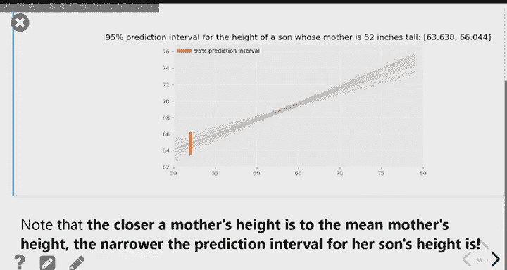

#  27：回归分析与统计推断 📊

在本节课中，我们将学习回归分析的深入概念，特别是残差分析，以及如何通过自助法将回归与统计推断联系起来。我们将探讨回归线的局限性，学习如何评估线性模型的适用性，并理解预测结果的不确定性。

---

## 🔍 回顾：回归线

上一节我们介绍了回归线。回归线是描述两个变量之间线性关系的最佳直线。它由以下公式定义的斜率和截距决定：

**斜率公式**：`m = r * (SD_y / SD_x)`
**截距公式**：`b = avg_y - m * avg_x`

这条线在所有可能的直线中，能够最小化**均方根误差**。均方根误差衡量的是预测值与实际数据点之间的平均偏差，其值越小，说明直线对数据的拟合越好。

然而，无论数据形态如何，我们总能计算出一条回归线。但这并不意味着它总是适合用于预测。只有当变量之间的关系确实是线性时，使用回归线进行预测才有意义。

---

## 📈 理解残差

为了评估回归线的拟合质量，我们需要引入**残差**的概念。残差是当预测值来自回归线时，每个数据点的预测误差。具体来说，它是实际 `y` 值减去回归线预测的 `y` 值：

**残差公式**：`residual = actual_y - predicted_y`

以下是计算一组数据预测值和残差的示例代码：

```python
def residuals(df, x_col, y_col):
    # 计算回归线的斜率和截距
    m = slope(df, x_col, y_col)
    b = intercept(df, x_col, y_col)
    # 计算预测值
    predicted = m * df.get(x_col) + b
    # 计算残差
    resids = df.get(y_col) - predicted
    return resids
```

每个数据点都有一个对应的残差。正残差表示实际值高于预测值（点在线上方），负残差则表示实际值低于预测值（点在线下方）。

---

## 📊 解读残差图

残差图是一种强大的可视化工具，它以自变量 `x` 为横轴，以残差为纵轴绘制散点图。通过观察残差图的形态，我们可以判断线性模型是否合适。

以下是解读残差图的关键点：

*   **理想情况（无模式）**：残差随机、均匀地分布在横轴（残差为0）上下，形成一个无特定模式的“云团”。这表示线性模型是合适的，没有系统性的预测偏差。
*   **存在曲线模式**：如果残差图显示出明显的曲线形态（例如，先正后负再正），则表明变量间的真实关系可能是非线性的。使用线性回归可能不是最佳选择，或许应考虑多项式回归等其他方法。
*   **不均匀的垂直分布**：如果残差的离散程度随着 `x` 的变化而改变（例如，在 `x` 值较小时残差分布很广，在 `x` 值较大时分布很窄），这种现象称为**异方差性**。这并不意味着回归线不好，但它提示我们：对于不同范围的 `x`，预测的可靠性是不同的。在数据变异大的区域，预测误差可能更大。

---

## ⚠️ 回归的陷阱：安斯库姆四重奏

仅仅依靠相关系数、均值、标准差等数值，无法判断数据是否适合线性回归。著名的“安斯库姆四重奏”完美地阐释了这一点。

以下是四个截然不同的数据集：

1.  一个理想的线性关系数据集。
2.  一个明显的非线性（抛物线）关系数据集。
3.  一个包含强影响力异常值的数据集。
4.  一个几乎所有 `x` 值都相同，仅靠一个离群点决定回归线的数据集。

令人惊讶的是，这四个数据集的五个关键统计量（`avg_x`, `avg_y`, `SD_x`, `SD_y`, `r`）完全相同，因此它们的回归线也完全一致。这个例子强有力地说明：**在进行回归分析前，必须可视化数据（绘制散点图和残差图）**，而不能仅仅依赖数字摘要。

---

## 🔗 回归与统计推断

到目前为止，我们基于一个样本数据计算了回归线。但在现实中，我们的数据只是从更大总体中抽取的一个样本。这就引出了统计推断的核心问题：如果换一个样本，我们的回归线和预测结果会有多大不同？

为了解决这个问题，我们再次请出强大的工具：**自助法**。

自助法的思路如下：

1.  从原始样本数据中**有放回地重复抽样**，生成一个与原始样本量相同的“新样本”（自助样本）。这个过程会重复很多次（例如5000次）。
2.  对每一个自助样本，计算其回归线的斜率和截距。
3.  现在，我们不再只有一条回归线，而是拥有了由许多斜率和截距定义的“一堆”回归线。

当我们想预测一个特定 `x` 值（例如，母亲身高为68英寸）对应的 `y` 值时，我们可以将这 `x` 值代入每一条自助回归线，从而得到一系列预测值。取这些预测值的中间95%，就得到了一个**预测区间**。这个区间给出了基于不同可能样本时，预测值的大致范围。

以下是通过自助法计算预测区间的核心代码逻辑：

```python
# 假设 slopes_array 和 intercepts_array 存储了自助法得到的斜率和截距
x_input = 68
# 利用数组运算，一次性计算所有回归线在 x=68 处的预测值
predictions = slopes_array * x_input + intercepts_array
# 计算95%预测区间
lower_bound = np.percentile(predictions, 2.5)
upper_bound = np.percentile(predictions, 97.5)
```

---

## 🍝 “意面图”与预测区间

将所有自助回归线绘制在同一张图上，会形成一个在中心收紧、向两端发散的图形，常被称为“意面图”。

这个图形揭示了一个重要规律：**预测区间在自变量均值附近最窄，在远离均值时变宽**。这是因为所有回归线都必然经过其自身样本的 `(avg_x, avg_y)` 点附近。由于不同自助样本的均值非常接近，这些线在中心区域被“束缚”在一起，差异很小。然而，随着向两端移动，斜率上的微小差异被放大，导致预测值出现更大的波动。

这意味着，对于身高接近平均水平的母亲，我们对其儿子身高的预测更加精确（区间窄）；而对于身高特别高或特别矮的母亲，预测的不确定性更大（区间宽）。

---

## 📝 总结

本节课中我们一起学习了回归分析的深入内容。

我们首先学习了**残差**和**残差图**，这是诊断线性回归模型是否适用的重要工具。通过识别残差图中的模式（如曲线或异方差性），我们可以判断是否需要更复杂的模型。

接着，我们通过**安斯库姆四重奏**认识到，不能仅凭汇总统计量就决定使用线性回归，可视化检查至关重要。

最后，我们将回归与统计推断相结合，使用**自助法**来量化预测的不确定性。我们了解到，基于单一样本的预测只是一个点估计，而通过自助法可以构建**预测区间**。并且，预测的精度取决于预测点在数据分布中的位置，越接近中心，预测越可靠。




这标志着我们新课学习部分的结束。接下来的课程将进入复习阶段，为期末考试做准备。