# 28：期末考试复习 📊

在本节课中，我们将复习春季学期期末考试中的一些关键题目。我们将重点讲解数据处理、假设检验、置信区间和回归分析等核心概念，帮助大家为即将到来的期末考试做好准备。

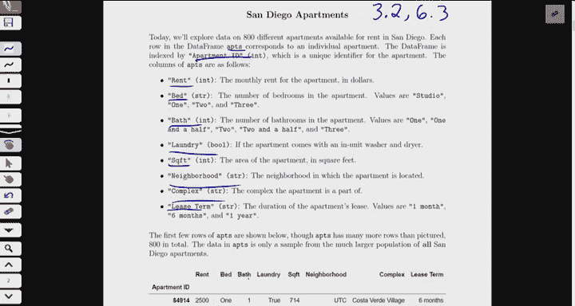

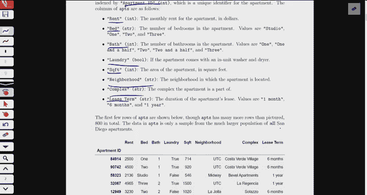

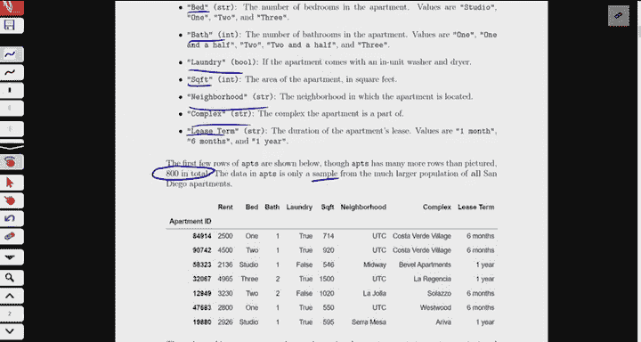

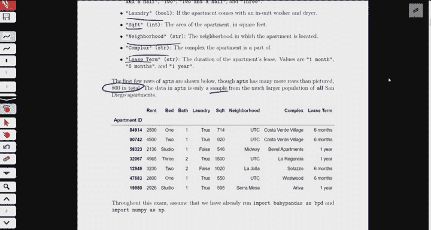

---

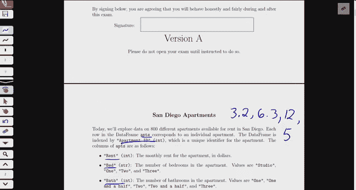

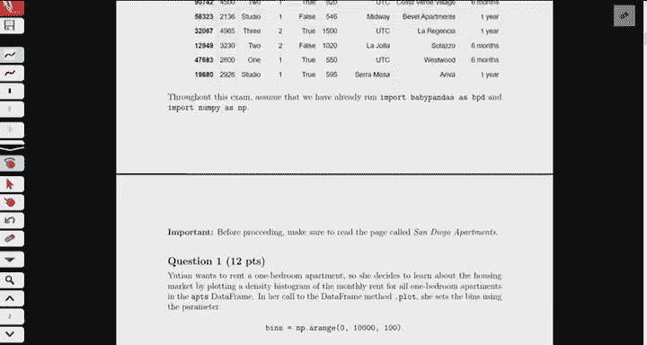

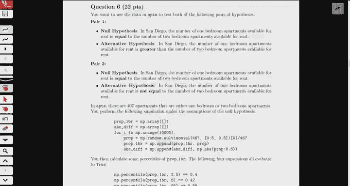

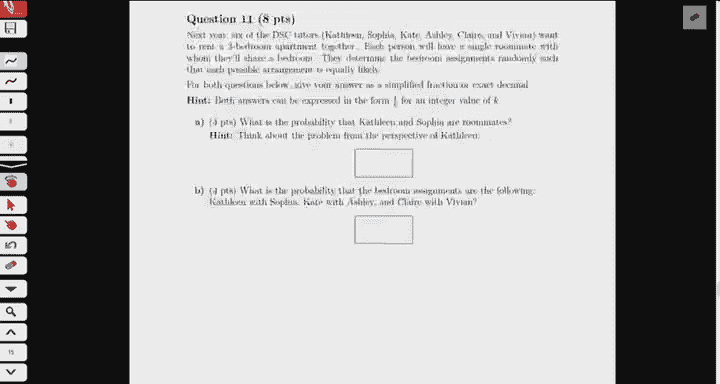

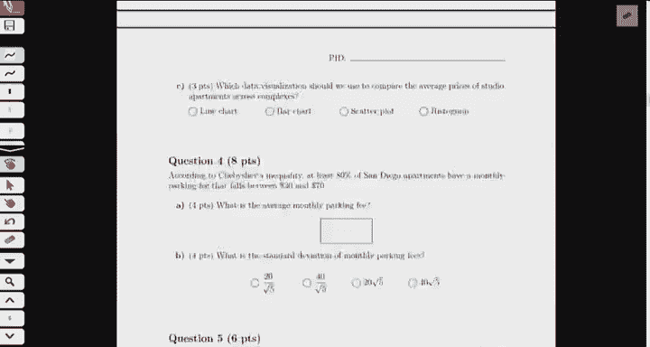

## 🏢 题目一：公寓租金数据分析

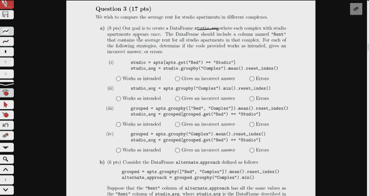

题目提供了一个名为`APS`的数据集，包含800套待租公寓的信息。数据列包括：租金（`rent`）、卧室数量（`bed`）、浴室数量（`bath`）、是否有洗衣机（`laundry`）、面积（`sqft`）、社区（`neighborhood`）、公寓楼（`complex`）和租期（`lease_term`）。

我们的目标是创建一个名为`studio_average`的数据框，其中每个**提供单间公寓（studio）的公寓楼**出现一次，并包含该楼所有单间公寓的平均租金。

### 解决方案分析

以下是几种可能的解决方案，我们需要判断其是否正确：

1.  **标准解决方案**：
    ```python
    studio_average = (aps.query('bed == "studio"')
                         .groupby('complex')['rent']
                         .mean()
                         .reset_index())
    ```
    *   **分析**：此代码首先筛选出所有单间公寓，然后按公寓楼分组并计算平均租金。这完全符合题目要求。

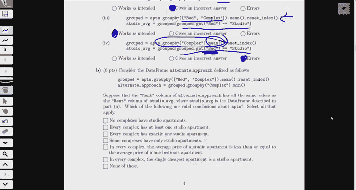

2.  **分组后取最小值**：
    ```python
    studio_average = (aps.groupby('complex')['rent']
                         .min()
                         .reset_index())
    ```
    *   **分析**：此代码计算每个公寓楼的最低租金，而非单间公寓的平均租金。即使单间公寓恰好是最便宜的，这也只是一个数据点，而非平均值。代码能运行，但结果错误。

3.  **按卧室类型和公寓楼双重分组**：
    ```python
    studio_average = (aps.groupby(['bed', 'complex'])['rent']
                         .mean()
                         .reset_index()
                         .query('bed == "studio"'))
    ```
    *   **分析**：此代码先计算每个公寓楼内每种卧室类型的平均租金，然后筛选出单间公寓的行。虽然多计算了信息，但最终结果正确。

4.  **先分组平均再筛选**：
    ```python
    studio_average = (aps.groupby('complex')['rent']
                         .mean()
                         .reset_index()
                         .query('bed == "studio"'))
    ```
    *   **分析**：在按`complex`分组并求均值后，数据框中将只包含数值列（如`rent`）。`bed`列是字符串类型，在求均值时已被丢弃，因此后续无法根据`bed == "studio"`进行筛选。此代码会报错。

上一节我们分析了如何正确计算单间公寓的平均租金。接下来，我们看一个相关的深入问题。

### 深入问题：替代方法的含义

考虑以下替代方法生成的`alternate_approach`数据框：
```python
grouped = aps.groupby(['bed', 'complex'])['rent'].mean().reset_index()
alternate_approach = grouped.groupby('complex')['rent'].min().reset_index()
```
题目指出，如果`alternate_approach`的结果与第一部分（标准解决方案）的结果完全相同，这说明了关于公寓的什么事实？

**分析**：
*   `grouped`数据框包含每个公寓楼内每种卧室类型的平均租金。
*   `alternate_approach`取每个公寓楼中所有卧室类型平均租金的最小值。
*   要使这个最小值等于该公寓楼单间公寓的平均租金，意味着在每个公寓楼中，**单间公寓的平均租金必须不高于（即小于或等于）其他任何卧室类型的平均租金**。换句话说，单间公寓是各个公寓楼中最便宜的房型（按平均租金计算）。

---

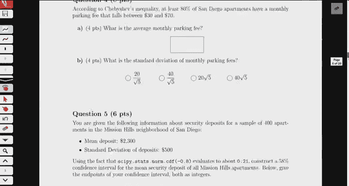

## 📈 题目二：置信区间计算

题目给出关于圣地亚哥Mission Hills社区400套公寓押金的样本信息：
*   样本均值（`mean_deposit`） = $2300
*   样本标准差（`sd_deposit`） = $500
*   已知标准正态分布的CDF在-0.8处的值约为0.21。

要求利用这些信息，构建总体平均押金的58%置信区间。

### 核心概念与计算

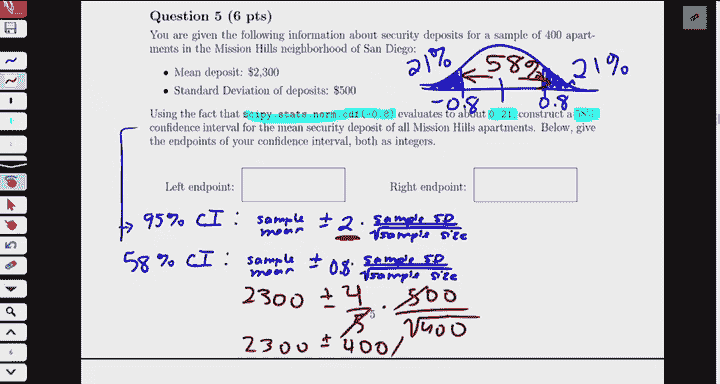

95%置信区间的公式为：
`样本均值 ± 2 * (样本标准差 / √样本数量)`

对于58%的置信区间，我们需要找到对应的“倍数”（而不是2）。已知CDF(-0.8) = 0.21，这意味着正态曲线下，有21%的面积在均值左侧0.8个标准差以外。根据对称性，也有21%的面积在均值右侧0.8个标准差以外。因此，均值±0.8个标准差范围内的面积是100% - 21% - 21% = 58%。

因此，58%置信区间的公式为：
`样本均值 ± 0.8 * (样本标准差 / √样本数量)`

代入数值计算：
`2300 ± 0.8 * (500 / √400) = 2300 ± 0.8 * (500 / 20) = 2300 ± 0.8 * 25 = 2300 ± 20`

所以，置信区间的端点是 **$2280** 和 **$2320**。

---

## 🔬 题目三：假设检验与模拟

题目希望使用公寓数据检验以下两对假设：
1.  **第一对**：
    *   H₀: 一居室数量 = 二居室数量
    *   H₁: 一居室数量 > 二居室数量
2.  **第二对**：
    *   H₀: 一居室数量 = 二居室数量
    *   H₁: 一居室数量 ≠ 二居室数量

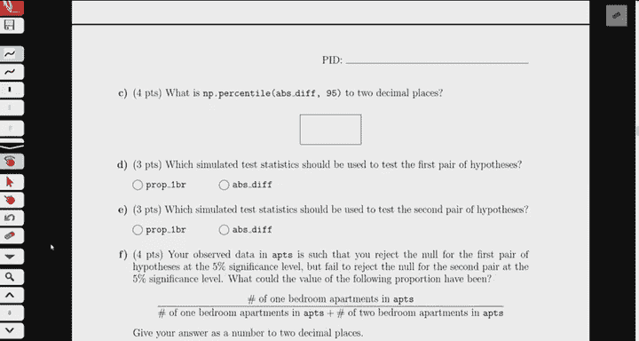

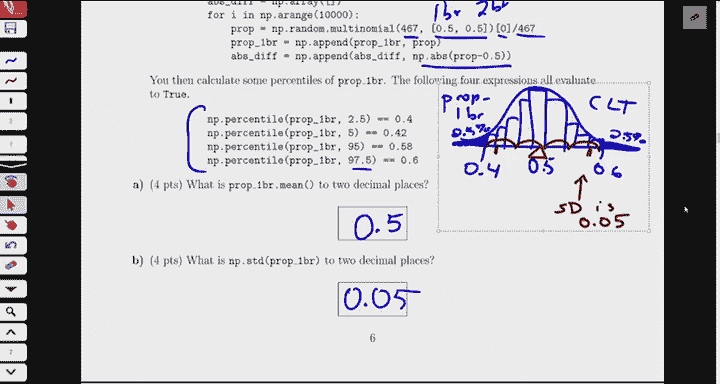

已知数据中一居室或二居室的公寓总数为467套。在零假设下进行了模拟，生成了两个统计量数组：
*   `prop_1br`：一居室公寓的比例（相对于一居室和二居室总数）。
*   `abs_diff`：上述比例与0.5的绝对差值。

模拟结果显示`prop_1br`的分布是正态的，均值为0.5，标准差约为0.05，并给出了其几个百分位数。

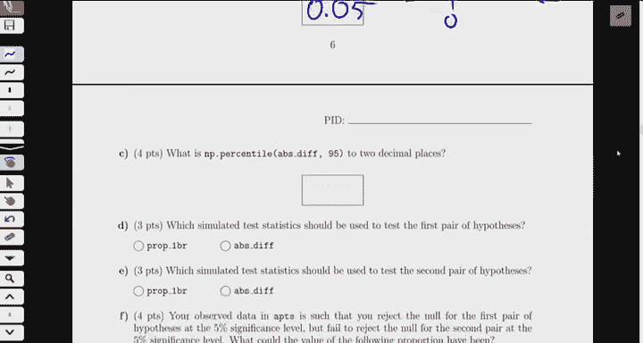

### 问题解析

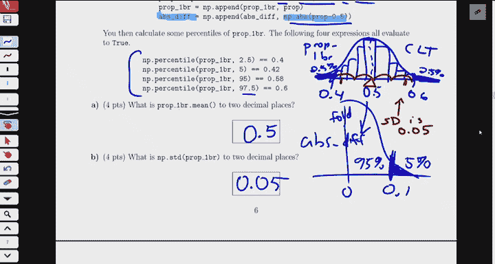

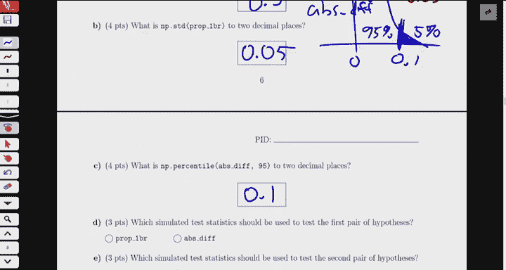

以下是基于模拟结果需要回答的问题：

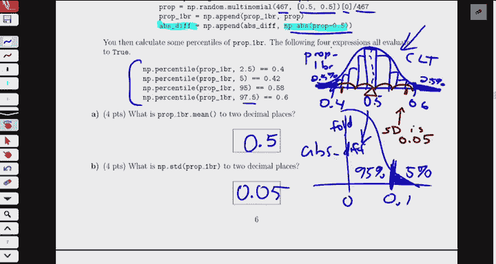

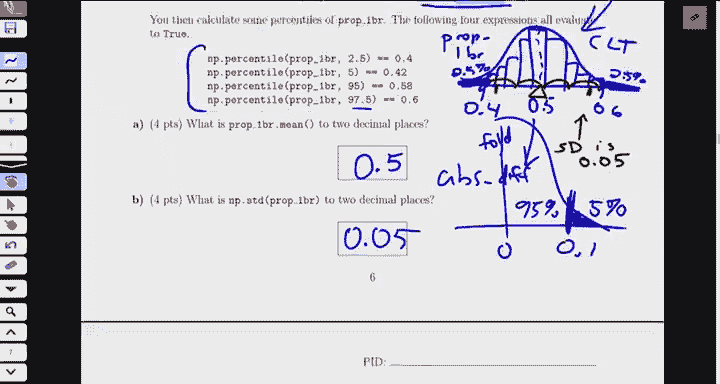

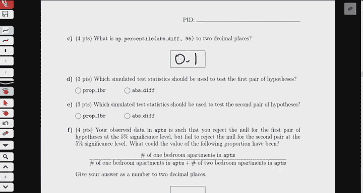

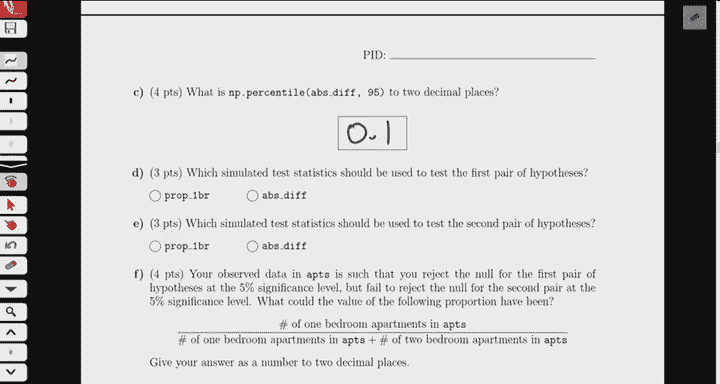

*   **`prop_1br`的均值**：根据零假设（数量相等），比例应为0.5。
*   **`prop_1br`的标准差**：从给出的百分位数（如2.5%分位数是0.4，97.5%分位数是0.6）可知，均值±2个标准差覆盖95%数据，因此标准差为 `(0.6 - 0.5) / 2 = 0.05`。
*   **`abs_diff`的95%分位数**：`abs_diff`是`prop_1br`分布“折叠”后的结果。`prop_1br`中2.5%的数据小于0.4，2.5%的数据大于0.6。当取绝对值差时，这两部分（共5%）的数据都对应着大于0.1的值。因此，`abs_diff`的95%分位数是 **0.1**。
*   **应使用的检验统计量**：
    *   检验第一对假设（有方向性，`>`）应使用 **`prop_1br`** 本身。
    *   检验第二对假设（无方向性，`≠`）应使用 **`abs_diff`**。
*   **观察结果分析**：题目指出，在5%显著性水平下，根据第一对假设拒绝了零假设，但根据第二对假设未能拒绝零假设。求观察到的`prop_1br`可能值。
    *   **第一对假设（拒绝）**：拒绝意味着观察到的`prop_1br`值很大，落在了`prop_1br`分布右尾的5%区域内。根据给出的95%分位数是0.58，这意味着观察值必须 **> 0.58**。
    *   **第二对假设（未拒绝）**：未拒绝意味着观察值对应的`abs_diff`没有落在`abs_diff`分布右尾的5%区域内。根据计算出的95%分位数是0.1，这意味着`|prop_1br - 0.5|` 必须 **≤ 0.1**，即观察值在 **0.4 到 0.6 之间**。
    *   **综合**：观察值必须同时满足 `> 0.58` 和 `在[0.4, 0.6]之间`。因此，可能的范围是 **0.58 到 0.6 之间**（例如0.59）。

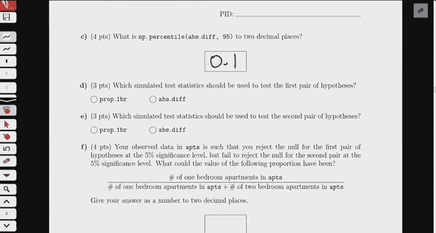

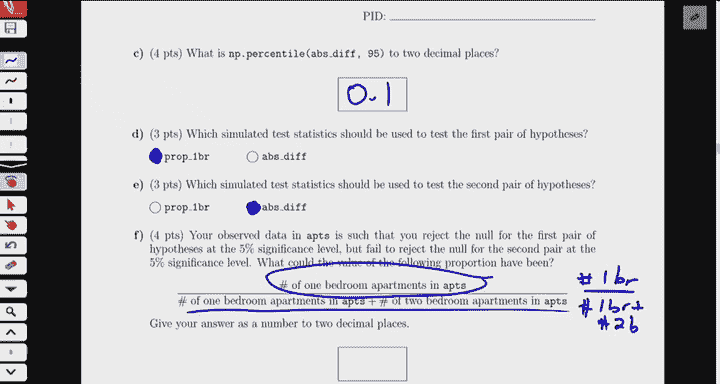

---

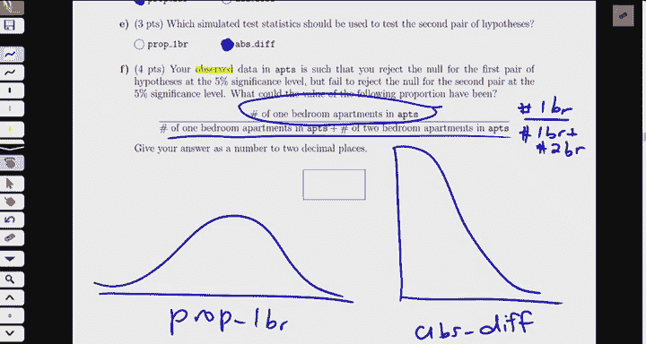

## 📉 题目四：回归分析应用

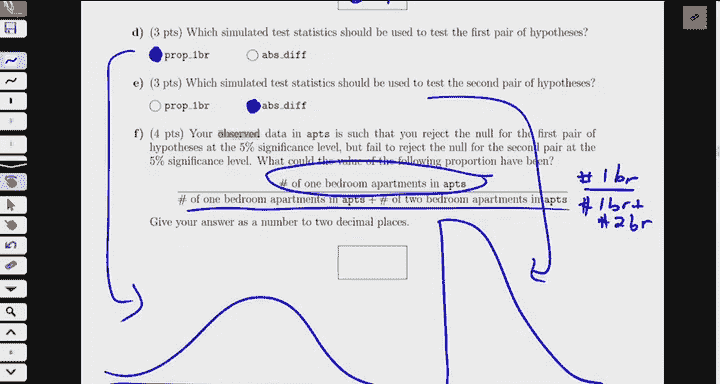

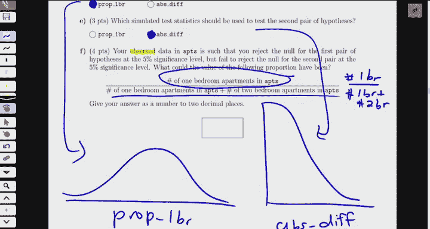

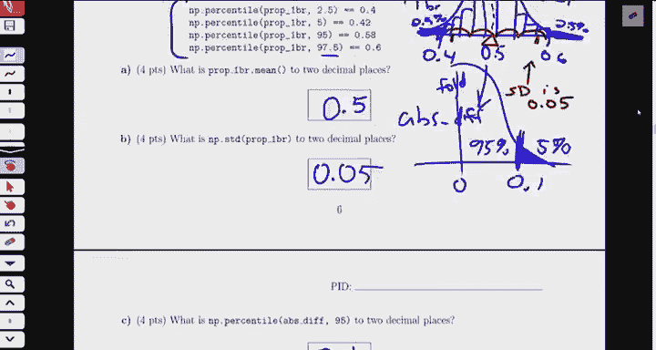

题目给出了租金（`rent`）和面积（`sqft`）的汇总统计：
*   平均租金 = $3000， 租金标准差 = $400
*   平均面积 = 2000 sqft， 面积标准差 = 100 sqft
*   两者的相关系数 `r` = 0.9

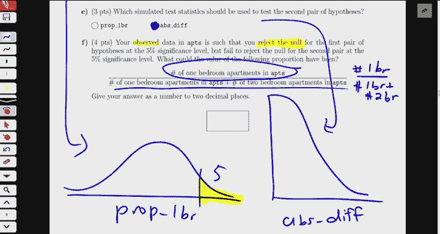

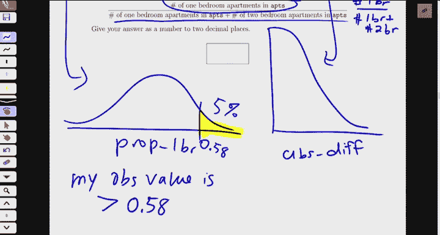

### 问题解析

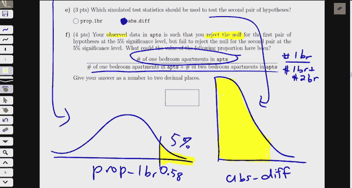

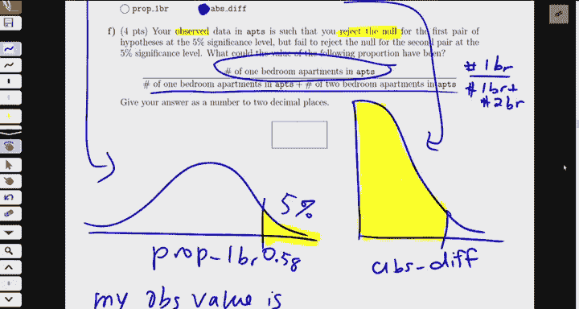

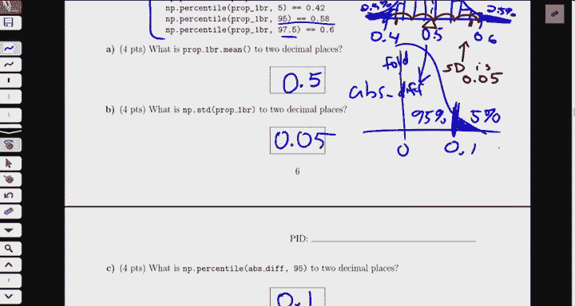

1.  **正态分布问题**：假设租金服从正态分布，求84%的公寓租金低于哪个值？
    *   根据经验法则，均值右侧1个标准差范围内的面积约为84%（50% + 34%）。因此，该值为 `均值 + 1个标准差 = 3000 + 400 = $3400`。

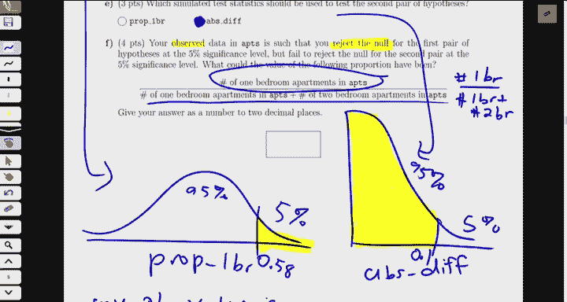

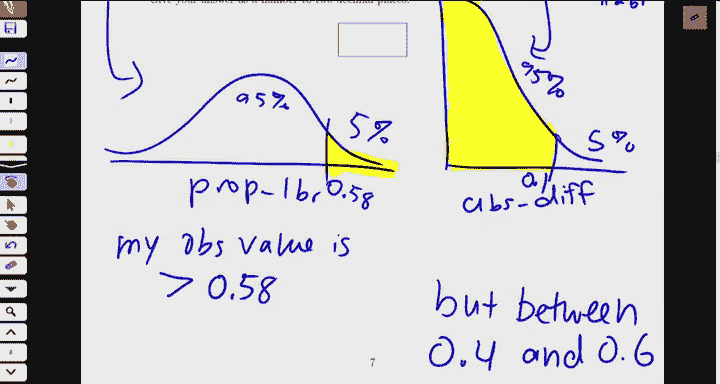

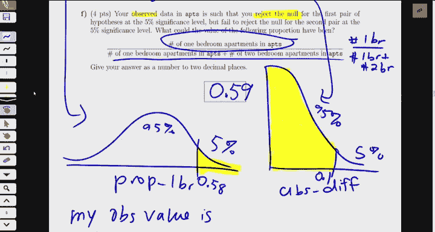

2.  **标准化单位（Standard Units）转换**：Sophie的公寓租金为$5000，将其转换为标准单位。
    *   标准单位公式：`(值 - 均值) / 标准差`
    *   `(5000 - 3000) / 400 = 5`
    *   她的租金比平均租金高5个标准差。

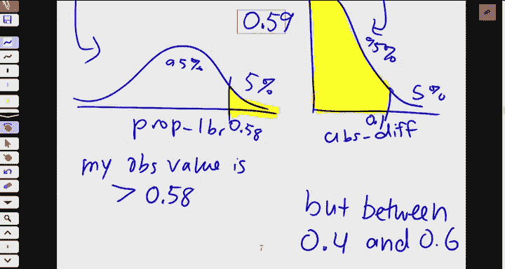

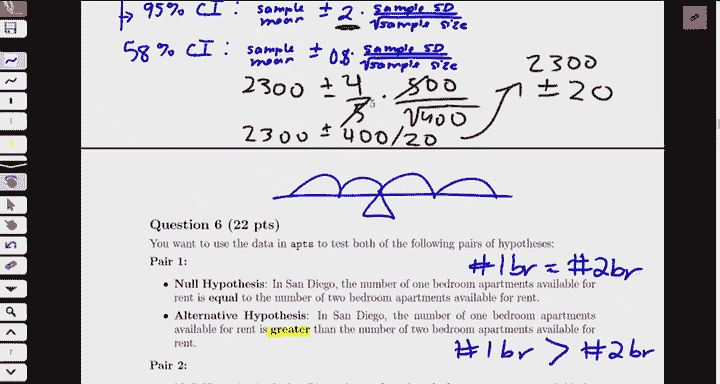

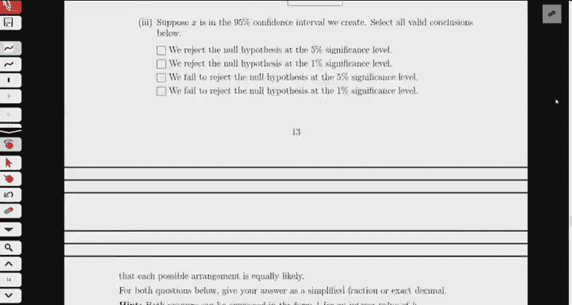

3.  **回归预测**：基于Sophie的租金，预测其公寓面积。
    *   在标准单位下，回归方程是：`y_su = r * x_su`
    *   已知 `x_su`（租金标准单位）= 5， `r` = 0.9。
    *   因此，预测的面积标准单位 `y_su = 0.9 * 5 = 4.5`。
    *   将标准单位转换回原始单位：`预测面积 = 面积均值 + y_su * 面积标准差 = 2000 + 4.5 * 100 = 2450 sqft`。

4.  **计算残差**：若Sophie公寓的实际面积是2300 sqft，预测的残差是多少？
    *   残差 = 实际值 - 预测值 = `2300 - 2450 = -150 sqft`。

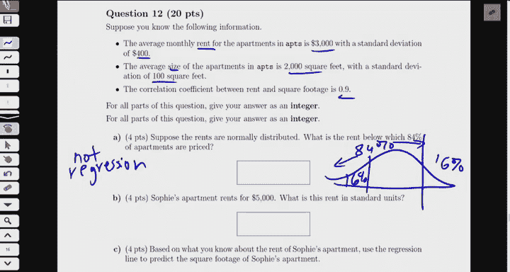

5.  **反向预测**：CC的公寓面积为1800 sqft，预测其租金。
    *   先将面积转换为标准单位：`(1800 - 2000) / 100 = -2`。
    *   使用回归方程预测租金标准单位：`y_su（租金） = r * x_su（面积） = 0.9 * (-2) = -1.8`。
    *   将租金标准单位转换回原始单位：`预测租金 = 租金均值 + y_su * 租金标准差 = 3000 + (-1.8) * 400 = $2280`。

---

## 🎯 总结

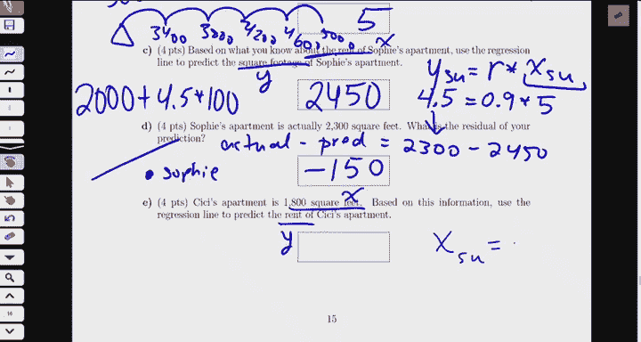

本节课我们一起复习了期末考试中的几个核心题型：
1.  **数据分组与聚合**：重点在于理解`groupby`、筛选和聚合操作的顺序与逻辑。
2.  **置信区间构建**：关键在于根据给定的分布信息（如CDF值）确定合适的乘数，并代入公式计算。
3.  **假设检验与模拟**：核心是理解不同备择假设对应不同的检验统计量，并能够根据模拟结果的分布解读观察值的意义。
4.  **回归分析应用**：熟练掌握利用均值、标准差和相关系数进行预测，包括在原始单位和标准单位之间的转换，以及残差的计算。

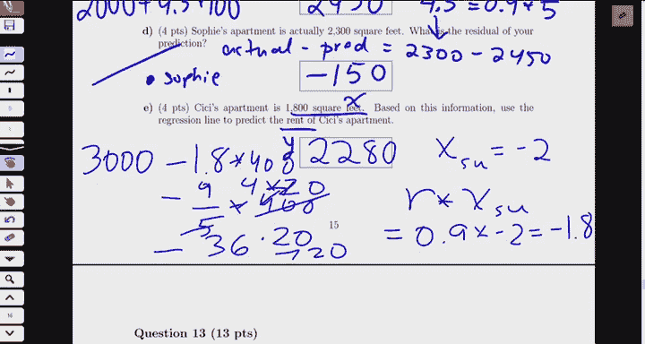

希望本次复习能帮助大家巩固这些重要的数据科学概念。祝大家在期末考试中取得好成绩！