# 29：数据科学原理 - 期末复习与课程总结 📊


在本节课中，我们将回顾一些过往的考试题目，并总结整个课程的核心内容。课程分为两部分：首先，我们将通过解决具体的考试问题来复习关键概念；其次，我们将探讨课程结束后的学习路径，并展示一些更高级的数据可视化技巧。

***

## 📝 期末考试安排与课程反馈

期末考试将于明天举行，时间为11:30至14:30。考试地点分为两个教室，具体安排已由助教Eric通过邮件通知。参加周日补考的同学无需座位安排，到场后在大厅登记即可。

今天是填写课程期末调查的最后一天。完成调查对课程未来的改进非常重要，并且在明天早上8点前完成可以获得一次参与分。

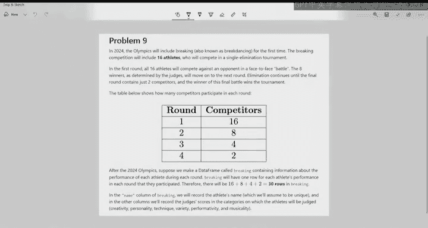

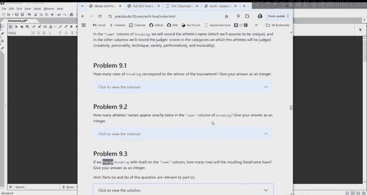

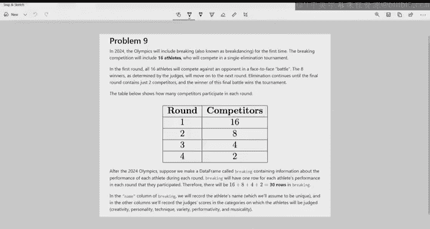

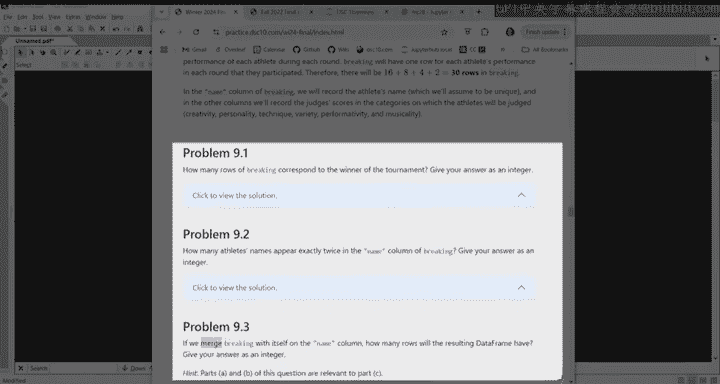

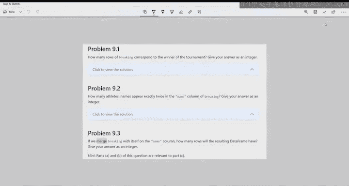

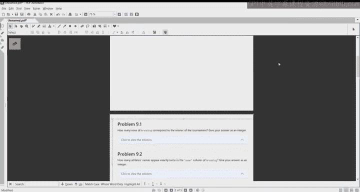

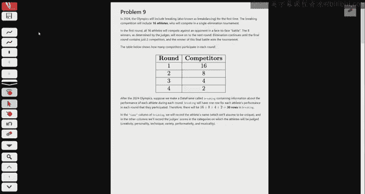

关于成绩，我们将在下周中段完成期末项目和期末考试的评分，并计算总成绩。成绩报告将更新，包含所有作业、已丢弃的作业和延期天数等信息。请注意，本课程不设成绩曲线，请专注于你能控制的部分，即明天的期末考试。

***

## 🔍 过往考题复习

本节课前半部分将用于复习过往的考试题目。我们将从合并数据、解读直方图和理解P值等主题开始。

### 合并数据框问题

上一节我们介绍了考试安排。本节中，我们来看看一个关于合并数据框的具体问题。这个问题来自Winter 24的第9题，涉及一个关于“霹雳舞”比赛的数据集。

**问题背景**：2024年奥运会首次引入霹雳舞（Breaking）项目。16名运动员参加单败淘汰赛。我们有一个名为 `breaking` 的DataFrame，它记录了每位运动员在每一轮比赛中的表现。每位参赛者在其参加的每一轮中都会有一行记录。

以下是关于数据框 `breaking` 的关键信息：
*   冠军会出现4次（参加了所有4轮）。
*   亚军也会出现4次。
*   有4名运动员的名字恰好出现2次（进入了第二轮但未进入第三轮）。
*   有2名运动员的名字恰好出现3次（进入了第三轮但未进入决赛）。
*   有8名运动员的名字只出现1次（在第一轮被淘汰）。

现在，如果将 `breaking` 数据框与自身在 `name` 列上进行合并，结果数据框将有多少行？

**解决方案**：
合并操作的本质是，对于左表中的每一行，都会与右表中具有相同键值的所有行进行配对。因此，一个名字在结果中产生的行数，等于该名字在数据框中出现次数的平方。

以下是计算过程：
1.  名字出现1次的8人：每人贡献 `1 * 1 = 1` 行，共 `8 * 1 = 8` 行。
2.  名字出现2次的4人：每人贡献 `2 * 2 = 4` 行，共 `4 * 4 = 16` 行。
3.  名字出现3次的2人：每人贡献 `3 * 3 = 9` 行，共 `2 * 9 = 18` 行。
4.  名字出现4次的2人：每人贡献 `4 * 4 = 16` 行，共 `2 * 16 = 32` 行。

总行数为：`8 + 16 + 18 + 32 = 74` 行。

**核心公式**：
如果某个键值在数据框中出现 `n` 次，那么在自合并后，它将产生 `n²` 行。

```python
# 概念性代码，说明合并后的行数计算逻辑
total_rows = sum(count**2 for count in appearance_counts.values())
```

### 直方图解读问题

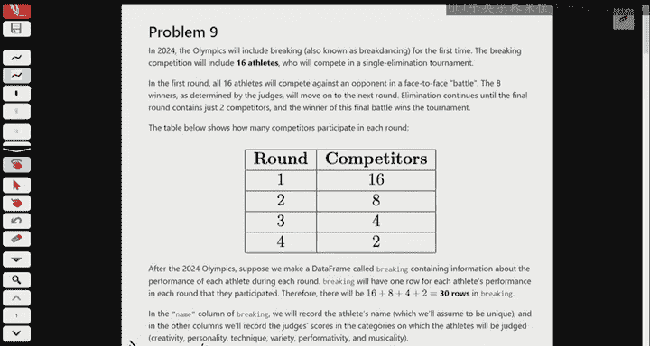

接下来，我们来看一个关于解读直方图的问题，来自Fall 23的第13题。

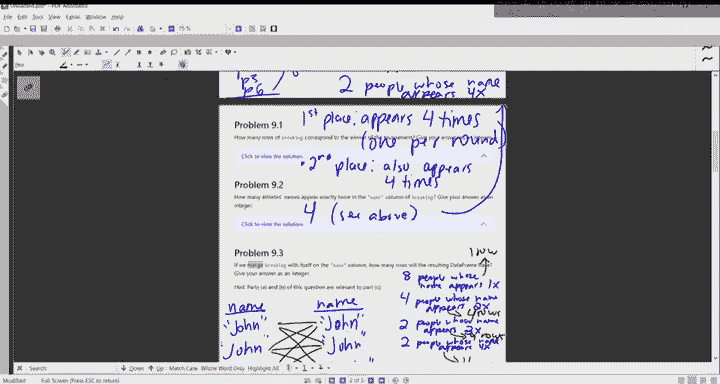

**问题背景**：Ashley有一个包含400条交易记录的随机样本，并绘制了两幅描述`amount`列分布的直方图（A和B），它们使用了不同的箱宽。直方图A的箱宽为30，但其中两个条形的高度数据丢失了。已知直方图A和B描述的是相同的数据。

第一个问题是：哪个箱体大约包含60笔交易？
由于总共有400笔交易，60笔交易占总数的比例为 `60/400 = 0.15`。在直方图A中，每个箱体的宽度为30。面积代表比例，所以我们需要找到高度满足 `宽度 * 高度 = 0.15` 的箱体。计算高度：`高度 = 0.15 / 30 = 0.005`。观察直方图A，高度约为0.005的箱体对应的是`(60, 90]`这个区间。

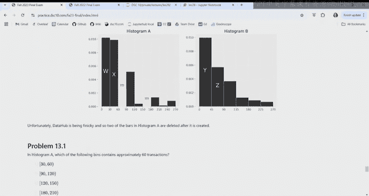

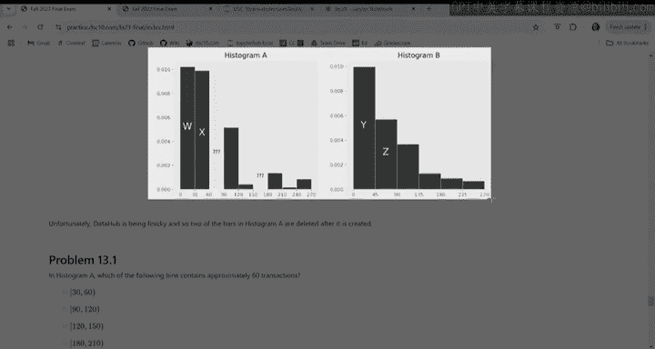

第二个更有趣的问题是：已知直方图B中前两个箱体（宽度为45）的高度分别为 `y` 和 `z`，如何用 `y` 和 `z` 表示直方图A中`(60, 90]`箱体的高度（设为 `u`）？
关键点在于，两个直方图中从0到90这个数据区间的总面积必须相等。

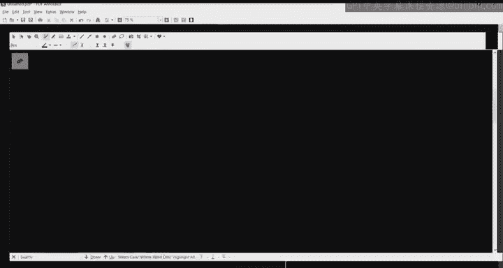

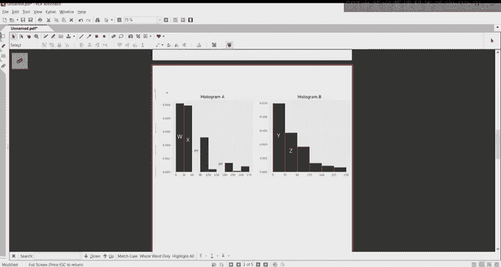

**计算逻辑**：
1.  直方图A中`[0, 90]`区间的总面积 = `30*w + 30*x + 30*u`
2.  直方图B中`[0, 90]`区间的总面积 = `45*y + 45*z`
3.  两者相等：`30*(w + x + u) = 45*(y + z)`
4.  解出 `u`：`u = (45*(y + z) / 30) - w - x = (3/2)*(y + z) - w - x`

### P值方向判断

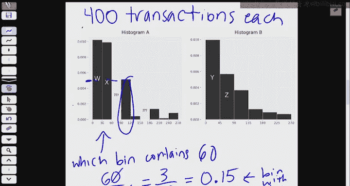

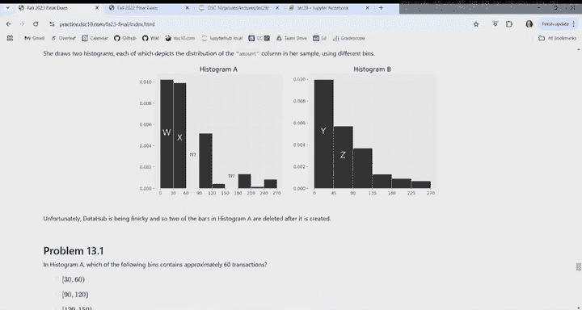

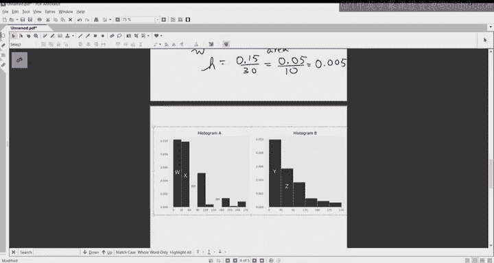

最后，我们简要回顾一下假设检验中P值方向的选择。这取决于你所使用的检验统计量及其含义。

**核心思路**：P值计算的是，在原假设成立的前提下，得到与观察结果同样极端或更极端结果的概率。“极端”的方向由备择假设决定。

**决策方法**：
1.  绘制一条数轴，表示检验统计量可能的取值。
2.  标记出你的观察到的统计量值。
3.  确定哪个方向的取值更支持备择假设（即更“极端”）。
4.  计算P值时，就计算统计量向那个方向取极端值（大于等于或小于等于观察值）的概率。

**示例**：
*   如果检验统计量是“正面次数与200的绝对差值”，用于检验硬币是否公平。大的差值支持“不公平”的备择假设。因此，P值应计算为 `P(统计量 >= 观察值)`。
*   如果检验统计量是“正面次数”，用于检验硬币是否偏向反面。少的正面次数支持“偏向反面”的备择假设。因此，P值应计算为 `P(统计量 <= 观察值)`。

***

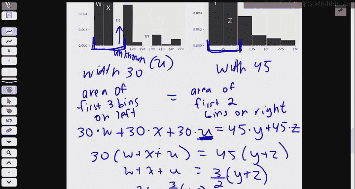

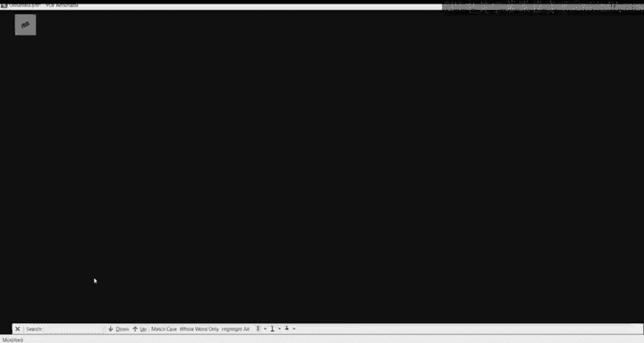

## 🚀 课程结束后的学习路径

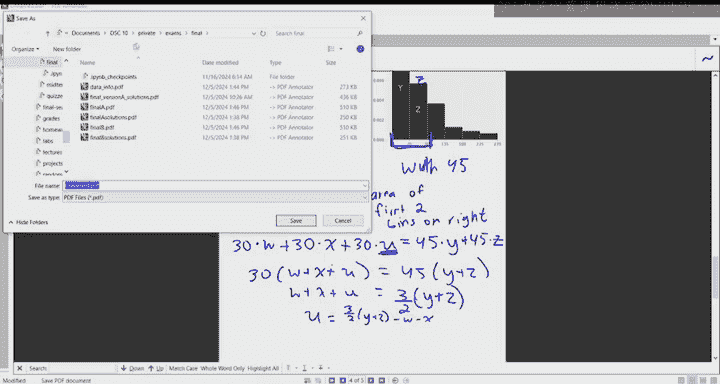

在复习了关键考题后，我们来看看课程结束后你可以如何继续你的数据科学之旅。

### 开展个人项目

本课程为你提供了开展个人数据科学项目所需的技能。你可以寻找感兴趣的数据集进行分析。

以下是一些寻找数据的途径：
*   **数据仓库**：如Kaggle，拥有大量社区上传的数据集和项目。
*   **政府与机构数据**：各国政府、世界银行等国际组织公开的数据。
*   **特定领域数据**：体育、音乐、交通、新冠疫情等。
*   **网络抓取**：可以从维基百科等网站提取表格数据。
*   **自行收集**：通过谷歌表单等工具创建调查并收集数据。

**技术准备**：
*   **保存你的工作**：如果你下个季度不再使用DataHub，请记得从DataHub下载你的笔记本和数据文件。具体方法已发布在课程网站的调试页面上。
*   **从BabyPandas到Pandas**：本课程使用的BabyPandas是Pandas的简化版。所有BabyPandas代码在标准Pandas中同样有效。只需将导入语句 `import babypandas as bpd` 改为 `import pandas as pd`，并将代码中的 `bpd` 替换为 `pd` 即可。Pandas提供了更多功能和参数选项。

### 进阶数据可视化演示

本课程使用了基础的绘图功能。数据可视化本身是一个广阔的领域。这里使用一个更高级的库`Plotly`进行演示，其代码逻辑与我们所学的相似。

我们使用`gapminder`数据集，它记录了1952年至2007年间世界各国的人口、人均GDP和预期寿命等数据。

**示例1：动态散点图**
我们可以绘制人均GDP与预期寿命的散点图，并用颜色区分大洲，用点的大小表示国家人口。`Plotly`的强大之处在于可以创建动画，展示这些指标随时间的变化。例如，可以观察到中国和印度随着经济发展（向右移动），预期寿命显著提高（向上移动），而非洲许多国家的发展相对滞后。

**示例2：动态直方图**
可以绘制预期寿命的分布直方图，并制作动画展示该分布如何从1952年到2007年整体向右移动（即全球预期寿命普遍提高）。

**示例3：热力图**
可以绘制世界地图热力图，用颜色深浅表示各地区的预期寿命，直观展示全球健康水平的差异。

这些演示表明，在掌握了本课程的基础后，你已有能力通过学习`Plotly`等新工具库的文档，创建出复杂且富有洞察力的可视化作品。

***

## 🎓 课程核心回顾与总结

在本节课中，我们一起回顾了数据合并、直方图解读和假设检验等关键考试题型，并展望了课程结束后的学习方向。

现在，让我们总结一下整个DSC 10课程的核心旅程，这与第一讲的目标相呼应：

1.  **使用Python探索数据**：这是前四周的重点，我们学习了数据操作、清洗和初步可视化。
2.  **对总体进行推断**：在随后的几周里，我们通过自助法和假设检验，学习了如何利用样本数据对总体做出统计推断。
3.  **进行预测**：在课程最后，我们学习了回归分析，这是最基本的机器学习算法之一，用于根据变量之间的关系进行预测。

未来的数据科学课程将会在这些主题上分别进行更深入、更专门的探讨。

衷心感谢所有为本课程顺利运行付出努力的教学团队成员（教授、助教、辅导员等）。 tutoring是一个由修读过本课程的学生申请的带薪职位，是回馈社区的好方式。

如果你对数据科学专业的发展路径有疑问，我们将在Ed讨论区发布帖子，欢迎你向助教们咨询。

最后，请为明天的期末考试做好充分准备。保证充足的休息和饮食，以最佳状态迎接挑战。祝大家好运！


***