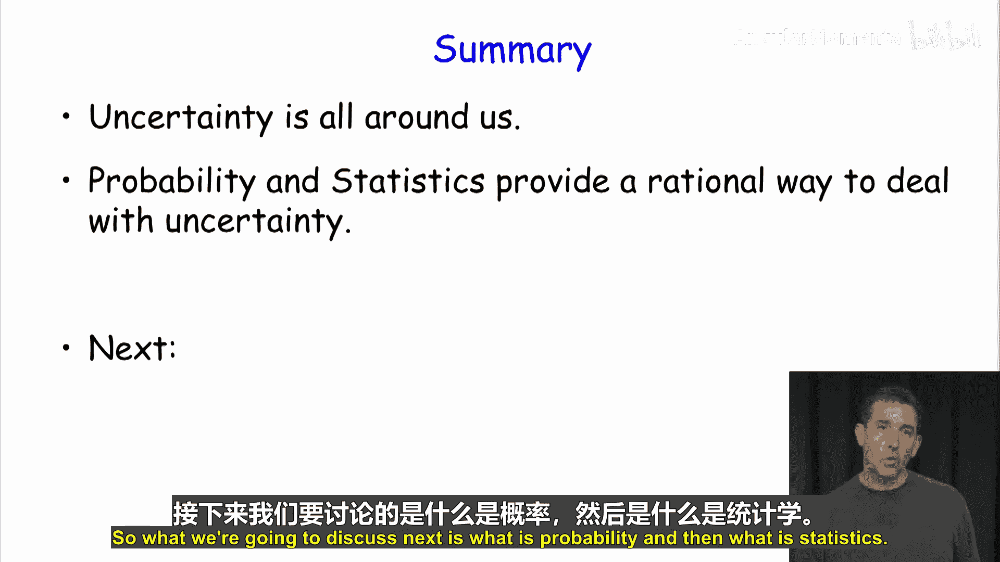

# 002：课程概览 📚

在本节课中，我们将学习概率与统计的基本概念，了解它们为何是处理不确定性的强大工具，并预览整个课程将要涵盖的核心内容。

## 课程简介

大家好，我是Yoav Freend，这是概率与统计入门课程。这是第一个视频，因此是概率与统计的入门介绍。

我们将讨论概率，粗略地说，这涉及掷骰子之类的事情。我们也将讨论统计，粗略地说，这涉及记录棒球比赛得分之类的事情。

## 为何要学习概率与统计？

学习概率与统计，主要是因为它们是处理不确定性的非常强大的工具。

考虑以下示例：谷歌试图为我们提供从A点到B点的最佳路线。这里显示了两条路线：一条是最短路线，另一条是最快路线。

如果我们考虑从A到B的最短路线，一旦我们知道道路是如何构建的，这就是一个确定的事情。另一方面，从A到B的最快路线，则取决于交通状况和其他条件，这确实是我们存在很多不确定性的地方，因此我们需要统计学来帮助我们处理这种不确定性。

以下是另一个例子：搜索引擎。假设你有一个搜索引擎，正在寻找一些信息。你可以进行的第一类查询是确定性查询，例如查找所有包含“特朗普”或“希拉里”以及“辩论”这些词的网页。这是一个非常具体的条件，你可以要求搜索引擎查找所有这些页面。另一方面，更相关的做法可能是询问“特朗普和希拉里辩论”这个查询最相关的10个页面。这不是一个具有明确定义答案集合的查询，它涉及这些页面中出现了哪些词、哪些页面真正最相关、最新等等，这些我们都存在不确定性。

最后一个例子是关于保险公司的。对于保险公司，你有一份合同，其中明确规定：如果你在这家公司购买了人寿保险并且你去世了，那么保险公司必须向你的家人支付规定数额的美元。这是确定的事情。另一方面，保险公司本身必须处理大量的不确定性。它不知道哪些人会去世，因此它必须计算出最低的人寿保险费是多少，使得保险公司在10年内破产的概率小于，比如说1%（可能远小于这个数字）。无论如何，公司需要以某种方式处理的是，有多少投保人会去世以及需要支付多少赔偿金的不确定性。这就是我们需要处理不确定性的情况。

## 本课程将学习什么？

首先，我之前展示的导航、搜索引擎以及人寿保险市场，这些都是非常高级的问题。你在这里将学习的是这些方法所基于的基础。

你将解决在不确定性下进行推理的基本问题。例如，你将知道如何回答这类问题：如果你抛一枚硬币100次，得到至多10次正面的概率是多少？或者在扑克牌中拿到四条（四张相同点数的牌）的概率是多少？这些都是你将能够回答的问题。

如果你对计算机科学示例感兴趣，这里还有一些你可能能够回答的其他问题：假设你有一个包含一百万个元素的哈希表，你希望最多只有10个元素的间接寻址次数不超过5次，那么这个表需要多大？这是你将能够进行的计算。一个类似的问题是：假设你有一个路由器，该路由器偶尔会故障，故障率大约是每年一次。这给了你一些信息，但你可能想知道，给定它平均每年故障一次，它在第一个月内发生故障的概率是多少？这是你将能够回答的问题。

并非所有人都相信统计学。这里有一个来自篮球教练的例子，他不相信统计学，因为存在太多其他因素等等。确实有很多人基本上不想信任统计学，这没关系。但另一方面，你可以说，在同一领域（这里指篮球）工作的许多其他人确实信任统计学。这是一个为篮球迷提供不同球员统计数据的应用程序，这样他们就可以玩梦幻篮球并赢得很多钱。

## 总结

总而言之，当我们在世界上做任何事情时，我们周围都充满了不确定性。概率与统计提供了一种理性的方式来应对不确定性。

接下来我们将讨论什么是概率，然后是什么是统计学。我们下次见。