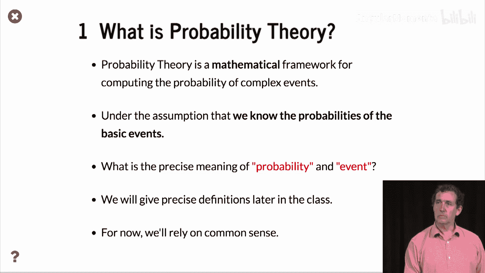
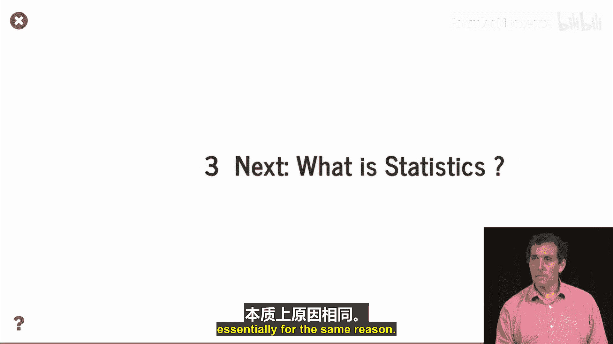

# 003：概率论入门 🎲


在本节课中，我们将学习概率论的基本概念。我们将通过一个简单的抛硬币实验，来理解概率论如何描述和分析随机事件，并初步探讨概率论与统计学的区别。

## 什么是概率论？



上一节我们介绍了课程的两个主要部分：概率论与统计学。本节中，我们来看看什么是概率论。


概率论是计算复杂事件概率的数学框架。这个定义听起来有些复杂。它的基本假设是，我们知道基本事件的概率。这里的“概率”和“事件”具体指什么，我们将在后续课程中精确定义。目前，我们可以先从常识角度来理解。

## 抛硬币实验

为了理解概率，让我们思考一个简单的问题：抛硬币。

我们抛一次硬币，得到反面。我们再抛一次，得到正面。我们通常相信，得到正面和反面的概率是相等的。但这究竟意味着什么？这是否意味着我们抛出的正面和反面次数会完全相等？并非如此。它的意思是，如果我们抛很多次硬币，比如抛10000次，那么正面出现的次数大约会是5000次。这就是我们的预期。

但“大约”是什么意思？我们如何更好地表达“大约”这个概念？因为我们可能实际上想知道，结果与预期值之间的偏差有多大。

## 模拟抛硬币

我们将使用伪随机数生成器来模拟抛硬币。为了计算方便，我们用 `+1` 代表正面，用 `-1` 代表反面。那么，正面的数量就与所有这些 `+1` 和 `-1` 的总和有关。我们期望这个总和是 `0` 或接近 `0`。

我们将改变抛硬币的次数，用 `k` 表示。以下是生成此类随机抛硬币结果的部分代码：

```python
# 生成随机抛硬币结果（+1 或 -1）
coin_flips = np.random.choice([1, -1], size=k)
# 对抛硬币结果序列求和
total_sum = np.sum(coin_flips)
```

我们生成了许多序列（默认 `n=100` 个序列），并观察总和的分布。完整的代码细节可以在课程配套的笔记本中找到。

下图是一个直方图，展示了抛掷1000次硬币时，总和 `S` 的分布情况。正如我们所看到的，总和并非正好是 `0`。每次重新运行这个实验，得到的直方图都略有不同。然而，尽管每次都有所不同，所有这些抛硬币实验都有一个非常共同的特点：它们都集中在 `0` 附近，但并非正好是 `0`。对于1000次抛掷，总和低于 `-250` 或高于 `250` 的可能性极小。

## 概率论的解释

通过概率论，我们可以计算出总和 `S` 的绝对值（因为它可以是负数或正数）的预期范围。我们将证明，总和 `Sk` 大于 `4 * sqrt(k)` 的概率是极小的，大约是 `2 * 10^{-8}` 或 `0.000002%`。这意味着我们需要重复进行很多很多次1000次抛硬币的序列，才可能看到总和超过 `4 * sqrt(k)`。

让我们通过模拟来验证这一点。在模拟中，我们分别进行了100次、1000次和10000次抛硬币实验。红色标记线表示概率论预测的边界，在这个边界内，抛硬币的总和极有可能出现。

每次重新运行实验，分布都有些不同，但它从未超出红色标记线。这与我们的理论预测一致。

如果我们不按边界缩放，而是绘制完整的尺度，我们会看到：随着抛硬币次数 `k` 的增加，分布相对于总范围（例如，从 `-k` 到 `k`）而言，越来越集中在 `0` 附近。分布的宽度与 `sqrt(k)` 成正比。

## 实验总结

我们进行了一些实验，对 `k` 个对应于抛硬币的随机数（`X` 为 `-1` 或 `+1`，概率各半）进行求和。

我们的实验表明，总和几乎总是在 `[-4 * sqrt(k), +4 * sqrt(k)]` 这个范围内。

我们可以这样表述：当 `k` 趋近于无穷大时，范围 `4 * sqrt(k)` 除以 `k`，即 `4 / sqrt(k)`，会趋近于 `0`。因此，我们可以说，`Sk / k`（即正面与反面次数之差除以总次数）趋近于 `0`。这基本上就是我们所说的概率各为一半的含义。

## 概率论的本质

那么，什么是概率论？它就是通过数学方法，精确地证明我们上面所做的陈述。之前我们只是进行了模拟，并提到了未来将证明的内容。但概率论的本质正是以精确的方式证明这些结论。

在大多数情况下，我们可以使用模拟（称为蒙特卡洛模拟）来近似计算这些概率，这基本上就是我们上面所做的小实验。

但这为什么不够呢？首先，计算概率能给出精确答案，而蒙特卡洛模拟只能给出近似值，并且需要运行更长时间才能获得更准确的答案。其次，计算概率通常比蒙特卡洛模拟快得多，本质上也是出于同样的原因。

## 课程总结



本节课中，我们一起学习了概率论的基本介绍。我们通过抛硬币实验，理解了概率论如何描述随机事件的长期规律，即大量重复试验中频率的稳定性。我们看到了实验总和 `Sk` 与 `sqrt(k)` 成正比的关系，并理解了 `Sk/k` 趋近于 `0` 是概率均等的数学表达。最后，我们区分了精确的概率计算与近似的蒙特卡洛模拟。


下一节，我们将探讨什么是统计学。