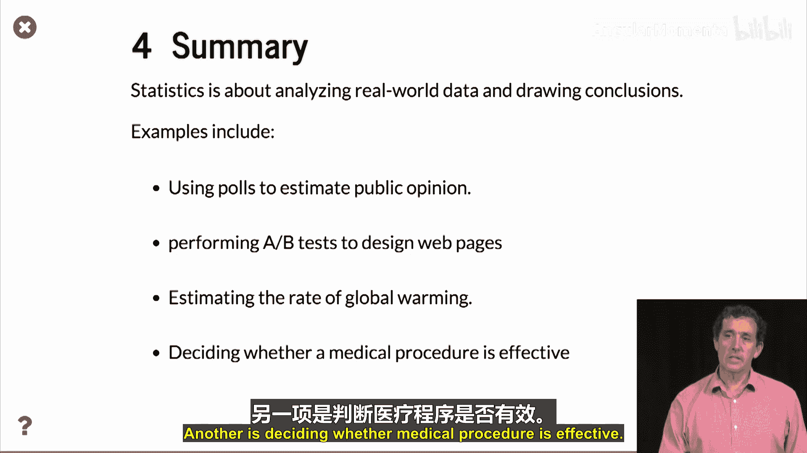

# 004：统计学 📊

在本节课中，我们将要学习**统计学**的基本概念，了解它如何与概率论相辅相成，并探索其在现实世界中的应用，如民意调查和A/B测试。

上一节我们介绍了**概率论**，它从已知的基础分布出发，计算复杂事件的概率。本节中我们来看看**统计学**，它处理问题的方向恰恰相反。

在统计学中，我们面对的是由某个随机过程生成的数据。我们的目标是从这些数据中，推断出该随机过程的性质。

## 从抛硬币到统计推断 🪙

让我们回到抛硬币的例子。我们假设一枚硬币是公平的（即正反面概率各为50%）。但我们如何验证这一点？

以下是统计推断的逻辑：
我们首先假设硬币是公平的。然后，我们计算在此假设下，观察到特定结果（例如，抛1000次得到570次正面）的概率。如果这个概率极小，我们就有信心**拒绝**“硬币公平”的假设，并认为硬币可能是有偏的。

### 如何计算概率？

回忆我们之前模拟抛硬币时，用 `+1` 代表正面，`-1` 代表反面。抛掷 `k` 次后，将所有结果求和得到 `S_k`。

*   如果正面次数为570，反面为430，则 `S_k = 570*(+1) + 430*(-1) = 140`。
*   根据概率论中的一个结论（将在后续课程中证明），对于公平硬币，`|S_k|` 的值极不可能超过 `4 * sqrt(k)`。
*   当 `k=1000` 时，`4 * sqrt(1000) ≈ 126.5`。由于 `140 > 126.5`，因此观察到 `S_k = 140` 的概率极低。

由此，我们可以很有信心地得出结论：硬币很可能是有偏的。

如果正面次数是507呢？此时 `S_k = 507 - 493 = 14`，远小于126.5。这意味着，一个公平硬币产生此结果的概率是相当大的。因此，仅凭507次正面这个数据，我们**无法**得出硬币有偏的结论。

## 现实世界中的统计学应用 🌍

统计学不像概率论是纯数学分支，它直接解决现实世界的问题。以下是一些将“判断硬币是否公平”的逻辑应用于实际场景的例子。

### 1. 民意调查

假设即将举行一场只有D党和R党参与的选举。我们想知道选民的整体投票意向。询问所有选民成本过高，因此我们采用**民意调查**：随机选取一小部分人，询问他们的投票计划，然后据此推断整体情况。

数学上，这完全等同于抛掷一枚有偏的硬币（选民选择D党或R党），并判断正面（D党）出现的概率是否大于反面（R党）。

### 2. A/B测试

在网页界面设计中，A/B测试非常普遍。例如，我们有两个备选设计方案A和B（比如某个按钮在屏幕左侧或右侧）。为了判断用户更喜欢哪个设计，我们在用户访问网站时，随机展示设计A或B。

然后，我们测量用户停留时间、广告点击率等指标，来判断哪个设计更优。这同样类似于判断一枚“有偏硬币”（用户偏好）更倾向于哪一面。

除了上述例子，统计学还广泛应用于许多其他领域，例如：
*   估算全球变暖的速度。
*   判断某种医疗程序是否有效。
*   这些应用虽然更复杂，但核心的统计推断思想是相通的。

## 总结 📝

本节课中我们一起学习了：
*   **统计学**的目标：从随机过程生成的数据中，推断该过程的性质。
*   统计推断的基本逻辑：先建立假设（如“硬币公平”），再计算在该假设下观察到实际数据的概率，根据概率大小决定是否拒绝该假设。
*   统计学的现实应用：包括**民意调查**和**A/B测试**等，它们本质上都是对“有偏硬币”问题的建模与求解。

本节结束了对概率与统计的概述。接下来，我们将开始深入探讨如何进行具体的概率计算。