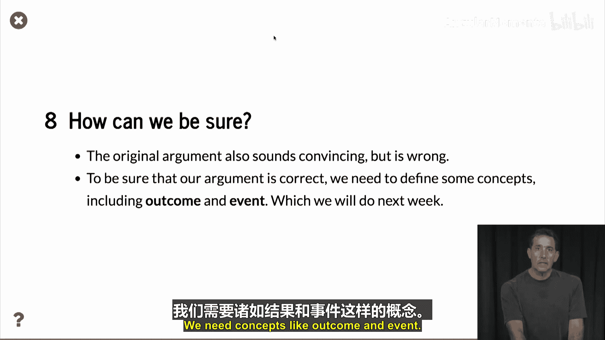

# 005：三卡拼图 🃏

在本节中，我们将通过一个名为“三卡拼图”的实际例子，探讨为什么需要严谨的概率论概念来解决看似简单的问题。我们将分析一个涉及三张特殊卡片的游戏，并揭示直觉推理可能导致的错误结论。

---

在之前的视频中，我简要解释了什么是概率。你可能会疑惑，为什么需要所有这些数学知识？它真的能帮助解决现实世界的问题吗？这里我将给出一个小谜题，这是一个非常自然的谜题，并非人为构造。我请你思考如何解答这个名为“三卡拼图”的问题。

想象你有一顶帽子，里面有三张卡片。

第一张卡片一面是红色，另一面是蓝色。
第二张卡片两面都是蓝色。
第三张卡片两面都是红色。

让我展示给你看：这是一张一面红一面蓝的卡片，这是一张两面红的卡片，这是一张两面蓝的卡片。很简单。我们将这些卡片放入帽子中并混合。

然后我们进行以下操作：我们随机抽取一张卡片，并将其放在桌子上。例如，这里桌子上有一张蓝色面朝上的卡片。我们称朝上一面的颜色为 **U**，它可以是蓝色（B）或红色（R）。

以下是游戏规则：如果卡片另一面的颜色**不同**，我付给你1美元。如果另一面的颜色**相同**，你付给我1美元。我认为这是公平的。为什么？假设朝上的是蓝色（实际上例子中就是蓝色），那么这张卡片可能是两面蓝的卡片，也可能是一面蓝一面红的卡片。所以有两种可能：另一面是红色，或者另一面是蓝色。两者发生的概率相同，因此1比1的赔率是公平的。

让我们看看这次的结果。实际上我翻到了红色，所以我付给你1美元。

为了确定赢得或失去1美元的概率，我们可以像之前一样使用蒙特卡洛模拟。我们将编写一个小程序，随机生成卡片的顺序，选择一张卡片，然后选择卡片的一面，最后打印出卡片以及哪一方获胜的结果。

以下是蒙特卡洛模拟的结果，你可以重新运行它。

每次运行都会得到略有不同的结果，但如果你看下面显示的数字，“不同”出现了17次，“相同”出现了33次。显然，“不同”发生的情况远少于“相同”。所以，尽管这个游戏看起来简单，但它对你不公平，平均来说我会从中赚钱。

正如我们所看到的，模拟结果与我们之前的论证不符。之前的论证一定是错误的。在模拟中，两面颜色相同的次数大约是颜色不同的两倍，因此其概率也大约是两倍。这意味着，如果你玩这个游戏，你输掉1美元的可能性大约是你赢得1美元的两倍。

因此，平均而言，你每次游戏会损失33美分，因为你以2/3的概率输掉1美元，以1/3的概率赢得1美元。

这里有一个替代论证：如果我们随机抽取一张卡片，那么有2/3的概率抽到两面颜色相同的卡片，只有1/3的概率抽到两面颜色不同的卡片。这基本上解释了我们所看到的现象。

所以，现在我们似乎理解了这个游戏。但问题是，最初的论证听起来也很有说服力，但它是错误的。那么，在不进行模拟的情况下，我们如何区分这个论证和另一个论证，并判断哪个是正确的？模拟固然可行，但有时正如你所见，运行模拟来回答概率问题可能很困难，你需要运行很长时间，而且只能得到近似结果。

因此，为了确保我们的论证正确，我们需要更形式化的理论。这就是本节视频的重点。我们需要诸如“结果”和“事件”这样的概念，这些内容我们将在下周开始讨论。

---

## 本节总结

在本节中，我们一起学习了“三卡拼图”游戏。通过这个例子，我们看到了直觉推理在概率问题中可能导致错误结论。我们使用蒙特卡洛模拟揭示了游戏的真正概率分布：抽到两面颜色相同的卡片的概率是2/3，而抽到两面颜色不同的卡片的概率是1/3。这解释了为什么游戏对玩家不公平。最后，我们认识到，为了严谨地分析和解决此类问题，需要引入更形式化的概率论概念，如“结果”和“事件”，这将是我们后续课程的重点。