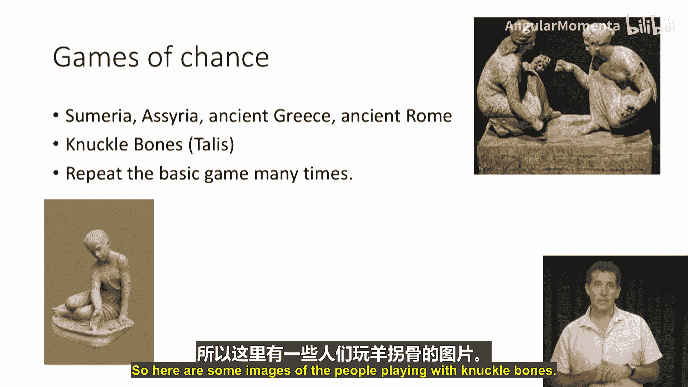
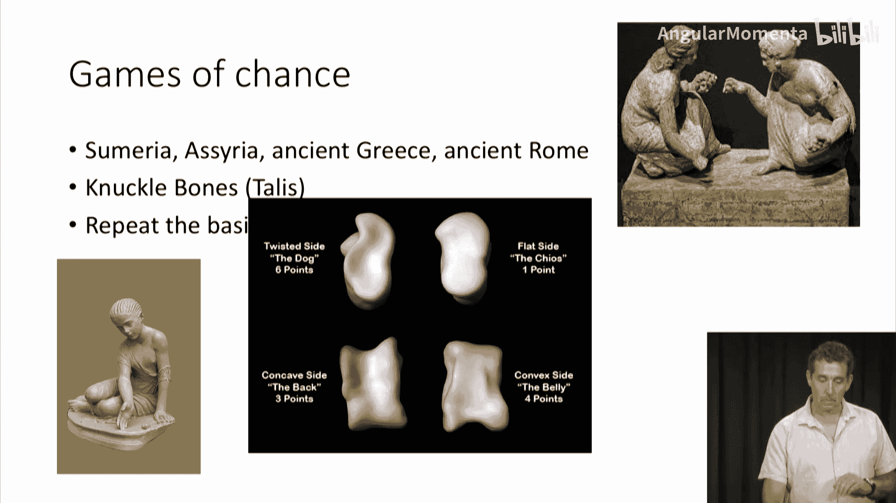
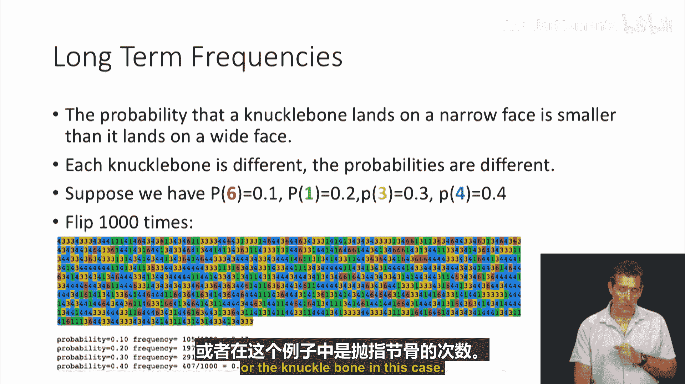

# 006：概率论与统计学发展史 📜

在本节课中，我们将学习概率论与统计学的发展简史。了解这段历史有助于我们理解概率与统计学的整体框架，以及人们通常会提出哪些类型的问题。我们将看到，这些问题主要分为两大类。

## 概述

现代形式的概率与统计学大约始于1650年。然而，历史上人们提出的问题总体上可以分为两大类：一类是**重复的机遇游戏**，另一类是关于**证据强度与信念程度**的问题。下面的图表展示了这两条主线在历史上的许多重要事件，我们将在后续视频中详细解读。现在，我们先来了解一些主要组成部分。请记住，红色部分代表“机遇游戏”，蓝色部分则关乎“信念程度”。

## 机遇游戏 🎲

机遇游戏的历史非常悠久，远在1600年之前，甚至可能早于公元前就已存在。

最早的这类游戏基于所谓的“距骨”或“骰子”，这些是从山羊身上取下的骨头，被用来玩游戏。这类游戏的一个重要特点是它们会被**反复进行**多次。上图展示了人们玩距骨游戏的场景。

当然，今天我们有许多不同类型的机遇游戏，例如骰子、轮盘赌、纸牌和抛硬币等。在概率论为人所知之前，这通常被视为检验运气或解读神意的方式。

玩这些游戏时，最简单的假设是**等概率假设**。例如，一个骰子有六个面，每个面出现的概率就是 `1/6`；一枚硬币每面出现的概率是 `1/2`。你仅仅因为游戏道具的设计而假设所有结果出现的可能性相同。这是概率论最简单的设定，我们将会大量使用它。但并非所有情况都符合这个假设，例如骰子和轮盘赌符合，但距骨不符合，因为距骨是不对称的，落在不同面上的概率并不相同。

那么，当我们说距骨不同结果具有不同概率时，这意味着什么？如前所述，距骨落在窄面上的概率小于落在宽面上的概率。每个距骨都不同，因此概率也不同。但我们现在假设四个面的概率分别为 `0.1`、`0.2`、`0.3` 和 `0.4`，每个面对应你获得的点数。

我们可以通过模拟来验证。你可以下载相关笔记本来模拟投掷距骨多次并观察结果。例如，我们投掷1000次。下图展示了1000次结果的序列，底部统计了每个结果出现的次数（如105次、197次等）。当我们根据总次数进行归一化后，得到的频率（`0.105`、`0.197`、`0.29`、`0.41`）非常接近我们设定的真实概率（`0.1`、`0.2`、`0.3`、`0.4`）。

这就是我们所说的**长期频率**。长期频率的基本假设是：当你将某物投掷很多、很多次时，每个可能结果出现的次数占总次数的比例会收敛于某个固定数值。当然，这取决于你投掷的次数。如果我们只投掷100次，得到的频率与真实概率的差距就会变大。如果只投掷10次，那么概率为 `0.3` 的结果可能一次都没出现，频率为 `0`。因此，当重复游戏的次数很少时，你得到的结果可能与概率无关；但从长期来看，你会得到长期概率。

以上就是关于概率可以提出的问题类型。一个著名的例子是1654年帕斯卡写给费马的信中提出的问题：假设有一个纯靠运气的纸牌游戏，双方各投入1美元，赢家拿走全部2美元。如果游戏在决出胜负前被迫中止，双方必须分开，那么每个人应该拿走多少钱？要回答这个问题，你需要说：给定玩家一手中的牌，他在游戏结束时获胜的**概率**是多少？帕斯卡为某些情况解决了这个问题，并将其写在信里寄给了费马。这是一个关于机遇游戏、频率和概率的经典问题。

这就是**频率主义**的观点。它基本上认为，概率的唯一含义是：当你对许多人或许多情况重复相同的游戏或试验很多、很多次时，你得到的结果会收敛于这些概率。这就是概率的意义。这为概率论的大部分数学构建了基础，在游戏、民意调查等情境中是合理的。

## 信念与证据强度 🧠

然而，并非所有情况都适合将概率视为重复多次相同游戏的结果。以下是一些例子。

假设气象学家说明天下雨的概率是 `10%`。这意味着什么？明天要么下雨，要么不下雨。而明天只会发生一次，你无法重复同一个明天很多次。因此，你不能真的将这 `10%` 的概率理解为“如果重复同一天很多次，有 `10%` 的时间会下雨”，因为那一天只发生一次。

类似地，假设外科医生告诉你，你正在考虑的某个特定手术出现并发症的概率是 `2%`。这可能意味着 `2%` 接受该手术的患者出现了并发症。这是一个合理的含义。但这对你个人意味着什么？也许大多数并发症发生在90岁以上的患者身上，而你只有35岁，那么这个 `2%` 对你来说可能毫无意义。

这引导我们走向另一种类型的概率，它与**置信度**、**衡量证据**以及**量化观点**有关。如果我们回溯到1650年以前，人们使用“可能的”这个词，但其含义并非量化的。即使在今天，如果你说“这很可能”或“probably”，它也没有任何量化含义。韦氏词典给出的定义是：“在似乎合理真实、符合事实、可预期或没有太多怀疑的范围内”。所有这些基本上都是在说“很可能意味着非常可能发生”或“我相当确定它会发生”，这很常见，但与数学、与机遇游戏无关。

1650年之前使用的一个术语“probable doctor”（可能的医生），展示了“可能的”这个词是如何被使用的。它的意思是“被某个权威机构批准的医生”。在当时欧洲的语境下，“批准”通常意味着教会。因此，“可能的”这个含义与我们今天直观的理解非常不同。今天，医学博士也需要通过委员会考试获得认证，才能成为“好医生”或“委员会认证的医生”，所以我们与那时在本质上并无太大不同，尽管用词不同。

现在，让我们思考医生面临的问题类型。如果你想诊断一个病人，需要整合许多不同的信息片段。下图展示了进入诊断过程的不同类型信息：患者访谈、体格检查、病史、医学检查等。

大多数信息都是不确定的。你并不确切知道一个人的血液成分，特定样本的结果可能每天都有变化。此外，不同的信息片段具有不同的相关性。血液检查结果可能相关性不大，而X光片可能揭示很多信息，或者MRI可能揭示很少。当你处于这种情况时，你拥有来自不同地方的信息。对于每一片信息，你都想以某种方式关联你当前的置信度。医生在很大程度上是凭直觉做到这一点的，但这类问题无处不在，不仅限于医学。

当我们谈论**整合证据**时，我们谈论的是医学、经济学、投资、法律、科学、技术等许多领域的核心问题，它们都依赖于整合证据。如果人们想定量地做这件事，就会使用概率和统计学。通常，你并不会多次重复一个实验。在某些特定情况下你会，但在你或医生面临的大多数重要决策中，他们只有**这一个**需要治疗的病人，因此说“某事的概率是多少”并没有实际意义。

这方面的数学由概率论提供，但围绕它的大部分讨论并非数学性的。它确实与**说服**以及**如何比较不同证据**有关。其中一些是数学，但很多是讨论，这就是你在统计学中会遇到的情况，你并不会得到非常明确的结果。将所有这些纳入一个通用框架的流行方法是**贝叶斯统计学**。贝叶斯统计学的核心是如何评估证据以及如何整合证据。尽管从根本上它们使用相同的数学，但它并不采取与频率主义相同的方法。

## 总结

以上就是大致的介绍。图表中有更多细节，在未来的视频中，我将带您详细了解这张图，并讲述更多细节。

本节课中，我们一起学习了概率论与统计学的简要发展史。我们了解到，现代概率统计起源于17世纪中叶，其核心问题主要沿着两条主线发展：一是基于**长期频率**的“机遇游戏”问题，形成了**频率主义**学派；二是关于**证据强度与主观信念**的问题，这引出了**贝叶斯统计学**。理解这两种不同的视角，对于我们后续深入学习概率与统计的数学细节和应用场景至关重要。