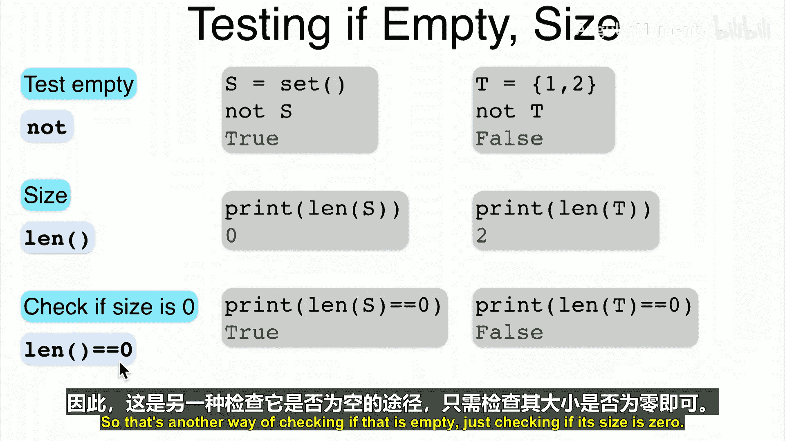

# 007：元素、集合与隶属关系 👨‍🏫


在本节课中，我们将开始学习集合论的基础知识。我们将首先为事物命名，以便精确而简洁地描述它们。具体内容包括：元素、集合、一些常见的集合、隶属关系，以及空集与全集。

## 元素与集合 🧱

上一节我们介绍了课程目标，本节中我们来看看集合论的基础构件。

集合的基石是元素。元素是如此基本，我们可以将其视为“原子”。元素可以是任何事物，例如著名运动员莱奥西、科技公司谷歌或常用药物阿司匹林。

在实际应用中，我们处理的元素通常更具结构性，例如字母、单词、文档或网页。由于我们关注概率与统计，因此会大量讨论数字。但为众多不同事物寻找图示可能变得繁琐，因此数字可能以抽象形式表示，但我们知道它们代表的是真正有趣的内容。

除了单个元素，我们常常需要关注更宏观的图景。为此，我们引入集合。集合就是元素的**集合**，“集合”与“收集”是同义词。定义一个集合，我们需要明确其包含的元素。

以下是定义集合的几种方法：

*   **列举法**：直接列出所有元素，并用大括号 `{}` 括起来。例如，硬币的两面可以表示为 `{正面, 反面}`。
*   **隐式描述法**：当集合较大时，可以省略部分元素并用“...”表示。例如，数字集合可以表示为 `{0, 1, ..., 9}`。
*   **描述法**：用语言描述集合的特性。例如，“所有四个字母的单词的集合”。

随着描述层级的提升，表达变得更紧凑、更具表现力，但也可能带来模糊性。因此，无论选择哪种方法，核心是确保定义清晰明确。

## 常见集合 📚

上一节我们了解了如何定义集合，本节中我们来看看一些在数学和计算机科学中常见的特定集合。

我们可以使用上述方法描述几个常见的集合：

*   **整数集 (Z)**：包含所有负整数、零和正整数，从负无穷到正无穷。记作 **Z**。
*   **自然数集 (N)**：包含零及所有正整数（0, 1, 2, 3, ...）。记作 **N**。
*   **正整数集 (P)**：包含所有大于零的整数（1, 2, 3, ...）。记作 **P**。
*   **有理数集 (Q)**：所有可以表示为两个整数之比的数（分子和分母都是整数，分母不为零）。记作 **Q**（代表商）。
*   **实数集 (R)**：包含所有有理数和无理数的集合。

注意，我们通常使用便于记忆的助记名称，例如 R 代表实数，Q 代表商（有理数），P 代表正数。整数集使用 Z 是因为它源自德语单词“Zahlen”（数字）。

我们将遵循一个方便的约定：使用**大写字母**（如 A, B, Z）表示集合，使用**小写字母**（如 x, y, a）表示元素。

## 隶属关系 ↔️

上一节我们认识了一些标准集合，本节中我们来看看如何描述元素与集合之间的关系。

一旦定义了集合，我们就需要说明哪些元素在集合内，哪些在集合外。

*   **属于**：如果元素 `x` 是集合 `A` 的成员，我们说 `x` 属于 `A`，记作 **`x ∈ A`**。
    *   例如：`0 ∈ {0, 1}`，`π ∈ R`（实数集）。
*   **包含**：等价地，我们也可以说集合 `A` 包含元素 `x`，记作 **`A ∋ x`**（这是 `∈` 符号的反转）。
    *   例如：`{0, 1} ∋ 0`，`R ∋ π`。

我们同样需要其对立面的表述：

*   **不属于**：如果元素 `x` 不在集合 `A` 中，我们说 `x` 不属于 `A`，记作 **`x ∉ A`**。
    *   例如：`2 ∉ {0, 1}`，`π ∉ Q`（有理数集）。
*   **不包含**：等价地，集合 `A` 不包含元素 `x`，记作 **`A ∌ x`**。
    *   例如：`{0, 1} ∌ 2`，`Q ∌ π`。

**小测验**：考虑“美国州”的集合。判断以下是否属于该集合：
*   加利福尼亚州：`∈` （属于）
*   佛罗里达州：`∈` （属于）
*   纽约州：`∈` （属于）
*   以色列国：`∉` （不属于）

在集合定义中，**元素的顺序和重复出现无关紧要**。集合 `{0, 1}` 与 `{1, 0}` 或 `{0, 1, 1, 1}` 是同一个集合。如果你需要考虑顺序或重复，则需要使用**有序元组**或**多重集**，这将在后续课程中讨论。

## 空集与全集 ⚫️⚪️

上一节我们讨论了元素与集合的一般关系，本节中我们来看看两个特殊的集合。

在所有集合中，有两个集合尤为特殊。

*   **空集 (∅ 或 {})**：不包含任何元素的集合。记作 **`∅`** 或 **`{}`**（这是Python中表示空集的方式）。
    *   空集的性质是：对于任何元素 `x`，都有 `x ∉ ∅`。
*   **全集 (Ω)**：包含所有可能元素的集合。记作 **`Ω`**。
    *   全集的性质是：对于任何元素 `x`，都有 `x ∈ Ω`。

引入全集 `Ω` 是为了让我们只关注相关的元素。例如，如果设定 `Ω = Z`（整数集），那么当我们谈论“质数”时，就明确指的是像2, 3, 5这样的数字，而不是亚马逊Prime会员或优质房地产。

需要注意的是，全集 `Ω` 取决于具体的应用场景。例如，讨论温度时，`Ω` 可能是实数集 `R`；讨论文本时，`Ω` 可能是所有单词的集合。**空集是唯一的**（因为没有元素的集合只有一个），但**全集可以有很多个**，随应用而变化。

## Python中的集合操作 💻

上一节我们学习了集合的数学概念，本节中我们来看看如何在Python中实现这些基本操作。

### 定义集合
在Python中，可以使用花括号 `{}` 或 `set()` 函数来定义集合。
```python
# 方法一：使用花括号
set_one = {1, 2}
print(set_one)  # 输出: {1, 2}

# 方法二：使用set()函数
set_two = set([2, 3]) # 传入一个列表
print(set_two)  # 输出: {2, 3}
```

### 定义空集
定义空集时，只能使用 `set()` 函数。使用 `{}` 定义的是空字典。
```python
# 正确方法
empty_set1 = set()
print(type(empty_set1)) # 输出: <class 'set'>
print(empty_set1)       # 输出: set()

# 这也是空集
empty_set2 = set([]) # 传入空列表
print(type(empty_set2)) # 输出: <class 'set'>

# 错误方法：这会创建一个空字典，而不是空集
not_a_set = {}
print(type(not_a_set)) # 输出: <class 'dict'>
```

### 测试隶属关系
使用关键字 `in` 和 `not in` 来测试元素是否属于集合。
```python
furniture = {"desk", "chair"}

# 检查元素是否在集合中
print("desk" in furniture)   # 输出: True
print("bed" in furniture)    # 输出: False

# 检查元素是否不在集合中
print("desk" not in furniture) # 输出: False
print("bed" not in furniture)  # 输出: True
```

### 检查集合是否为空及获取大小
使用 `len()` 函数获取集合中元素的数量（大小）。检查集合是否为空，可以判断其长度是否为0，或者直接使用 `not` 运算符（但后者可能不够直观）。
```python
S = set() # 空集
T = {1, 2}

# 方法一：使用 not 运算符 (不够直观)
print(not S) # 输出: True (S为空)
print(not T) # 输出: False (T不为空)

# 方法二：检查长度是否为0 (推荐)
print(len(S))        # 输出: 0
print(len(S) == 0)   # 输出: True (S为空)

print(len(T))        # 输出: 2
print(len(T) == 0)   # 输出: False (T不为空)
```

## 总结 📝



本节课中我们一起学习了集合论的基础知识：
1.  **元素与集合**：元素是构成集合的基本单位，集合是元素的聚集。
2.  **常见集合**：我们认识了整数集(Z)、自然数集(N)、有理数集(Q)、实数集(R)等标准数学集合。
3.  **隶属关系**：学习了如何使用符号 `∈`（属于）和 `∉`（不属于）来描述元素与集合的关系。
4.  **特殊集合**：了解了唯一的**空集 (∅)** 和依赖于上下文的**全集 (Ω)**。
5.  **Python实现**：掌握了在Python中定义集合、测试隶属关系以及检查集合是否为空的方法。


下一节课，我们将探讨更多关于集合的基本操作。