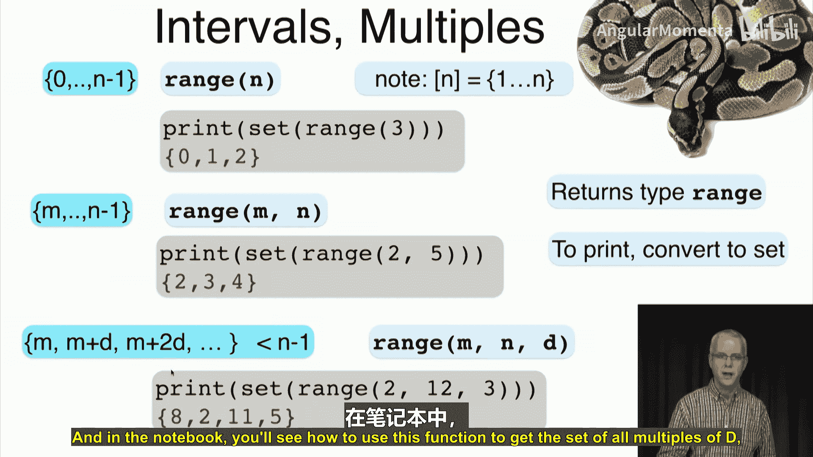

# 008：若干简单集合 📚

在本节课中，我们将学习如何定义和表示几种基础的集合类型，包括区间、倍数集合等。这些工具对于后续理解更复杂的概率与统计概念至关重要。

上一节我们介绍了集合的基本概念，本节中我们来看看如何定义一些更具体的、常用的简单集合。

## 定义集合的通用方法

我们可以通过“满足某条件”的方式来定义一个集合。其通用写法是：`{ x ∈ A | 条件 }`。这表示“所有属于集合A且满足给定条件的元素x的集合”。

有时，我们也会用冒号`:`来代替竖线`|`。例如，自然数集可以定义为：`{ x ∈ Z | x ≥ 0 }`，即所有大于等于0的整数。

这种方法非常有用，例如：
*   `{ x ∈ R | x² ≥ 0 }` 的结果是全体实数集 `R`。
*   `{ x ∈ R | x² = 1 }` 的结果是集合 `{-1, 1}`。
*   `{ x ∈ R | x² = 0 }` 的结果是只包含一个元素的集合 `{0}`，我们称之为**单元素集**。
*   `{ x ∈ R | x² = -1 }` 的结果是空集 `∅`，因为没有实数的平方等于-1。但如果我们定义 `{ x ∈ C | x² = -1 }`（在复数范围内），结果就是 `{i, -i}`。这说明集合的定义也依赖于我们限定的**全集**。

## 整数区间

基于上述方法，我们可以定义一些简单的集合。首先是**整数区间**。

定义 `M..N` 为所有满足 `M ≤ i ≤ N` 的整数 `i` 的集合。这是一个**闭区间**，包含端点M和N。

例如：
*   `3..5` 是集合 `{3, 4, 5}`。
*   `3..4` 是集合 `{3, 4}`。
*   `3..3` 是单元素集 `{3}`。
*   `3..2` 是空集 `∅`，因为没有整数同时满足 `≥3` 和 `≤2`。

一个方便的约定是，用 `[N]` 来表示集合 `1..N`，即从1到N的所有整数。

## 实数区间

类似于整数区间，我们可以定义**实数区间**。方括号 `[` 和 `]` 表示包含端点，圆括号 `(` 和 `)` 表示不包含端点。

以下是几种常见的实数区间表示法：
*   `[a, b] = { x ∈ R | a ≤ x ≤ b }` （闭区间）
*   `(a, b) = { x ∈ R | a < x < b }` （开区间）
*   `[a, b) = { x ∈ R | a ≤ x < b }` （左闭右开区间）
*   `(a, b] = { x ∈ R | a < x ≤ b }` （左开右闭区间）

例如：
*   `[3, 5]` 包含3和5以及之间的所有实数。
*   `(3, 5)` 包含3和5之间的所有实数，但不包含3和5本身。
*   `[3, 5)` 包含3以及3到5之间的实数，但不包含5。

一些特例：
*   `[3, 3]` 是单元素集 `{3}`。
*   `[3, 2]`, `(3, 2]`, `[3, 2)` 都等同于空集 `∅`。

## 整除与倍数

接下来，我们引入整数之间**整除**的概念。

对于两个整数 `m` 和 `n`，如果存在某个整数 `c` 使得 `n = c * m`，那么我们就说 **`m` 整除 `n`**，记作 `m | n`。同时，`n` 是 `m` 的一个**倍数**。

公式：`m | n ⇔ ∃ c ∈ Z, 使得 n = c * m`

例如：
*   `3 | 6`，因为 `6 = 2 * 3`。
*   `4 | -8`，因为 `-8 = -2 * 4`。
*   `-2 | 0`，因为 `0 = 0 * (-2)`。

如果不存在这样的整数 `c`，则称 `m` 不整除 `n`，记作 `m ∤ n`。例如，`3 ∤ 4`。

关于0需要注意：
*   `0` 是任何整数的倍数吗？不是。因为对于任何非零整数 `n`，不存在 `c` 使得 `n = c * 0`。所以 `0 ∤ n` (n ≠ 0)。
*   任何整数都整除 `0` 吗？是的。因为对于任何整数 `m`，`0 = 0 * m` 总是成立。所以 `m | 0` 对所有 `m` 成立。

让我们通过几个小问题来巩固理解：
*   **3的倍数有哪些？** `{..., -6, -3, 0, 3, 6, ...}`
*   **1的倍数有哪些？** 所有整数，因为任何整数 `n` 都可以写成 `n = n * 1`。
*   **0的倍数有哪些？** 只有 `0` 本身。
*   **4的因数（能整除4的数）有哪些？** `{1, 2, 4, -1, -2, -4}`
*   **能整除0的数有哪些？** 所有整数。
*   **能整除任何非零整数的数有哪些？** `1` 和 `-1`。

## 倍数集合

利用整除的概念，我们可以定义特定的倍数集合。

令 `m` 为一个整数，我们用 `mZ` 表示所有 `m` 的整数倍构成的集合。
定义：`mZ = { i ∈ Z | m | i }`

例如：
*   `2Z = {..., -4, -2, 0, 2, 4, ...}`，也称为**偶数集** `E`。
*   `1Z = Z`，即所有整数。
*   `0Z = {0}`。

更进一步，对于正整数 `n`，我们定义 `D_m(n)` 为在集合 `[n]`（即 `{1, 2, ..., n}`）中，所有 `m` 的倍数构成的集合。
定义：`D_m(n) = { i ∈ [n] | m | i }`

例如：
*   `D_3(13) = {3, 6, 9, 12}` （1到13中3的倍数）
*   `D_7(13) = {7}`
*   `D_1(13) = {1, 2, 3, ..., 13} = [13]`
*   `D_14(13) = ∅` （因为14 > 13，1到13中没有14的倍数）

## 在Python中实现

最后，我们看看如何在Python中表示这些概念。

**整数区间**：Python使用 `range` 函数。需要注意的是，`range(n)` 生成 `0, 1, ..., n-1`，这与我们的 `[n]`（从1开始）不同，因为Python索引通常从0开始。

```python
# 生成 0, 1, 2
set(range(3))
# 生成 2, 3, 4 （注意：range(2,5) 包含2，不包含5）
set(range(2, 5))
# 生成步长为3的序列：2, 5, 8, 11
set(range(2, 12, 3))
```

**倍数集合**：我们可以结合 `range` 和取余操作符 `%` 来生成。例如，生成1到n中d的倍数：

```python
n = 13
d = 3
# 列表推导式：遍历1到n，筛选出能被d整除的数
multiples = [i for i in range(1, n+1) if i % d == 0]
print(multiples)  # 输出: [3, 6, 9, 12]
```



## 总结

本节课中我们一起学习了如何定义和使用几种基础的集合工具：
1.  **描述法定义集合**：使用 `{x ∈ A | 条件}` 的形式。
2.  **整数区间**：`M..N` 和 `[N]`。
3.  **实数区间**：开区间 `(a,b)`、闭区间 `[a,b]` 及其混合形式。
4.  **整除与倍数**：`m | n` 表示 `m` 整除 `n`，`n` 是 `m` 的倍数。
5.  **倍数集合**：`mZ` 表示所有 `m` 的整数倍；`D_m(n)` 表示1到n中 `m` 的倍数。
6.  **Python实现**：使用 `range()` 函数和列表推导式来生成序列和倍数集合。


这些集合是构建更复杂数学对象的基石。下一节，我们将学习如何可视化这些集合，以便更直观地理解它们之间的关系。