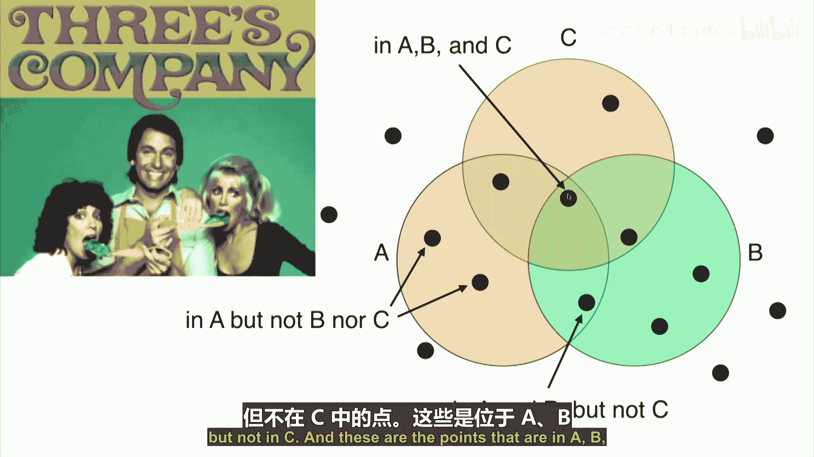
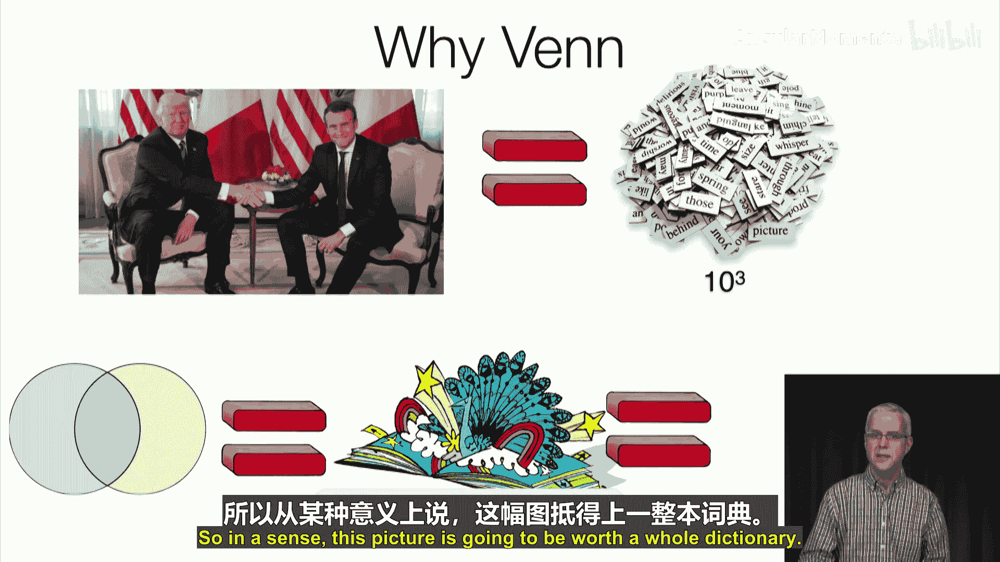
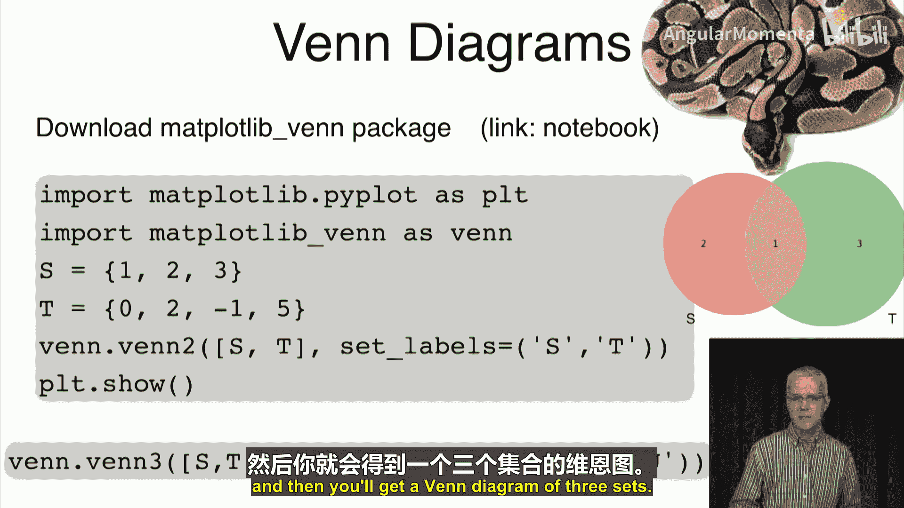

**概率与统计在数据科学中的应用：P9-3：集合的可视化** 🎨

在本节课中，我们将学习如何可视化集合。集合是概率论和数据分析的基础，而可视化能帮助我们更直观地理解集合之间的关系及其运算。

---

上一节我们介绍了集合的定义与创建，本节中我们来看看如何将集合以图形化的方式呈现。正如我们所知，可视化是理解复杂概念的有力工具。对于集合而言，最经典的可视化工具是**维恩图**。

维恩图以数学家约翰·维恩的名字命名。他将集合表示为平面上的一个区域，通常是一个圆形。集合中的元素则表示为该区域内的点。

*   对于单个集合，我们画一个圆，圆内的点属于该集合，圆外的点则不属于。
*   对于两个集合，我们画两个可能重叠的圆。重叠区域（交集）内的点同时属于两个集合，而不重叠区域内的点只属于其中一个集合。
*   对于三个集合，我们画三个相互重叠的圆，这样可以清晰地展示出所有可能的组合区域（例如，只属于A的区域、同时属于A和B的区域、同时属于A、B和C的区域等）。

为什么维恩图如此重要？因为一图胜千言。在处理集合和概率问题时，维恩图可以将冗长的文字证明和定义转化为直观的视觉表示和证明。从某种意义上说，一幅维恩图抵得上一整本词典。

---

以下是使用Python绘制维恩图的具体步骤。

首先，需要安装并导入必要的库。我们将使用 `matplotlib_venn` 这个专门绘制维恩图的包。



```python
import matplotlib.pyplot as plt
import matplotlib_venn as venn
```



接着，定义你想要可视化的集合。

```python
S = {1, 2, 3}
T = {2, 3, 4, 5}
U = {3, 4, 6}
```

然后，使用相应的函数进行绘制。对于两个集合，使用 `venn2` 函数。


```python
venn.venn2([S, T], set_labels=('S', 'T'))
plt.show()
```

这段代码会生成一个双圆维恩图，并分别用“S”和“T”标记两个集合。图形会自动根据集合大小调整圆形的面积，并高亮显示交集部分。

对于三个集合，则使用 `venn3` 函数。

```python
venn.venn3([S, T, U], set_labels=('S', 'T', 'U'))
plt.show()
```

这段代码会生成一个三圆维恩图，清晰地展示出三个集合之间所有可能的交集和并集区域。



---

本节课中，我们一起学习了集合的可视化方法，重点介绍了**维恩图**的原理及其在Python中的实现。维恩图是帮助我们思考、证明和理解集合关系的强大工具，这在后续学习概率论和数据分析时将非常有用。下一节，我们将探讨集合之间的具体关系。