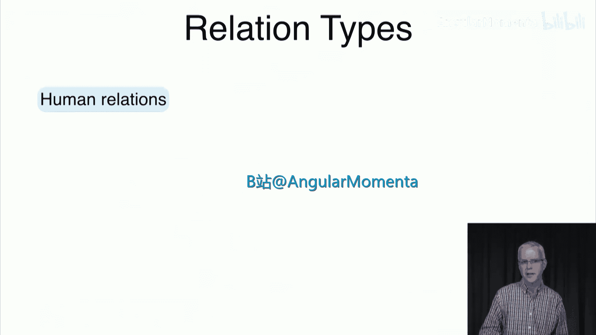
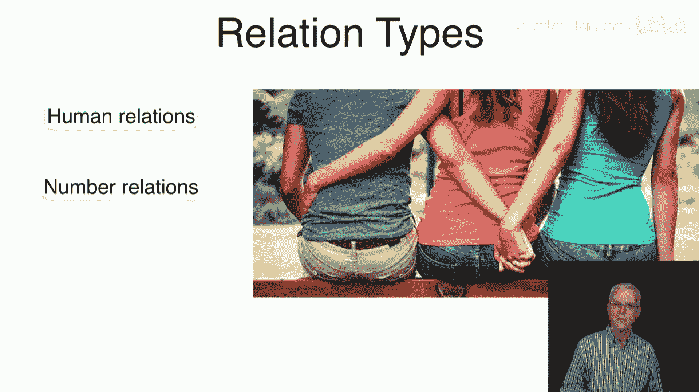
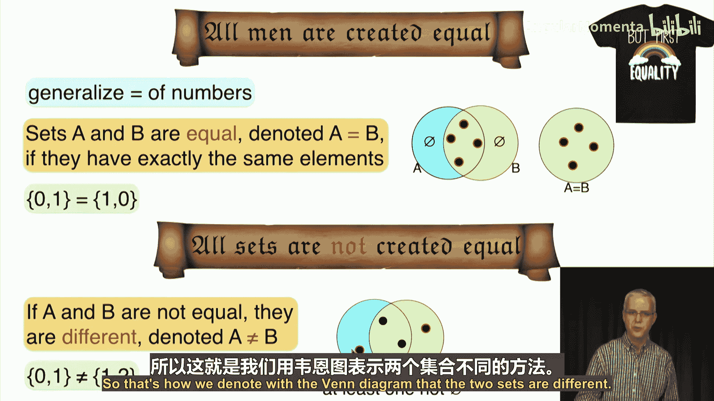
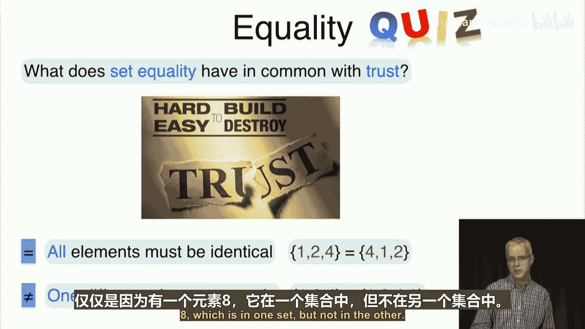
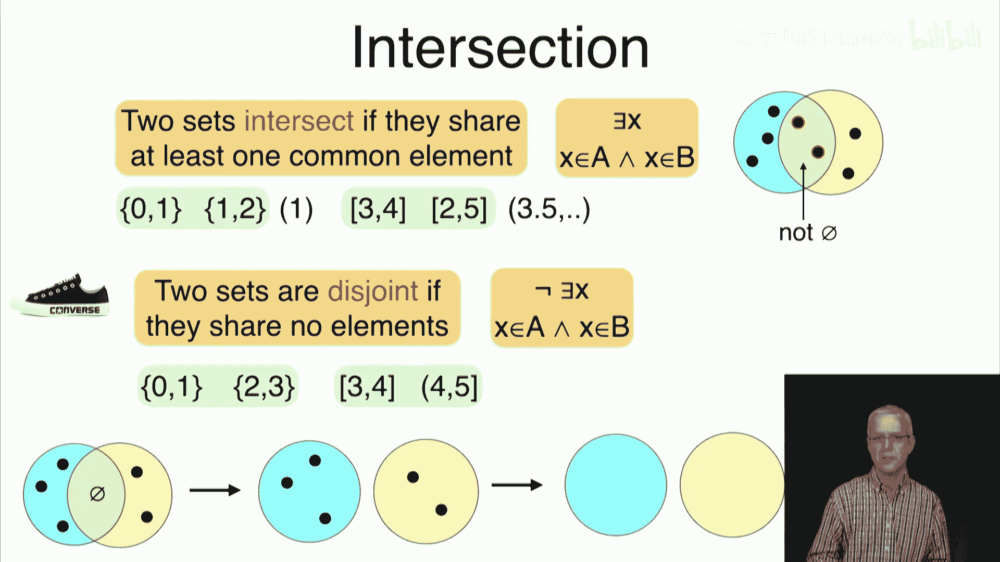
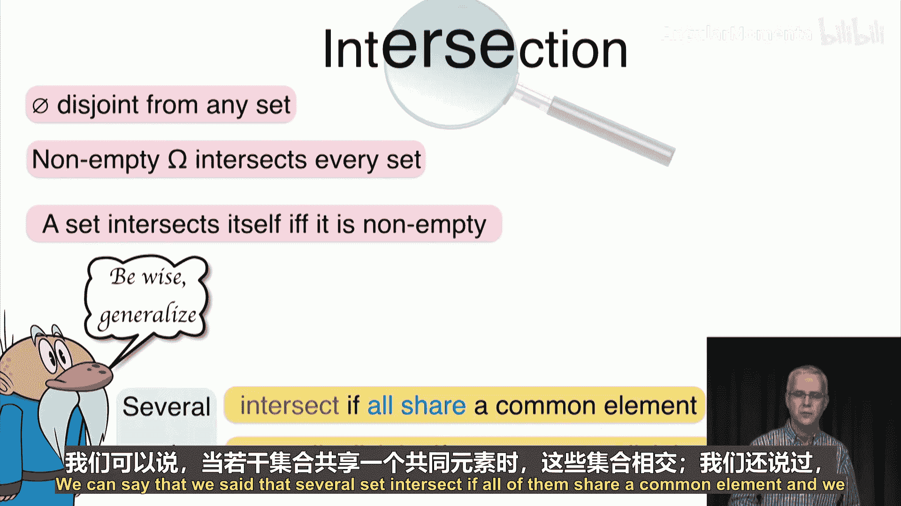
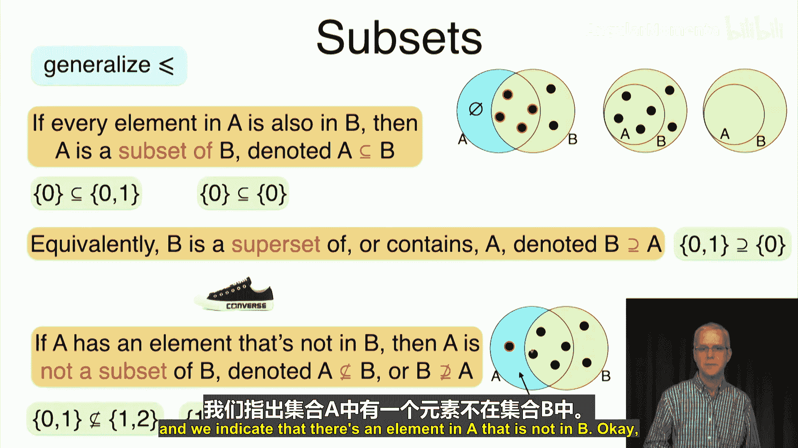
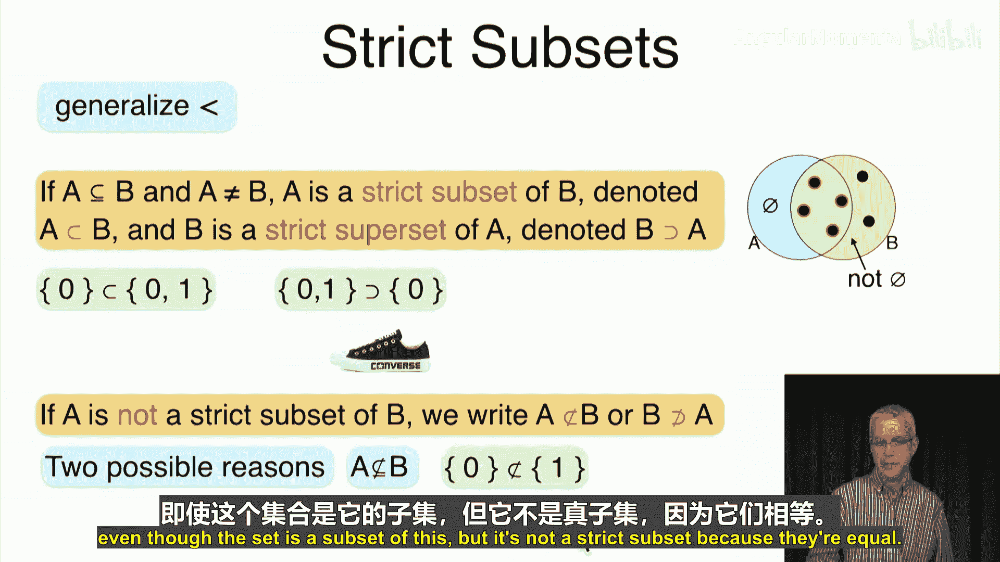
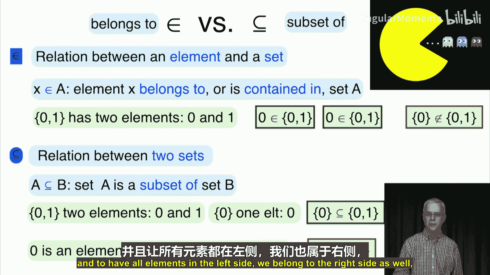
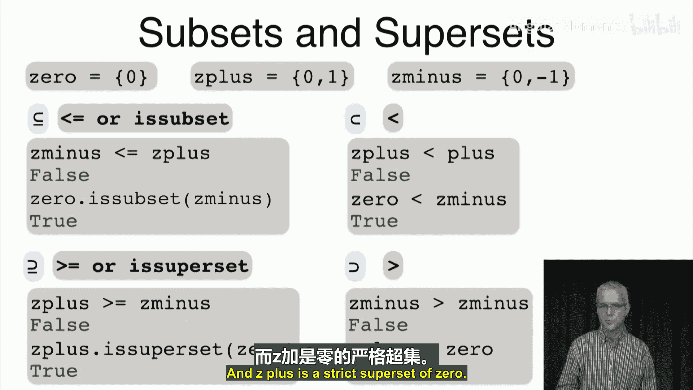

# 010：集合关系 🔗

在本节课中，我们将学习集合之间的基本关系。我们将从数字关系的类比出发，探讨集合的相等、交集和子集关系，并使用Python代码进行演示。

上一节我们介绍了集合的概念及其可视化方法。本节中，我们来看看集合之间有哪些重要的关系。





## 集合的相等与不相等

集合的相等关系是数字相等关系的推广。两个集合A和B被称为相等，记作 **A = B**，当且仅当它们拥有完全相同的元素。

例如，集合 `{0, 1}` 和 `{1, 0}` 拥有完全相同的元素（0和1），因此它们是相等的。在文氏图中，两个相等的集合完全重叠，表示它们之间没有只属于其中一个集合的元素。




反之，如果两个集合不相等，则称它们为不同的集合，记作 **A ≠ B**。例如，集合 `{0, 1}` 和 `{1, 2}` 不相等，因为前者包含元素0，而后者不包含。在文氏图中，两个不同的集合至少有一个区域（只属于A或只属于B）是非空的。




关于集合相等，有一个有趣的观察：建立相等关系（要求所有元素都相同）很难，但破坏它（只需一个元素不同）却很容易。

## 集合的交集与互斥

接下来，我们讨论集合的交集。两个集合A和B相交，意味着它们至少共享一个公共元素。用逻辑术语表达，即 **∃x (x ∈ A ∧ x ∈ B)**。

例如，集合 `{0, 1}` 和 `{1, 2}` 共享元素1，因此它们相交。在文氏图中，相交的集合其重叠区域非空。




反之，如果两个集合没有公共元素，则称它们为互斥（或不相交）的集合。逻辑上表达为：**∄x (x ∈ A ∧ x ∈ B)** 或等价地 **∀x (x ∉ A ∨ x ∉ B)**。

例如，集合 `{0, 1}` 和 `{2, 3}` 没有公共元素，因此它们是互斥的。在文氏图中，互斥的集合被画成完全分离的。




以下是关于交集和互斥的几个要点：
*   空集与任何集合都是互斥的。
*   一个非空的全集（例如所有实数的集合）与任何集合都相交。
*   一个非空集合总是与自身相交。
*   这些概念可以推广到多个集合：多个集合相交意味着它们共享一个公共元素；多个集合两两互斥，则称它们为“相互互斥”。

## 集合的子集与超集

子集关系推广了数字的“小于或等于”关系。如果集合A中的每一个元素也都是集合B中的元素，那么我们称A是B的子集，记作 **A ⊆ B**。

例如，集合 `{0}` 是集合 `{0, 1}` 的子集，因为元素0同时属于这两个集合。任何集合都是其自身的子集。在文氏图中，子集A被完全包含在超集B内部。




等价地，我们也可以说B是A的超集，记作 **B ⊇ A**。

如果A不是B的子集，记作 **A ⊈ B**，这意味着A中至少有一个元素不在B中。

关于子集，有以下重要性质：
*   空集是任何集合的子集。
*   任何集合都是其自身的子集。
*   任何集合都是全集（所讨论的所有对象的集合）的子集。
*   子集关系具有传递性：如果 **A ⊆ B** 且 **B ⊆ C**，那么 **A ⊆ C**。
*   如果 **A ⊆ B** 且 **B ⊆ A**，那么 **A = B**。

## 真子集与属于关系

如果A是B的子集，但A不等于B，那么我们称A是B的真子集，记作 **A ⊂ B**。这推广了数字的“严格小于”关系。例如，`{0}` 是 `{0, 1}` 的真子集。



初学者常混淆“属于”（∈）和“子集”（⊆）这两个符号。
*   **属于（∈）**：表示一个**元素**与一个**集合**之间的关系。例如，`0 ∈ {0, 1}` 是正确的，但 `{0} ∈ {0, 1}` 是错误的，因为 `{0}` 本身是一个集合，而不是 `{0, 1}` 中的一个元素。
*   **子集（⊆）**：表示两个**集合**之间的关系。例如，`{0} ⊆ {0, 1}` 是正确的，因为集合 `{0}` 中的唯一元素0也属于集合 `{0, 1}`。


一个有趣的谜题是：能否找到两个集合A和B，使得A既是B的元素（A ∈ B），又是B的子集（A ⊆ B）？我们将在后续课程中探讨。

## Python中的集合关系操作

现在，让我们看看如何在Python中实现这些集合关系。

以下是检查集合相等、不等和互斥的代码示例：
```python
# 定义几个集合
S1 = {0, 1}
S2 = set([0, 1])  # 使用set函数创建
S3 = {1, 0, 1}    # 重复元素会被自动去重
T = {0, 2}

# 检查相等
print(S1 == T)   # 输出: False
print(S1 == S2)  # 输出: True
print(S1 == S3)  # 输出: True



# 检查不等
print(S1 != S2)  # 输出: False
print(S1 != T)   # 输出: True

# 检查是否互斥
print(S1.isdisjoint(T))      # 输出: False (因为共享元素0)
print(S1.isdisjoint({2}))    # 输出: True
```

以下是检查子集、超集和真子集的代码示例：
```python
# 定义集合
zero = {0}
Z_plus = {0, 1}
Z_minus = {0, -1}

# 检查子集 (使用 <= 或 issubset())
print(Z_minus <= Z_plus)        # 输出: False
print(zero.issubset(Z_minus))   # 输出: True

# 检查真子集 (使用 <)
print(Z_plus < Z_minus)         # 输出: False
print(zero < Z_minus)           # 输出: True

# 检查超集 (使用 >= 或 issuperset())
print(Z_plus >= Z_minus)        # 输出: False
print(Z_plus.issuperset(zero))  # 输出: True

# 检查真超集 (使用 >)
print(Z_minus > Z_minus)        # 输出: False (不是真超集)
print(Z_plus > zero)            # 输出: True
```

## 总结

本节课中，我们一起学习了集合之间的基本关系：
1.  **相等（=）与不相等（≠）**：基于是否拥有完全相同元素。
2.  **交集与互斥**：基于是否共享公共元素。
3.  **子集（⊆）与超集（⊇）**：基于一个集合的所有元素是否都包含于另一个集合。
4.  **真子集（⊂）与真超集（⊃）**：是子集/超集关系，但排除相等的情况。
5.  我们区分了“属于”（∈）和“子集”（⊆）这两个关键概念。
6.  最后，我们使用Python代码演示了如何判断这些关系。



下一节，我们将学习集合的运算，例如并集、交集和补集。