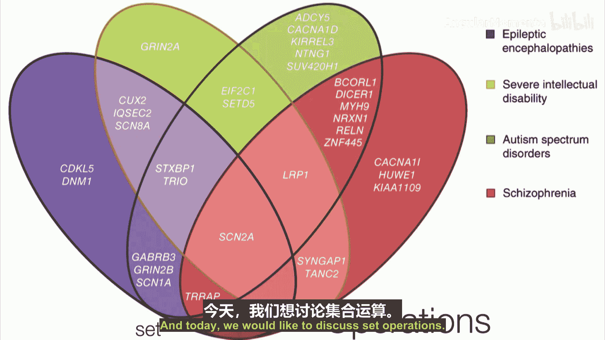
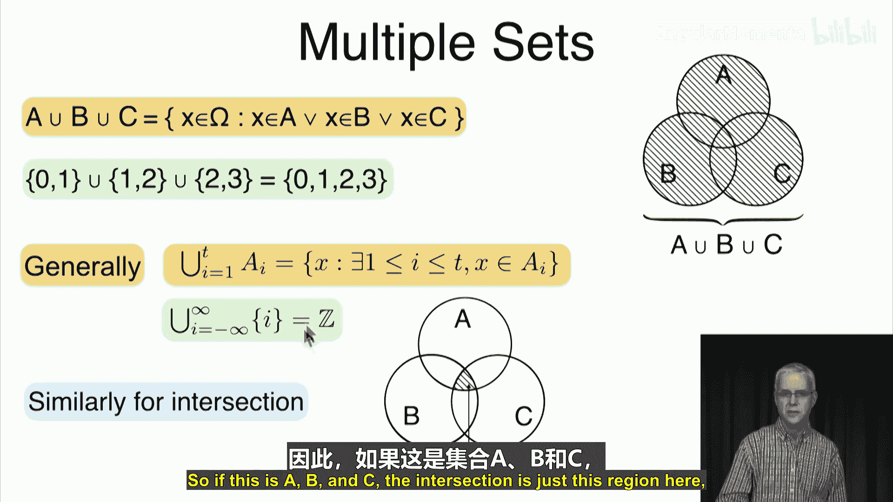
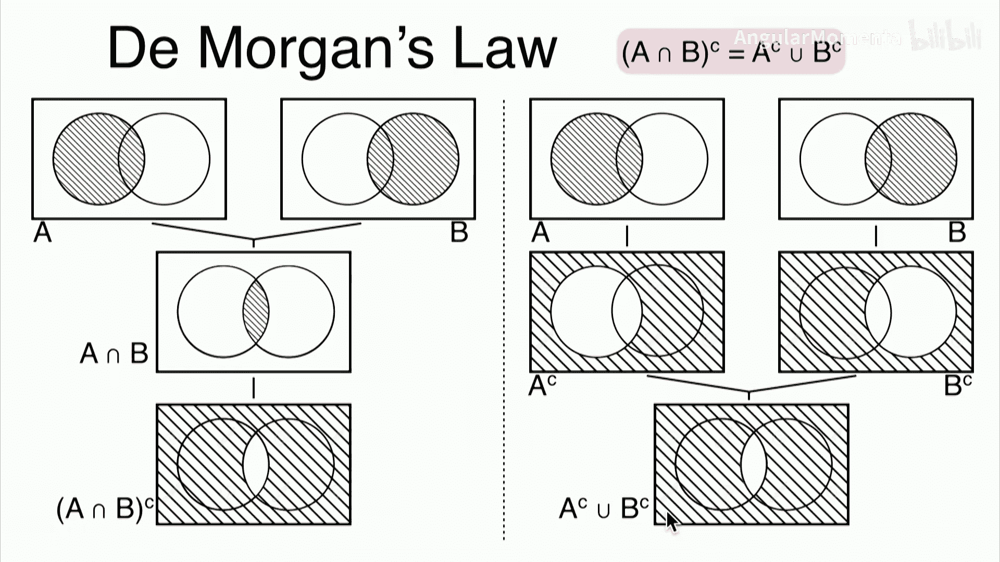
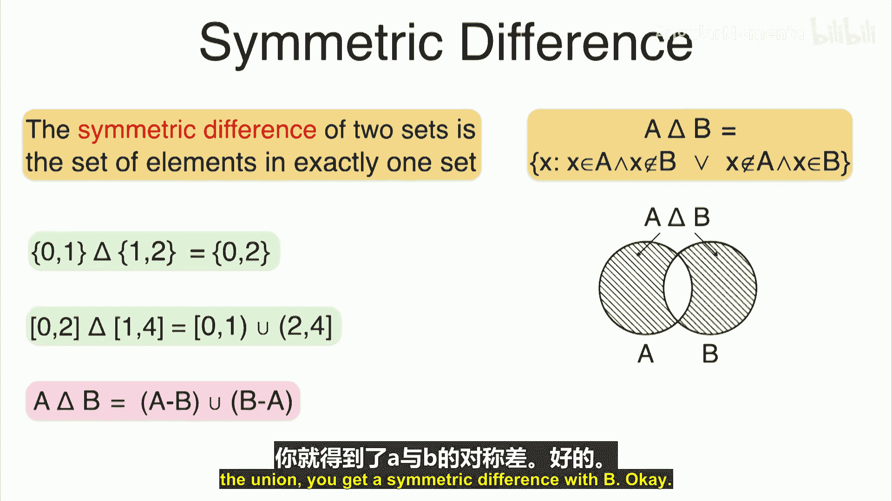
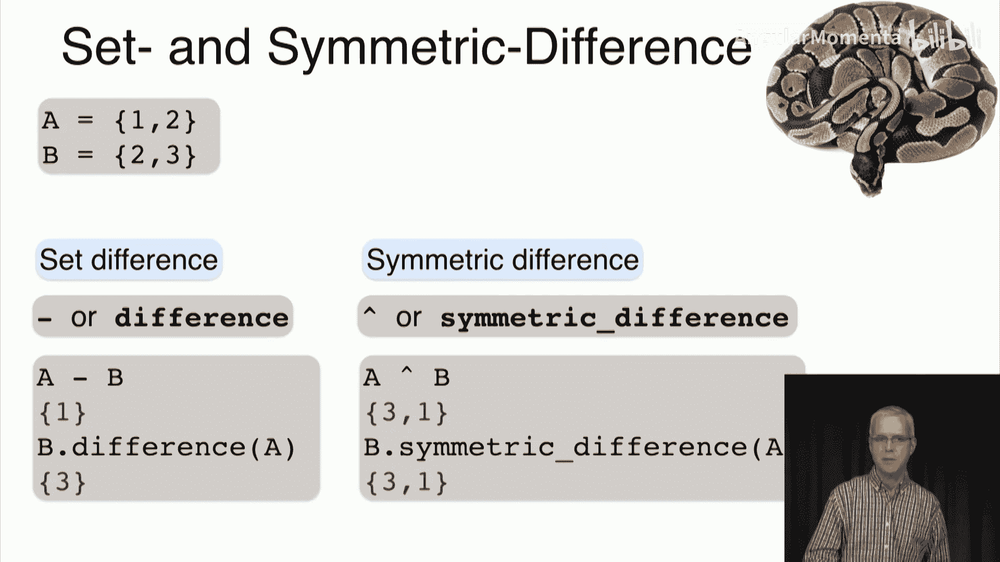

**概率与统计在数据科学中的应用：第11讲：集合运算** 🧮

在本节课中，我们将学习集合的基本运算，包括补集、交集、并集、差集和对称差。这些运算与数字的加、减、乘类似，是处理集合关系的基础工具。



---

### **概述**

上一节我们介绍了集合之间的关系，如相等、子集和真子集。本节中，我们将探讨集合的运算，这些运算帮助我们组合和比较不同的集合。

---

### **补集**

补集是集合运算的基础。给定一个全集 **Ω**（包含所有考虑的元素），集合 **A** 的补集（记作 **Aᶜ**）包含所有在 **Ω** 中但不在 **A** 中的元素。

用逻辑表达式表示为：
\[
A^c = \{ x \in \Omega \mid x \notin A \}
\]

例如，如果全集 **Ω = {0, 1}**，那么：
*   **{0}** 的补集是 **{1}**。
*   **{0, 1}** 的补集是空集 **∅**。
*   空集 **∅** 的补集是 **{0, 1}**。

补集的性质包括：
*   **∅ᶜ = Ω**
*   **Ωᶜ = ∅**
*   **A** 和 **Aᶜ** 不相交。
*   **(Aᶜ)ᶜ = A**（补集运算是对合的）。
*   如果 **A ⊆ B**，那么 **Bᶜ ⊆ Aᶜ**。

---

### **交集**

两个集合 **A** 和 **B** 的交集（记作 **A ∩ B**）包含所有同时属于 **A** 和 **B** 的元素。

用逻辑表达式表示为：
\[
A \cap B = \{ x \mid x \in A \text{ 且 } x \in B \}
\]

例如：
*   **{0, 1} ∩ {1, 3} = {1}**
*   **{0} ∩ {1} = ∅**
*   区间 **[0, 4) ∩ [3, 6) = [3, 4)**

---

### **并集**

两个集合 **A** 和 **B** 的并集（记作 **A ∪ B**）包含所有属于 **A**、属于 **B** 或同时属于两者的元素。

用逻辑表达式表示为：
\[
A \cup B = \{ x \mid x \in A \text{ 或 } x \in B \}
\]

例如：
*   **{0, 1} ∪ {1, 2} = {0, 1, 2}**
*   区间 **[0, 2) ∪ (1, 3] = [0, 3]**

这些运算可以推广到多个集合。例如，多个集合的并集包含属于其中至少一个集合的所有元素。

---



### **集合运算的基本定律**

以下是集合运算的一些基本恒等式（定律）：

*   **恒等律**:
    *   **A ∩ Ω = A**
    *   **A ∪ Ω = Ω**
*   **支配律**:
    *   **A ∩ ∅ = ∅**
    *   **A ∪ ∅ = A**
*   **幂等律**:
    *   **A ∩ A = A**
    *   **A ∪ A = A**
*   **补集律**:
    *   **A ∩ Aᶜ = ∅**
    *   **A ∪ Aᶜ = Ω**
*   **交换律**:
    *   **A ∩ B = B ∩ A**
    *   **A ∪ B = B ∪ A**
*   **结合律**:
    *   **(A ∩ B) ∩ C = A ∩ (B ∩ C)**
    *   **(A ∪ B) ∪ C = A ∪ (B ∪ C)**
*   **分配律**:
    *   **A ∩ (B ∪ C) = (A ∩ B) ∪ (A ∩ C)**
    *   **A ∪ (B ∩ C) = (A ∪ B) ∩ (A ∪ C)**
*   **德摩根定律**（非常重要）:
    *   **(A ∩ B)ᶜ = Aᶜ ∪ Bᶜ**
    *   **(A ∪ B)ᶜ = Aᶜ ∩ Bᶜ**

德摩根定律表明，交集的补集等于补集的并集，并集的补集等于补集的交集。

---

### **差集与对称差**

**差集**（记作 **A \ B** 或 **A - B**）包含所有属于 **A** 但不属于 **B** 的元素。

用逻辑表达式表示为：
\[
A \setminus B = \{ x \mid x \in A \text{ 且 } x \notin B \}
\]

一个重要关系是：**A \ B = A ∩ Bᶜ**。

例如：
*   **{0, 1} \ {1} = {0}**
*   区间 **[1, 3) \ [2, 4) = [1, 2)**



**对称差**（记作 **A Δ B**）包含所有恰好属于 **A** 和 **B** 中一个集合的元素（即只属于其中一个，不同时属于两者）。

用逻辑表达式表示为：
\[
A \Delta B = \{ x \mid (x \in A \text{ 且 } x \notin B) \text{ 或 } (x \in B \text{ 且 } x \notin A) \}
\]

它可以表示为：**A Δ B = (A \ B) ∪ (B \ A)**。

例如：
*   **{0, 1} Δ {1, 2} = {0, 2}**
*   区间 **[0, 2) Δ (1, 4] = [0, 1] ∪ (2, 4]**

---

### **在Python中实现集合运算**

Python的`set`数据类型直接支持这些集合运算。



以下是核心操作的代码示例：

```python
# 定义两个集合
A = {1, 2}
B = {2, 3}

# 并集
print(A | B)           # 输出: {1, 2, 3}
print(A.union(B))      # 输出: {1, 2, 3}

# 交集
print(A & B)           # 输出: {2}
print(A.intersection(B)) # 输出: {2}

# 差集 (A - B)
print(A - B)           # 输出: {1}
print(A.difference(B)) # 输出: {1}

# 对称差
print(A ^ B)           # 输出: {1, 3}
print(A.symmetric_difference(B)) # 输出: {1, 3}
```

---


### **总结**



本节课中我们一起学习了集合的五种核心运算：
1.  **补集 (Aᶜ)**：在全集中不属于A的元素。
2.  **交集 (A ∩ B)**：同时属于A和B的元素。
3.  **并集 (A ∪ B)**：属于A或B（或两者）的元素。
4.  **差集 (A \ B)**：属于A但不属于B的元素。
5.  **对称差 (A Δ B)**：恰好属于A和B中一个集合的元素。

我们还了解了支配这些运算的基本定律，特别是德摩根定律，并学会了如何在Python中执行这些运算。下一讲我们将探讨集合的笛卡尔积。