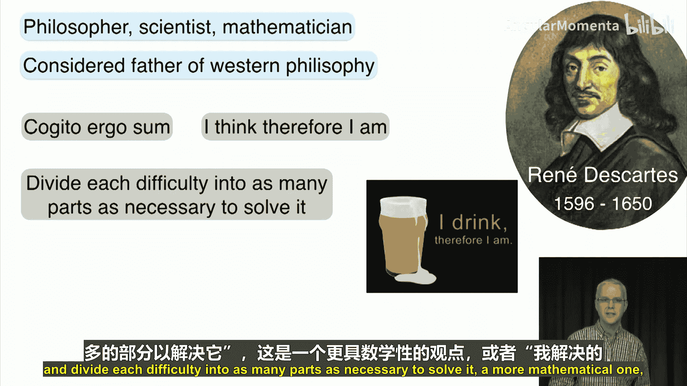
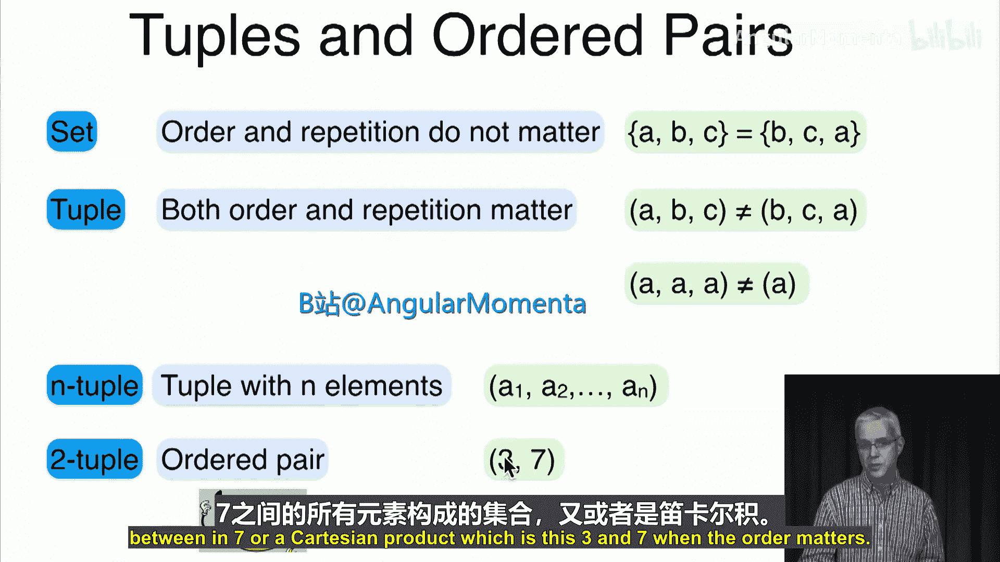
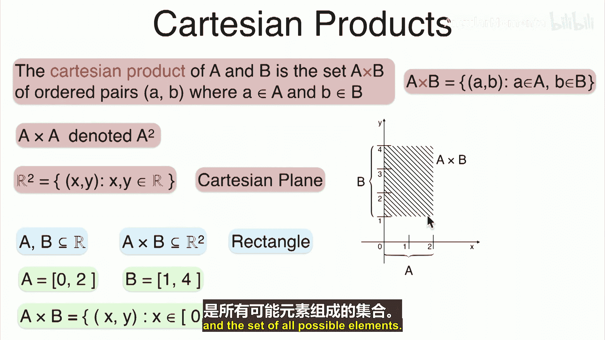
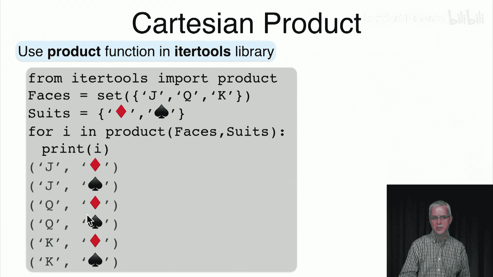

# 012：元组与笛卡尔积 📐

在本节课中，我们将要学习集合论中的最后一个重要运算——笛卡尔积。我们将从元组和有序对的概念开始，逐步理解笛卡尔积的定义、几何意义及其在数据科学中的应用。

---



## 概述

上一节我们介绍了集合的并集和交集等运算。本节中，我们将探讨笛卡尔积。笛卡尔积以法国哲学家、数学家勒内·笛卡尔命名，他因提出“我思故我在”等思想而闻名，并在数学上为坐标系奠定了基础。

## 元组与有序对

首先，我们需要理解元组的概念。集合是元素的**无序**集合，其中元素的顺序和重复都不重要。例如，集合 `{A, B, C}` 与 `{B, C, A}` 是相同的。

然而，当我们希望**顺序和重复**都重要时，我们使用**元组**。元组用圆括号表示，元素之间用逗号分隔。

*   **n元组**：包含n个元素的元组，记作 `(a1, a2, ..., an)`。
*   **有序对**：n=2时的特殊元组，包含两个元素，记作 `(a, b)`。例如，`(3, 7)` 就是一个有序对。

> **注意**：符号 `(3, 7)` 也可能表示实数区间。通常我们可以根据上下文区分其含义。

## 笛卡尔积的定义

两个集合 **A** 和 **B** 的**笛卡尔积**，记作 **A × B**，是所有可能有序对 `(a, b)` 的集合，其中 `a` 来自集合 **A**，`b** 来自集合 **B**。

用集合构造式表示为：
**A × B = { (a, b) | a ∈ A, b ∈ B }**



如果对同一个集合 **A** 做笛卡尔积，可以简写为 **A²**。

最著名的笛卡尔积是实数集 **R** 与自身的笛卡尔积 **R × R**，也称为**实数平面**或**笛卡尔平面**，记作 **R²**。它包含了所有形如 `(x, y)` 的点，其中 `x` 和 `y` 都是实数。

## 笛卡尔积的几何表示

当集合 **A** 和 **B** 是实数的子集时，它们的笛卡尔积 **A × B** 是 **R²** 的一个子集，通常可以表示为一个矩形。

例如，若 **A = [0, 2]**，**B = [1, 4]**，则：
**A × B = { (x, y) | x ∈ [0, 2], y ∈ [1, 4] }**
这在平面上表示为一个以 `x` 轴范围 `[0, 2]` 和 `y` 轴范围 `[1, 4]` 确定的矩形。




对于离散集合（有限或可数无限），笛卡尔积的表示更简单。例如，若 **A = {a, b}**，**B = {1, 2, 3}**，则：
**A × B = { (a,1), (a,2), (a,3), (b,1), (b,2), (b,3) }**
我们可以将第一个集合 **A** 的元素垂直排列，第二个集合 **B** 的元素水平排列，来形象化地表示这些点，这类似于矩阵的坐标系统。

## 笛卡尔积的运算性质

以下是笛卡尔积的一些基本运算性质：

*   **与空集的积**：**A × ∅ = ∅ × A = ∅**
*   **对并集的分配律**：**A × (B ∪ C) = (A × B) ∪ (A × C)**
*   **对交集的分配律**：**A × (B ∩ C) = (A × B) ∩ (A × C)**
*   **对差集的分配律**：**A × (B \ C) = (A × B) \ (A × C)**

这些性质直观上易于理解。例如，分配律意味着先取并集再做笛卡尔积，等价于先分别做笛卡尔积再取并集。

## 应用：表格与序列

理解了离散集合的笛卡尔积后，我们来看看它的实际应用。

**1. 数据库表格**
在计算机科学中，数据库的表格本质上就是笛卡尔积的一种体现。表格的每一行（记录）可以看作一个元组，每一列（属性）代表一个维度。整个表格是所有行与所有列属性值可能组合的一个子集。

**2. 序列**
序列是我们经常使用的概念，它本质上就是去掉括号和逗号的元组。例如，序列 `A1 A2 A3` 对应元组 `(A1, A2, A3)`。在计算机中，二进制序列空间如 **{0,1}²**（所有两位二进制数）就是笛卡尔积 **{0,1} × {0,1}** 的结果，包含 `00`, `01`, `10`, `11`。

笛卡尔积可以推广到两个以上的集合。例如，**A × B × C** 表示一个三维空间中的“长方体”点集。

## 在Python中实现笛卡尔积

在Python中，我们可以使用 `itertools` 库中的 `product` 函数轻松计算笛卡尔积。

以下是使用示例：

```python
# 导入 product 函数
from itertools import product

# 定义两个集合
faces = ['Jack', 'Queen', 'King']
suits = ['Diamonds', 'Spades']

# 计算并打印笛卡尔积中的所有有序对
for card in product(faces, suits):
    print(card)
```
运行这段代码将输出所有可能的（点数，花色）组合，例如 `('Jack', 'Diamonds')`, `('Jack', 'Spades')` 等。

---

## 总结

本节课中我们一起学习了：
1.  **元组和有序对**：它们是元素**有序**且**可重复**的集合。
2.  **笛卡尔积**：定义为 **A × B = { (a, b) | a ∈ A, b ∈ B }**，是两个集合所有可能有序对的集合。
3.  **几何意义**：对于实数子集，笛卡尔积对应平面上的矩形区域；对于离散集合，则对应一个点阵。
4.  **运算性质**：笛卡尔积对并、交、差运算满足分配律。
5.  **实际应用**：数据库表格和序列都是笛卡尔积概念的具体体现。
6.  **Python实现**：使用 `itertools.product` 函数可以方便地生成笛卡尔积。



下一讲，我们将探讨一个令人困惑的悖论。