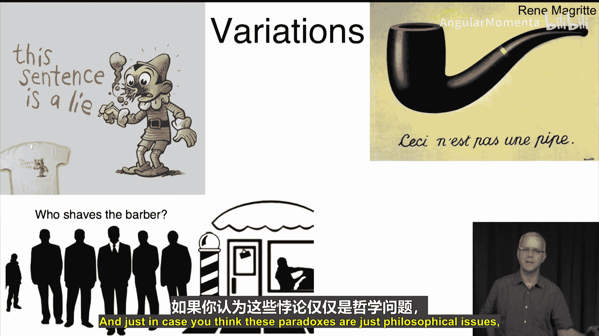

**概率与统计在数据科学中的应用：13：罗素悖论** 🧩

在本节课中，我们将探讨集合论中一个引人入胜且出人意料的结论——罗素悖论。我们将从基础的集合概念出发，逐步揭示一个看似合理的集合定义如何导致逻辑上的矛盾。

---

### **概述**

本节是集合主题的第四个也是最后一个视频。我们将展示，即便是之前讨论过的简单集合概念，也能引发出有趣且令人惊讶的后果，即一个著名的悖论。

这个悖论由英国数学家、哲学家兼作家伯特兰·罗素提出。他以其广泛的见解闻名，尤其对人类智慧有独到评论。他曾说：“在民主制度中，愚人有权利投票；在独裁制度中，愚人有权利统治。”以及“多数人宁愿死也不愿思考，事实上，多数人确实如此。”或许最贴合我们课程的是：“人生而无知，并非愚蠢，是教育让他们变得愚蠢。”那么，就让我们来了解一下他的悖论。

---

### **集合基础回顾**

首先，我们简单回顾一下集合。在集合论中，请记住，**集合本身也可以作为元素**。例如，这里有一个集合，另一个集合，而两者都是包含它们俩的那个集合的元素。

同时，每个集合都是其自身的**子集**。例如，空集包含于自身。

更有趣的问题是：**一个集合能否属于自身，或者说成为自身的元素？** 即，是否存在一个集合 S，使得 S 是 S 的一个元素？

通常，集合并不属于自身。例如，只包含数字0的集合 `{0}`，其唯一元素是数字0，因此集合 `{0}` 不是 `{0}` 的元素。同样，空集不包含任何元素，因此空集自然也不是空集的元素。

然而，**有些集合确实包含自身**。考虑一个例子：集合 **N**（非特朗普集合），即包含所有“不是特朗普”的事物的集合。这个集合包含许多元素，例如克林顿（不是特朗普）、数字0（不是特朗普）、集合 `{1,2}`（不是特朗普）等等。事实上，除了唐纳德·特朗普本人，一切事物都在这个集合中。因此，**集合 N 本身也不是唐纳德·特朗普**，所以 N 自身也是 N 的一个元素。因此，我们得出结论：集合 N 属于自身。

这有些令人惊讶，并且确实会导致有趣的后果。其中之一是，如果一个集合包含自身，就会产生一种无限递归。但不必担心这一点，我们只需要知道：有些集合是自身的元素（如 N），而有些集合不是自身的元素（如 `{0}`）。这是我们讨论罗素悖论所需的全部背景知识。

---

### **罗素悖论详解**

那么，什么是罗素悖论？它指出，**你可以定义一个不可能存在的集合**。

罗素考虑了如下集合 **R**：**所有不属于自身的集合所构成的集合**。

用数学语言定义就是：
**R = { S | S ∉ S }**

让我们仔细理解这个定义：我们定义了一个集合 R，其元素是那些“不是自身元素”的集合。也就是说：
*   如果一个集合 S 是自身的元素（S ∈ S），那么 S 就不在 R 中。
*   如果一个集合 S 不是自身的元素（S ∉ S），那么 S 就在 R 中。

根据之前的例子：
*   集合 `{0}` 不是自身的元素，因此 `{0}` ∈ R。
*   集合 N（非特朗普集合）是自身的元素，因此 N ∉ R。

现在，关键问题来了：**集合 R 本身是否属于 R？**

根据逻辑排中律，只有两种可能：要么 R ∈ R，要么 R ∉ R。然而，我们将证明，**无论哪种情况都会导致矛盾**，因此这样的集合 R 不可能存在。

**情况一：假设 R ∈ R。**
如果 R 是自身的元素（即 R ∈ R），那么根据集合 R 的定义（R 只包含那些“不属于自身”的集合），R 必须满足“R ∉ R”这个条件才能成为 R 的元素。这与我们“R ∈ R”的假设直接矛盾。因此，如果 R ∈ R，则会推导出 R ∉ R，矛盾。

**情况二：假设 R ∉ R。**
如果 R 不是自身的元素（即 R ∉ R），那么看看集合 R 的定义：R 恰好包含所有“不属于自身”的集合。既然 R 满足“不属于自身”这个条件，那么根据定义，R 就应该被包含在 R 中，即 R ∈ R。这又与我们“R ∉ R”的假设矛盾。

综上所述，无论假设 R 属于自身还是不属于自身，都会导致逻辑矛盾（R ∈ R 且 R ∉ R 同时成立）。这意味着我们定义的集合 **R 在逻辑上无法存在**。这就是罗素悖论。

---

### **悖论的根源与变体**

我们看到了问题根源在于**递归或自指的定义**。当我们考虑包含自身的集合时，会导致无限递归；而当我们考虑“所有不包含自身的集合”时，则直接导致了矛盾。

为了避免这类问题，在朴素的集合论中，我们通常**只考虑那些非递归定义、非自指的集合**，以保持逻辑的一致性。这部分内容虽然有趣，但并非考试必需，不过了解它有助于深化对数学基础的理解。

这个悖论有几个著名的变体：

*   **理发师悖论**：一个理发师宣称：“我只给那些不自己刮胡子的人刮胡子。”那么，他给自己刮胡子吗？如果他给自己刮，那么他就给了一个“自己刮胡子的人”刮胡子，违背誓言；如果他不给自己刮，那么他就没给“不自己刮胡子的人”刮胡子，也违背誓言。
*   **说谎者悖论**：“这句话是假的。”这句话本身是真的还是假的？
*   艺术领域的自指：马格利特的画作《形象的叛逆》（这不是一个烟斗）。
*   甚至伍迪·艾伦的一句自嘲也体现了这种逻辑：“我永远不想加入任何愿意接纳我这种人的俱乐部。”

---

### **总结**

本节课中，我们一起学习了罗素悖论。我们从集合的基本概念——集合可以作为元素以及“属于自身”的概念——出发，定义了一个特殊的集合 R（所有不属于自身的集合的集合）。通过逻辑推理，我们发现无论假设 R 是否属于自身，都会导出矛盾，从而证明这样的集合 R 不可能存在。这揭示了在未加限制的集合论中，自指定义可能带来的根本性问题。理解这个悖论有助于我们更严谨地看待数学和逻辑的基础。