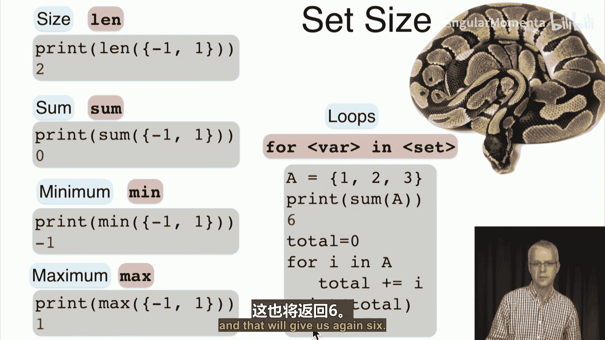

**概率与统计：P14-04-02-03：集合大小** 📏

在本节课中，我们将学习如何描述和计算集合的大小，即集合中元素的数量。这是后续学习计数技巧的基础。

---

### **集合大小的定义**

集合 `S` 中元素的数量称为其**大小**或**基数**，记作 `|S|` 或 `#S`。

以下是几个示例：
*   比特集合 `{0, 1}` 的大小是 **2**。
*   硬币的两面 `{正面, 反面}` 的大小是 **2**。
*   骰子的六个面 `{1, 2, 3, 4, 5, 6}` 的大小是 **6**。
*   十进制数字集合 `{0, 1, 2, 3, 4, 5, 6, 7, 8, 9}` 的大小是 **10**。
*   英文字母集合 `{a, b, c, ..., z}` 的大小是 **26**。
*   空集 `∅` 的大小是 **0**。
*   整数集 `Z`、自然数集 `N`、有理数集 `Q` 和实数集 `R` 的大小都是**无穷大**。其中，`Z`、`N`、`Q` 是**可数无穷**，而 `R` 是**不可数无穷**，但本节课我们暂不深入讨论这种区别。

---

### **整数区间的大小**

上一节我们定义了集合的基本概念，本节中我们来看看如何计算特定集合的大小。首先，我们回顾一下整数区间。

对于 `m ≤ n`，我们定义 `[m..n]` 为从 `m` 到 `n`（包含两端）的整数集合。例如，`[3..5] = {3, 4, 5}`。

该区间的大小计算公式为：
**`|[m..n]| = n - m + 1`**

初学者常会问为何要加 `1`。我们可以通过小例子来理解：
*   `[5..5] = {5}`，其大小为 `5 - 5 + 1 = 1`。
*   `[1..3] = {1, 2, 3}`，其大小为 `3 - 1 + 1 = 3`。

从几何角度看，`n - m` 计算的是从 `m` 到 `n` 的**距离**或**单位间隔数**。而要计算**点的数量**，我们需要在间隔数的基础上，加上起点 `m` 本身这个点，因此需要 `+1`。

---

### **倍数集合的大小**

接下来，我们看看如何计算一个范围内特定倍数集合的大小。

我们用 `[1..n]` 表示从 `1` 到 `n` 的整数集合。那么，在 `[1..n]` 中能被 `d` 整除（即 `d` 的倍数）的整数集合记作 `{k ∈ [1..n] : d | k}`。

以下是计算其大小的示例：
*   在 `[1..8]` 中，`3` 的倍数集合是 `{3, 6}`，其大小为 **2**。
*   在 `[1..9]` 中，`3` 的倍数集合是 `{3, 6, 9}`，其大小为 **3**。

该集合大小的通用计算公式为：
**`|{k ∈ [1..n] : d | k}| = ⌊n / d⌋`**

其中，`⌊x⌋` 表示**向下取整**函数，即小于等于 `x` 的最大整数。
*   对于第一个例子：`⌊8 / 3⌋ = ⌊2.666...⌋ = 2`。
*   对于第二个例子：`⌊9 / 3⌋ = ⌊3⌋ = 3`。

---

### **在Python中操作集合**

最后，我们学习如何在Python中获取集合的大小并进行相关计算。

在Python中，使用 `len()` 函数获取集合（或列表等可迭代对象）的大小。

以下是相关操作的代码示例：

```python
# 计算集合大小
print(len({-1, 1}))  # 输出：2

# 计算集合元素之和
print(sum({-1, 1}))  # 输出：0

# 查找集合中的最小值和最大值
print(min({-1, 1}))  # 输出：-1
print(max({-1, 1}))  # 输出：1

# 使用循环迭代计算元素总和
a = {1, 2, 3}
total = 0
for i in a:
    total += i
print(total)  # 输出：6

# 更简洁的求和方式
print(sum(a))  # 输出：6
```

---

### **总结**

本节课中我们一起学习了：
1.  **集合大小（基数）** 的定义和表示法 `|S|`。
2.  计算**整数区间** `[m..n]` 大小的公式：**`n - m + 1`**。
3.  计算**倍数集合** `{k ∈ [1..n] : d | k}` 大小的公式：**`⌊n / d⌋`**。
4.  在**Python**中使用 `len()`、`sum()`、`min()`、`max()` 函数以及循环来处理集合的大小和元素。




掌握了计算单个集合大小的方法后，下节课我们将进一步学习如何计算**并集**、**交集**等复合集合的大小。