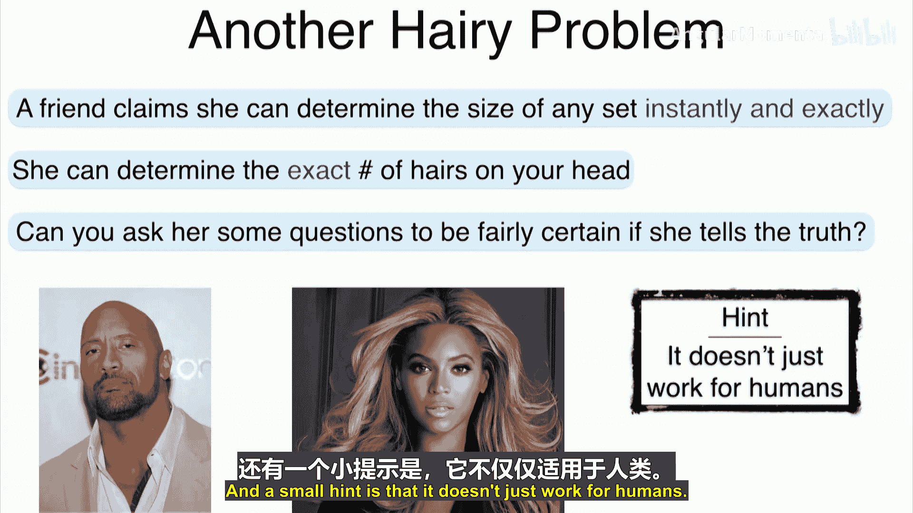

# 015：不相交并集 🧮

在本节课中，我们将学习集合论中的一个重要概念——不相交并集。我们将探讨加法规则、减法规则，并通过一些简单的例子来理解它们的应用。最后，我们会看到一个有趣的“头发问题”，帮助你思考如何应用这些规则。

---

## 不相交并集与加法规则

上一节我们介绍了基本的计数方法。本节中，我们来看看不相交并集。

假设有两个集合：集合 **A** 包含两个元素，集合 **B** 包含三个元素。这两个集合是**不相交**的，意味着它们没有共享任何元素。因此，并集的大小就是两个集合大小的简单相加：2 + 3 = 5。

用公式表示，对于任意两个不相交的集合 **A** 和 **B**，有：
\[
|A \cup B| = |A| + |B|
\]
这被称为**加法规则**。它表明，对于不相交的集合，并集的大小等于各自大小的和。

以下是两个应用加法规则的简单例子：

*   **例子1：班级学生**：一个班级有2名男生和3名女生。班级总人数是男生集合与女生集合的并集。由于这两个集合不相交，总人数为 2 + 3 = 5。
*   **例子2：罐中弹珠**：一个罐子里有1颗蓝色、2颗绿色和3颗红色弹珠。总弹珠数是三个不相交集合（蓝色、绿色、红色）的并集大小，即 1 + 2 + 3 = 6。

---

## 补集与减法规则

最典型的不相交集合是一个集合和它的补集。

对于全集 **Ω** 中的一个子集 **A**，它的补集 **Aᶜ** 包含了 **Ω** 中所有不属于 **A** 的元素。显然，**A** 和 **Aᶜ** 是不相交的，并且它们的并集就是全集 **Ω**。

根据加法规则：
\[
|Ω| = |A \cup Aᶜ| = |A| + |Aᶜ|
\]
我们可以重新排列这个公式，得到：
\[
|Aᶜ| = |Ω| - |A|
\]
这被称为**减法规则**或**互补规则**。它表明，一个集合的补集大小等于全集大小减去该集合本身的大小。

以下是一个应用减法规则的例子：

*   **例子：骰子点数**：考虑一个六面骰子，全集 **Ω** = {1, 2, 3, 4, 5, 6}，大小为6。设集合 **D** 为能被3整除的点数，即 **D** = {3, 6}，大小为2。那么 **D** 的补集 **Dᶜ** 就是不能被3整除的点数，即 {1, 2, 4, 5}。根据减法规则，**Dᶜ** 的大小为 6 - 2 = 4，这与我们直接数出的结果一致。

---

## 减法规则的灵活应用

减法规则有时可以反过来用，这在我们计算复杂集合的大小时非常有用。

如果直接计算集合 **A** 的大小很困难，但计算其补集 **Aᶜ** 的大小相对容易，那么我们可以利用公式：
\[
|A| = |Ω| - |Aᶜ|
\]
来间接求出 **|A|**。

以下是一个例子：

*   **例子：1到100中非3的倍数**：我们想计算集合 **A** = {1到100之间不能被3整除的整数} 的大小。直接计算很繁琐。全集 **Ω** 是1到100的所有整数，大小为100。**A** 的补集 **Aᶜ** 就是1到100之间能被3整除的整数，即 {3, 6, 9, ..., 99}。这个集合的大小很容易计算：99 ÷ 3 = 33。因此，根据减法规则，**|A|** = 100 - 33 = 67。

---

## 更一般的减法规则

减法规则可以推广到任意包含关系的集合。

如果集合 **A** 是集合 **B** 的子集（即 **A ⊆ B**），那么集合差 **B \ A**（在 **B** 中但不在 **A** 中的元素）的大小为：
\[
|B \ A| = |B| - |A|
\]
这是因为 **B** 可以表示为 **A** 和 **B \ A** 这两个不相交集合的并集，然后应用加法规则即可推导出上述公式。

这个规则在生活中有实际应用。例如，给宠物称重：

以下是给宠物称重的步骤：
1.  称量你自己的体重。
2.  抱着你的宠物一起称重。
3.  用你和宠物的总重量减去你自己的重量，就得到了宠物的重量。

这种方法巧妙地运用了“减去已知部分以得到未知部分”的思想。

---

## 总结与思考：头发问题 🧑🦰

本节课中，我们一起学习了不相交并集、加法规则和减法规则，并看到了它们在简单计数和实际问题中的应用。

最后，我们以一个“头发问题”作为思考结束：假设你的一位朋友声称她能瞬间精确地说出任何人头上的头发数量。你能否通过问她几个问题，就能相当确定她是否在说实话？（提示：解决方法并不仅仅适用于人类。）

希望你能运用本节课学到的集合思维来思考这个问题。我们下节课再见！