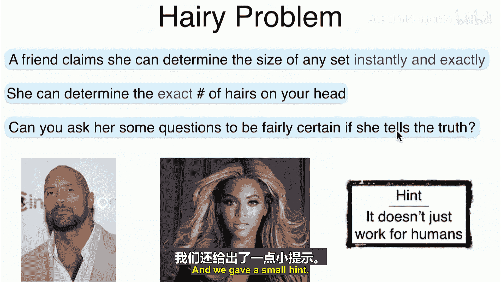
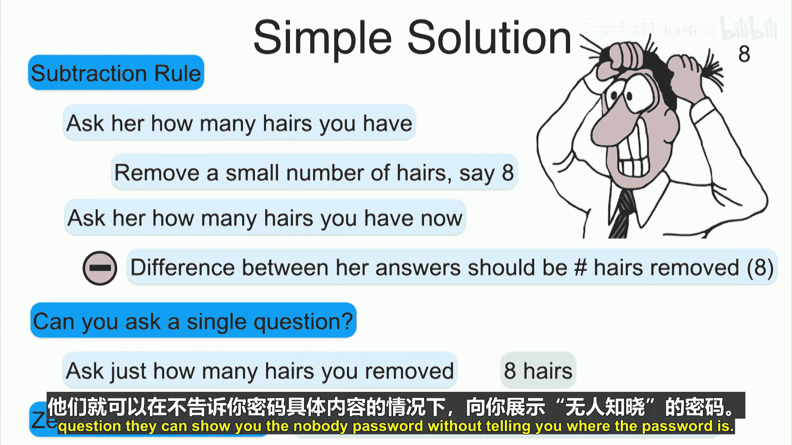
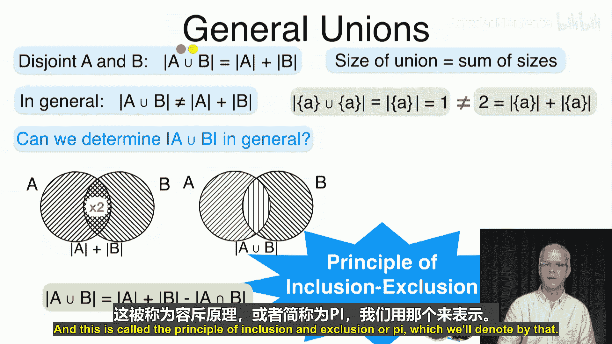
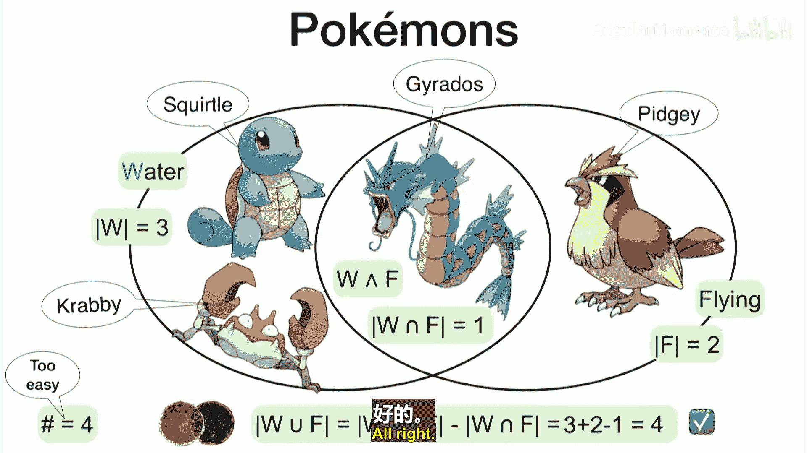
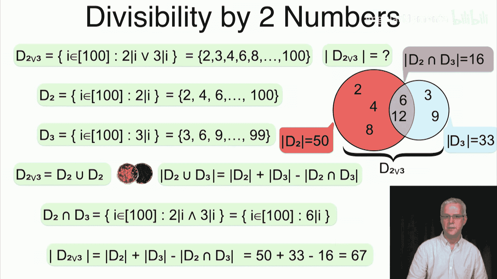
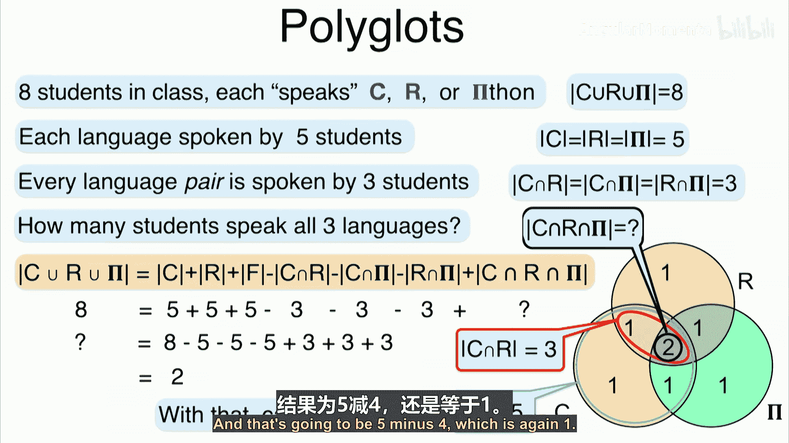
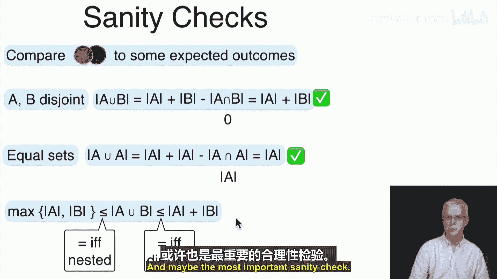
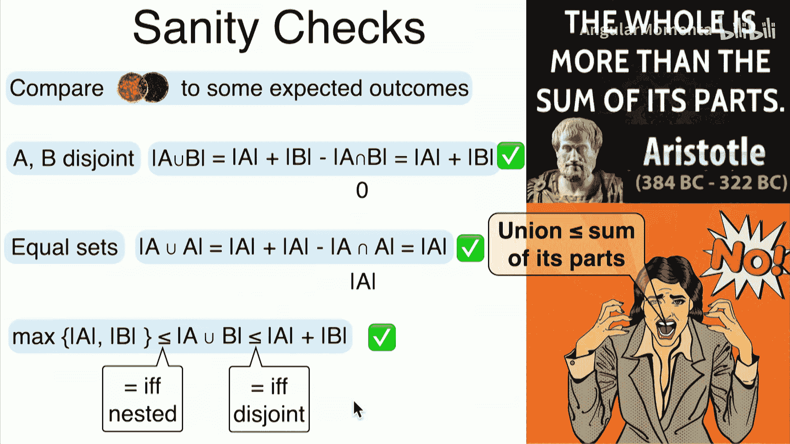

# 016：总体并集

在本节课中，我们将学习如何计算任意集合的并集大小。我们将介绍**容斥原理**，并展示如何将其应用于两个或多个集合。课程将从回顾一个有趣的“头发问题”开始，然后深入探讨并集大小的通用计算方法。

## 头发问题与减法规则

上一节我们讨论了集合的并集。现在，我们来看一个有趣的谜题：假设你的朋友声称能瞬间精确地说出你头上头发的数量。你如何通过提问来验证她是否在说实话？

一个简单的解决方案是使用**减法规则**。你可以问她两个问题：
1.  首先，问她你现在有多少根头发。
2.  然后，你到一个她看不见的地方，拔掉8根头发。
3.  回来后，再问她你现在有多少根头发。

根据减法规则，如果她两次的答案之差正好是8，那么她很可能说的是真话。如果差值不是8，那么她至少有一次说错了。

实际上，你甚至可以只问一个问题：直接问她你拔掉了多少根头发。如果她的答案是8，那么她很可能知道真实的头发数量。这个思路在“零知识证明”中有应用，即在不泄露具体信息（如初始头发数）的前提下证明自己知道某个信息。

## 两个集合的并集大小

对于两个不相交的集合A和B，其并集的大小是各自大小之和：
**|A ∪ B| = |A| + |B|** （当 A ∩ B = ∅ 时）

然而，对于一般的集合（即可能相交），情况并非如此。例如，集合A与其自身的并集仍是A，因此 **|A ∪ A| = |A|**，而不是 **|A| + |A| = 2|A|**。这是因为A与自身有交集。

为了计算一般情况下的并集大小，我们使用**容斥原理**。当我们计算 **|A| + |B|** 时，位于交集 **A ∩ B** 中的元素被计算了两次。因此，我们需要减去多算的一次：
**|A ∪ B| = |A| + |B| - |A ∩ B|**

### 示例：宝可梦集合

假设我们有如下宝可梦：
*   水属性宝可梦集合 W = {杰尼龟，卡咪龟，暴鲤龙}
*   飞行属性宝可梦集合 F = {波波，暴鲤龙}

我们想知道总共有多少只**不同的**宝可梦（即并集的大小）。直接观察可知是4只（杰尼龟，卡咪龟，暴鲤龙，波波）。使用容斥原理计算：
*   |W| = 3
*   |F| = 2
*   |W ∩ F| = 1 （暴鲤龙既是水属性也是飞行属性）
*   **|W ∪ F| = 3 + 2 - 1 = 4**

结果与直接观察一致。

### 示例：整除性问题

求1到100之间能被2或3整除的整数个数。
*   设 D2 = {能被2整除的数}，则 |D2| = floor(100/2) = 50
*   设 D3 = {能被3整除的数}，则 |D3| = floor(100/3) = 33
*   D2 ∩ D3 = {能被2和3同时整除的数} = {能被6整除的数}，则 |D2 ∩ D3| = floor(100/6) = 16

根据容斥原理：
**|D2 ∪ D3| = |D2| + |D3| - |D2 ∩ D3| = 50 + 33 - 16 = 67**

因此，1到100之间能被2或3整除的数共有67个。

## 多个集合的并集大小

对于三个集合A, B, C，容斥原理的公式扩展如下：
**|A ∪ B ∪ C| = |A| + |B| + |C| - |A ∩ B| - |A ∩ C| - |B ∩ C| + |A ∩ B ∩ C|**

这个公式的逻辑是：
1.  先加各个集合的大小，此时两两交集部分的元素被计算了两次，三重重合部分的元素被计算了三次。
2.  减去所有两两交集的大小，此时两两交集部分的元素被减掉一次（变为计算一次），但三重重合部分的元素被减掉了三次（变为计算零次）。
3.  最后加上三重重合部分的大小，使其被正确计算一次。

此模式可以推广到n个集合。并集大小的公式是一个交替求和序列：加上所有单个集合的大小，减去所有两两交集的大小，加上所有三三交集的大小，减去所有四四交集的大小……依此类推，直到加上或减去所有n个集合的交集大小（符号取决于n的奇偶性）。

### 应用示例：学生编程语言调查

一个班级有8名学生，每名学生至少会C、R或Python中的一种语言。已知：
*   会C语言的学生有5人。
*   会R语言的学生有5人。
*   会Python的学生有5人。
*   同时会C和R的学生有3人。
*   同时会C和Python的学生有3人。
*   同时会R和Python的学生有3人。

问：同时会三种语言的学生有多少人？

设集合C、R、P分别代表会对应语言的学生。已知 |C ∪ R ∪ P| = 8。
根据容斥原理：
**|C ∪ R ∪ P| = |C| + |R| + |P| - |C∩R| - |C∩P| - |R∩P| + |C∩R∩P|**

代入已知数值：
**8 = 5 + 5 + 5 - 3 - 3 - 3 + |C∩R∩P|**
**8 = 15 - 9 + |C∩R∩P|**
**8 = 6 + |C∩R∩P|**
**|C∩R∩P| = 2**

因此，同时会三种语言的学生有2人。利用这个结果，我们可以进一步推算出只精通某一种或两种语言的学生人数。

## 原理验证与总结

最后，我们用容斥原理验证一些直观结论：
*   **若A与B不相交**：则 |A ∩ B| = 0，公式简化为 **|A ∪ B| = |A| + |B|**，符合预期。
*   **若A等于B**：则 |A ∪ A| = |A|，公式计算为 |A| + |A| - |A| = |A|，符合预期。
*   **并集大小的范围**：对于任意两个集合，有 **max(|A|, |B|) ≤ |A ∪ B| ≤ |A| + |B|**。当一个是另一个的子集时取到下界，当两者不相交时取到上界。

本节课中我们一起学习了：
1.  如何利用减法规则解决“头发问题”。
2.  计算两个集合并集大小的通用方法——**容斥原理**，其公式为 **|A ∪ B| = |A| + |B| - |A ∩ B|**。
3.  如何将容斥原理推广到三个及更多个集合，以计算复杂并集的大小。
4.  通过编程语言调查等实例，掌握了如何应用该原理解决实际问题。

下一节，我们将探讨集合的笛卡尔积。