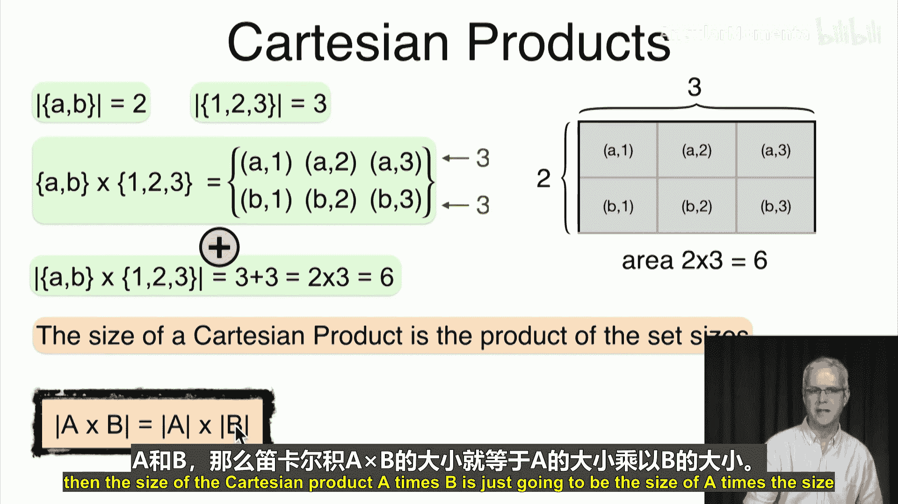
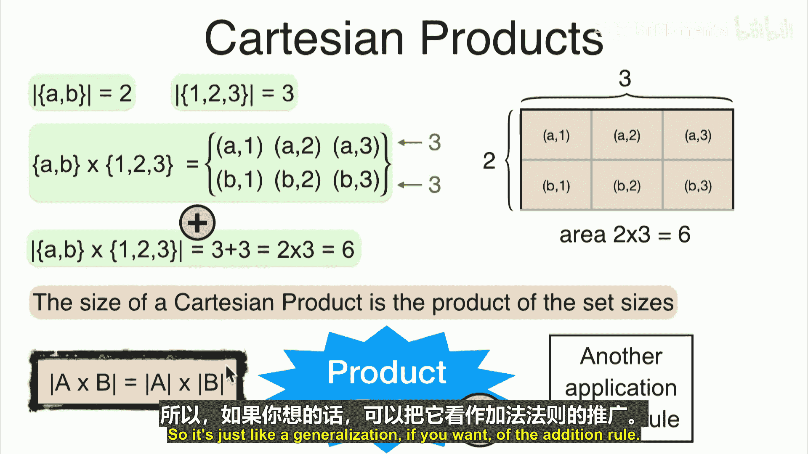
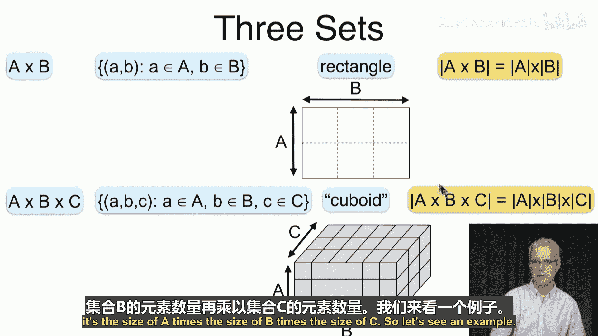
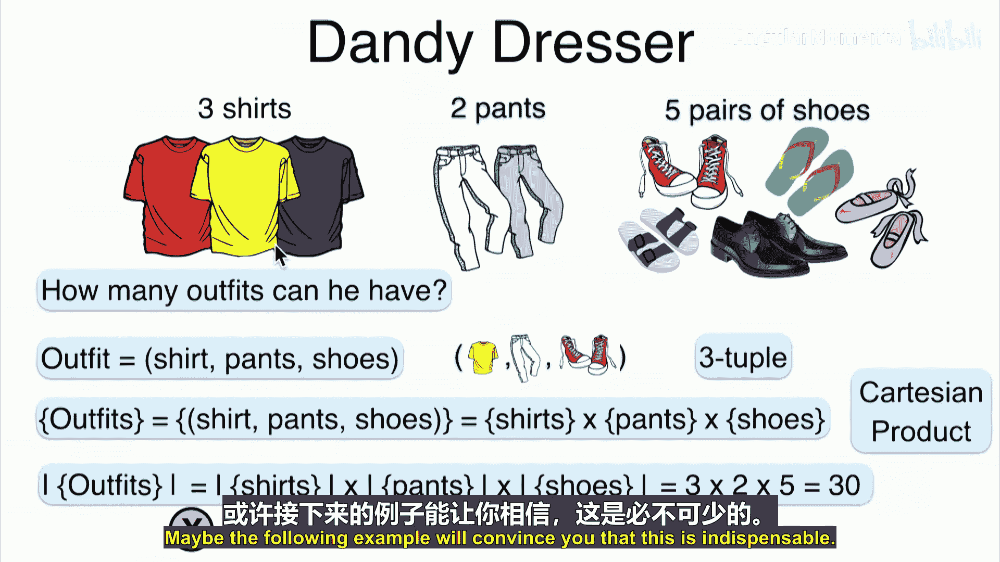
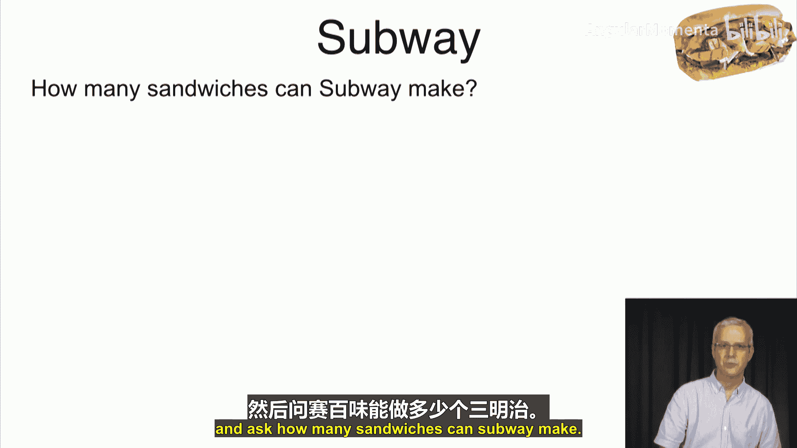
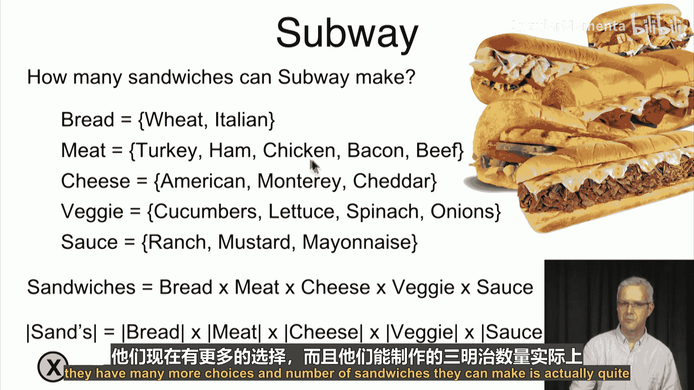

**概率与统计在数据科学中的应用：P17-04-05-03：笛卡尔积** 🧮

在本节课中，我们将要学习笛卡尔积的概念及其在计数中的应用。上一节我们介绍了广义并集的大小，本节中我们来看看如何计算两个或多个集合组合形成的笛卡尔积的大小。

笛卡尔积是集合论中的一个基本概念。如果有一个集合A（例如 `{A, B}`）和另一个集合B（例如 `{1, 2, 3}`），那么它们的笛卡尔积 `A × B` 是一个由所有有序对 `(a, b)` 组成的集合，其中 `a` 属于A，`b` 属于B。

根据乘法原理（或称乘积法则），笛卡尔积的大小等于各个集合大小的乘积。其核心公式为：

**`|A × B| = |A| × |B|`**

这个规则可以推广到多个集合。对于n个集合 `A₁, A₂, ..., Aₙ`，其笛卡尔积的大小为：

**`|A₁ × A₂ × ... × Aₙ| = |A₁| × |A₂| × ... × |Aₙ|`**

---

以下是笛卡尔积的一些具体应用示例：

**应用一：表格数据**
我们日常使用的数据表格本质上就是一个笛卡尔积。表格的行代表记录，列代表属性。表格中的单元格总数，就是行集合与列集合的笛卡尔积的大小。例如，一个有5行、3列的表格，其单元格总数为 `5 × 3 = 15`。

**应用二：服装搭配**
假设一个人有3件衬衫、2条裤子和5双鞋。一套完整的穿搭由一件衬衫、一条裤子和一双鞋组成。所有可能的穿搭组合集合就是这三个集合的笛卡尔积。因此，不同的穿搭总数为 `3 × 2 × 5 = 30` 套。

**应用三：商品计数**
在超市购买成卷的卫生纸时，包装通常是多层排列的。例如，一个包装的排列方式是 `3 × 3 × 4`。虽然无法直接数清每一卷，但根据乘积法则，我们可以快速计算出总卷数为 `3 × 3 × 4 = 36` 卷。

**应用四：三明治定制**
以赛百味（Subway）定制三明治为例。假设顾客需要从以下选项中各选一项：
*   面包种类：2种
*   肉类种类：5种
*   奶酪种类：3种
*   蔬菜种类：4种
*   酱料种类：3种

那么，所有可能的三明治组合就是这五个集合的笛卡尔积。根据乘积法则，可以制作的不同三明治总数为 `2 × 5 × 3 × 4 × 3 = 360` 种。实际上，由于选项更多，真实的可组合数量非常庞大。

---

本节课中我们一起学习了笛卡尔积和乘积法则。我们了解到，计算多个集合组合形成的所有可能有序元组的数量，只需将各个集合的大小相乘即可。这个原理是组合计数的基础，在数据分析、概率计算和日常生活中的许多场景都非常有用。

下一节，我们将探讨笛卡尔积的一种特殊形式——笛卡尔幂。