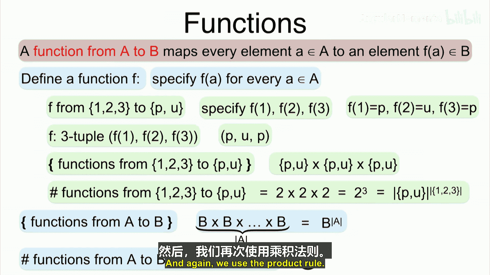
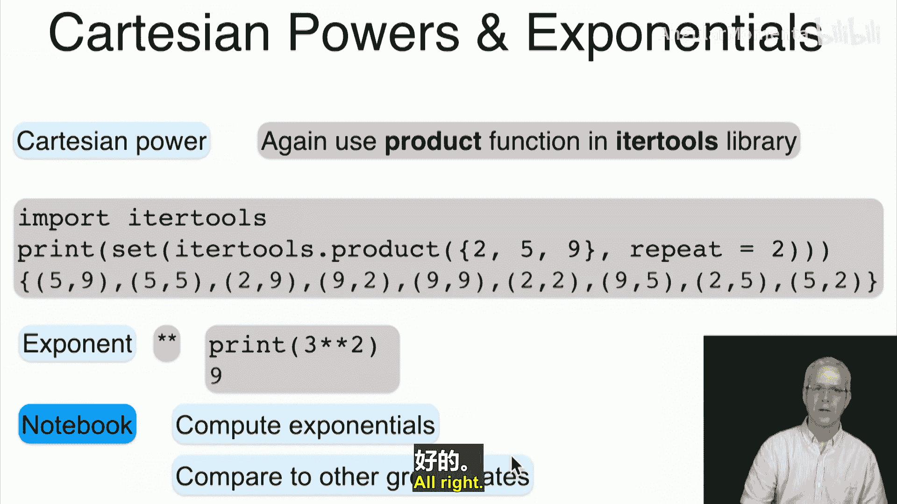
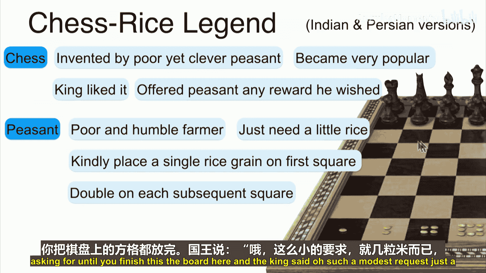
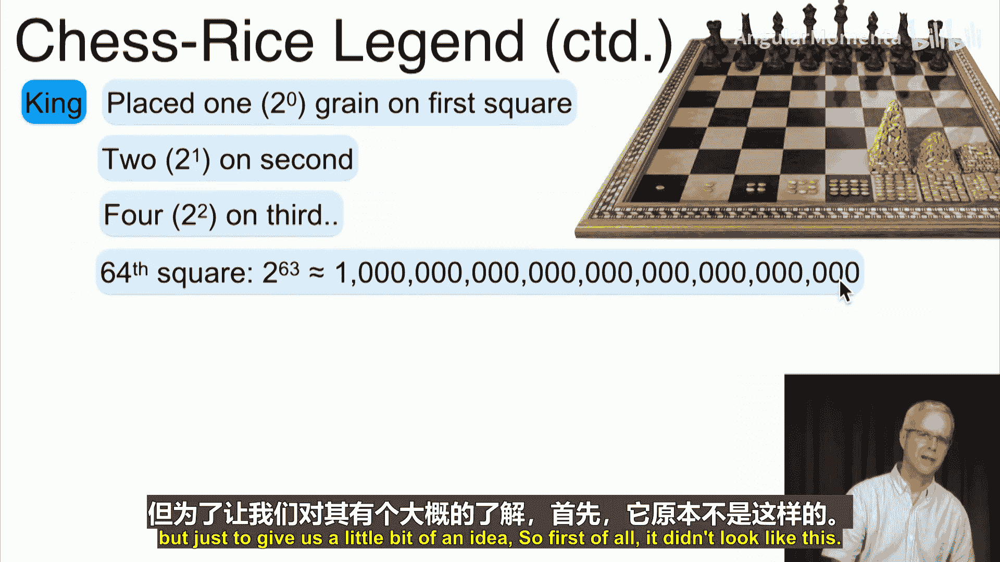
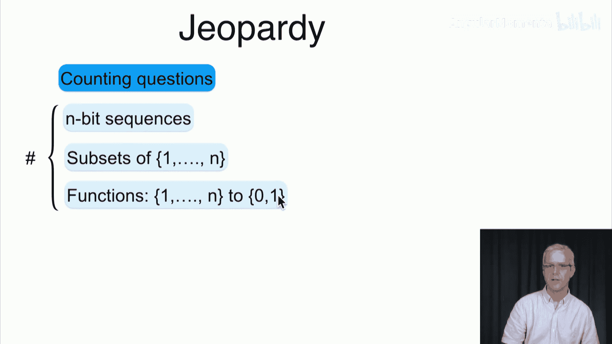
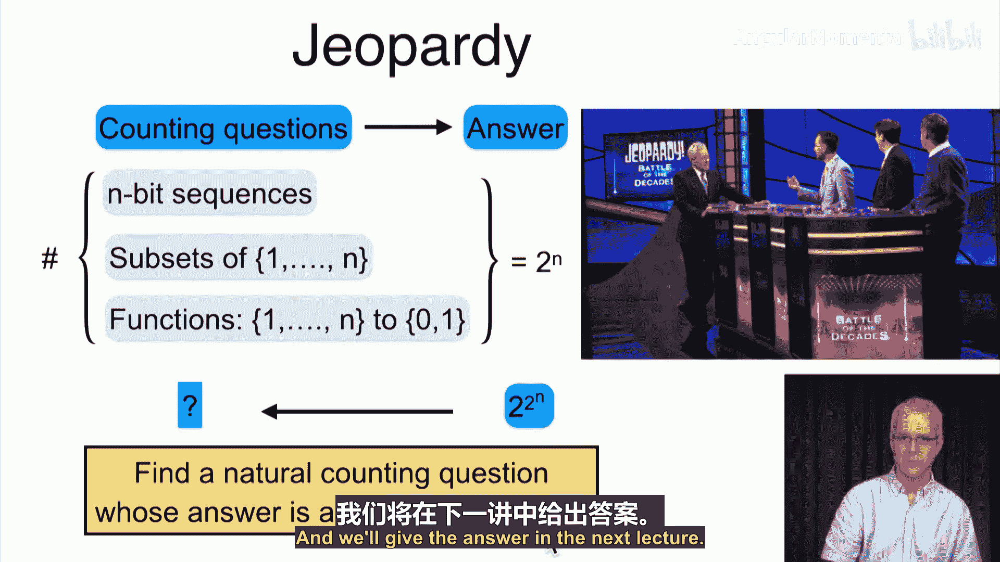
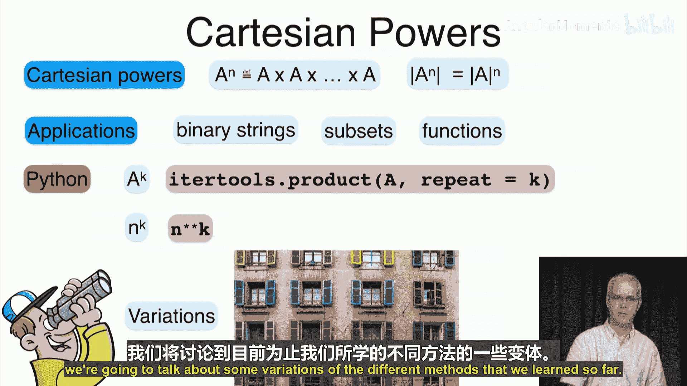

# 018：笛卡尔幂 📊

在本节课中，我们将要学习笛卡尔幂的概念。这是笛卡尔积的一种特殊形式，即一个集合与自身进行多次笛卡尔积运算。我们将探讨其定义、性质、应用，并通过实例和Python代码来加深理解。

上一节我们介绍了笛卡尔积，本节中我们来看看笛卡尔幂。

## 概述 📝

笛卡尔幂是指一个集合与自身进行多次笛卡尔积运算。例如，集合A的平方（A²）是A与自身的笛卡尔积，即A × A。更一般地，集合A的n次幂（Aⁿ）是A与自身进行n次笛卡尔积。其元素数量遵循指数增长规律，即|Aⁿ| = |A|ⁿ。

## 笛卡尔幂的定义与性质 🔢

笛卡尔幂的正式定义如下：对于集合A，其n次笛卡尔幂记作Aⁿ，定义为A与自身进行n次笛卡尔积。用公式表示为：
**Aⁿ = A × A × ... × A** （共n次）

其元素数量（基数）的计算公式为：
**|Aⁿ| = |A|ⁿ**


这个简单的公式在理论和实践中都有重要应用。

## 应用实例：车牌系统 🚗

以下是加州车牌系统的演变过程，它展示了笛卡尔幂在实际计数问题中的应用。

*   **早期（1913年起）**：车牌格式为最多6位数字。假设所有从0到999999的数字组合都可用，则可能的车牌总数为10⁶，即100万个。
*   **1956年**：车牌号码即将用尽，格式改为“3个字母 + 3个数字”。根据乘法原理，可能的组合数为26³ × 10³，约1760万个。
*   **1969年**：再次面临号码耗尽，格式改为“3个字母 + 4个数字”。这使可能的组合数增加了10倍，达到约1.76亿个。

这个例子清晰地展示了如何通过增加集合（字母集、数字集）的笛卡尔幂的指数来极大地扩展可能性空间。

## 核心应用领域 💡

笛卡尔幂在计算机科学和数学中有几个基础且重要的应用。

### 1. 二进制字符串

取集合{0, 1}的n次笛卡尔幂，即{0, 1}ⁿ，得到的是所有长度为n的二进制字符串的集合。
例如：
*   {0, 1}¹ = {0, 1}
*   {0, 1}² = {00, 01, 10, 11}
*   {0, 1}³ = {000, 001, 010, 011, 100, 101, 110, 111}

其数量为：**|{0, 1}ⁿ| = 2ⁿ**

### 2. 子集计数

一个集合S的幂集P(S)（即S的所有子集构成的集合）与二进制字符串存在一一对应关系。
具体来说，对于大小为|S|的集合，其每个子集可以唯一地用一个长度为|S|的二进制串表示（某位为1表示包含对应元素，为0表示不包含）。



因此，集合S的幂集的大小等于所有长度为|S|的二进制串的数量，即：
**|P(S)| = 2^{|S|}**

### 3. 函数计数

从集合A到集合B的所有可能函数的数量，也遵循笛卡尔幂的计数原理。
要定义一个函数f: A → B，需要为A中的每一个元素指定一个B中的像。这相当于为每个“位置”（A中的元素）从B中选择一个值。

因此，所有可能函数的集合可以看作|A|个B的笛卡尔积，即B^{|A|}。其数量为：
**从A到B的函数数量 = |B|^{|A|}**



## 指数增长与Python实现 🐍

指数函数（如2ⁿ）的增长速度远快于任何多项式函数（如n²）。理解这种增长对于评估算法复杂度和问题规模至关重要。

在Python中，我们可以轻松计算笛卡尔幂和指数。

以下是计算笛卡尔幂和指数的示例代码：



```python
# 计算笛卡尔幂
import itertools

# 定义一个集合
my_set = {5, 9}
# 计算该集合的2次笛卡尔幂（即自身与自身的笛卡尔积）
cartesian_power_2 = set(itertools.product(my_set, repeat=2))
print(f“集合 {my_set} 的2次笛卡尔幂是：{cartesian_power_2}”)

# 计算指数
base = 3
exponent = 2
result = base ** exponent  # 使用双星号 ** 表示幂运算
print(f“{base} 的 {exponent} 次方是：{result}”)
```

## 棋盘与麦粒的传说 ♟️



有一个著名的传说，形象地说明了指数增长的威力。一位聪明的农夫为国王发明了国际象棋，国王答应给他任何奖励。农夫请求在棋盘的第一格放1粒麦子，第二格放2粒，第三格放4粒，以此类推，每一格都是前一格的两倍。



国王起初认为这个要求很谦逊，但最终发现，放到第64格时需要2⁶³粒麦子。这个数字（约9.22×10¹⁸）如此巨大，足以耗尽国王的所有财富。这个故事的寓意是：**务必警惕指数增长的力量**。



## 总结与下节预告 📚

本节课中我们一起学习了笛卡尔幂。我们了解到：
*   笛卡尔幂Aⁿ是集合A与自身进行n次笛卡尔积。
*   其元素数量为|A|ⁿ，呈现指数增长。
*   它在二进制字符串、子集计数和函数计数中有直接应用。
*   指数增长非常迅速，在算法设计和问题分析中需要特别注意。

最后，我们留下一个思考题：如果某个计数问题的答案是2^{2ⁿ}（双重指数），那么这个问题可能是什么？我们将在下一讲中揭晓答案。



下一节，我们将讨论目前所学各种计数方法的变体与应用。