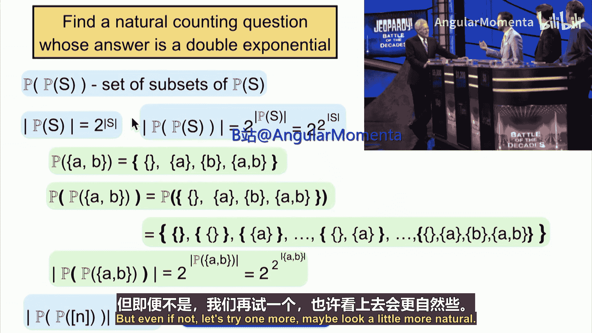
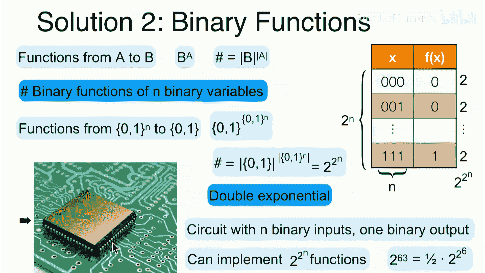
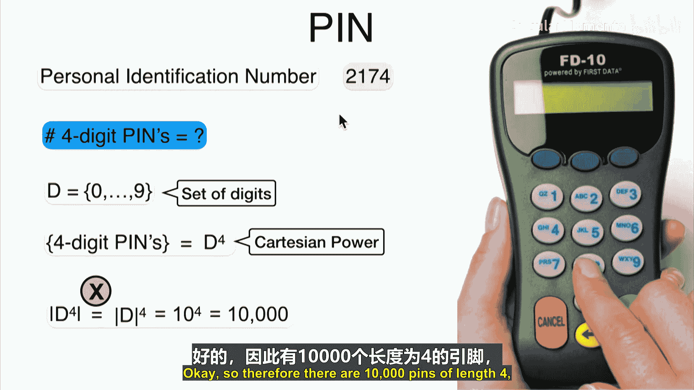

# 019：计数变体 🧮

在本节课中，我们将学习如何组合使用加法规则、减法规则和乘法规则，来计算更复杂集合的大小。我们将通过分析不同约束条件下的个人识别码（PIN码）来应用这些规则。

---

## 概述

到目前为止，我们已经讨论了如何计算不同类型的集合，如并集、笛卡尔积和笛卡尔幂。今天，我们将探讨这些集合的几种变体，并学习如何组合使用计数规则来解决实际问题。

---

## 双指数计数问题的两个例子

上一节末尾我们提出了一个问题：是否存在一个自然的计数问题，其答案是双指数形式的？本节将给出两个答案：一个使用子集，另一个使用函数。

### 例子一：幂集的幂集

首先，我们回顾一下集合 `S` 的幂集 `P(S)` 的定义，它是 `S` 的所有子集构成的集合。其大小公式为：
\[
|P(S)| = 2^{|S|}
\]
例如，集合 `{A, B}` 的幂集是 `{∅, {A}, {B}, {A, B}}`，大小为 `4`，即 `2^2`。

现在，考虑幂集的幂集 `P(P(S))`，即 `P(S)` 的所有子集构成的集合。其大小公式为：
\[
|P(P(S))| = 2^{|P(S)|} = 2^{2^{|S|}}
\]
这就是一个双指数形式的答案。例如，对于集合 `{1, 2, ..., n}`，其幂集的幂集大小为 `2^{2^n}`。

### 例子二：二元函数

其次，我们考虑从集合 `A` 到集合 `B` 的函数。函数集合 `B^A` 的大小公式为：
\[
|B^A| = |B|^{|A|}
\]
现在，考虑具有 `n` 个二元变量的函数。具体来说，是函数 `f: {0, 1}^n → {0, 1}`。这类函数的数量为：
\[
2^{2^n}
\]
这同样是一个双指数形式的答案。例如，一个具有 `6` 个输入引脚的芯片，理论上可以实现 `2^{2^6}` 种不同的函数，这个数字非常巨大。

---

## 应用计数规则分析PIN码

现在，让我们回到今天的主题，通过分析PIN码的例子来组合应用加法、减法和乘法规则。

### 基础：四位数PIN码的数量

设 `D` 代表数字集合 `{0, 1, ..., 9}`。所有四位数PIN码的集合是 `D` 的四次笛卡尔幂 `D^4`。根据乘法规则，其大小为：
\[
|D^4| = |D|^4 = 10^4 = 10,000
\]

### 变体一：可变长度的PIN码

考虑长度在 `3` 到 `5` 位之间的PIN码。有效PIN码的集合是：
\[
D^3 \cup D^4 \cup D^5
\]
由于这些集合互不相交（长度不同的PIN码必然不同），我们可以使用加法规则。因此，总数为：
\[
|D^3| + |D^4| + |D^5| = 10^3 + 10^4 + 10^5 = 1,000 + 10,000 + 100,000 = 111,000
\]

### 变体二：包含禁止序列的PIN码

考虑不允许出现特定序列的四位数PIN码。例如，禁止所有数字相同的序列（如 `3333`）和连续数字序列（如 `3456`）。

*   所有数字相同的序列有 `10` 个（`0000` 到 `9999`）。
*   连续数字序列有 `7` 个（`0123`, `1234`, ..., `6789`）。

禁止序列集合是这两个集合的并集，且它们互不相交。因此，禁止序列的数量为：
\[
10 + 7 = 17
\]
允许的PIN码集合是 `D^4` 减去禁止序列集合。根据减法规则，其大小为：
\[
|D^4| - 17 = 10,000 - 17 = 9,983
\]

### 变体三：包含数字0的PIN码

我们想计算包含至少一个数字 `0` 的 `n` 位数PIN码的数量。我们将以 `n=2` 为例，展示两种方法：容斥原理和补集规则。

**方法一：容斥原理**

设 `ExistZero` 为包含至少一个 `0` 的两位数PIN码集合。
设 `Z1` 为第一位是 `0` 的PIN码集合，`Z2` 为第二位是 `0` 的PIN码集合。
显然，`ExistZero = Z1 ∪ Z2`。

*   `|Z1| = 10`（第一位固定为0，第二位有10种选择）
*   `|Z2| = 10`（第二位固定为0，第一位有10种选择）
*   `|Z1 ∩ Z2| = 1`（只有 `00` 同时满足两个条件）

根据容斥原理：
\[
|ExistZero| = |Z1| + |Z2| - |Z1 ∩ Z2| = 10 + 10 - 1 = 19
\]

**方法二：补集规则**

设全集 `Ω = D^2`，即所有两位数PIN码。
`ExistZero` 的补集 `AllNonZero` 是所有位数都不为 `0` 的PIN码集合，即 `{1,...,9}^2`。
根据乘法规则：
\[
|AllNonZero| = 9 \times 9 = 81
\]
根据补集（减法）规则：
\[
|ExistZero| = |Ω| - |AllNonZero| = 100 - 81 = 19
\]

两种方法得到相同结果。对于更大的 `n`，补集规则通常更简单。

**推广到 `n` 位数**

使用补集规则，包含至少一个 `0` 的 `n` 位数PIN码数量为：
\[
|ExistZero_n| = |D^n| - |AllNonZero_n| = 10^n - 9^n
\]
这里，`AllNonZero_n = {1,...,9}^n`，其大小为 `9^n`。

---

## 总结

在本节课中，我们一起学习了：
1.  通过幂集的幂集和二元函数两个例子，了解了双指数形式的计数问题。
2.  组合运用加法规则、减法规则和乘法规则，计算了在不同约束条件下（固定长度、可变长度、包含禁止序列、必须包含特定数字）的PIN码数量。
3.  对比了容斥原理和补集规则在解决“包含至少一个某元素”这类问题上的应用，并认识到补集规则在多数情况下更为简洁直观。

下一节，我们将讨论如何计数树结构。