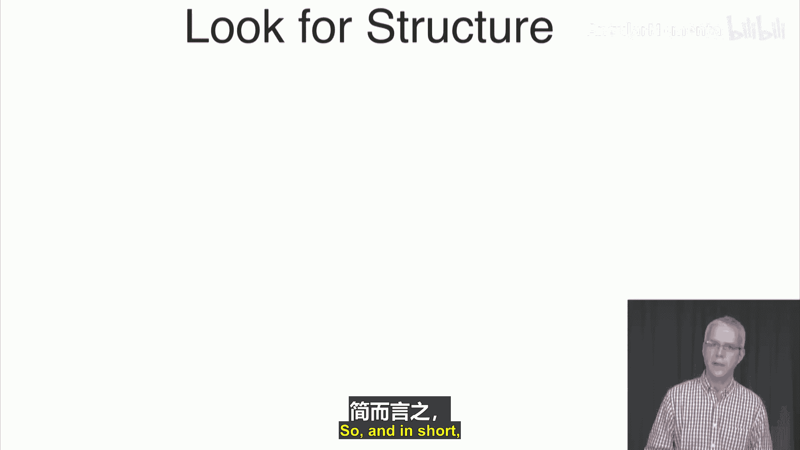

# 020：计数树 🌳

在本节课中，我们将学习如何将笛卡尔积视为一种特殊的树结构，并探讨更一般的树结构如何推广笛卡尔积。我们将介绍一种系统性的方法来计算树中的路径数量，并简要提及这种方法在建模随机现象中的应用。

---

## 笛卡尔积与树结构 🌲

上一节我们介绍了集合的计数方法，本节中我们来看看笛卡尔积如何与树结构联系起来。

笛卡尔积可以视为序列的集合。例如，考虑笛卡尔积 `{A, B} × {1, 2, 3}`。我们知道这个集合的大小是 `|{A, B}| × |{1, 2, 3}| = 2 × 3 = 6`。我们可以将这个笛卡尔积解释为所有序列的集合：`(A,1)`, `(A,2)`, `(A,3)`, `(B,1)`, `(B,2)`, `(B,3)`。

这些序列可以表示为一棵树。树的根节点开始，每个分支代表一个选择。例如，从根节点选择 `A` 或 `B`，然后在下一层选择 `1`, `2`, 或 `3`。每个从根节点到叶子节点的路径对应一个序列。因此，序列的数量等于树中叶子节点的数量。在这棵树中，第一层有2个分支，第二层每个节点有3个分支，所以叶子节点总数为 `2 × 3 = 6`。

**公式**：  
对于笛卡尔积 `A × B`，其大小计算公式为：
```
|A × B| = |A| × |B|
```

---

## 树的推广：超越笛卡尔积 🌿

树结构比笛卡尔积更一般化。在笛卡尔积对应的树中，每一层的所有节点具有相同的分支数（度数）。但树结构允许不同节点有不同的分支数。

考虑一个例子：假设一所新大学“数据科学大学”有三个系：计算机科学（CS）、电子工程（EE）和数学（Math）。每个系提供不同的课程：
*   CS系提供：机器学习、Python
*   EE系提供：图像处理、信息论
*   Math系提供：概率、统计

这个（系，课程）对的集合**不是**一个笛卡尔积，因为并非所有组合都存在（例如，CS系不提供概率课）。然而，我们仍然可以计算课程总数。我们可以将其表示为一棵树：根节点代表大学，第一层是三个系节点，每个系节点下有两个课程节点（叶子）。

虽然这不是笛卡尔积，但计数方式相同：因为每个系都提供2门课程，所以总课程数为 `3 × 2 = 6`。我们仍然可以应用乘积法则，因为在这个特定层级上，所有节点的度数相同。

**核心思想**：  
树可以表示**任何**序列集合，而不仅仅是笛卡尔积。只要我们能识别出树的结构，就可以系统性地计算路径或叶子节点的数量。

---

## 应用实例：体育比赛赛制 🏆

树结构在计数场景中非常有用，例如分析体育比赛赛制。在许多体育项目中，采用“n局胜”制（如七局四胜）。通常，当一方赢得超过半数的局数时，比赛就会提前结束。

以三局两胜制为例，参赛者是Roger和Serena。比赛序列可以用树来表示。以下是所有可能的获胜序列树：

1.  Roger赢第一局
    *   Roger赢第二局 -> 比赛结束 (R, R)
    *   Serena赢第二局
        *   Roger赢第三局 -> 比赛结束 (R, S, R)
        *   Serena赢第三局 -> 比赛结束 (R, S, S)
2.  Serena赢第一局
    *   Serena赢第二局 -> 比赛结束 (S, S)
    *   Roger赢第二局
        *   Serena赢第三局 -> 比赛结束 (S, R, S)
        *   Roger赢第三局 -> 比赛结束 (S, R, R)

我们希望计算有多少种可能的比赛序列（即树中有多少叶子节点）。以下是系统性的计数方法：

*   **自底向上递归计数**：
    *   每个叶子节点自身的后代叶子数计为1。
    *   对于非叶子节点，其后代叶子数等于其所有子节点的后代叶子数之和。

通过这种方法，我们可以计算出总共有6个叶子节点，即6种可能的比赛序列。

---

## 进一步推广：有向无环图中的路径 🛣️

树的概念可以进一步推广到更一般的**有向无环图**中计算路径数量。目标是计算从源节点到目标节点的所有可能路径数。

我们同样可以使用递归方法：

*   **方法一（从目标向前推）**：
    1.  设目标节点到自身的路径数为1。
    2.  对于其他节点，计算到目标节点的路径数：**该节点到目标的路径数 = 其所有后继节点到目标的路径数之和**。
    3.  递归计算，直到得到源节点到目标节点的路径数。

*   **方法二（从源点向后推）**：
    1.  设源节点到自身的路径数为1。
    2.  对于其他节点，计算从源节点到该节点的路径数：**到该节点的路径数 = 其所有前驱节点到源节点的路径数之和**。
    3.  递归计算，直到得到源节点到目标节点的路径数。

两种方法最终结果一致。这展示了一种强大的思想：通过识别图的结构（此处为无环性），我们可以将复杂的计数问题分解为简单的递归步骤。

---

## 总结 📚

本节课中我们一起学习了：
1.  **笛卡尔积**可以直观地用**树结构**表示，其大小计算符合乘积法则。
2.  **树结构**是比笛卡尔积更一般的概念，可以表示任何序列集合，并允许进行系统性计数。
3.  通过**递归方法**，可以计算树中叶子节点（或路径）的数量，核心是`节点计数 = 子节点计数之和`。
4.  这种方法可以推广到**有向无环图**中计算源点到目标点的路径总数。
5.  这些计数技巧为后续理解随机现象的概率计算奠定了基础。




总之，在计数问题时，寻找并利用结构（如树或特定图）是简化问题的关键。下一节我们将探讨组合数学。