# 021：组合 📊

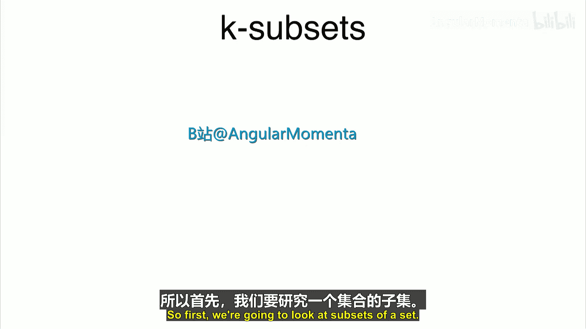

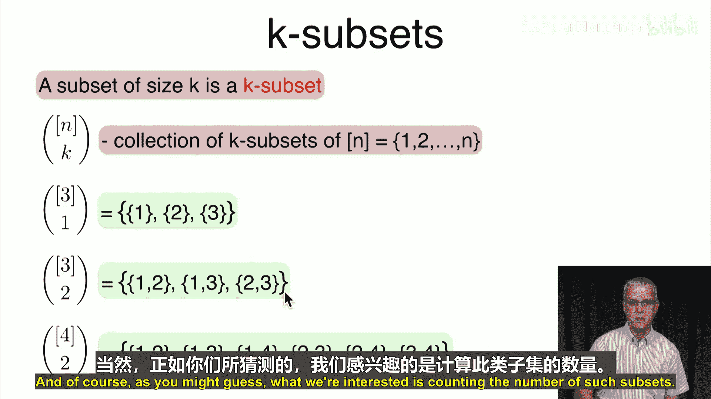

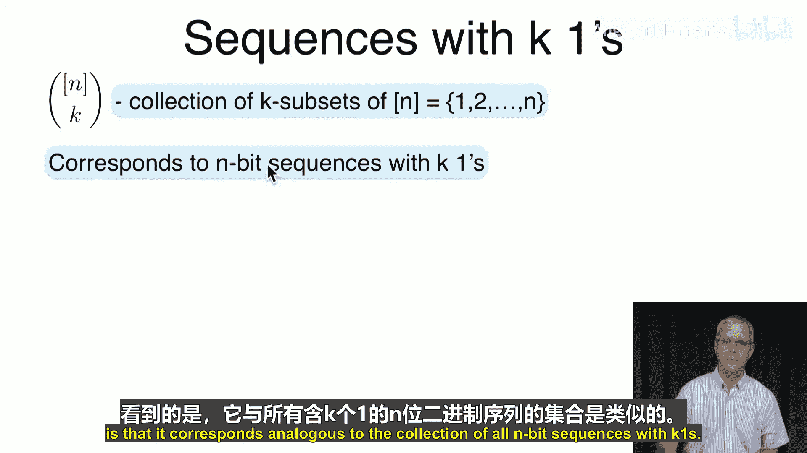

在本节课中，我们将要学习**组合**的概念。上一节我们介绍了**排列**，本节中我们来看看如何计算从一组元素中**不考虑顺序**地选择子集的方法数，即组合。

## 组合的定义

组合关注的是从一个集合中选出指定大小的**子集**，而不考虑这些元素被选出的顺序。

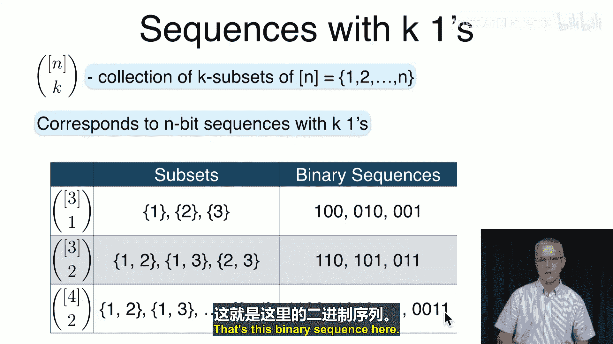

一个包含 `n` 个元素的集合（例如 `{1, 2, ..., n}`）中，所有大小为 `k` 的子集构成的集合，记作 `{1, ..., n} choose k`。这个集合的**元素个数**就是我们想要计算的**组合数**，记作 `n choose k`，也称为**二项式系数**。

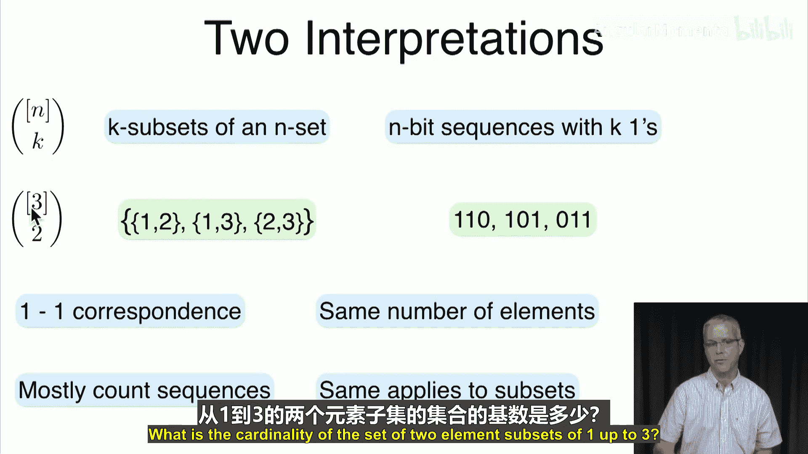

以下是几个例子：
*   `{1, 2, 3} choose 1` 包含的子集有：`{1}`, `{2}`, `{3}`。
*   `{1, 2, 3} choose 2` 包含的子集有：`{1, 2}`, `{1, 3}`, `{2, 3}`。
*   `{1, 2, 3, 4} choose 2` 包含的子集有：`{1, 2}`, `{1, 3}`, `{1, 4}`, `{2, 3}`, `{2, 4}`, `{3, 4}`。

## 组合与二进制序列的对应关系

为了更直观地计算组合数，我们可以建立组合与二进制序列之间的一一对应关系。

考虑一个长度为 `n` 的二进制序列（由 `0` 和 `1` 组成）。一个包含 `k` 个 `1` 的序列，可以看作是指定了原集合中哪些位置（对应 `1`）的元素被选中。因此：
*   **集合 `{1, ..., n} choose k`** 与 **所有长度为 `n` 且恰好有 `k` 个 `1` 的二进制序列的集合** 是等价的。

以下是这种对应关系的例子：
*   `{1, 2, 3} choose 1` 对应序列：`100`, `010`, `001`。
*   `{1, 2, 3} choose 2` 对应序列：`110`, `101`, `011`。
*   子集 `{2, 4}` （属于 `{1, 2, 3, 4} choose 2`）对应序列：`0101`。

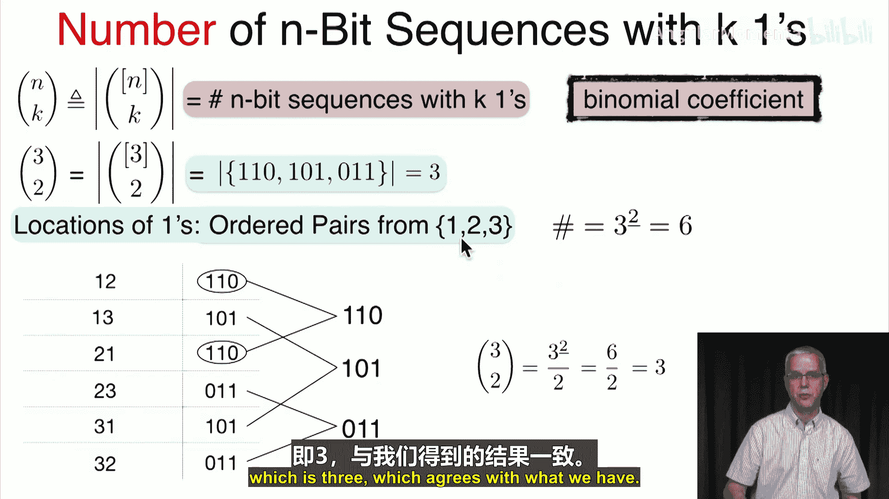

由于存在一一对应关系，这两个集合的大小（元素个数）是相同的。因此，计算组合数 `n choose k` 等价于计算长度为 `n` 且包含 `k` 个 `1` 的二进制序列的个数。

## 推导组合数公式

现在我们来推导二项式系数 `n choose k` 的计算公式。

我们通过指定 `1` 出现的位置来构造序列。一种方法是**有序地**指定 `k` 个不同的位置。第一个位置有 `n` 种选择，第二个有 `n-1` 种，以此类推，直到第 `k` 个位置有 `n-k+1` 种选择。这实际上是在计算 `k`-排列数：

**有序指定位置的方法数 = n 的 k 次下降阶乘 = n * (n-1) * ... * (n-k+1) = n! / (n-k)!**

但是，这种方法会**重复计数**同一个二进制序列。因为对于同一个包含 `k` 个 `1` 的序列，这 `k` 个 `1` 被列出的**顺序**有 `k!` 种（即 `k` 个元素的排列数）。例如，序列 `101` 可以通过指定顺序 `(1, 3)` 或 `(3, 1)` 得到。

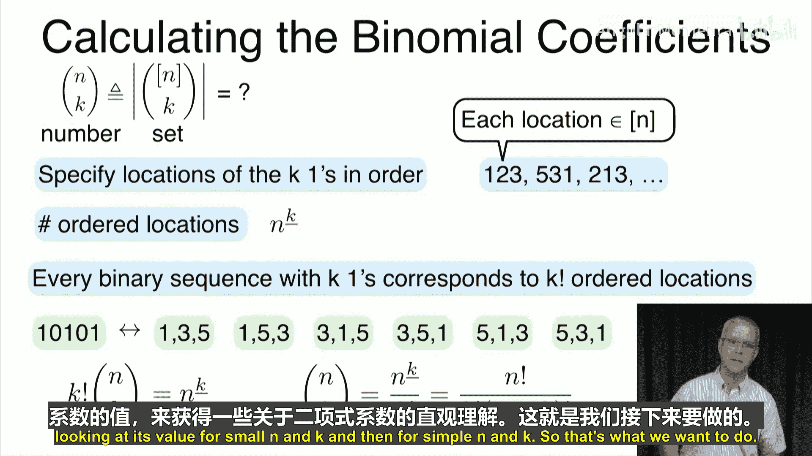

因此，我们得到以下关系：
**(n choose k) * k! = n! / (n-k)!**

整理后，得到组合数的标准公式：

**n choose k = n! / (k! * (n-k)!)**

这个公式也可以理解为：先计算有序选择 `k` 个位置的方法数 `n!/(n-k)!`，然后除以这 `k` 个位置的内部排列数 `k!`，以消除顺序的影响。

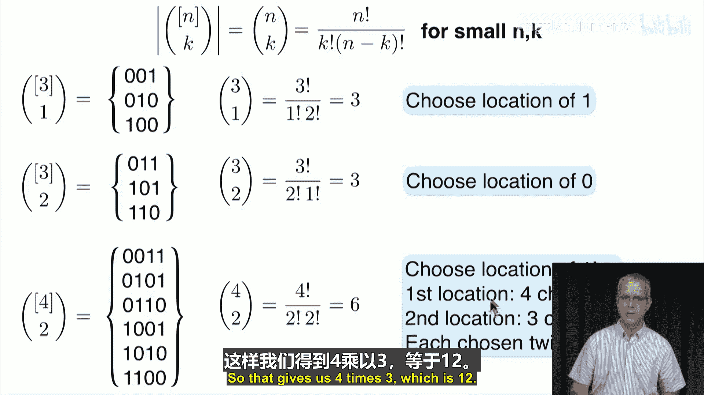

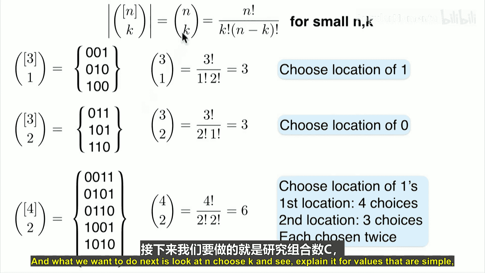

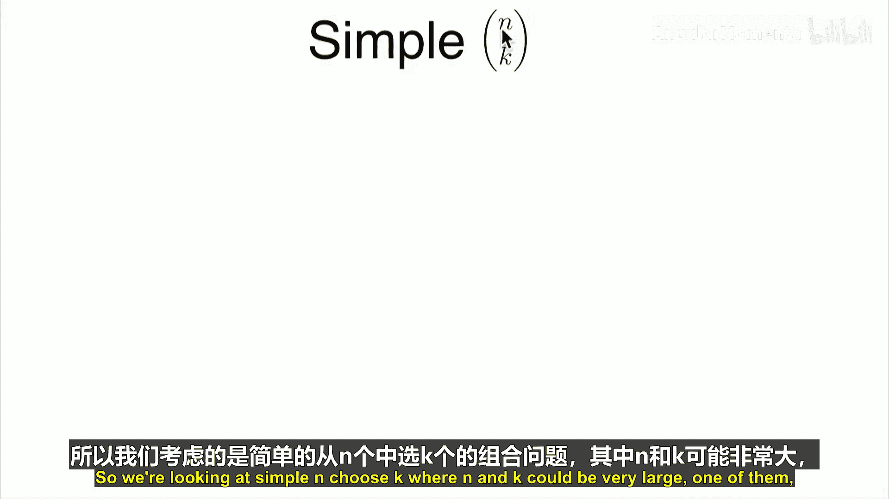

## 理解特殊情况的组合数

我们可以通过公式或直观理解来计算一些特殊情况下的组合数，这有助于加深对概念的理解。

以下是几个简单情况的组合数及其解释：
*   **n choose 0 = 1**：从 `n` 个元素中一个都不选，只有一种方式（空集）。对应全为 `0` 的二进制序列。
*   **n choose n = 1**：选择所有 `n` 个元素，只有一种方式（全集）。对应全为 `1` 的二进制序列。
*   **n choose 1 = n**：选择 `1` 个元素，有 `n` 种方式，即选择哪个元素。对应只有一个 `1` 的二进制序列，`1` 的位置有 `n` 种可能。
*   **n choose 2 = n(n-1)/2**：选择 `2` 个元素。先有序选择有 `n(n-1)` 种方式，再除以 `2! = 2` 消除顺序。也可以理解为在 `n` 个位置中选一个给唯一的 `0`，有 `n` 种选法。

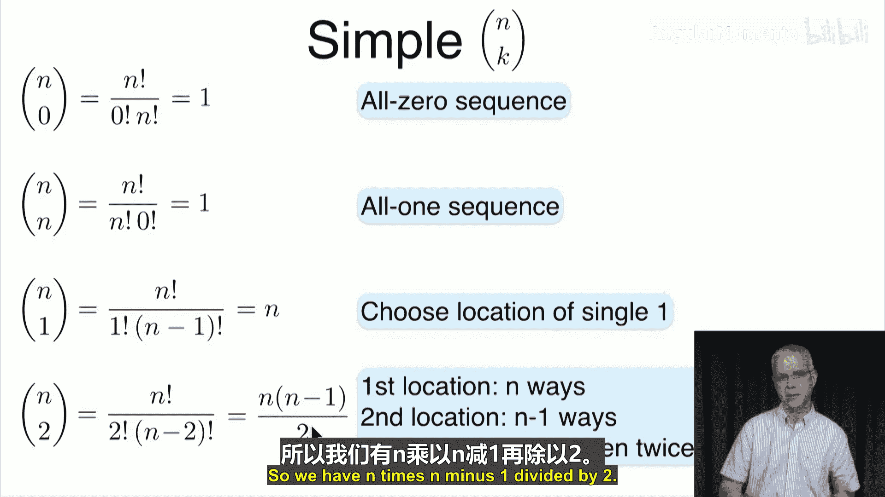

## 对称性与计算技巧

二项式系数具有对称性：**n choose k = n choose (n-k)**。这从公式上很容易看出，因为 `n!/(k!(n-k)!) = n!/((n-k)!k!)`。

这个性质在计算时非常有用。当 `k` 较大时，计算 `n choose (n-k)` 可能更简单。例如：
*   计算 `7 choose 5` 时，可以转为计算 `7 choose 2`。
*   计算 `12 choose 9` 时，可以转为计算 `12 choose 3`。

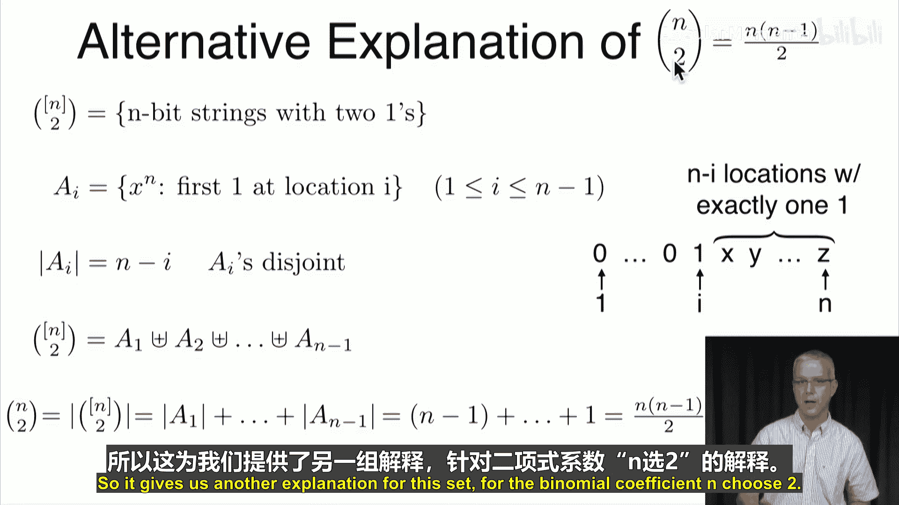

对于具体的计算，可以利用公式的简化形式：**n choose k = (n 的 k 次下降阶乘) / k!**。例如：
*   `7 choose 2 = (7*6) / (2*1) = 21`
*   `12 choose 3 = (12*11*10) / (3*2*1) = 220`

## 总结

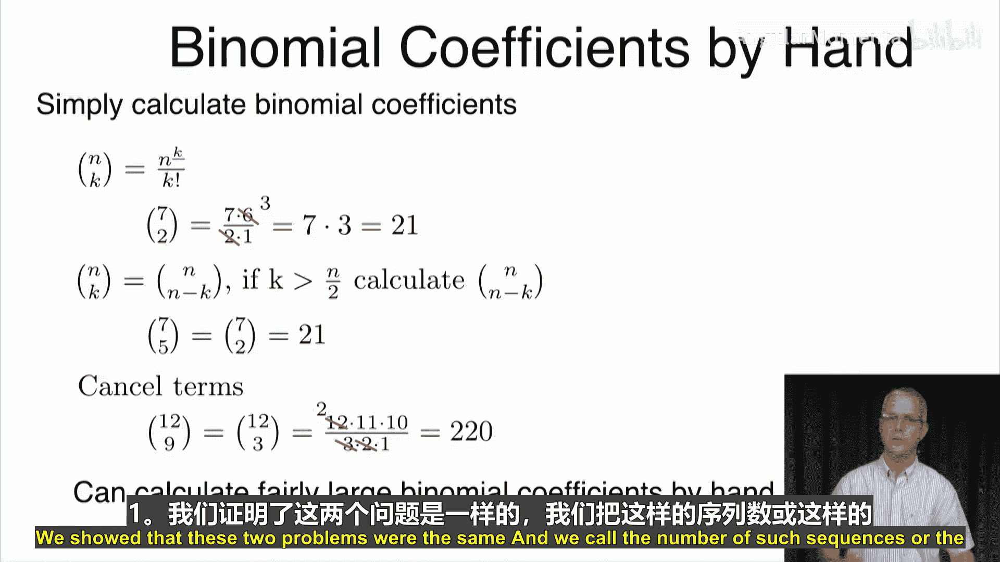

本节课中我们一起学习了**组合**的核心内容。我们首先定义了从 `n` 个元素中选取 `k` 个元素的子集（组合），并将其等价转化为计算特定二进制序列个数的问题。通过分析有序选择与最终无序结果之间的关系，我们推导出了组合数的核心公式 **n choose k = n! / (k! * (n-k)!)**。我们还探讨了该公式的特殊情况、对称性以及一些实用的计算技巧。组合数是概率论与统计学中计数原理的基础，在后续学习二项分布等概念时将起到关键作用。